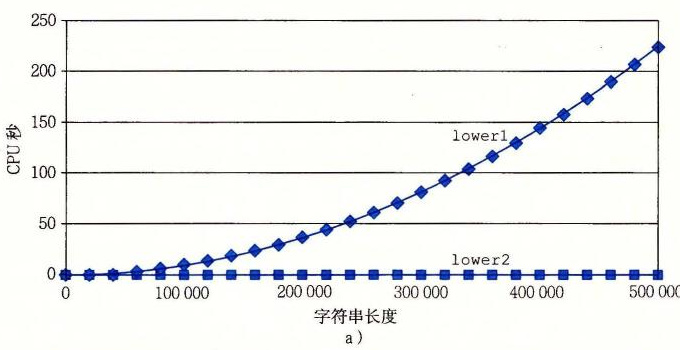

# 5.4 消除循环的低效率

可以观察到，过程 `combine1` 调用函数 `vec_length` 作为 `for` 循环的测试条件，如图 5-5 所示。回想关于如何将含有循环的代码翻译成机器级程序的讨论（见 3.6.7 节），每次循环迭代时都必须对测试条件求值。另一方面，向量的长度并不会随着循环的进行而改变。因此，只需计算一次向量的长度，然后在我们的测试条件中都使用这个值。

图 5-6 是一个修改了的版本，称为 `combine2`，它在开始时调用 `vec_length`，并将结果赋值给局部变量 `length`。对于某些数据类型和操作，这个变换明显地影响了某些数据类型和操作的整体性能，对于其他的则只有很小甚至没有影响。无论是哪种情况，都需要这种变换来消除这个低效率，这有可能成为尝试进一步优化时的瓶颈。

```c
/* Move call to vec_length out of loop */
void combine2(vec_ptr v, data_t *dest)
{
    long i;
    long length = vec_length(v);

    *dest = IDENT;
    for (i = 0; i < length; i++) {
        data_t val;
        get_vec_element(v, i, &val);
        *dest = *dest OP val;
    }
}
```

**图 5-6** 改进循环测试的效率。通过把对 `vec_length` 的调用移出循环测试，我们不再需要每次迭代时都执行这个函数。

| 函数 | 方法 | 整数 `+` | 整数 `*` | 浮点数 `+` | 浮点数 `*` |
| --- | --- | ---: | ---: | ---: | ---: |
| `combine1` | 抽象的 `-O1` | 10.12 | 10.12 | 10.17 | 11.14 |
| `combine2` | 移动 `vec_length` | 7.02 | 9.03 | 9.02 | 11.03 |

这个优化是一类常见的优化的一个例子，称为代码移动（code motion）。这类优化包括识别要执行多次（例如在循环里）但是计算结果不会改变的计算。因而可以将计算移动到代码前面不会被多次求值的部分。在本例中，我们将对 `vec_length` 的调用从循环内部移动到循环的前面。

优化编译器会试着进行代码移动。不幸的是，就像前面讨论过的那样，对于会改变在哪里调用函数或调用多少次的变换，编译器通常会非常小心。它们不能可靠地发现一个函数是否会有副作用，因而假设函数会有副作用。例如，如果 `vec_length` 有某种副作用，那么 `combine1` 和 `combine2` 可能就会有不同的行为。为了改进代码，程序员必须经常帮助编译器显式地完成代码的移动。

举一个 `combine1` 中看到的循环低效率的极端例子，考虑图 5-7 中所示的过程 `lower1`。这个过程模仿几个学生的函数设计，他们的函数是作为一个网络编程项目的一部分交上来的。这个过程的目的是将一个字符串中所有大写字母转换成小写字母。这个大小写转换涉及将“A”到“Z”范围内的字符转换成“a”到“z”范围内的字符。

```c
/* Convert string to lowercase: slow */
void lower1(char *s)
{
    long i;

    for (i = 0; i < strlen(s); i++)
        if (s[i] >= 'A' && s[i] <= 'Z')
            s[i] -= ('A' - 'a');
}

/* Convert string to lowercase: faster */
void lower2(char *s)
{
    long i;
    long len = strlen(s);

    for (i = 0; i < len; i++)
        if (s[i] >= 'A' && s[i] <= 'Z')
            s[i] -= ('A' - 'a');
}

/* Sample implementation of library function strlen */
/* Compute length of string */
size_t strlen(const char *s)
{
    long length = 0;
    while (*s != '\0') {
        s++;
        length++;
    }
    return length;
}
```

**图 5-7** 小写字母转换函数。两个过程的性能差别很大。

对库函数 `strlen` 的调用是 `lower1` 的循环测试的一部分。虽然 `strlen` 通常是用特殊的 x86 字符串处理指令来实现的，但是它的整体执行也类似于图 5-7 中给出的这个简单版本。因为 C 语言中的字符串是以 null 结尾的字符序列，`strlen` 必须一步一步地检查这个序列，直到遇到 null 字符。对于一个长度为 *n* 的字符串，`strlen` 所用的时间与 *n* 成正比。因为对 `lower1` 的 *n* 次迭代的每一次都会调用 `strlen`，所以 `lower1` 的整体运行时间是字符串长度的二次项，正比于 *n*<sup>2</sup>。

如图 5-8 所示（使用 `strlen` 的库版本），这个函数对各种长度的字符串的实际测量值证实了上述分析。`lower1` 的运行时间曲线图随着字符串长度的增加上升得很陡峭（图 5-8a）。图 5-8b 展示了 7 个不同长度字符串的运行时间（与曲线图中所示的有所不同），每个长度都是 2 的幂。可以观察到，对于 `lower1` 来说，字符串长度每增加一倍，运行时间都会变为原来的 4 倍。这很明显地表明运行时间是二次的。对于一个长度为 1 048 576 的字符串来说，`lower1` 需要超过 17 分钟的 CPU 时间。



| 函数 | 16 384 | 32 768 | 65 536 | 131 072 | 262 144 | 524 288 | 1 048 576 |
| --- | ---: | ---: | ---: | ---: | ---: | ---: | ---: |
| `lower1` | 0.26 | 1.03 | 4.10 | 16.41 | 65.62 | 262.48 | 1 049.89 |
| `lower2` | 0.0000 | 0.0001 | 0.0001 | 0.0003 | 0.0005 | 0.0010 | 0.0020 |

**图 5-8** 小写字母转换函数的性能比较。由于循环结构的效率比较低，初始代码 `lower1` 的运行时间是二次项的。修改过的代码 `lower2` 的运行时间是线性的。

除了把对 `strlen` 的调用移出了循环以外，图 5-7 中所示的 `lower2` 与 `lower1` 是一样的。做了这样的变化之后，性能有了显著改善。对于一个长度为 1 048 576 的字符串，这个函数只需要 2.0 毫秒——比 `lower1` 快了 500 000 多倍。字符串长度每增加一倍，运行时间也会增加一倍——很显然运行时间是线性的。对于更长的字符串，运行时间的改进会更大。

在理想的世界里，编译器会认出循环测试中对 `strlen` 的每次调用都会返回相同的结果，因此应该能够把这个调用移出循环。这需要非常成熟完善的分析，因为 `strlen` 会检查字符串的元素，而随着 `lower1` 的进行，这些值会改变。编译器需要探查，即使字符串中的字符发生了改变，但是没有字符会从非零变为零，或是反过来，从零变为非零。即使是使用内联函数，这样的分析也远远超出了最成熟完善的编译器的能力，所以程序员必须自己进行这样的变换。

这个示例说明了编程时一个常见的问题，一个看上去无足轻重的代码片断有隐藏的渐近低效率（asymptotic inefficiency）。人们可不希望一个小写字母转换函数成为程序性能的限制因素。通常，会在小数据集上测试和分析程序，对此，`lower1` 的性能是足够的。不过，当程序最终部署好以后，过程完全可能被应用到一个有 100 万个字符的串上。突然，这段无危险的代码变成了一个主要的性能瓶颈。相比较而言，`lower2` 的性能对于任意长度的字符串来说都是足够的。大型编程项目中出现这样问题的故事比比皆是。一个有经验的程序员工作的一部分就是避免引入这样的渐近低效率。

> **练习题 5.3**
>
> 考虑下面的函数：
>
> ```c
> long min(long x, long y) { return x < y ? x : y; }
> long max(long x, long y) { return x < y ? y : x; }
> void incr(long *xp, long v) { *xp += v; }
> long square(long x) { return x * x; }
> ```
>
> 下面三个代码片断调用这些函数：
>
> ```c
> /* A */
> for (i = min(x, y); i < max(x, y); incr(&i, 1))
>     t += square(i);
>
> /* B */
> for (i = max(x, y) - 1; i >= min(x, y); incr(&i, -1))
>     t += square(i);
>
> /* C */
> long low = min(x, y);
> long high = max(x, y);
> for (i = low; i < high; incr(&i, 1))
>     t += square(i);
> ```
>
> 假设 `x` 等于 10，而 `y` 等于 100。填写下表，指出在代码片断 A～C 中 4 个函数每个被调用的次数：
>
> | 代码 | `min` | `max` | `incr` | `square` |
> | --- | --- | --- | --- | --- |
> | A |  |  |  |  |
> | B |  |  |  |  |
> | C |  |  |  |  |
