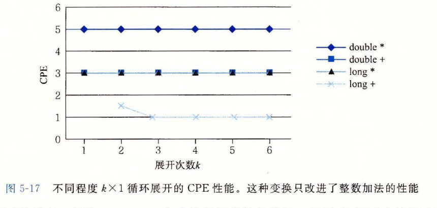
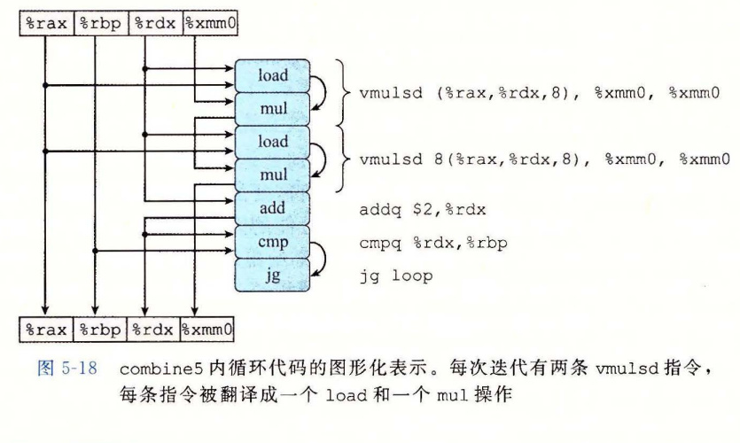
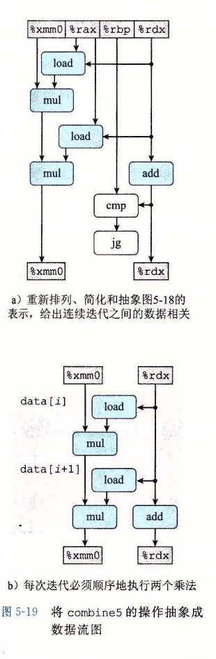
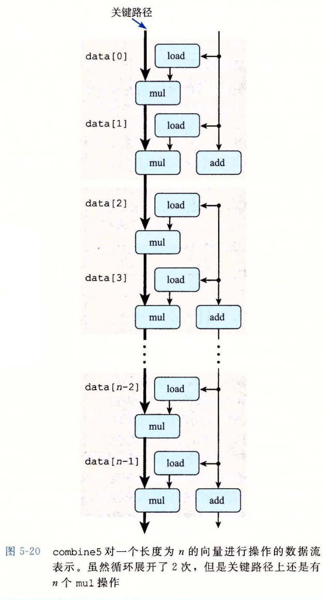

# 5.8 循环展开

循环展开是一种程序变换，通过增加每次迭代计算的元素的数量，减少循环的迭代次数。`psum2` 函数（见图 5-1）就是这样一个例子，其中每次迭代计算前置和的两个元素，因而将需要的迭代次数减半。循环展开能够从两个方面改进程序的性能。首先，它减少了不直接有助于程序结果的操作的数量，例如循环索引计算和条件分支。第二，它提供了一些方法，可以进一步变化代码，减少整个计算中关键路径上的操作数量。在本节中，我们会看一些简单的循环展开，不做任何进一步的变化。

图 5-16 是合并代码的使用“2×1 循环展开”的版本。第一个循环每次处理数组的两个元素。也就是每次迭代，循环索引 *i* 加 2，在一次迭代中，对数组元素 *i* 和 *i*+1 使用合并运算。

一般来说，向量长度不一定是 2 的倍数。想要使我们的代码对任意向量长度都能正确工作，可以从两个方面来解释这个需求。首先，要确保第一次循环不会超出数组的界限。对于长度为 *n* 的向量，我们将循环界限设为 *n*-1。然后，保证只有当循环索引 *i* 满足 *i*<*n*-1 时才会执行这个循环，因此最大数组索引 *i*+1 满足 *i*+1<（*n*-1）+1=*n*。

把这个思想归纳为对一个循环按任意因子 *k* 进行展开，由此产生 *k*×1 循环展开。为此，上限设为 *n*-*k*+1，在循环内对元素 *i* 到 *i*+*k*-1 应用合并运算。每次迭代，循环索引 *i* 加 *k*。那么最大循环索引 *i*+*k*-1 会小于 *n*。要使用第二个循环，以每次处理一个元素的方式处理向量的最后几个元素。这个循环体将会执行 0～*k*-1 次。对于 *k*=2，我们能用一个简单的条件语句，可选地增加最后一次迭代，如函数 `psum2`（图 5-1）所示。对于 *k*>2，最后的这些情况最好用一个循环来表示，所以对 *k*=2 的情况，我们同样也采用这个编程惯例。我们称这种变换为“*k*×1 循环展开”，因为循环展开因子为 *k*，而累积值只在单个变量 `acc` 中。

```c
/* 2 x 1 loop unrolling */
void combine5(vec_ptr v, data_t *dest)
{
    long i;
    long length = vec_length(v);
    long limit = length-1;
    data_t *data = get_vec_start(v);
    data_t acc = IDENT;

    /* Combine 2 elements at a time */
    for (i = 0; i < limit; i += 2) {
        acc = (acc OP data[i]) OP data[i+1];
    }

    /* Finish any remaining elements */
    for (; i < length; i++) {
        acc = acc OP data[i];
    }
    *dest = acc;
}
```

**图 5-16** 使用 2×1 循环展开。这种变换能减小循环开销的影响。

> **练习题 5.7**
>
> 修改 `combine5` 的代码，展开循环 *k*=5 次。

当测量展开次数 *k*=2（`combine5`）和 *k*=3 的展开代码的性能时，得到下面的结果：

| 函数/界限 | 方法 | 整数 `+` | 整数 `*` | 浮点数 `+` | 浮点数 `*` |
| --- | --- | ---: | ---: | ---: | ---: |
| `combine4` | 无展开 | 1.27 | 3.01 | 3.01 | 5.01 |
| `combine5` | 2×1 展开 | 1.01 | 3.01 | 3.01 | 5.01 |
|  | 3×1 展开 | 1.01 | 3.01 | 3.01 | 5.01 |
| 延迟界限 |  | 1.00 | 3.00 | 3.00 | 5.00 |
| 吞吐量界限 |  | 0.50 | 1.00 | 1.00 | 0.50 |

我们看到对于整数加法，CPE 有所改进，得到的延迟界限为 1.00。会有这样的结果是得益于减少了循环开销操作。相对于计算向量和所需要的加法数量，降低开销操作的数量，此时，整数加法的一个周期的延迟成为了限制性能的因素。另一方面，其他情况并没有性能提高——它们已经达到了其延迟界限。图 5-17 给出了当循环展开到 10 次时的 CPE 测量值。对于展开 2 次和 3 次时观察到的趋势还在继续——没有一个低于其延迟界限。



**图 5-17** 不同程度 *k*×1 循环展开的 CPE 性能。这种变换只改进了整数加法的性能。

要理解为什么 *k*×1 循环展开不能将性能改进到超过延迟界限，让我们来查看一下 *k*=2 时，`combine5` 内循环的机器级代码。当类型 `data_t` 为 `double`，操作为乘法时，生成如下代码：

```asm
# Inner loop of combine5. data_t = double, OP = *
# i in %rdx, data in %rax, limit in %rbp, acc in %xmm0
.L35:                                      # loop:
    vmulsd  (%rax,%rdx,8), %xmm0, %xmm0    # Multiply acc by data[i]
    vmulsd  8(%rax,%rdx,8), %xmm0, %xmm0   # Multiply acc by data[i+1]
    addq    $2, %rdx                        # Increment i by 2
    cmpq    %rdx, %rbp                      # Compare to limit:i
    jg      .L35                            # If >, goto loop
```

我们可以看到，相比 `combine4` 生成的基于指针的代码，GCC 使用了 C 代码中数组引用的更加直接的转换。循环索引 *i* 在寄存器 `%rdx` 中，`data` 的地址在寄存器 `%rax` 中。和前面一样，累积值 `acc` 在向量寄存器 `%xmm0` 中。循环展开会导致两条 `vmulsd` 指令——一条将 `data[i]` 加到 `acc` 上，第二条将 `data[i+1]` 加到 `acc` 上。图 5-18 给出了这段代码的图形化表示。每条 `vmulsd` 指令被翻译成两个操作：一个操作是从内存中加载一个数组元素，另一个是把这个值乘以已有的累积值。这里我们看到，循环的每次执行中，对寄存器 `%xmm0` 读和写两次。

> **编校注（非原书正文）** 原书此处两次写作“加到 `acc` 上”；对应的 `vmulsd` 指令及下文说明均为乘法。这里保留原文，阅读时应按乘法理解。

> GCC 优化器产生一个函数的多个版本，并从中选择它预测会获得最佳性能和最小代码量的那一个。其结果就是，源代码中微小的变化就会生成各种不同形式的机器码。我们已经发现对基于指针和基于数组的代码的选择不会影响在参考机上运行的程序的性能。



**图 5-18** `combine5` 内循环代码的图形化表示。每次迭代有两条 `vmulsd` 指令，每条指令被翻译成一个 `load` 和一个 `mul` 操作。

可以重新排列、简化和抽象这张图，按照图 5-19a 所示的过程得到图 5-19b 所示的模板。然后，把这个模板复制 *n*/2 次，给出一个长度为 *n* 的向量的计算，得到如图 5-20 所示的数据流表示。在此我们看到，这张图中关键路径还是 *n* 个 `mul` 操作——迭代次数减半了，但是每次迭代中还是有两个顺序的乘法操作。这个关键路径是循环没有展开代码的性能制约因素，而它仍然是 *k*×1 循环展开代码的性能制约因素。



**图 5-19** 将 `combine5` 的操作抽象成数据流图。a）重新排列、简化和抽象图 5-18 的表示，给出连续迭代之间的数据相关。b）每次迭代必须顺序地执行两个乘法。



**图 5-20** `combine5` 对一个长度为 *n* 的向量进行操作的数据流表示。虽然循环展开了 2 次，但是关键路径上还是有 *n* 个 `mul` 操作。

> **旁注 让编译器展开循环**
>
> 编译器可以很容易地执行循环展开。只要优化级别设置得足够高，许多编译器都能例行公事地做到这一点。用优化等级 3 或更高等级调用 GCC，它就会执行循环展开。
