# 第 5 章 优化程序性能

[返回总目录](../README.md) · [上一章](../第04章-处理器体系结构/README.md) · [下一章](../第06章-存储器层次结构/README.md) · [按小节阅读](README.md) · [练习题答案](练习题答案.md)

## 本章目录

- [第 5 章 优化程序性能](#第-5-章-优化程序性能)
  - [5.1 优化编译器的能力和局限性](#51-优化编译器的能力和局限性)
  - [5.2 表示程序性能](#52-表示程序性能)
  - [5.3 程序示例](#53-程序示例)
  - [5.4 消除循环的低效率](#54-消除循环的低效率)
  - [5.5 减少过程调用](#55-减少过程调用)
  - [5.6 消除不必要的内存引用](#56-消除不必要的内存引用)
  - [5.7 理解现代处理器](#57-理解现代处理器)
    - [5.7.1 整体操作](#571-整体操作)
    - [5.7.2 功能单元的性能](#572-功能单元的性能)
    - [5.7.3 处理器操作的抽象模型](#573-处理器操作的抽象模型)
  - [5.8 循环展开](#58-循环展开)
  - [5.9 提高并行性](#59-提高并行性)
    - [5.9.1 多个累积变量](#591-多个累积变量)
    - [5.9.2 重新结合变换](#592-重新结合变换)
  - [5.10 优化合并代码的结果小结](#510-优化合并代码的结果小结)
  - [5.11 一些限制因素](#511-一些限制因素)
    - [5.11.1 寄存器溢出](#5111-寄存器溢出)
    - [5.11.2 分支预测和预测错误处罚](#5112-分支预测和预测错误处罚)
  - [5.12 理解内存性能](#512-理解内存性能)
    - [5.12.1 加载的性能](#5121-加载的性能)
    - [5.12.2 存储的性能](#5122-存储的性能)
  - [5.13 应用：性能提高技术](#513-应用性能提高技术)
  - [5.14 确认和消除性能瓶颈](#514-确认和消除性能瓶颈)
    - [5.14.1 程序剖析](#5141-程序剖析)
    - [5.14.2 使用剖析程序来指导优化](#5142-使用剖析程序来指导优化)
  - [5.15 小结](#515-小结)
- [参考文献说明](#参考文献说明)
- [第 5 章家庭作业：5.13～5.17](#第-5-章家庭作业513517)
- [第 5 章家庭作业：5.18～5.19](#第-5-章家庭作业518519)

## 第 5 章 优化程序性能

写程序最主要的目标就是使它在所有可能的情况下都正确工作。一个运行得很快但是给出错误结果的程序没有任何用处。程序员必须写出清晰简洁的代码，这样做不仅是为了自己能够看懂代码，也是为了在检查代码和今后需要修改代码时，其他人能够读懂和理解代码。

另一方面，在很多情况下，让程序运行得快也是一个重要的考虑因素。如果一个程序要实时地处理视频帧或者网络包，一个运行得很慢的程序就不能提供所需的功能。当一个计算任务的计算量非常大，需要执行数日或者数周，那么哪怕只是让它运行得快 20% 也会产生重大的影响。本章会探讨如何使用几种不同类型的程序优化技术，使程序运行得更快。

编写高效程序需要做到以下几点：第一，我们必须选择一组适当的算法和数据结构。第二，我们必须编写出编译器能够有效优化以转换成高效可执行代码的源代码。对于这第二点，理解优化编译器的能力和局限性是很重要的。编写程序方式中看上去只是一点小小的变动，都会引起编译器优化方式很大的变化。有些编程语言比其他语言容易优化。C 语言的有些特性，例如执行指针运算和强制类型转换的能力，使得编译器很难对它进行优化。程序员经常能够以一种使编译器更容易产生高效代码的方式来编写他们的程序。第三项技术针对处理运算量特别大的计算，将一个任务分成多个部分，这些部分可以在多核和多处理器的某种组合上并行地计算。我们会把这种性能改进的方法推迟到第 12 章中去讲。即使是要利用并行性，每个并行的线程都以最高性能执行也是非常重要的，所以无论如何本章所讲的内容也还是有意义的。

在程序开发和优化的过程中，我们必须考虑代码使用的方式，以及影响它的关键因素。通常，程序员必须在实现和维护程序的简单性与它的运行速度之间做出权衡。在算法级上，几分钟就能编写一个简单的插入排序，而一个高效的排序算法程序可能需要一天或更长的时间来实现和优化。在代码级上，许多低级别的优化往往会降低程序的可读性和模块性，使得程序容易出错，并且更难以修改或扩展。对于在性能重要的环境中反复执行的代码，进行大量的优化会比较合适。一个挑战就是尽管做了大量的变化，但还是要维护代码一定程度的简洁和可读性。

我们描述许多提高代码性能的技术。理想的情况是，编译器能够接受我们编写的任何代码，并产生尽可能高效的、具有指定行为的机器级程序。现代编译器采用了复杂的分析和优化形式，而且变得越来越好。然而，即使是最好的编译器也受到妨碍优化的因素（optimization blocker）的阻碍，妨碍优化的因素就是程序行为中那些严重依赖于执行环境的方面。程序员必须编写容易优化的代码，以帮助编译器。

程序优化的第一步就是消除不必要的工作，让代码尽可能有效地执行所期望的任务。这包括消除不必要的函数调用、条件测试和内存引用。这些优化不依赖于目标机器的任何具体属性。

为了使程序性能最大化，程序员和编译器都需要一个目标机器的模型，指明如何处理指令，以及各个操作的时序特性。例如，编译器必须知道时序信息，才能够确定是用一条乘法指令，还是用移位和加法的某种组合。现代计算机用复杂的技术来处理机器级程序，并行地执行许多指令，执行顺序还可能不同于它们在程序中出现的顺序。程序员必须理解这些处理器是如何工作的，从而调整他们的程序以获得最大的速度。基于 Intel 和 AMD 处理器最近的设计，我们提出了这种机器的一个高级模型。我们还设计了一种图形数据流（data-flow）表示法，可以使处理器对指令的执行形象化，我们还可以利用它预测程序的性能。

了解了处理器的运作，我们就可以进行程序优化的第二步，利用处理器提供的指令级并行（instruction-level parallelism）能力，同时执行多条指令。我们会讲述几个对程序的变化，降低一个计算的不同部分之间的数据相关，增加并行度，这样就可以同时执行这些部分了。

我们以对优化大型程序的问题的讨论来结束这一章。我们描述了代码剖析程序（profiler）的使用，代码剖析程序是测量程序各个部分性能的工具。这种分析能够帮助找到代码中低效率的地方，并且确定程序中我们应该着重优化的部分。

在本章的描述中，我们使代码优化看起来像按照某种特殊顺序，对代码进行一系列转换的简单线性过程。实际上，这项工作远非这么简单。需要相当多的试错法试验。当我们进行到后面的优化阶段时，尤其是这样，到那时，看上去很小的变化会导致性能上很大的变化。相反，一些看上去很有希望的技术被证明是无效的。正如后面的例子中会看到的那样，要确切解释为什么某段代码序列具有特定的执行时间，是很困难的。性能可能依赖于处理器设计的许多细节特性，而对此我们所知甚少。这也是为什么要尝试各种技术的变形和组合的另一个原因。

研究程序的汇编代码表示是理解编译器以及产生的代码会如何运行的最有效手段之一。仔细研究内循环的代码是一个很好的开端，识别出降低性能的属性，例如过多的内存引用和对寄存器使用不当。从汇编代码开始，我们还可以预测什么操作会并行执行，以及它们会如何使用处理器资源。正如我们会看到的，常常通过确认关键路径（critical path）来决定执行一个循环所需要的时间（或者说，至少是一个时间下界）。所谓关键路径是在循环的反复执行过程中形成的数据相关链。然后，我们会回过头来修改源代码，试着控制编译器使之产生更有效率的实现。

大多数编译器，包括 GCC，一直都在更新和改进，特别是在优化能力方面。一个很有用的策略是只重写程序到编译器由此就能产生有效代码所需要的程度就好了。这样，能尽量避免损害代码的可读性、模块性和可移植性，就好像我们使用的是具有最低能力的编译器。同样，通过测量值和检查生成的汇编代码，反复修改源代码和分析它的性能是很有帮助的。

对于新手程序员来说，不断修改源代码，试图欺骗编译器产生有效的代码，看起来很奇怪，但这确实是编写很多高性能程序的方式。比较于另一种方法——用汇编语言写代码，这种间接的方法具有的优点是：虽然性能不一定是最好的，但得到的代码仍然能够在其他机器上运行。

### 5.1 优化编译器的能力和局限性

现代编译器运用复杂精细的算法来确定一个程序中计算的是什么值，以及它们是被如何使用的。然后会利用一些机会来简化表达式，在几个不同的地方使用同一个计算，以及降低一个给定的计算必须被执行的次数。大多数编译器，包括 GCC，向用户提供了一些对它们所使用的优化的控制。就像在第 3 章中讨论过的，最简单的控制就是指定优化级别。例如，以命令行选项 `-Og` 调用 GCC 是让 GCC 使用一组基本的优化。以选项 `-O1` 或更高（如 `-O2` 或 `-O3`）调用 GCC 会让它使用更大量的优化。这样做可以进一步提高程序的性能，但是也可能增加程序的规模，也可能使标准的调试工具更难对程序进行调试。我们的表述，虽然对于大多数使用 GCC 的软件项目来说，优化级别 `-O2` 已经成为了被接受的标准，但是还是主要考虑以优化级别 `-O1` 编译出的代码。我们特意限制了优化级别，以展示写 C 语言函数的不同方法如何影响编译器产生代码的效率。我们会发现可以写出的 C 代码，即使用 `-O1` 选项编译得到的性能，也比用可能的最高的优化等级编译一个更原始的版本得到的性能好。

编译器必须很小心地对程序只使用安全的优化，也就是说对于程序可能遇到的所有可能的情况，在 C 语言标准提供的保证之下，优化后得到的程序和未优化的版本有一样的行为。限制编译器只进行安全的优化，消除了造成不希望的运行时行为的一些可能的原因，但是这也意味着程序员必须花费更大的力气写出编译器能够将之转换成有效机器代码的程序。为了理解决定一种程序转换是否安全的难度，让我们来看看下面这两个过程：

```c
void twiddle1(long *xp, long *yp)
{
    *xp += *yp;
    *xp += *yp;
}

void twiddle2(long *xp, long *yp)
{
    *xp += 2 * *yp;
}
```

乍一看，这两个过程似乎有相同的行为。它们都是将存储在由指针 `yp` 指示的位置处的值两次加到指针 `xp` 指示的位置处的值。另一方面，函数 `twiddle2` 效率更高一些。它只要求 3 次内存引用（读 `*xp`，读 `*yp`，写 `*xp`），而 `twiddle1` 需要 6 次（2 次读 `*xp`，2 次读 `*yp`，2 次写 `*xp`）。因此，如果要编译器编译过程 `twiddle1`，我们会认为基于 `twiddle2` 执行的计算能产生更有效的代码。

不过，考虑 `xp` 等于 `yp` 的情况。此时，函数 `twiddle1` 会执行下面的计算：

```c
*xp += *xp;  /* Double value at xp */
*xp += *xp;  /* Double value at xp */
```

结果是 `xp` 的值增加 4 倍。另一方面，函数 `twiddle2` 会执行下面的计算：

```c
*xp += 2 * *xp;  /* Triple value at xp */
```

结果是 `xp` 的值增加 3 倍。编译器不知道 `twiddle1` 会如何被调用，因此它必须假设参数 `xp` 和 `yp` 可能会相等。因此，它不能产生 `twiddle2` 风格的代码作为 `twiddle1` 的优化版本。

这种两个指针可能指向同一个内存位置的情况称为内存别名使用（memory aliasing）。在只执行安全的优化中，编译器必须假设不同的指针可能会指向内存中同一个位置。再看一个例子，对于一个使用指针变量 `p` 和 `q` 的程序，考虑下面的代码序列：

```c
x = 1000;
y = 3000;
*q = y;       /* 3000 */
*p = x;       /* 1000 */
t1 = *q;      /* 1000 or 3000 */
```

`t1` 的计算值依赖于指针 `p` 和 `q` 是否指向内存中同一个位置。如果不是，`t1` 就等于 3000，但如果是，`t1` 就等于 1000。这造成了一个主要的妨碍优化的因素，这也是可能严重限制编译器产生优化代码机会的程序的一个方面。如果编译器不能确定两个指针是否指向同一个位置，就必须假设什么情况都有可能，这就限制了可能的优化策略。

> **练习题 5.1**
>
> 下面的问题说明了内存别名使用可能会导致意想不到的程序行为的方式。考虑下面这个交换两个值的过程：
>
> ```c
> /* Swap value x at xp with value y at yp */
> void swap(long *xp, long *yp)
> {
>     *xp = *xp + *yp;
>     *yp = *xp - *yp;
>     *xp = *xp - *yp;
> }
> ```
>
> 如果调用这个过程时 `xp` 等于 `yp`，会有什么样的效果？

第二个妨碍优化的因素是函数调用。作为一个示例，考虑下面这两个过程：

```c
long f();

long func1()
{
    return f() + f() + f() + f();
}

long func2()
{
    return 4 * f();
}
```

最初看上去两个过程计算的都是相同的结果，但是 `func2` 只调用 `f` 一次，而 `func1` 调用 `f` 四次。以 `func1` 作为源代码时，会很想产生 `func2` 风格的代码。

不过，考虑下面 `f` 的代码：

```c
long counter = 0;

long f()
{
    return counter++;
}
```

这个函数有个副作用——它修改了全局程序状态的一部分。改变调用它的次数会改变程序的行为。特别地，假设开始时全局变量 `counter` 都设置为 0，对 `func1` 的调用会返回 0+1+2+3=6，而对 `func2` 的调用会返回 4·0=0。

大多数编译器不会试图判断一个函数是否没有副作用，如果没有，就可能被优化成像 `func2` 中的样子。相反，编译器会假设最糟的情况，并保持所有的函数调用不变。

> **旁注 用内联函数替换优化函数调用**
>
> 包含函数调用的代码可以用一个称为内联函数替换（inline substitution，或者简称“内联（inlining）”）的过程进行优化，此时，将函数调用替换为函数体。例如，我们可以通过替换掉对函数 `f` 的四次调用，展开 `func1` 的代码：
>
> ```c
> /* Result of inlining f in func1 */
> long func1in()
> {
>     long t = counter++;  /* +0 */
>     t += counter++;      /* +1 */
>     t += counter++;      /* +2 */
>     t += counter++;      /* +3 */
>     return t;
> }
> ```
>
> 这样的转换既减少了函数调用的开销，也允许对展开的代码做进一步优化。例如，编译器可以统一 `func1in` 中对全局变量 `counter` 的更新，产生这个函数的一个优化版本：
>
> ```c
> /* Optimization of inlined code */
> long func1opt()
> {
>     long t = 4 * counter + 6;
>     counter += 4;
>     return t;
> }
> ```
>
> 对于这个特定的函数 `f` 的定义，上述代码忠实地重现了 `func1` 的行为。
>
> GCC 的最近版本会尝试进行这种形式的优化，要么是被用命令行选项 `-finline` 指示时，要么是使用优化等级 `-O1` 或者更高的等级时。遗憾的是，GCC 只尝试在单个文件中定义的函数的内联。这就意味着它将无法应用于常见的情况，即一组库函数在一个文件中被定义，却被其他文件内的函数所调用。
>
> 在某些情况下，最好能阻止编译器执行内联替换。一种情况是用符号调试器来评估代码，比如 GDB，如 3.10.2 节描述的一样。如果一个函数调用已经用内联替换优化过了，那么任何对这个调用进行追踪或设置断点的尝试都会失败。还有一种情况是用代码剖析的方式来评估程序性能，如 5.14.1 节讨论的一样。用内联替换消除的函数调用是无法被正确剖析的。

在各种编译器中，就优化能力来说，GCC 被认为是胜任的，但是并不是特别突出。它完成基本的优化，但是它不会对程序进行更加“有进取心的”编译器所做的那种激进变换。因此，使用 GCC 的程序员必须花费更多的精力，以一种简化编译器生成高效代码的任务的方式来编写程序。

### 5.2 表示程序性能

我们引入度量标准每元素的周期数（Cycles Per Element，CPE），作为一种表示程序性能并指导我们改进代码的方法。CPE 这种度量标准帮助我们在更细节的级别上理解迭代程序的循环性能。这样的度量标准对执行重复计算的程序来说是很适当的，例如处理图像中的像素，或是计算矩阵乘积中的元素。

处理器活动的顺序是由时钟控制的，时钟提供了某个频率的规律信号，通常用千兆赫兹（GHz），即十亿周期每秒来表示。例如，当表明一个系统有“4 GHz”处理器，这表示处理器时钟运行频率为每秒 4×10<sup>9</sup> 个周期。每个时钟周期的时间是时钟频率的倒数，通常是以纳秒（nanosecond，1 纳秒等于 10<sup>-9</sup> 秒）或皮秒（picosecond，1 皮秒等于 10<sup>-12</sup> 秒）为单位的。例如，一个 4 GHz 的时钟其周期为 0.25 纳秒，或者 250 皮秒。从程序员的角度来看，用时钟周期来表示度量标准要比用纳秒或皮秒来表示有帮助得多。用时钟周期来表示，度量值表示的是执行了多少条指令，而不是时钟运行得有多快。

许多过程含有在一组元素上迭代的循环。例如，图 5-1 中的函数 `psum1` 和 `psum2` 计算的都是一个长度为 *n* 的向量的前置和（prefix sum）。对于向量 *a*=〈*a*<sub>0</sub>, *a*<sub>1</sub>, …, *a*<sub>*n*-1</sub>〉，前置和 *p*=〈*p*<sub>0</sub>, *p*<sub>1</sub>, …, *p*<sub>*n*-1</sub>〉定义为

*p*<sub>0</sub> = *a*<sub>0</sub>

*p*<sub>*i*</sub> = *p*<sub>*i*-1</sub> + *a*<sub>*i*</sub>，1 ≤ *i* < *n*　　（5.1）

```c
/* Compute prefix sum of vector a */
void psum1(float a[], float p[], long n)
{
    long i;
    p[0] = a[0];
    for (i = 1; i < n; i++)
        p[i] = p[i-1] + a[i];
}

void psum2(float a[], float p[], long n)
{
    long i;
    p[0] = a[0];
    for (i = 1; i < n-1; i += 2) {
        float mid_val = p[i-1] + a[i];
        p[i]   = mid_val;
        p[i+1] = mid_val + a[i+1];
    }
    /* For even n, finish remaining element */
    if (i < n)
        p[i] = p[i-1] + a[i];
}
```

**图 5-1** 前置和函数。这些函数提供了我们如何表示程序性能的示例。

函数 `psum1` 每次迭代计算结果向量的一个元素。第二个函数使用循环展开（loop unrolling）的技术，每次迭代计算两个元素。本章后面我们会探讨循环展开的好处。（关于分析和优化前置和计算的内容请参见练习题 5.11、5.12 和家庭作业 5.19。）

这样一个过程所需要的时间可以用一个常数加上一个与被处理元素个数成正比的因子来描述。例如，图 5-2 是这两个函数需要的周期数关于 *n* 的取值范围图。

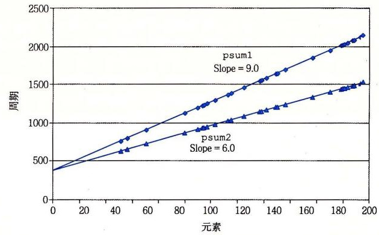

**图 5-2** 前置和函数的性能。两条线的斜率表明每元素的周期数（CPE）的值。

使用最小二乘拟合（least squares fit），我们发现，`psum1` 和 `psum2` 的运行时间（用时钟周期为单位）分别近似于等式 368+9.0*n* 和 368+6.0*n*。这两个等式表明对代码计时和初始化过程、准备循环以及完成过程的开销为 368 个周期加上每个元素 6.0 或 9.0 周期的线性因子。对于较大的 *n* 的值（比如说大于 200），运行时间就会主要由线性因子来决定。这些项中的系数称为每元素的周期数（简称 CPE）的有效值。注意，我们更愿意用每个元素的周期数而不是每次循环的周期数来度量，这是因为像循环展开这样的技术使得我们能够用较少的循环完成计算，而我们最终关心的是，对于给定的向量长度，程序运行的速度如何。我们将精力集中在减小计算的 CPE 上。根据这种度量标准，`psum2` 的 CPE 为 6.0，优于 CPE 为 9.0 的 `psum1`。

> **旁注 什么是最小二乘拟合**
>
> 对于一个数据点（*x*<sub>1</sub>, *y*<sub>1</sub>），…，（*x*<sub>*n*</sub>, *y*<sub>*n*</sub>）的集合，我们常常试图画一条线，它能最接近于这些数据代表的 X—Y 趋势。使用最小二乘拟合，寻找一条形如 *y*=*mx*+*b* 的线，使得下面这个误差度量最小：
>
> *E*(*m*, *b*) = Σ<sub>*i*=1,…,*n*</sub>（*mx*<sub>*i*</sub> + *b* - *y*<sub>*i*</sub>）<sup>2</sup>
>
> 将 *E*(*m*, *b*) 分别对 *m* 和 *b* 求导，把两个导数函数设置为 0，进行推导就能得出计算 *m* 和 *b* 的算法。

> **练习题 5.2**
>
> 在本章后面，我们会从一个函数开始，生成许多不同的变种，这些变种保持函数的行为，又具有不同的性能特性。对于其中三个变种，我们发现运行时间（以时钟周期为单位）可以用下面的函数近似地估计：
>
> - 版本 1：60+35*n*
> - 版本 2：136+4*n*
> - 版本 3：157+1.25*n*
>
> 每个版本在 *n* 取什么值时是三个版本中最快的？记住，*n* 总是整数。

### 5.3 程序示例

为了说明一个抽象的程序是如何被系统地转换成更有效的代码的，我们将使用一个基于图 5-3 所示向量数据结构的运行示例。向量由两个内存块表示：头部和数据数组。头部是一个声明如下的结构：

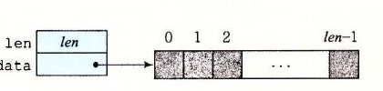

**图 5-3** 向量的抽象数据类型。向量由头信息加上指定长度的数组来表示。

```c
/* Create abstract data type for vector */
typedef struct {
    long len;
    data_t *data;
} vec_rec, *vec_ptr;
```

这个声明用 `data_t` 来表示基本元素的数据类型。在测试中，我们度量代码对于整数（C 语言的 `int` 和 `long`）和浮点数（C 语言的 `float` 和 `double`）数据的性能。为此，我们会分别为不同的类型声明编译和运行程序，就像下面这个例子对数据类型 `long` 一样：

```c
typedef long data_t;
```

我们还会分配一个 `len` 个 `data_t` 类型对象的数组，来存放实际的向量元素。

图 5-4 给出的是一些生成向量、访问向量元素以及确定向量长度的基本过程。一个值得注意的重要特性是向量访问程序 `get_vec_element`，它会对每个向量引用进行边界检查。这段代码类似于许多其他语言（包括 Java）所使用的数组表示法。边界检查降低了程序出错的机会，但是它也会减缓程序的执行。

```c
/* Create vector of specified length */
vec_ptr new_vec(long len)
{
    /* Allocate header structure */
    vec_ptr result = (vec_ptr) malloc(sizeof(vec_rec));
    data_t *data = NULL;
    if (!result)
        return NULL;  /* Couldn't allocate storage */
    result->len = len;

    /* Allocate array */
    if (len > 0) {
        data = (data_t *)calloc(len, sizeof(data_t));
        if (!data) {
            free((void *) result);
            return NULL;  /* Couldn't allocate storage */
        }
    }

    /* Data will either be NULL or allocated array */
    result->data = data;
    return result;
}

/*
 * Retrieve vector element and store at dest.
 * Return 0 (out of bounds) or 1 (successful)
 */
int get_vec_element(vec_ptr v, long index, data_t *dest)
{
    if (index < 0 || index >= v->len)
        return 0;
    *dest = v->data[index];
    return 1;
}

/* Return length of vector */
long vec_length(vec_ptr v)
{
    return v->len;
}
```

**图 5-4** 向量抽象数据类型的实现。在实际程序中，数据类型 `data_t` 被声明为 `int`、`long`、`float` 或 `double`。

作为一个优化示例，考虑图 5-5 中所示的代码，它使用某种运算，将一个向量中所有的元素合并成一个值。通过使用编译时常数 `IDENT` 和 `OP` 的不同定义，这段代码可以重编译成对数据执行不同的运算。特别地，使用声明：

```c
#define IDENT 0
#define OP +
```

它对向量的元素求和。使用声明：

```c
#define IDENT 1
#define OP *
```

它计算的是向量元素的乘积。

```c
/* Implementation with maximum use of data abstraction */
void combine1(vec_ptr v, data_t *dest)
{
    long i;

    *dest = IDENT;
    for (i = 0; i < vec_length(v); i++) {
        data_t val;
        get_vec_element(v, i, &val);
        *dest = *dest OP val;
    }
}
```

**图 5-5** 合并运算的初始实现。使用基本元素 `IDENT` 和合并运算 `OP` 的不同声明，我们可以测量该函数对不同运算的性能。

在我们的讲述中，我们会对这段代码进行一系列的变化，写出这个合并函数的不同版本。为了评估性能变化，我们会在一个具有 Intel Core i7 Haswell 处理器的机器上测量这些函数的 CPE 性能，这个机器称为参考机。3.1 节中给出了一些有关这个处理器的特性。这些测量值刻画的是程序在某个特定的机器上的性能，所以在其他机器和编译器组合中不保证有同等的性能。不过，我们把这些结果与许多不同编译器/处理器组合上的结果做了比较，发现也非常相似。

我们会进行一组变换，发现有很多只能带来很小的性能提高，而其他的能带来更巨大的效果。确定该使用哪些变换组合确实是编写快速代码的“魔术（black art）”。有些不能提供可测量的好处的组合确实是无效的，然而有些组合是很重要的，它们使编译器能够进一步优化。根据我们的经验，最好的方法是实验加上分析：反复地尝试不同的方法，进行测量，并检查汇编代码表示以确定底层的性能瓶颈。

作为一个起点，下表给出的是 `combine1` 的 CPE 度量值，它运行在我们的参考机上，尝试了操作（加法或乘法）和数据类型（长整数和双精度浮点数）的不同组合。使用多个不同的程序，我们的实验显示 32 位整数操作和 64 位整数操作有相同的性能，除了涉及除法操作的代码之外。同样，对于操作单精度和双精度浮点数据的程序，其性能也是相同的。因此在表中，我们将只给出整数数据和浮点数据各自的结果。

| 函数 | 方法 | 整数 `+` | 整数 `*` | 浮点数 `+` | 浮点数 `*` |
| --- | --- | ---: | ---: | ---: | ---: |
| `combine1` | 抽象的未优化的 | 22.68 | 20.02 | 19.98 | 20.18 |
| `combine1` | 抽象的 `-O1` | 10.12 | 10.12 | 10.17 | 11.14 |

可以看到测量值有些不太精确。对于整数求和的 CPE 数更像是 23.00，而不是 22.68；对于整数乘积的 CPE 数则是 20.0 而非 20.02。我们不会“捏造”数据让它们看起来好看一点儿，只是给出了实际获得的测量值。有很多因素会使得可靠地测量某段代码序列需要的精确周期数这个任务变得复杂。检查这些数字时，在头脑里把结果向上或者向下取整几百分之一个时钟周期会很有帮助。

未经优化的代码是从 C 语言代码到机器代码的直接翻译，通常效率明显较低。简单地使用命令行选项 `-O1`，就会进行一些基本的优化。正如可以看到的，程序员不需要做什么，就会显著地提高程序性能——超过两个数量级。通常，养成至少使用这个级别优化的习惯是很好的。（使用 `-Og` 优化级别能得到相似的性能结果。）在剩下的测试中，我们使用 `-O1` 和 `-O2` 级别的优化来生成和测量程序。

### 5.4 消除循环的低效率

可以观察到，过程 `combine1` 调用函数 `vec_length` 作为 `for` 循环的测试条件，如图 5-5 所示。回想关于如何将含有循环的代码翻译成机器级程序的讨论（见 3.6.7 节），每次循环迭代时都必须对测试条件求值。另一方面，向量的长度并不会随着循环的进行而改变。因此，只需计算一次向量的长度，然后在我们的测试条件中都使用这个值。

图 5-6 是一个修改了的版本，称为 `combine2`，它在开始时调用 `vec_length`，并将结果赋值给局部变量 `length`。对于某些数据类型和操作，这个变换明显地影响了某些数据类型和操作的整体性能，对于其他的则只有很小甚至没有影响。无论是哪种情况，都需要这种变换来消除这个低效率，这有可能成为尝试进一步优化时的瓶颈。

```c
/* Move call to vec_length out of loop */
void combine2(vec_ptr v, data_t *dest)
{
    long i;
    long length = vec_length(v);

    *dest = IDENT;
    for (i = 0; i < length; i++) {
        data_t val;
        get_vec_element(v, i, &val);
        *dest = *dest OP val;
    }
}
```

**图 5-6** 改进循环测试的效率。通过把对 `vec_length` 的调用移出循环测试，我们不再需要每次迭代时都执行这个函数。

| 函数 | 方法 | 整数 `+` | 整数 `*` | 浮点数 `+` | 浮点数 `*` |
| --- | --- | ---: | ---: | ---: | ---: |
| `combine1` | 抽象的 `-O1` | 10.12 | 10.12 | 10.17 | 11.14 |
| `combine2` | 移动 `vec_length` | 7.02 | 9.03 | 9.02 | 11.03 |

这个优化是一类常见的优化的一个例子，称为代码移动（code motion）。这类优化包括识别要执行多次（例如在循环里）但是计算结果不会改变的计算。因而可以将计算移动到代码前面不会被多次求值的部分。在本例中，我们将对 `vec_length` 的调用从循环内部移动到循环的前面。

优化编译器会试着进行代码移动。不幸的是，就像前面讨论过的那样，对于会改变在哪里调用函数或调用多少次的变换，编译器通常会非常小心。它们不能可靠地发现一个函数是否会有副作用，因而假设函数会有副作用。例如，如果 `vec_length` 有某种副作用，那么 `combine1` 和 `combine2` 可能就会有不同的行为。为了改进代码，程序员必须经常帮助编译器显式地完成代码的移动。

举一个 `combine1` 中看到的循环低效率的极端例子，考虑图 5-7 中所示的过程 `lower1`。这个过程模仿几个学生的函数设计，他们的函数是作为一个网络编程项目的一部分交上来的。这个过程的目的是将一个字符串中所有大写字母转换成小写字母。这个大小写转换涉及将“A”到“Z”范围内的字符转换成“a”到“z”范围内的字符。

```c
/* Convert string to lowercase: slow */
void lower1(char *s)
{
    long i;

    for (i = 0; i < strlen(s); i++)
        if (s[i] >= 'A' && s[i] <= 'Z')
            s[i] -= ('A' - 'a');
}

/* Convert string to lowercase: faster */
void lower2(char *s)
{
    long i;
    long len = strlen(s);

    for (i = 0; i < len; i++)
        if (s[i] >= 'A' && s[i] <= 'Z')
            s[i] -= ('A' - 'a');
}

/* Sample implementation of library function strlen */
/* Compute length of string */
size_t strlen(const char *s)
{
    long length = 0;
    while (*s != '\0') {
        s++;
        length++;
    }
    return length;
}
```

**图 5-7** 小写字母转换函数。两个过程的性能差别很大。

对库函数 `strlen` 的调用是 `lower1` 的循环测试的一部分。虽然 `strlen` 通常是用特殊的 x86 字符串处理指令来实现的，但是它的整体执行也类似于图 5-7 中给出的这个简单版本。因为 C 语言中的字符串是以 null 结尾的字符序列，`strlen` 必须一步一步地检查这个序列，直到遇到 null 字符。对于一个长度为 *n* 的字符串，`strlen` 所用的时间与 *n* 成正比。因为对 `lower1` 的 *n* 次迭代的每一次都会调用 `strlen`，所以 `lower1` 的整体运行时间是字符串长度的二次项，正比于 *n*<sup>2</sup>。

如图 5-8 所示（使用 `strlen` 的库版本），这个函数对各种长度的字符串的实际测量值证实了上述分析。`lower1` 的运行时间曲线图随着字符串长度的增加上升得很陡峭（图 5-8a）。图 5-8b 展示了 7 个不同长度字符串的运行时间（与曲线图中所示的有所不同），每个长度都是 2 的幂。可以观察到，对于 `lower1` 来说，字符串长度每增加一倍，运行时间都会变为原来的 4 倍。这很明显地表明运行时间是二次的。对于一个长度为 1 048 576 的字符串来说，`lower1` 需要超过 17 分钟的 CPU 时间。


| 函数 | 16 384 | 32 768 | 65 536 | 131 072 | 262 144 | 524 288 | 1 048 576 |
| --- | ---: | ---: | ---: | ---: | ---: | ---: | ---: |
| `lower1` | 0.26 | 1.03 | 4.10 | 16.41 | 65.62 | 262.48 | 1 049.89 |
| `lower2` | 0.0000 | 0.0001 | 0.0001 | 0.0003 | 0.0005 | 0.0010 | 0.0020 |

**图 5-8** 小写字母转换函数的性能比较。由于循环结构的效率比较低，初始代码 `lower1` 的运行时间是二次项的。修改过的代码 `lower2` 的运行时间是线性的。

除了把对 `strlen` 的调用移出了循环以外，图 5-7 中所示的 `lower2` 与 `lower1` 是一样的。做了这样的变化之后，性能有了显著改善。对于一个长度为 1 048 576 的字符串，这个函数只需要 2.0 毫秒——比 `lower1` 快了 500 000 多倍。字符串长度每增加一倍，运行时间也会增加一倍——很显然运行时间是线性的。对于更长的字符串，运行时间的改进会更大。

在理想的世界里，编译器会认出循环测试中对 `strlen` 的每次调用都会返回相同的结果，因此应该能够把这个调用移出循环。这需要非常成熟完善的分析，因为 `strlen` 会检查字符串的元素，而随着 `lower1` 的进行，这些值会改变。编译器需要探查，即使字符串中的字符发生了改变，但是没有字符会从非零变为零，或是反过来，从零变为非零。即使是使用内联函数，这样的分析也远远超出了最成熟完善的编译器的能力，所以程序员必须自己进行这样的变换。

这个示例说明了编程时一个常见的问题，一个看上去无足轻重的代码片断有隐藏的渐近低效率（asymptotic inefficiency）。人们可不希望一个小写字母转换函数成为程序性能的限制因素。通常，会在小数据集上测试和分析程序，对此，`lower1` 的性能是足够的。不过，当程序最终部署好以后，过程完全可能被应用到一个有 100 万个字符的串上。突然，这段无危险的代码变成了一个主要的性能瓶颈。相比较而言，`lower2` 的性能对于任意长度的字符串来说都是足够的。大型编程项目中出现这样问题的故事比比皆是。一个有经验的程序员工作的一部分就是避免引入这样的渐近低效率。

> **练习题 5.3**
>
> 考虑下面的函数：
>
> ```c
> long min(long x, long y) { return x < y ? x : y; }
> long max(long x, long y) { return x < y ? y : x; }
> void incr(long *xp, long v) { *xp += v; }
> long square(long x) { return x * x; }
> ```
>
> 下面三个代码片断调用这些函数：
>
> ```c
> /* A */
> for (i = min(x, y); i < max(x, y); incr(&i, 1))
>     t += square(i);
>
> /* B */
> for (i = max(x, y) - 1; i >= min(x, y); incr(&i, -1))
>     t += square(i);
>
> /* C */
> long low = min(x, y);
> long high = max(x, y);
> for (i = low; i < high; incr(&i, 1))
>     t += square(i);
> ```
>
> 假设 `x` 等于 10，而 `y` 等于 100。填写下表，指出在代码片断 A～C 中 4 个函数每个被调用的次数：
>
> | 代码 | `min` | `max` | `incr` | `square` |
> | --- | --- | --- | --- | --- |
> | A |  |  |  |  |
> | B |  |  |  |  |
> | C |  |  |  |  |

### 5.5 减少过程调用

像我们看到过的那样，过程调用会带来开销，而且妨碍大多数形式的程序优化。从 `combine2` 的代码（见图 5-6）中我们可以看出，每次循环迭代都会调用 `get_vec_element` 来获取下一个向量元素。对每个向量引用，这个函数要把向量索引 `i` 与循环边界做比较，很明显会造成低效率。在处理任意的数组访问时，边界检查可能是个很有用的特性，但是对 `combine2` 代码的简单分析表明所有的引用都是合法的。

作为替代，假设为我们的抽象数据类型增加一个函数 `get_vec_start`。这个函数返回数组的起始地址，如图 5-9 所示。然后就能写出此图中 `combine3` 所示的过程，其内循环里没有函数调用。它没有用函数调用来获取每个向量元素，而是直接访问数组。一个纯粹主义者可能会说这种变换严重损害了程序的模块性。原则上来说，向量抽象数据类型的使用者甚至不应该需要知道向量的内容是作为数组来存储的，而不是作为诸如链表之类的某种其他数据结构来存储的。比较实际的程序员会争论说这种变换是获得高性能结果的必要步骤。

| 函数 | 方法 | 整数 `+` | 整数 `*` | 浮点数 `+` | 浮点数 `*` |
| --- | --- | ---: | ---: | ---: | ---: |
| `combine2` | 移动 `vec_length` | 7.02 | 9.03 | 9.02 | 11.03 |
| `combine3` | 直接数据访问 | 7.17 | 9.02 | 9.02 | 11.03 |

```c
data_t *get_vec_start(vec_ptr v)
{
    return v->data;
}

/* Direct access to vector data */
void combine3(vec_ptr v, data_t *dest)
{
    long i;
    long length = vec_length(v);
    data_t *data = get_vec_start(v);

    *dest = IDENT;
    for (i = 0; i < length; i++) {
        *dest = *dest OP data[i];
    }
}
```

**图 5-9** 消除循环中的函数调用。结果代码没有显示性能提升，但是它有其他的优化。

令人吃惊的是，性能没有明显的提升。事实上，整数求和的性能还略有下降。显然，内循环中的其他操作形成了瓶颈，限制性能超过调用 `get_vec_element`。我们还会再回到这个函数（见 5.11.2 节），看看为什么 `combine2` 中反复的边界检查不会让性能更差。而现在，我们可以将这个转换视为一系列步骤中的一步，这些步骤将最终产生显著的性能提升。

### 5.6 消除不必要的内存引用

`combine3` 的代码将合并运算计算的值累积在指针 `dest` 指定的位置。通过检查编译出来的为内循环产生的汇编代码，可以看出这个属性。在此我们给出数据类型为 `double`，合并运算为乘法的 x86-64 代码：

```asm
# Inner loop of combine3. data_t = double, OP = *
# dest in %rbx, data+i in %rdx, data+length in %rax
.L17:                              # loop:
    vmovsd  (%rbx), %xmm0          # Read product from dest
    vmulsd  (%rdx), %xmm0, %xmm0   # Multiply product by data[i]
    vmovsd  %xmm0, (%rbx)          # Store product at dest
    addq    $8, %rdx               # Increment data+i
    cmpq    %rax, %rdx             # Compare to data+length
    jne     .L17                   # If !=, goto loop
```

在这段循环代码中，我们看到，指针 `dest` 的地址存放在寄存器 `%rbx` 中，它还改变了代码，将第 *i* 个数据元素的指针保存在寄存器 `%rdx` 中，注释中显示为 `data+i`。每次迭代，这个指针都加 8。循环终止操作通过比较这个指针与保存在寄存器 `%rax` 中的数值来判断。我们可以看到每次迭代时，累积变量的数值都要从内存读出再写入到内存。这样的读写很浪费，因为每次迭代开始时从 `dest` 读出的值就是上次迭代最后写入的值。

我们能够消除这种不必要的内存读写，按照图 5-10 中 `combine4` 所示的方式重写代码。引入一个临时变量 `acc`，它在循环中用来累积计算出来的值。只有在循环完成之后结果才存放在 `dest` 中。正如下面的汇编代码所示，编译器现在可以用寄存器 `%xmm0` 来保存累积值。与 `combine3` 中的循环相比，我们将每次迭代的内存操作从两次读和一次写减少到只需要一次读。

```asm
# Inner loop of combine4. data_t = double, OP = *
# acc in %xmm0, data+i in %rdx, data+length in %rax
.L25:                              # loop:
    vmulsd  (%rdx), %xmm0, %xmm0   # Multiply acc by data[i]
    addq    $8, %rdx               # Increment data+i
    cmpq    %rax, %rdx             # Compare to data+length
    jne     .L25                   # If !=, goto loop
```

```c
/* Accumulate result in local variable */
void combine4(vec_ptr v, data_t *dest)
{
    long i;
    long length = vec_length(v);
    data_t *data = get_vec_start(v);
    data_t acc = IDENT;

    for (i = 0; i < length; i++) {
        acc = acc OP data[i];
    }
    *dest = acc;
}
```

**图 5-10** 把结果累积在临时变量中。将累积值存放在局部变量 `acc`（累积器（accumulator）的简写）中，消除了每次循环迭代中从内存中读出并将更新值写回的需要。

我们看到程序性能有了显著的提高，如下表所示：

| 函数 | 方法 | 整数 `+` | 整数 `*` | 浮点数 `+` | 浮点数 `*` |
| --- | --- | ---: | ---: | ---: | ---: |
| `combine3` | 直接数据访问 | 7.17 | 9.02 | 9.02 | 11.03 |
| `combine4` | 累积在临时变量中 | 1.27 | 3.01 | 3.01 | 5.01 |

所有的时间改进范围从 2.2× 到 5.7×，整数加法情况的时间下降到了每元素只需 1.27 个时钟周期。

可能又有人会认为编译器应该能够自动将图 5-9 中所示的 `combine3` 的代码转换为在寄存器中累积那个值，就像图 5-10 中所示的 `combine4` 的代码所做的那样。然而实际上，由于内存别名使用，两个函数可能会有不同的行为。例如，考虑整数数据，运算为乘法，标识元素为 1 的情况。设 *v*=[2, 3, 5] 是一个由 3 个元素组成的向量，考虑下面两个函数调用：

```c
combine3(v, get_vec_start(v) + 2);
combine4(v, get_vec_start(v) + 2);
```

也就是在向量最后一个元素和存放结果的目标之间创建一个别名。那么，这两个函数的执行如下：

| 函数 | 初始值 | 循环之前 | *i*=0 | *i*=1 | *i*=2 | 最后 |
| --- | --- | --- | --- | --- | --- | --- |
| `combine3` | [2, 3, 5] | [2, 3, 1] | [2, 3, 2] | [2, 3, 6] | [2, 3, 36] | [2, 3, 36] |
| `combine4` | [2, 3, 5] | [2, 3, 5] | [2, 3, 5] | [2, 3, 5] | [2, 3, 5] | [2, 3, 30] |

正如前面讲到过的，`combine3` 将它的结果累积在目标位置中，在本例中，目标位置就是向量的最后一个元素。因此，这个值首先被设置为 1，然后设为 2·1=2，然后设为 3·2=6。最后一次迭代中，这个值会乘以它自己，得到最后结果 36。对于 `combine4` 的情况来说，直到最后向量都保持不变，结束之前，最后一个元素会被设置为计算出来的值 1·2·3·5=30。

当然，我们说明 `combine3` 和 `combine4` 之间差别的例子是人为设计的。有人会说 `combine4` 的行为更加符合函数描述的意图。不幸的是，编译器不能判断函数会在什么情况下被调用，以及程序员的本意可能是什么。取而代之，在编译 `combine3` 时，保守的方法是不断地读和写内存，即使这样做效率不太高。

> **练习题 5.4**
>
> 当用带命令行选项 `-O2` 的 GCC 来编译 `combine3` 时，得到的代码 CPE 性能远好于使用 `-O1` 时的：
>
> | 函数 | 方法 | 整数 `+` | 整数 `*` | 浮点数 `+` | 浮点数 `*` |
> | --- | --- | ---: | ---: | ---: | ---: |
> | `combine3` | 用 `-O1` 编译 | 7.17 | 9.02 | 9.02 | 11.03 |
> | `combine3` | 用 `-O2` 编译 | 1.60 | 3.01 | 3.01 | 5.01 |
> | `combine4` | 累积在临时变量中 | 1.27 | 3.01 | 3.01 | 5.01 |
>
> 由此得到的性能与 `combine4` 相当，不过对于整数求和的情况除外，虽然性能已经得到了显著的提高，但还是低于 `combine4`。在检查编译器产生的汇编代码时，我们发现对内循环的一个有趣的变化：
>
> ```asm
> # Inner loop of combine3. data_t = double, OP = *
> # dest in %rbx, data+i in %rdx, data+length in %rax
> # Accumulated product in %xmm0
> # Compiled -O2
> .L22:                              # loop:
>     vmulsd  (%rdx), %xmm0, %xmm0   # Multiply product by data[i]
>     addq    $8, %rdx               # Increment data+i
>     cmpq    %rax, %rdx             # Compare to data+length
>     vmovsd  %xmm0, (%rbx)          # Store product at dest
>     jne     .L22                   # If !=, goto loop
> ```
>
> 把上面的代码与用优化等级 1 产生的代码进行比较：
>
> ```asm
> # Inner loop of combine3. data_t = double, OP = *
> # dest in %rbx, data+i in %rdx, data+length in %rax
> # Compiled -O1
> .L17:                              # loop:
>     vmovsd  (%rbx), %xmm0          # Read product from dest
>     vmulsd  (%rdx), %xmm0, %xmm0   # Multiply product by data[i]
>     vmovsd  %xmm0, (%rbx)          # Store product at dest
>     addq    $8, %rdx               # Increment data+i
>     cmpq    %rax, %rdx             # Compare to data+length
>     jne     .L17                   # If !=, goto loop
> ```
>
> 我们看到，除了指令顺序有些不同，唯一的区别就是使用更优化的版本不含有 `vmovsd` 指令，它实现的是从 `dest` 指定的位置读数据（第 2 行）。
>
> A. 寄存器 `%xmm0` 的角色在两个循环中有什么不同？
>
> B. 这个更优化的版本忠实地实现了 `combine3` 的 C 语言代码吗（包括在 `dest` 和向量数据之间使用内存别名的时候）？
>
> C. 解释为什么这个优化保持了期望的行为，或者给出一个例子说明它产生了与使用较少优化的代码不同的结果。

使用了这最后的变换，至此，对于每个元素的计算，都只需要 1.25～5 个时钟周期。比起最开始采用优化时的 9～11 个周期，这是相当大的提高了。现在我们想看看是什么因素在制约着代码的性能，以及可以如何进一步提高。

### 5.7 理解现代处理器

到目前为止，我们运用的优化都不依赖于目标机器的任何特性。这些优化只是简单地降低了过程调用的开销，以及消除了一些重大的“妨碍优化的因素”，这些因素会给优化编译器造成困难。随着试图进一步提高性能，必须考虑利用处理器微体系结构的优化，也就是处理器用来执行指令的底层系统设计。要想充分提高性能，需要仔细分析程序，同时代码的生成也要针对目标处理器进行调整。尽管如此，我们还是能够运用一些基本的优化，在很大一类处理器上产生整体的性能提高。我们在这里公布的详细性能结果，对其他机器不一定有同样的效果，但是操作和优化的通用原则对各种各样的机器都适用。

为了理解改进性能的方法，我们需要理解现代处理器的微体系结构。由于大量的晶体管可以被集成到一块芯片上，现代微处理器采用了复杂的硬件，试图使程序性能最大化。带来的一个后果就是处理器的实际操作与通过观察机器级程序所察觉到的大相径庭。在代码级上，看上去似乎是一次执行一条指令，每条指令都包括从寄存器或内存取值，执行一个操作，并把结果存回到一个寄存器或内存位置。在实际的处理器中，是同时对多条指令求值的，这个现象称为指令级并行。在某些设计中，可以有 100 或更多条指令在处理中。采用一些精细的机制来确保这种并行执行的行为，正好能获得机器级程序要求的顺序语义模型的效果。现代微处理器取得的了不起的功绩之一是：它们采用复杂而奇异的微处理器结构，其中，多条指令可以并行地执行，同时又呈现出一种简单的顺序执行指令的表象。

虽然现代微处理器的详细设计超出了本书讲授的范围，对这些微处理器运行的原则有一般性的了解就足够能够理解它们如何实现指令级并行。我们会发现两种下界描述了程序的最大性能。当一系列操作必须按照严格顺序执行时，就会遇到延迟界限（latency bound），因为在下一条指令开始之前，这条指令必须结束。当代码中的数据相关限制了处理器利用指令级并行的能力时，延迟界限能够限制程序性能。吞吐量界限（throughput bound）刻画了处理器功能单元的原始计算能力。这个界限是程序性能的终极限制。

#### 5.7.1 整体操作

图 5-11 是现代微处理器的一个非常简单化的示意图。我们假想的处理器设计是不太严格地基于近期的 Intel 处理器的结构。这些处理器在工业界称为超标量（superscalar），意思是它可以在每个时钟周期执行多个操作，而且是乱序的（out-of-order），意思就是指令执行的顺序不一定要与它们在机器级程序中的顺序一致。整个设计有两个主要部分：指令控制单元（Instruction Control Unit，ICU）和执行单元（Execution Unit，EU）。前者负责从内存中读出指令序列，并根据这些指令序列生成一组针对程序数据的基本操作；而后者执行这些操作。和第 4 章中研究过的按序（in-order）流水线相比，乱序处理器需要更大、更复杂的硬件，但是它们能更好地达到更高的指令级并行度。

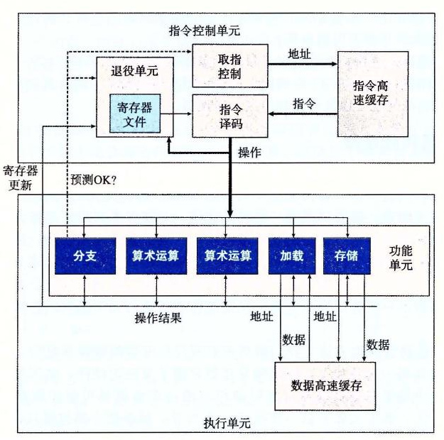

**图 5-11** 一个乱序处理器的框图。指令控制单元负责从内存中读出指令，并产生一系列基本操作。然后执行单元完成这些操作，以及指出分支预测是否正确。

ICU 从指令高速缓存（instruction cache）中读取指令，指令高速缓存是一个特殊的高速存储器，它包含最近访问的指令。通常，ICU 会在当前正在执行的指令很早之前取指，这样它才有足够的时间对指令译码，并把操作发送到 EU。不过，一个问题是当程序遇到分支时，程序有两个可能的前进方向。一种可能会选择分支，控制被传递到分支目标。另一种可能是，不选择分支，控制被传递到指令序列的下一条指令。现代处理器采用了一种称为分支预测（branch prediction）的技术，处理器会猜测是否会选择分支，同时还预测分支的目标地址。使用投机执行（speculative execution）的技术，处理器会开始取出位于它预测的分支会跳到的地方的指令，并对指令译码，甚至在它确定分支预测是否正确之前就开始执行这些操作。如果过后确定分支预测错误，会将状态重新设置到分支点的状态，并开始取出和执行另一个方向上的指令。标记为取指控制的块包括分支预测，以完成确定取哪些指令的任务。

> 术语“分支”专指条件转移指令。对处理器来说，其他可能将控制传送到多个目的地址的指令，例如过程返回和间接跳转，带来的也是类似的挑战。

指令译码逻辑接收实际的程序指令，并将它们转换成一组基本操作（有时称为微操作）。每个这样的操作都完成某个简单的计算任务，例如两个数相加，从内存中读数据，或是向内存写数据。对于具有复杂指令的机器，比如 x86 处理器，一条指令可以被译码成多个操作。关于指令如何被译码成操作序列的细节，不同的机器都会不同，这个信息可谓是高度机密。幸运的是，不需要知道某台机器实现的底层细节，我们也能优化自己的程序。

在一个典型的 x86 实现中，一条只对寄存器操作的指令，例如

```asm
addq %rax,%rdx
```

会被转化成一个操作。另一方面，一条包括一个或者多个内存引用的指令，例如

```asm
addq %rax,8(%rdx)
```

会产生多个操作，把内存引用和算术运算分开。这条指令会被译码成为三个操作：一个操作从内存中加载一个值到处理器中，一个操作将加载进来的值加上寄存器 `%rax` 中的值，而一个操作将结果存回到内存。这种译码逻辑对指令进行分解，允许任务在一组专门的硬件单元之间进行分割。这些单元可以并行地执行多条指令的不同部分。

EU 接收来自取指单元的操作。通常，每个时钟周期会接收多个操作。这些操作会被分派到一组功能单元中，它们会执行实际的操作。这些功能单元专门用来处理不同类型的操作。

读写内存是由加载和存储单元实现的。加载单元处理从内存读数据到处理器的操作。这个单元有一个加法器来完成地址计算。类似，存储单元处理从处理器写数据到内存的操作。它也有一个加法器来完成地址计算。如图中所示，加载和存储单元通过数据高速缓存（data cache）来访问内存。数据高速缓存是一个高速存储器，存放着最近访问的数据值。

使用投机执行技术对操作求值，但是最终结果不会存放在程序寄存器或数据内存中，直到处理器能确定应该实际执行这些指令。分支操作被送到 EU，不是确定分支该往哪里去，而是确定分支预测是否正确。如果预测错误，EU 会丢弃分支点之后计算出来的结果。它还会发信号给分支单元，说预测是错误的，并指出正确的分支目的。在这种情况中，分支单元开始在新的位置取指。如在 3.6.6 节中看到的，这样的预测错误会导致很大的性能开销。在可以取出新指令、译码和发送到执行单元之前，要花费一点时间。

图 5-11 说明不同的功能单元被设计来执行不同的操作。那些标记为执行“算术运算”的单元通常是专门用来执行整数和浮点数操作的不同组合。随着时间的推移，在单个微处理器芯片上能够集成的晶体管数量越来越多，后续的微处理器型号都增加了功能单元的数量以及每个单元能执行的操作组合，还提升了每个单元的性能。由于不同程序间所要求的操作变化很大，因此，算术运算单元被特意设计成能够执行各种不同的操作。比如，有些程序也许会涉及整数操作，而其他则要求许多浮点操作。如果一个功能单元专门执行整数操作，而另一个只能执行浮点操作，那么，这些程序就没有一个能够完全得到多个功能单元带来的好处了。

举个例子，我们的 Intel Core i7 Haswell 参考机有 8 个功能单元，编号为 0～7。下面部分列出了每个单元的功能：

- 0：整数运算、浮点乘、整数和浮点数除法、分支
- 1：整数运算、浮点加、整数乘、浮点乘
- 2：加载、地址计算
- 3：加载、地址计算
- 4：存储
- 5：整数运算
- 6：整数运算、分支
- 7：存储、地址计算

在上面的列表中，“整数运算”是指基本的操作，比如加法、位级操作和移位。乘法和除法需要更多的专用资源。我们看到存储操作要两个功能单元——一个计算存储地址，一个实际保存数据。5.12 节将讨论存储（和加载）操作的机制。

我们可以看出功能单元的这种组合具有同时执行多个同类型操作的潜力。它有 4 个功能单元可以执行整数操作，2 个单元能执行加载操作，2 个单元能执行浮点乘法。稍后我们将看到这些资源对程序获得最大性能所带来的影响。

在 ICU 中，退役单元（retirement unit）记录正在进行的处理，并确保它遵守机器级程序的顺序语义。我们的图中展示了一个寄存器文件，它包含整数、浮点数和最近的 SSE 和 AVX 寄存器，是退役单元的一部分，因为退役单元控制这些寄存器的更新。指令译码时，关于指令的信息被放置在一个先进先出的队列中。这个信息会一直保持在队列中，直到发生以下两个结果中的一个。首先，一旦一条指令的操作完成了，而且所有引起这条指令的分支点也都被确认为预测正确，那么这条指令就可以退役（retired）了，所有对程序寄存器的更新都可以被实际执行了。另一方面，如果引起该指令的某个分支点预测错误，这条指令会被清空（flushed），丢弃所有计算出来的结果。通过这种方法，预测错误就不会改变程序的状态了。

正如我们已经描述的那样，任何对程序寄存器的更新都只会在指令退役时才会发生，只有在处理器能够确信导致这条指令的所有分支都预测正确了，才会这样做。为了加速一条指令到另一条指令的结果的传送，许多此类信息是在执行单元之间交换的，即图中的“操作结果”。如图中的箭头所示，执行单元可以直接将结果发送给彼此。这是 4.5.5 节中简单处理器设计中采用的数据转发技术的更复杂精细版本。

控制操作数在执行单元间传送的最常见的机制称为寄存器重命名（register renaming）。当一条更新寄存器 *r* 的指令译码时，产生标记 *t*，得到一个指向该操作结果的唯一的标识符。条目（*r*, *t*）被加入到一张表中，该表维护着每个程序寄存器 *r* 与会更新该寄存器的操作的标记 *t* 之间的关联。当随后以寄存器 *r* 作为操作数的指令译码时，发送到执行单元的操作会包含 *t* 作为操作数源的值。当某个执行单元完成第一个操作时，会生成一个结果（*v*, *t*），指明标记为 *t* 的操作产生值 *v*。所有等待 *t* 作为源的操作都能使用 *v* 作为源值，这就是一种形式的数据转发。通过这种机制，值可以从一个操作直接转发到另一个操作，而不是写到寄存器文件再读出来，使得第二个操作能够在第一个操作完成后尽快开始。重命名表只包含关于有未进行写操作的寄存器条目。当一条被译码的指令需要寄存器 *r*，而又没有标记与这个寄存器相关联，那么可以直接从寄存器文件中获取这个操作数。有了寄存器重命名，即使只有在处理器确定了分支结果之后才能更新寄存器，也可以预测着执行操作的整个序列。

> **旁注 乱序处理的历史**
>
> 乱序处理最早是在 1964 年 Control Data Corporation 的 6600 处理器中实现的。指令由十个不同的功能单元处理，每个单元都能独立地运行。在那个时候，这种时钟频率为 10 MHz 的机器被认为是科学计算最好的机器。
>
> 在 1966 年，IBM 首先是在 IBM 360/91 上实现了乱序处理，但只是用来执行浮点指令。在大约 25 年的时间里，乱序处理都被认为是一项异乎寻常的技术，只在追求尽可能高性能的机器中使用，直到 1990 年 IBM 在 RS/6000 系列工作站中重新引入了这项技术。这种设计成为了 IBM/Motorola PowerPC 系列的基础，1993 年引入的型号 601，它成为第一个使用乱序处理的单芯片微处理器。Intel 在 1995 年的 Pentium Pro 型号中引入了乱序处理，Pentium Pro 的底层微体系结构类似于我们的参考机。

#### 5.7.2 功能单元的性能

图 5-12 提供了 Intel Core i7 Haswell 参考机的一些算术运算的性能，有的是测量出来的，有的是引用 Intel 的文献 [49]。这些时间对于其他处理器来说也是具有代表性的。每个运算都是由以下这些数值来刻画的：一个是延迟（latency），它表示完成运算所需要的总时间；另一个是发射时间（issue time），它表示两个连续的同类型的运算之间需要的最小时钟周期数；还有一个是容量（capacity），它表示能够执行该运算的功能单元的数量。

| 运算 | 整数延迟 | 整数发射 | 整数容量 | 浮点数延迟 | 浮点数发射 | 浮点数容量 |
| --- | ---: | ---: | ---: | ---: | ---: | ---: |
| 加法 | 1 | 1 | 4 | 3 | 1 | 1 |
| 乘法 | 3 | 1 | 1 | 5 | 1 | 2 |
| 除法 | 3～30 | 3～30 | 1 | 3～15 | 3～15 | 1 |

**图 5-12** 参考机的操作的延迟、发射时间和容量特性。延迟表明执行实际运算所需要的时钟周期总数，而发射时间表明两次运算之间间隔的最小周期数。容量表明同时能发射多少个这样的操作。除法需要的时间依赖于数据值。

我们看到，从整数运算到浮点运算，延迟是增加的。还可以看到加法和乘法运算的发射时间都为 1，意思是说在每个时钟周期，处理器都可以开始一条新的这样的运算。这种很短的发射时间是通过使用流水线实现的。流水线化的功能单元实现为一系列的阶段（stage），每个阶段完成一部分的运算。例如，一个典型的浮点加法器包含三个阶段（所以有三个周期的延迟）：一个阶段处理指数值，一个阶段将小数相加，而另一个阶段对结果进行舍入。算术运算可以连续地通过各个阶段，而不用等待一个操作完成后再开始下一个。只有当要执行的运算是连续的、逻辑上独立的时候，才能利用这种功能。发射时间为 1 的功能单元被称为完全流水线化的（fully pipelined）：每个时钟周期可以开始一个新的运算。出现容量大于 1 的运算是由于有多个功能单元，就如前面所述的参考机一样。

我们还看到，除法器（用于整数和浮点除法，还用来计算浮点平方根）不是完全流水线化的——它的发射时间等于它的延迟。这就意味着在开始一条新运算之前，除法器必须完成整个除法。我们还看到，对于除法的延迟和发射时间是以范围的形式给出的，因为某些被除数和除数的组合比其他的组合需要更多的步骤。除法的长延迟和长发射时间使之成为了一个相对开销很大的运算。

表达发射时间的一种更常见的方法是指明这个功能单元的最大吞吐量，定义为发射时间的倒数。一个完全流水线化的功能单元有最大的吞吐量，每个时钟周期一个运算，而发射时间较大的功能单元的最大吞吐量比较小。具有多个功能单元可以进一步提高吞吐量。对一个容量为 *C*，发射时间为 *I* 的操作来说，处理器可能获得的吞吐量为每时钟周期 *C*/*I* 个操作。比如，我们的参考机可以每个时钟周期执行两个浮点乘法运算。我们将看到如何利用这种能力来提高程序的性能。

电路设计者可以创建具有各种性能特性的功能单元。创建一个延迟短或使用流水线的单元需要较多的硬件，特别是对于像乘法和浮点操作这样比较复杂的功能。因为微处理器芯片上，对于这些单元，只有有限的空间，所以 CPU 设计者必须小心地平衡功能单元的数量和它们各自的性能，以获得最优的整体性能。设计者们评估许多不同的基准程序，将大多数资源用于最关键的操作。如图 5-12 表明的那样，在 Core i7 Haswell 处理器的设计中，整数乘法、浮点乘法和加法被认为是重要的操作，即使为了获得低延迟和较高的流水线化程度需要大量的硬件。另一方面，除法相对不太常用，而且要想实现低延迟或完全流水线化是很困难的。

这些算术运算的延迟、发射时间和容量会影响合并函数的性能。我们用 CPE 值的两个基本界限来描述这种影响：

| 界限 | 整数 `+` | 整数 `*` | 浮点数 `+` | 浮点数 `*` |
| --- | ---: | ---: | ---: | ---: |
| 延迟 | 1.00 | 3.00 | 3.00 | 5.00 |
| 吞吐量 | 0.50 | 1.00 | 1.00 | 0.50 |

延迟界限给出了任何必须按照严格顺序完成合并运算的函数所需要的最小 CPE 值。根据功能单元产生结果的最大速率，吞吐量界限给出了 CPE 的最小界限。例如，因为只有一个整数乘法器，它的发射时间为 1 个时钟周期，处理器不可能支持每个时钟周期大于 1 条乘法的速度。另一方面，四个功能单元都可以执行整数加法，处理器就有可能持续每个周期执行 4 个操作的速率。不幸的是，因为需要从内存读数据，这造成了另一个吞吐量界限。两个加载单元限制了处理器每个时钟周期最多只能读取两个数据值，从而使得吞吐量界限为 0.50。我们会展示延迟界限和吞吐量界限对合并函数不同版本的影响。

#### 5.7.3 处理器操作的抽象模型

作为分析在现代处理器上执行的机器级程序性能的一个工具，我们会使用程序的数据流（data-flow）表示，这是一种图形化的表示方法，展现了不同操作之间的数据相关是如何限制它们的执行顺序的。这些限制形成了图中的关键路径（critical path），这是执行一组机器指令所需时钟周期数的一个下界。

在继续技术细节之前，检查一下函数 `combine4` 的 CPE 测量值是很有帮助的，到目前为止 `combine4` 是最快的代码：

| 函数/界限 | 方法 | 整数 `+` | 整数 `*` | 浮点数 `+` | 浮点数 `*` |
| --- | --- | ---: | ---: | ---: | ---: |
| `combine4` | 累积在临时变量中 | 1.27 | 3.01 | 3.01 | 5.01 |
| 延迟界限 |  | 1.00 | 3.00 | 3.00 | 5.00 |
| 吞吐量界限 |  | 0.50 | 1.00 | 1.00 | 0.50 |

我们可以看到，除了整数加法的情况，这些测量值与处理器的延迟界限是一样的。这不是巧合——它表明这些函数的性能是由所执行的求和或者乘积计算主宰的。计算 *n* 个元素的乘积或者和需要大约 *L*·*n*+*K* 个时钟周期，这里 *L* 是合并运算的延迟，而 *K* 表示调用函数和初始化以及终止循环的开销。因此，CPE 就等于延迟界限 *L*。

##### 1. 从机器级代码到数据流图

程序的数据流表示是非正式的。我们只是想用它来形象地描述程序中的数据相关是如何主宰程序的性能的。以 `combine4`（图 5-10）为例来描述数据流表示法。我们将注意力集中在循环执行的计算上，因为对于大向量来说，这是决定性能的主要因素。我们考虑类型为 `double` 的数据、以乘法作为合并运算的情况，不过其他数据类型和运算的组合也有几乎一样的结构。这个循环编译出的代码由 4 条指令组成，寄存器 `%rdx` 存放指向数组 `data` 中第 *i* 个元素的指针，`%rax` 存放指向数组末尾的指针，而 `%xmm0` 存放累积值 `acc`。

```asm
# Inner loop of combine4. data_t = double, OP = *
# acc in %xmm0, data+i in %rdx, data+length in %rax
.L25:                              # loop:
    vmulsd  (%rdx), %xmm0, %xmm0   # Multiply acc by data[i]
    addq    $8, %rdx               # Increment data+i
    cmpq    %rax, %rdx             # Compare to data+length
    jne     .L25                   # If !=, goto loop
```

如图 5-13 所示，在我们假想的处理器设计中，指令译码器会把这 4 条指令扩展成为一系列的五步操作，最开始的乘法指令被扩展成一个 `load` 操作，从内存读出源操作数，和一个 `mul` 操作，执行乘法。

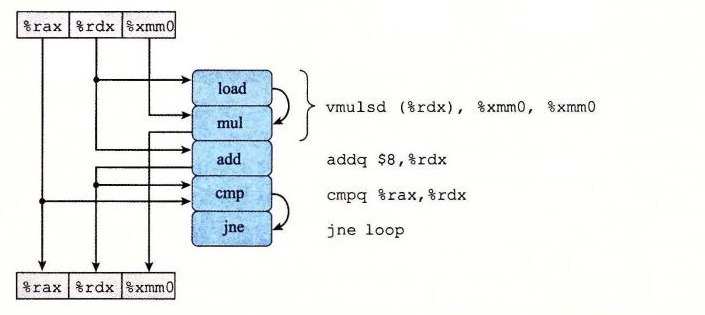

**图 5-13** `combine4` 的内循环代码的图形化表示。指令动态地被翻译成一个或两个操作，每个操作从其他操作或寄存器接收值，并且为其他操作和寄存器产生值。我们给出最后一条指令的目标为标号 `loop`。它跳转到给出的第一条指令。

作为生成程序数据流图表示的一步，图 5-13 左手边的方框和线给出了各个指令是如何使用和更新寄存器的，顶部的方框表示循环开始时寄存器的值，而底部的方框表示最后寄存器的值。例如，寄存器 `%rax` 只被 `cmp` 操作作为源值，因此这个寄存器在循环结束时有着同循环开始时一样的值。另一方面，在循环中，寄存器 `%rdx` 既被使用也被修改。它的初始值被 `load` 和 `add` 操作使用；它的新值由 `add` 操作产生，然后被 `cmp` 操作使用。在循环中，`mul` 操作首先使用寄存器 `%xmm0` 的初始值作为源值，然后会修改它的值。

图 5-13 中的某些操作产生的值不对应于任何寄存器。在右边，用操作间的弧线来表示。`load` 操作从内存读出一个值，然后把它直接传递到 `mul` 操作。由于这两个操作是通过对一条 `vmulsd` 指令译码产生的，所以这个在两个操作之间传递的中间值没有与之相关联的寄存器。`cmp` 操作更新条件码，然后 `jne` 操作会测试这些条件码。

对于形成循环的代码片段，我们可以将访问到的寄存器分为四类：

- **只读**：这些寄存器只用作源值，可以作为数据，也可以用来计算内存地址，但是在循环中它们是不会被修改的。循环 `combine4` 的只读寄存器是 `%rax`。
- **只写**：这些寄存器作为数据传送操作的目的。在本循环中没有这样的寄存器。
- **局部**：这些寄存器在循环内部被修改和使用，迭代与迭代之间不相关。在这个循环中，条件码寄存器就是例子：`cmp` 操作会修改它们，然后 `jne` 操作会使用它们，不过这种相关是在单次迭代之内的。
- **循环**：对于循环来说，这些寄存器既作为源值，又作为目的，一次迭代中产生的值会在另一次迭代中用到。可以看到，`%rdx` 和 `%xmm0` 是 `combine4` 的循环寄存器，对应于程序值 `data+i` 和 `acc`。

正如我们会看到的，循环寄存器之间的操作链决定了限制性能的数据相关。

图 5-14 是对图 5-13 的图形化表示的进一步改进，目标是只给出影响程序执行时间的操作和数据相关。在图 5-14a 中看到，我们重新排列了操作符，更清晰地表明了从顶部源寄存器（只读寄存器和循环寄存器）到底部目的寄存器（只写寄存器和循环寄存器）的数据流。

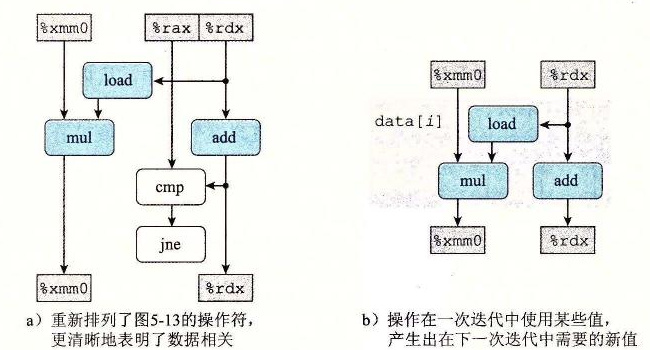

**图 5-14** 将 `combine4` 的操作抽象成数据流图。a）重新排列了图 5-13 的操作符，更清晰地表明了数据相关。b）操作在一次迭代中使用某些值，产生出在下一次迭代中需要的新值。

在图 5-14a 中，如果操作符不属于某个循环寄存器之间的相关链，那么就把它们标识成白色。例如，比较（`cmp`）和分支（`jne`）操作不直接影响程序中的数据流。假设指令控制单元预测会选择分支，因此程序会继续循环。比较和分支操作的目的是测试分支条件，如果不选择分支的话，就通知 ICU。我们假设这个检查能够完成得足够快，不会减慢处理器的执行。

在图 5-14b 中，消除了左边标识为白色的操作符，而且只保留了循环寄存器。剩下的是一个抽象的模板，表明的是由于循环的一次迭代在循环寄存器中形成的数据相关。在这个图中可以看到，从一次迭代到下一次迭代有两个数据相关。在一边，我们看到存储在寄存器 `%xmm0` 中的程序值 `acc` 的连续的值之间有相关。通过将 `acc` 的旧值乘以一个数据元素，循环计算出 `acc` 的新值，这个数据元素是由 `load` 操作产生的。在另一边，我们看到循环索引 *i* 的连续的值之间有相关。每次迭代中，*i* 的旧值用来计算 `load` 操作的地址，然后 `add` 操作也会增加它的值，计算出新值。

图 5-15 给出了函数 `combine4` 内循环的 *n* 次迭代的数据流表示。可以看出，简单地重复图 5-14 右边的模板 *n* 次，就能得到这张图。我们可以看到，程序有两条数据相关链，分别对应于操作 `mul` 和 `add` 对程序值 `acc` 和 `data+i` 的修改。假设浮点乘法延迟为 5 个周期，而整数加法延迟为 1 个周期，可以看到左边的链会成为关键路径，需要 5*n* 个周期执行。右边的链只需要 *n* 个周期执行，因此，它不会制约程序的性能。

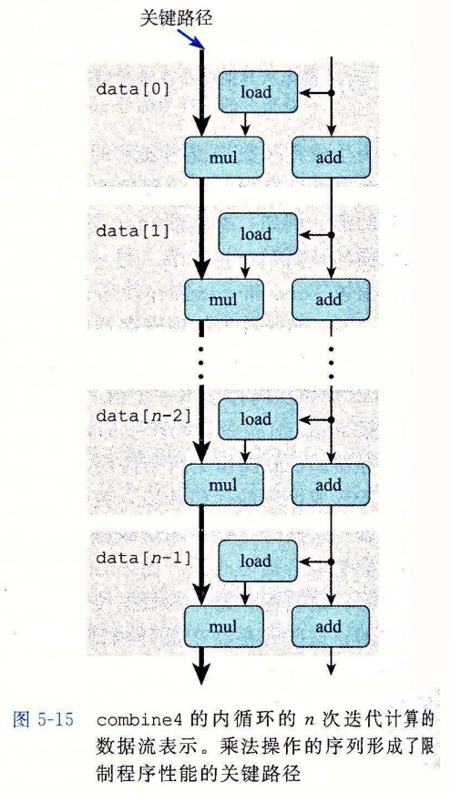

**图 5-15** `combine4` 的内循环的 *n* 次迭代计算的数据流表示。乘法操作的序列形成了限制程序性能的关键路径。

图 5-15 说明在执行单精度浮点乘法时，对于 `combine4`，为什么我们获得了等于 5 个周期延迟界限的 CPE。当执行这个函数时，浮点乘法器成为了制约资源。循环中需要的其他操作——控制和测试指针值 `data+i`，以及从内存中读数据——与乘法器并行地进行。每次后继的 `acc` 的值被计算出来，它就反馈回来计算下一个值，不过只有等到 5 个周期后才能完成。

其他数据类型和运算组合的数据流与图 5-15 所示的内容一样，只是在左边的形成数据相关链的数据操作不同。对于所有情况，如果运算的延迟 *L* 大于 1，那么可以看到测量出来的 CPE 就是 *L*，表明这个链是制约性能的关键路径。

##### 2. 其他性能因素

另一方面，对于整数加法的情况，我们对 `combine4` 的测试表明 CPE 为 1.27，而根据沿着图 5-15 中左边和右边形成的相关链预测的 CPE 为 1.00，测试值比预测值要慢。这说明了一个原则，那就是数据流表示中的关键路径提供的只是程序需要周期数的下界。还有其他一些因素会限制性能，包括可用的功能单元的数量和任何一步中功能单元之间能够传递数据值的数量。对于合并运算为整数加法的情况，数据操作足够快，使得其他操作供应数据的速度不够快。要准确地确定为什么程序中每个元素需要 1.27 个周期，需要比公开可以获得的更详细的硬件设计知识。

总结一下 `combine4` 的性能分析：我们对程序操作的抽象数据流表示说明，`combine4` 的关键路径长 *L*·*n* 是由对程序值 `acc` 的连续更新造成的，这条路径将 CPE 限制为最多 *L*。除了整数加法之外，对于所有的其他情况，测量出的 CPE 确实等于 *L*，对于整数加法，测量出的 CPE 为 1.27 而不是根据关键路径的长度所期望的 1.00。

看上去，延迟界限是基本的限制，决定了我们的合并运算能执行多快。接下来的任务是重新调整操作的结构，增强指令级并行性。我们想对程序做变换，使得唯一的限制变成吞吐量界限，得到接近于 1.00 的 CPE。

> **练习题 5.5**
>
> 假设写一个对多项式求值的函数，这里，多项式的次数为 *n*，系数为 *a*<sub>0</sub>, *a*<sub>1</sub>, …, *a*<sub>*n*</sub>。对于值 *x*，我们对多项式求值，计算
>
> *a*<sub>0</sub> + *a*<sub>1</sub>*x* + *a*<sub>2</sub>*x*<sup>2</sup> + … + *a*<sub>*n*</sub>*x*<sup>*n*</sup>　　（5.2）
>
> 这个求值可以用下面的函数来实现，参数包括一个系数数组 `a`、值 `x` 和多项式的次数 `degree`（等式（5.2）中的值 *n*）。在这个函数的一个循环中，我们计算连续的等式的项，以及连续的 *x* 的幂：
>
> ```c
> double poly(double a[], double x, long degree)
> {
>     long i;
>     double result = a[0];
>     double xpwr = x;  /* Equals x^i at start of loop */
>     for (i = 1; i <= degree; i++) {
>         result += a[i] * xpwr;
>         xpwr = x * xpwr;
>     }
>     return result;
> }
> ```
>
> A. 对于次数 *n*，这段代码执行多少次加法和多少次乘法运算？
>
> B. 在我们的参考机上，算术运算的延迟如图 5-12 所示，我们测量了这个函数的 CPE 等于 5.00。根据由于实现函数第 7～8 行的操作迭代之间形成的数据相关，解释为什么会得到这样的 CPE。

> **练习题 5.6**
>
> 我们继续探索练习题 5.5 中描述的多项式求值的方法。通过采用 Horner 法（以英国数学家 William G. Horner（1786—1837）命名）对多项式求值，我们可以减少乘法的数量。其思想是反复提出 *x* 的幂，得到下面的求值：
>
> *a*<sub>0</sub> + *x*（*a*<sub>1</sub> + *x*（*a*<sub>2</sub> + … + *x*（*a*<sub>*n*-1</sub> + *xa*<sub>*n*</sub>）…））　　（5.3）
>
> 使用 Horner 法，我们可以用下面的代码实现多项式求值：
>
> ```c
> /* Apply Horner's method */
> double polyh(double a[], double x, long degree)
> {
>     long i;
>     double result = a[degree];
>     for (i = degree-1; i >= 0; i--)
>         result = a[i] + x * result;
>     return result;
> }
> ```
>
> A. 对于次数 *n*，这段代码执行多少次加法和多少次乘法运算？
>
> B. 在我们的参考机上，算术运算的延迟如图 5-12 所示，测量这个函数的 CPE 等于 8.00。根据由于实现函数第 7 行的操作迭代之间形成的数据相关，解释为什么会得到这样的 CPE。
>
> C. 请解释虽然练习题 5.5 中所示的函数需要更多的操作，但是它是如何运行得更快的。

### 5.8 循环展开

循环展开是一种程序变换，通过增加每次迭代计算的元素的数量，减少循环的迭代次数。`psum2` 函数（见图 5-1）就是这样一个例子，其中每次迭代计算前置和的两个元素，因而将需要的迭代次数减半。循环展开能够从两个方面改进程序的性能。首先，它减少了不直接有助于程序结果的操作的数量，例如循环索引计算和条件分支。第二，它提供了一些方法，可以进一步变化代码，减少整个计算中关键路径上的操作数量。在本节中，我们会看一些简单的循环展开，不做任何进一步的变化。

图 5-16 是合并代码的使用“2×1 循环展开”的版本。第一个循环每次处理数组的两个元素。也就是每次迭代，循环索引 *i* 加 2，在一次迭代中，对数组元素 *i* 和 *i*+1 使用合并运算。

一般来说，向量长度不一定是 2 的倍数。想要使我们的代码对任意向量长度都能正确工作，可以从两个方面来解释这个需求。首先，要确保第一次循环不会超出数组的界限。对于长度为 *n* 的向量，我们将循环界限设为 *n*-1。然后，保证只有当循环索引 *i* 满足 *i*<*n*-1 时才会执行这个循环，因此最大数组索引 *i*+1 满足 *i*+1<（*n*-1）+1=*n*。

把这个思想归纳为对一个循环按任意因子 *k* 进行展开，由此产生 *k*×1 循环展开。为此，上限设为 *n*-*k*+1，在循环内对元素 *i* 到 *i*+*k*-1 应用合并运算。每次迭代，循环索引 *i* 加 *k*。那么最大循环索引 *i*+*k*-1 会小于 *n*。要使用第二个循环，以每次处理一个元素的方式处理向量的最后几个元素。这个循环体将会执行 0～*k*-1 次。对于 *k*=2，我们能用一个简单的条件语句，可选地增加最后一次迭代，如函数 `psum2`（图 5-1）所示。对于 *k*>2，最后的这些情况最好用一个循环来表示，所以对 *k*=2 的情况，我们同样也采用这个编程惯例。我们称这种变换为“*k*×1 循环展开”，因为循环展开因子为 *k*，而累积值只在单个变量 `acc` 中。

```c
/* 2 x 1 loop unrolling */
void combine5(vec_ptr v, data_t *dest)
{
    long i;
    long length = vec_length(v);
    long limit = length-1;
    data_t *data = get_vec_start(v);
    data_t acc = IDENT;

    /* Combine 2 elements at a time */
    for (i = 0; i < limit; i += 2) {
        acc = (acc OP data[i]) OP data[i+1];
    }

    /* Finish any remaining elements */
    for (; i < length; i++) {
        acc = acc OP data[i];
    }
    *dest = acc;
}
```

**图 5-16** 使用 2×1 循环展开。这种变换能减小循环开销的影响。

> **练习题 5.7**
>
> 修改 `combine5` 的代码，展开循环 *k*=5 次。

当测量展开次数 *k*=2（`combine5`）和 *k*=3 的展开代码的性能时，得到下面的结果：

| 函数/界限 | 方法 | 整数 `+` | 整数 `*` | 浮点数 `+` | 浮点数 `*` |
| --- | --- | ---: | ---: | ---: | ---: |
| `combine4` | 无展开 | 1.27 | 3.01 | 3.01 | 5.01 |
| `combine5` | 2×1 展开 | 1.01 | 3.01 | 3.01 | 5.01 |
|  | 3×1 展开 | 1.01 | 3.01 | 3.01 | 5.01 |
| 延迟界限 |  | 1.00 | 3.00 | 3.00 | 5.00 |
| 吞吐量界限 |  | 0.50 | 1.00 | 1.00 | 0.50 |

我们看到对于整数加法，CPE 有所改进，得到的延迟界限为 1.00。会有这样的结果是得益于减少了循环开销操作。相对于计算向量和所需要的加法数量，降低开销操作的数量，此时，整数加法的一个周期的延迟成为了限制性能的因素。另一方面，其他情况并没有性能提高——它们已经达到了其延迟界限。图 5-17 给出了当循环展开到 10 次时的 CPE 测量值。对于展开 2 次和 3 次时观察到的趋势还在继续——没有一个低于其延迟界限。


**图 5-17** 不同程度 *k*×1 循环展开的 CPE 性能。这种变换只改进了整数加法的性能。

要理解为什么 *k*×1 循环展开不能将性能改进到超过延迟界限，让我们来查看一下 *k*=2 时，`combine5` 内循环的机器级代码。当类型 `data_t` 为 `double`，操作为乘法时，生成如下代码：

```asm
# Inner loop of combine5. data_t = double, OP = *
# i in %rdx, data in %rax, limit in %rbp, acc in %xmm0
.L35:                                      # loop:
    vmulsd  (%rax,%rdx,8), %xmm0, %xmm0    # Multiply acc by data[i]
    vmulsd  8(%rax,%rdx,8), %xmm0, %xmm0   # Multiply acc by data[i+1]
    addq    $2, %rdx                        # Increment i by 2
    cmpq    %rdx, %rbp                      # Compare to limit:i
    jg      .L35                            # If >, goto loop
```

我们可以看到，相比 `combine4` 生成的基于指针的代码，GCC 使用了 C 代码中数组引用的更加直接的转换。循环索引 *i* 在寄存器 `%rdx` 中，`data` 的地址在寄存器 `%rax` 中。和前面一样，累积值 `acc` 在向量寄存器 `%xmm0` 中。循环展开会导致两条 `vmulsd` 指令——一条将 `data[i]` 加到 `acc` 上，第二条将 `data[i+1]` 加到 `acc` 上。图 5-18 给出了这段代码的图形化表示。每条 `vmulsd` 指令被翻译成两个操作：一个操作是从内存中加载一个数组元素，另一个是把这个值乘以已有的累积值。这里我们看到，循环的每次执行中，对寄存器 `%xmm0` 读和写两次。

> **编校注（非原书正文）** 原书此处两次写作“加到 `acc` 上”；对应的 `vmulsd` 指令及下文说明均为乘法。这里保留原文，阅读时应按乘法理解。

> GCC 优化器产生一个函数的多个版本，并从中选择它预测会获得最佳性能和最小代码量的那一个。其结果就是，源代码中微小的变化就会生成各种不同形式的机器码。我们已经发现对基于指针和基于数组的代码的选择不会影响在参考机上运行的程序的性能。


**图 5-18** `combine5` 内循环代码的图形化表示。每次迭代有两条 `vmulsd` 指令，每条指令被翻译成一个 `load` 和一个 `mul` 操作。

可以重新排列、简化和抽象这张图，按照图 5-19a 所示的过程得到图 5-19b 所示的模板。然后，把这个模板复制 *n*/2 次，给出一个长度为 *n* 的向量的计算，得到如图 5-20 所示的数据流表示。在此我们看到，这张图中关键路径还是 *n* 个 `mul` 操作——迭代次数减半了，但是每次迭代中还是有两个顺序的乘法操作。这个关键路径是循环没有展开代码的性能制约因素，而它仍然是 *k*×1 循环展开代码的性能制约因素。


**图 5-19** 将 `combine5` 的操作抽象成数据流图。a）重新排列、简化和抽象图 5-18 的表示，给出连续迭代之间的数据相关。b）每次迭代必须顺序地执行两个乘法。


**图 5-20** `combine5` 对一个长度为 *n* 的向量进行操作的数据流表示。虽然循环展开了 2 次，但是关键路径上还是有 *n* 个 `mul` 操作。

> **旁注 让编译器展开循环**
>
> 编译器可以很容易地执行循环展开。只要优化级别设置得足够高，许多编译器都能例行公事地做到这一点。用优化等级 3 或更高等级调用 GCC，它就会执行循环展开。

### 5.9 提高并行性

在此，程序的性能是受运算单元的延迟限制的。不过，正如我们表明的，执行加法和乘法的功能单元是完全流水线化的，这意味着它们可以每个时钟周期开始一个新操作，并且有些操作可以被多个功能单元执行。硬件具有以更高速率执行乘法和加法的潜力，但是代码不能利用这种能力，即使是使用循环展开也不能，这是因为我们将累积值放在一个单独的变量 `acc` 中。在前面的计算完成之前，都不能计算 `acc` 的新值。虽然计算 `acc` 新值的功能单元能够每个时钟周期开始一个新的操作，但是它只会每 *L* 个周期开始一条新操作，这里 *L* 是合并操作的延迟。现在我们要考察打破这种顺序相关，得到比延迟界限更好性能的方法。

#### 5.9.1 多个累积变量

对于一个可结合和可交换的合并运算来说，比如说整数加法或乘法，我们可以通过将一组合并运算分割成两个或更多的部分，并在最后合并结果来提高性能。例如，*P*<sub>*n*</sub> 表示元素 *a*<sub>0</sub>, *a*<sub>1</sub>, …, *a*<sub>*n*-1</sub> 的乘积：

*P*<sub>*n*</sub> = ∏<sub>*i*=0</sub><sup>*n*-1</sup> *a*<sub>*i*</sub>

假设 *n* 为偶数，我们还可以把它写成

*P*<sub>*n*</sub> = *PE*<sub>*n*</sub> × *PO*<sub>*n*</sub>

这里 *PE*<sub>*n*</sub> 是索引值为偶数的元素的乘积，而 *PO*<sub>*n*</sub> 是索引值为奇数的元素的乘积：

*PE*<sub>*n*</sub> = ∏<sub>*i*=0</sub><sup>*n*/2-1</sup> *a*<sub>2*i*</sub>

*PO*<sub>*n*</sub> = ∏<sub>*i*=0</sub><sup>*n*/2-1</sup> *a*<sub>2*i*+1</sub>

图 5-21 展示的是使用这种方法的代码。它既使用了两次循环展开，以使每次迭代合并更多的元素，也使用了两路并行，将索引值为偶数的元素累积在变量 `acc0` 中，而索引值为奇数的元素累积在变量 `acc1` 中。因此，我们将其称为“2×2 循环展开”。同前面一样，我们还包括了第二个循环，对于向量长度不为 2 的倍数时，这个循环要累积所有剩下的数组元素。然后，我们对 `acc0` 和 `acc1` 应用合并运算，计算最终的结果。

```c
/* 2 x 2 loop unrolling */
void combine6(vec_ptr v, data_t *dest)
{
    long i;
    long length = vec_length(v);
    long limit = length-1;
    data_t *data = get_vec_start(v);
    data_t acc0 = IDENT;
    data_t acc1 = IDENT;

    /* Combine 2 elements at a time */
    for (i = 0; i < limit; i += 2) {
        acc0 = acc0 OP data[i];
        acc1 = acc1 OP data[i+1];
    }

    /* Finish any remaining elements */
    for (; i < length; i++) {
        acc0 = acc0 OP data[i];
    }
    *dest = acc0 OP acc1;
}
```

**图 5-21** 运用 2×2 循环展开。通过维护多个累积变量，这种方法利用了多个功能单元以及它们的流水线能力。

比较只做循环展开和既做循环展开同时也使用两路并行这两种方法，我们得到下面的性能：

| 函数/界限 | 方法 | 整数 `+` | 整数 `*` | 浮点数 `+` | 浮点数 `*` |
| --- | --- | ---: | ---: | ---: | ---: |
| `combine4` | 在临时变量中累积 | 1.27 | 3.01 | 3.01 | 5.01 |
| `combine5` | 2×1 展开 | 1.01 | 3.01 | 3.01 | 5.01 |
| `combine6` | 2×2 展开 | 0.81 | 1.51 | 1.51 | 2.51 |
| 延迟界限 |  | 1.00 | 3.00 | 3.00 | 5.00 |
| 吞吐量界限 |  | 0.50 | 1.00 | 1.00 | 0.50 |

我们看到所有情况都得到了改进，整数乘、浮点加、浮点乘改进了约 2 倍，而整数加也有所改进。最棒的是，我们打破了由延迟界限设下的限制。处理器不再需要延迟一个加法或乘法操作以待前一个操作完成。

要理解 `combine6` 的性能，我们从图 5-22 所示的代码和操作序列开始。通过图 5-23 所示的过程，可以推导出一个模板，给出迭代之间的数据相关。同 `combine5` 一样，这个内循环包括两个 `vmulsd` 运算，但是这些指令被翻译成读写不同寄存器的 `mul` 操作，它们之间没有数据相关（图 5-23b）。


**图 5-22** `combine6` 内循环代码的图形化表示。每次循环有两条 `vmulsd` 指令，每条指令被翻译成一个 `load` 和一个 `mul` 操作。

然后，把这个模板复制 *n*/2 次（图 5-24），就是在一个长度为 *n* 的向量上执行这个函数的模型。可以看到，现在有两条关键路径，一条对应于计算索引为偶数的元素的乘积（程序值 `acc0`），另一条对应于计算索引为奇数的元素的乘积（程序值 `acc1`）。每条关键路径只包含 *n*/2 个操作，因此导致 CPE 大约为 5.00/2=2.50。相似的分析可以解释我们观察到的对于不同的数据类型和合并运算的组合，延迟为 *L* 的操作的 CPE 等于 *L*/2。实际上，程序正在利用功能单元的流水线能力，将利用率提高到 2 倍。唯一的例外是整数加。我们已将 CPE 降低到 1.0 以下，但是还是有太多的循环开销，而无法达到理论界限 0.50。

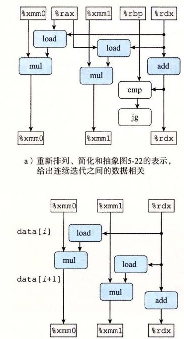

**图 5-23** 将 `combine6` 的运算抽象成数据流图。a）重新排列、简化和抽象图 5-22 的表示，给出连续迭代之间的数据相关。b）两个 `mul` 操作之间没有相关。

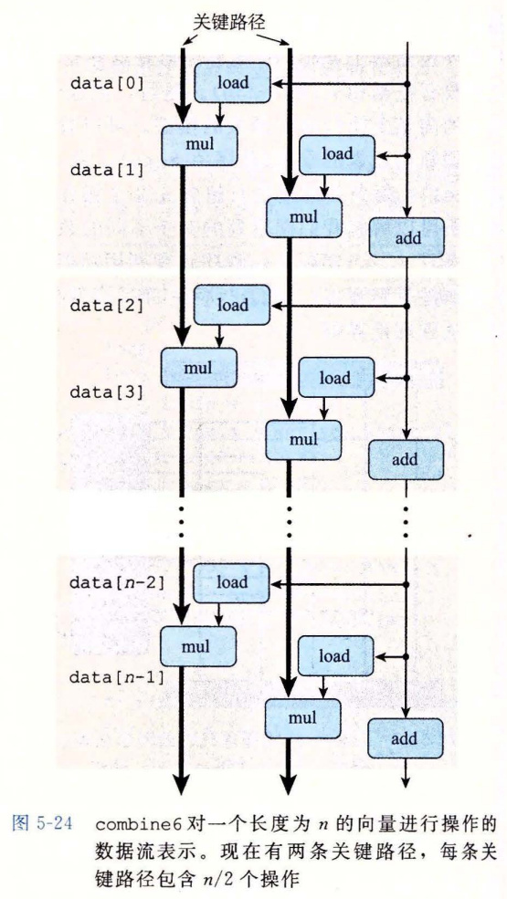

**图 5-24** `combine6` 对一个长度为 *n* 的向量进行操作的数据流表示。现在有两条关键路径，每条关键路径包含 *n*/2 个操作。

我们可以将多个累积变量变换归纳为将循环展开 *k* 次，以及并行累积 *k* 个值，得到 *k*×*k* 循环展开。图 5-25 显示了当数值达到 *k*=10 时，应用这种变换的效果。可以看到，当 *k* 值足够大时，程序在所有情况下几乎都能达到吞吐量界限。整数加在 *k*=7 时达到的 CPE 为 0.54，接近由两个加载单元导致的吞吐量界限 0.50。整数乘和浮点加在 *k*≥3 时达到的 CPE 为 1.01，接近由它们的功能单元设置的吞吐量界限 1.00。浮点乘在 *k*≥10 时达到的 CPE 为 0.51，接近由两个浮点乘法器和两个加载单元设置的吞吐量界限 0.50。值得注意的是，即使乘法是更加复杂的操作，我们的代码在浮点乘上达到的吞吐量几乎是浮点加可以达到的两倍。


**图 5-25** *k*×*k* 循环展开的 CPE 性能。使用这种变换后，所有的 CPE 都有所改进，接近或达到其吞吐量界限。

通常，只有保持能够执行该操作的所有功能单元的流水线都是满的，程序才能达到这个操作的吞吐量界限。对延迟为 *L*、容量为 *C* 的操作而言，这就要求循环展开因子 *k*≥*C*·*L*。比如，浮点乘有 *C*=2，*L*=5，循环展开因子就必须为 *k*≥10。浮点加有 *C*=1，*L*=3，则在 *k*≥3 时达到最大吞吐量。

在执行 *k*×*k* 循环展开变换时，我们必须考虑是否要保留原始函数的功能。在第 2 章已经看到，补码运算是可交换和可结合的，甚至是当溢出时也是如此。因此，对于整数数据类型，在所有可能的情况下，`combine6` 计算出的结果都和 `combine5` 计算出的相同。因此，优化编译器潜在地能够将 `combine4` 中所示的代码首先转换成 `combine5` 的二路循环展开的版本，然后再通过引入并行性，将之转换成 `combine6` 的版本。有些编译器可以做这种或与之类似的变换来提高整数数据的性能。

另一方面，浮点乘法和加法不是可结合的。因此，由于四舍五入或溢出，`combine5` 和 `combine6` 可能产生不同的结果。例如，假想这样一种情况，所有索引值为偶数的元素都是绝对值非常大的数，而索引值为奇数的元素都非常接近于 0.0。那么，即使最终的乘积 *P*<sub>*n*</sub> 不会溢出，乘积 *PE*<sub>*n*</sub> 也可能上溢，或者 *PO*<sub>*n*</sub> 也可能下溢。不过在大多数现实的程序中，不太可能出现这样的情况。因为大多数物理现象是连续的，所以数值数据也趋向于相当平滑，不会出什么问题。即使有不连续的时候，它们通常也不会导致前面描述的条件那样的周期性模式。按照严格顺序对元素求积的准确性不太可能从根本上比“分成两组独立求积，然后再将这两个积相乘”更好。对大多数应用程序来说，使性能翻倍要比冒对奇怪的数据模式产生不同的结果的风险更重要。但是，程序开发人员应该与潜在的用户协商，看看是否有特殊的条件，可能会导致修改后的算法不能接受。大多数编译器并不会尝试对浮点数代码进行这种变换，因为它们没有办法判断引入这种会改变程序行为的转换所带来的风险，不论这种改变是多么小。

#### 5.9.2 重新结合变换

现在来探讨另一种打破顺序相关从而使性能提高到延迟界限之外的方法。我们看到过做 *k*×1 循环展开的 `combine5` 没有改变合并向量元素形成和或者乘积中执行的操作。不过，对代码做很小的改动，我们可以从根本上改变合并执行的方式，也极大地提高程序的性能。

图 5-26 给出了一个函数 `combine7`，它与 `combine5` 的展开代码（图 5-16）的唯一区别在于内循环中元素合并的方式。在 `combine5` 中，合并是以下面这条语句来实现的：

```c
acc = (acc OP data[i]) OP data[i+1];
```

而在 `combine7` 中，合并是以这条语句来实现的：

```c
acc = acc OP (data[i] OP data[i+1]);
```

差别仅在于两个括号是如何放置的。我们称之为重新结合变换（reassociation transformation），因为括号改变了向量元素与累积值 `acc` 的合并顺序，产生了我们称为“2×1a”的循环展开形式。

```c
/* 2 x 1a loop unrolling */
void combine7(vec_ptr v, data_t *dest)
{
    long i;
    long length = vec_length(v);
    long limit = length-1;
    data_t *data = get_vec_start(v);
    data_t acc = IDENT;

    /* Combine 2 elements at a time */
    for (i = 0; i < limit; i += 2) {
        acc = acc OP (data[i] OP data[i+1]);
    }

    /* Finish any remaining elements */
    for (; i < length; i++) {
        acc = acc OP data[i];
    }
    *dest = acc;
}
```

**图 5-26** 运用 2×1a 循环展开，重新结合合并操作。这种方法增加了可以并行执行的操作数量。

对于未经训练的人来说，这两个语句可能看上去本质上是一样的，但是当我们测量 CPE 的时候，得到令人吃惊的结果：

| 函数/界限 | 方法 | 整数 `+` | 整数 `*` | 浮点数 `+` | 浮点数 `*` |
| --- | --- | ---: | ---: | ---: | ---: |
| `combine4` | 累积在临时变量中 | 1.27 | 3.01 | 3.01 | 5.01 |
| `combine5` | 2×1 展开 | 1.01 | 3.01 | 3.01 | 5.01 |
| `combine6` | 2×2 展开 | 0.81 | 1.51 | 1.51 | 2.51 |
| `combine7` | 2×1a 展开 | 1.01 | 1.51 | 1.51 | 2.51 |
| 延迟界限 |  | 1.00 | 3.00 | 3.00 | 5.00 |
| 吞吐量界限 |  | 0.50 | 1.00 | 1.00 | 0.50 |

整数加的性能几乎与使用 *k*×1 展开的版本（`combine5`）的性能相同，而其他三种情况则与使用并行累积变量的版本（`combine6`）相同，是 *k*×1 展开的性能的两倍。这些情况已经突破了延迟界限造成的限制。

图 5-27 说明了 `combine7` 内循环的代码（对于合并操作为乘法，数据类型为 `double` 的情况）是如何被译码成操作，以及由此得到的数据相关。我们看到，来自于 `vmovsd` 和第一个 `vmulsd` 指令的 `load` 操作从内存中加载向量元素 *i* 和 *i*+1，第一个 `mul` 操作把它们乘起来。然后，第二个 `mul` 操作把这个结果乘以累积值 `acc`。


**图 5-27** `combine7` 内循环代码的图形化表示。每次迭代被译码成与 `combine5` 或 `combine6` 类似的操作，但是数据相关不同。

图 5-28a 给出了我们如何对图 5-27 的操作进行重新排列、优化和抽象，得到表示一次迭代中数据相关的模板（图 5-28b）。对于 `combine5` 和 `combine7` 的模板，有两个 `load` 和两个 `mul` 操作，但是只有一个 `mul` 操作形成了循环寄存器间的数据相关链。

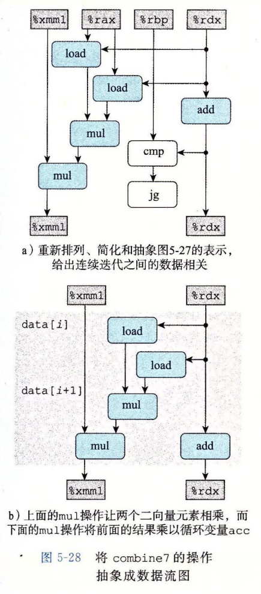

**图 5-28** 将 `combine7` 的操作抽象成数据流图。a）重新排列、简化和抽象图 5-27 的表示，给出连续迭代之间的数据相关。b）上面的 `mul` 操作让两个向量元素相乘，而下面的 `mul` 操作将前面的结果乘以循环变量 `acc`。

然后，把这个模板复制 *n*/2 次，给出了 *n* 个向量元素相乘所执行的计算（图 5-29），我们可以看到关键路径上只有 *n*/2 个操作。每次迭代内的第一个乘法都不需要等待前一次迭代的累积值就可以执行。因此，最小可能的 CPE 减少了 2 倍。

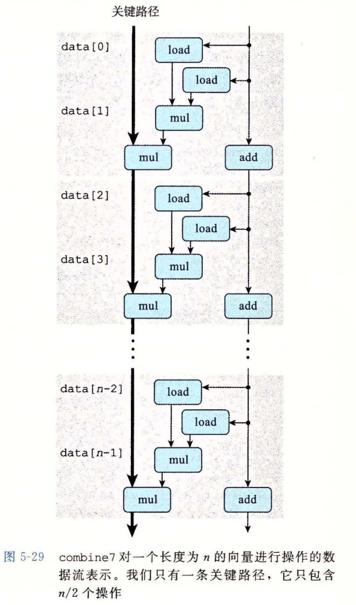

**图 5-29** `combine7` 对一个长度为 *n* 的向量进行操作的数据流表示。我们只有一条关键路径，它只包含 *n*/2 个操作。

图 5-30 展示了当数值达到 *k*=10 时，实现 *k*×1a 循环展开并重新结合变换的效果。可以看到，这种变换带来的性能结果与 *k*×*k* 循环展开中保持 *k* 个累积变量的结果相似。对所有的情况来说，我们都接近了由功能单元造成的吞吐量界限。

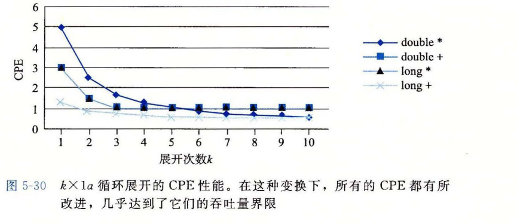

**图 5-30** *k*×1a 循环展开的 CPE 性能。在这种变换下，所有的 CPE 都有所改进，几乎达到了它们的吞吐量界限。

在执行重新结合变换时，我们又一次改变向量元素合并的顺序。对于整数加法和乘法，这些运算是可结合的，这表示这种重新变换顺序对结果没有影响。对于浮点数情况，必须再次评估这种重新结合是否有可能严重影响结果。我们会说对大多数应用来说，这种差别不重要。

总的来说，重新结合变换能够减少计算中关键路径上操作的数量，通过更好地利用功能单元的流水线能力得到更好的性能。大多数编译器不会尝试对浮点运算做重新结合，因为这些运算不保证是可结合的。当前的 GCC 版本会对整数运算执行重新结合，但不是总有好的效果。通常，我们发现循环展开和并行地累积在多个值中，是提高程序性能的更可靠的方法。

> **练习题 5.8**
>
> 考虑下面的计算 *n* 个双精度数组成的数组乘积的函数。我们 3 次展开这个循环。
>
> ```c
> double aprod(double a[], long n)
> {
>     long i;
>     double x, y, z;
>     double r = 1;
>
>     for (i = 0; i < n-2; i += 3) {
>         x = a[i]; y = a[i+1]; z = a[i+2];
>         r = r * x * y * z;  /* Product computation */
>     }
>     for (; i < n; i++)
>         r *= a[i];
>     return r;
> }
> ```
>
> 对于标记为 `Product computation` 的行，可以用括号得到该计算的五种不同的结合，如下所示：
>
> ```c
> r = ((r * x) * y) * z;  /* A1 */
> r = (r * (x * y)) * z;  /* A2 */
> r = r * ((x * y) * z);  /* A3 */
> r = r * (x * (y * z));  /* A4 */
> r = (r * x) * (y * z);  /* A5 */
> ```
>
> 假设在一台浮点数乘法延迟为 5 个时钟周期的机器上运行这些函数。确定由乘法的数据相关限定的 CPE 的下界。（提示：画出每次迭代如何计算 `r` 的图形化表示会有帮助。）

> **旁注 用向量指令达到更高的并行度**
>
> 就像在 3.1 节中讲述的，Intel 在 1999 年引入了 SSE 指令，SSE 是“Streaming SIMD Extensions（流 SIMD 扩展）”的缩写，而 SIMD（读作“sim-dee”）是“Single-Instruction, Multiple-Data（单指令多数据）”的缩写。SSE 功能历经几代，最新的版本为高级向量扩展（advanced vector extension）或 AVX。SIMD 执行模型是用单条指令对整个向量数据进行操作。这些向量保存在一组特殊的向量寄存器（vector register）中，名字为 `%ymm0`～`%ymm15`。目前的 AVX 向量寄存器长为 32 字节，因此每一个都可以存放 8 个 32 位数或 4 个 64 位数，这些数据既可以是整数也可以是浮点数。AVX 指令可以对这些寄存器执行向量操作，比如并行执行 8 组数值或 4 组数值的加法或乘法。例如，如果 YMM 寄存器 `%ymm0` 包含 8 个单精度浮点数，用 *a*<sub>0</sub>, …, *a*<sub>7</sub> 表示，而 `%rcx` 包含 8 个单精度浮点数的内存地址，用 *b*<sub>0</sub>, …, *b*<sub>7</sub> 表示，那么指令
>
> ```asm
> vmulps (%rcx), %ymm0, %ymm1
> ```
>
> 会从内存中读出 8 个值，并行地执行 8 个乘法，计算 *a*<sub>*i*</sub>·*b*<sub>*i*</sub>，0≤*i*≤7，并将得到的 8 个乘积保存到向量寄存器 `%ymm1`。我们看到，一条指令能够产生对多个数据值的计算，因此称为“SIMD”。
>
> GCC 支持对 C 语言的扩展，能够让程序员在程序中使用向量操作，这些操作能够被编译成 AVX 的向量指令（以及基于早前的 SSE 指令的代码）。这种代码风格比直接用汇编语言写代码要好，因为 GCC 还可以为其他处理器上的向量指令产生代码。
>
> 使用 GCC 指令、循环展开和多个累积变量的组合，我们的合并函数能够达到下面的性能：
>
> | 方法 | 整数 `int +` | 整数 `int *` | 整数 `long +` | 整数 `long *` | 浮点 `float +` | 浮点 `float *` | 浮点 `double +` | 浮点 `double *` |
> | --- | ---: | ---: | ---: | ---: | ---: | ---: | ---: | ---: |
> | 标量 10×10 | 0.54 | 1.01 | 0.55 | 1.00 | 1.01 | 0.51 | 1.01 | 0.52 |
> | 标量吞吐量界限 | 0.50 | 1.00 | 0.50 | 1.00 | 1.00 | 0.50 | 1.00 | 0.50 |
> | 向量 8×8 | 0.05 | 0.24 | 0.13 | 1.51 | 0.12 | 0.08 | 0.25 | 0.16 |
> | 向量吞吐量界限 | 0.06 | 0.12 | 0.12 | — | 0.12 | 0.06 | 0.25 | 0.12 |
>
> 上表中，第一组数字对应的是按照 `combine6` 的风格编写的传统标量代码，循环展开因子为 10，并维护 10 个累积变量。第二组数字对应的代码编写形式可以被 GCC 编译成 AVX 向量代码。除了使用向量操作外，这个版本也进行了循环展开，展开因子为 8，并维护 8 个不同的向量累积变量。我们给出了 32 位和 64 位数字的结果，因为向量指令在第一种情况中达到 8 路并行，而在第二种情况中只能达到 4 路并行。
>
> 可以看到，向量代码在 32 位的 4 种情况下几乎都获得了 8 倍的提升，对于 64 位来说，在其中的 3 种情况下获得了 4 倍的提升。只有长整数乘法代码在我们尝试将其表示为向量代码时性能不佳。AVX 指令集不包括 64 位整数的并行乘法指令，因此 GCC 无法为此种情况生成向量代码。使用向量指令对合并操作产生了新的吞吐量界限。与标量界限相比，32 位操作的新界限小了 8 倍，64 位操作的新界限小了 4 倍。我们的代码在几种数据类型和操作的组合上接近了这些界限。

### 5.10 优化合并代码的结果小结

我们极大化对向量元素加或者乘的函数性能的努力获得了成功。下表总结了对于标量代码所获得的结果，没有使用 AVX 向量指令提供的向量并行性：

| 函数/界限 | 方法 | 整数 `+` | 整数 `*` | 浮点数 `+` | 浮点数 `*` |
| --- | --- | ---: | ---: | ---: | ---: |
| `combine1` | 抽象 `-O1` | 10.12 | 10.12 | 10.17 | 11.14 |
| `combine6` | 2×2 循环展开 | 0.81 | 1.51 | 1.51 | 2.51 |
|  | 10×10 循环展开 | 0.55 | 1.00 | 1.01 | 0.52 |
| 延迟界限 |  | 1.00 | 3.00 | 3.00 | 5.00 |
| 吞吐量界限 |  | 0.50 | 1.00 | 1.00 | 0.50 |

使用多项优化技术，我们获得的 CPE 已经接近于 0.50 和 1.00 的吞吐量界限，只受限于功能单元的容量。与原始代码相比提升了 10～20 倍，且使用普通的 C 代码和标准编译器就获得了所有这些改进。重写代码利用较新的 SIMD 指令得到了将近 4 倍或 8 倍的性能提升。比如单精度乘法，CPE 从初值 11.14 降到了 0.06，整体性能提升超过 180 倍。这个例子说明现代处理器具有相当的计算能力，但是我们可能需要按非常程式化的方式来编写程序以便将这些能力诱发出来。

### 5.11 一些限制因素

我们已经看到在一个程序的数据流图表示中，关键路径指明了执行该程序所需时间的一个基本的下界。也就是说，如果程序中有某条数据相关链，这条链上的所有延迟之和等于 *T*，那么这个程序至少需要 *T* 个周期才能执行完。

我们还看到功能单元的吞吐量界限也是程序执行时间的一个下界。也就是说，假设一个程序一共需要 *N* 个某种运算的计算，而微处理器只有 *C* 个能执行这个操作的功能单元，并且这些单元的发射时间为 *I*。那么，这个程序的执行至少需要 *N*·*I*/*C* 个周期。

在本节中，我们会考虑其他一些制约程序在实际机器上性能的因素。

#### 5.11.1 寄存器溢出

循环并行性的好处受汇编代码描述计算的能力限制。如果我们的并行度 *p* 超过了可用的寄存器数量，那么编译器会诉诸溢出（spilling），将某些临时值存放到内存中，通常是在运行时堆栈上分配空间。举个例子，将 `combine6` 的多累积变量模式扩展到 *k*=10 和 *k*=20，其结果的比较如下表所示：

| 函数/界限 | 方法 | 整数 `+` | 整数 `*` | 浮点数 `+` | 浮点数 `*` |
| --- | --- | ---: | ---: | ---: | ---: |
| `combine6` | 10×10 循环展开 | 0.55 | 1.00 | 1.01 | 0.52 |
|  | 20×20 循环展开 | 0.83 | 1.03 | 1.02 | 0.68 |
| 吞吐量界限 |  | 0.50 | 1.00 | 1.00 | 0.50 |

我们可以看到对这种循环展开程度的增加没有改善 CPE，有些甚至还变差了。现代 x86-64 处理器有 16 个寄存器，并可以使用 16 个 YMM 寄存器来保存浮点数。一旦循环变量的数量超过了可用寄存器的数量，程序就必须在栈上分配一些变量。

例如，下面的代码片段展示了在 10×10 循环展开的内循环中，累积变量 `acc0` 是如何更新的：

```asm
# Updating of accumulator acc0 in 10 x 10 unrolling
vmulsd (%rdx), %xmm0, %xmm0  # acc0 *= data[i]
```

我们看到该累积变量被保存在寄存器 `%xmm0` 中，因此程序可以简单地从内存中读取 `data[i]`，并与这个寄存器相乘。

与之相比，20×20 循环展开的相应部分非常不同：

```asm
# Updating of accumulator acc0 in 20 x 20 unrolling
vmovsd 40(%rsp), %xmm0
vmulsd (%rdx), %xmm0, %xmm0
vmovsd %xmm0, 40(%rsp)
```

累积变量保存为栈上的一个局部变量，其位置距离栈指针偏移量为 40。程序必须从内存中读取两个数值：累积变量的值和 `data[i]` 的值，将两者相乘后，将结果保存回内存。

一旦编译器必须要诉诸寄存器溢出，那么维护多个累积变量的优势就很可能消失。幸运的是，x86-64 有足够多的寄存器，大多数循环在出现寄存器溢出之前就将达到吞吐量限制。

#### 5.11.2 分支预测和预测错误处罚

在 3.6.6 节中通过实验证明，当分支预测逻辑不能正确预测一个分支是否要跳转的时候，条件分支可能会招致很大的预测错误处罚。既然我们已经学习到了一些关于处理器是如何工作的知识，就能理解这样的处罚是从哪里产生出来的了。

现代处理器的工作远超前于当前正在执行的指令，从内存读新指令，译码指令，以确定在什么操作数上执行什么操作。只要指令遵循的是一种简单的顺序，那么这种指令流水线化（instruction pipelining）就能很好地工作。当遇到分支的时候，处理器必须猜测分支该往哪个方向走。对于条件转移的情况，这意味着要预测是否会选择分支。对于像间接跳转（跳转到由一个跳转表条目指定的地址）或过程返回这样的指令，这意味着要预测目标地址。在这里，我们主要讨论条件分支。

在一个使用投机执行（speculative execution）的处理器中，处理器会开始执行预测的分支目标处的指令。它会避免修改任何实际的寄存器或内存位置，直到确定了实际的结果。如果预测正确，那么处理器就会“提交”投机执行的指令的结果，把它们存储到寄存器或内存。如果预测错误，处理器必须丢弃掉所有投机执行的结果，在正确的位置，重新开始取指令的过程。这样做会引起预测错误处罚，因为在产生有用的结果之前，必须重新填充指令流水线。

在 3.6.6 节中我们看到，最近的 x86 处理器（包含所有可以执行 x86-64 程序的处理器）有条件传送指令。在编译条件语句和表达式的时候，GCC 能产生使用这些指令的代码，而不是更传统的基于控制的条件转移的实现。翻译成条件传送的基本思想是计算出一个条件表达式或语句两个方向上的值，然后用条件传送选择期望的值。在 4.5.7 节中我们看到，条件传送指令可以被实现为普通指令流水线化处理的一部分。没有必要猜测条件是否满足，因此猜测错误也没有处罚。

那么一个 C 语言程序员怎么能够保证分支预测处罚不会阻碍程序的效率呢？对于参考机来说，预测错误处罚是 19 个时钟周期，赌注很高。对于这个问题没有简单的答案，但是下面的通用原则是可用的。

##### 1. 不要过分关心可预测的分支

我们已经看到错误的分支预测的影响可能非常大，但是这并不意味着所有的程序分支都会减缓程序的执行。实际上，现代处理器中的分支预测逻辑非常善于辨别不同的分支指令的有规律的模式和长期的趋势。例如，在合并函数中结束循环的分支通常会被预测为选择分支，因此只在最后一次会导致预测错误处罚。

再来看另一个例子，当从 `combine2` 变化到 `combine3` 时，我们把函数 `get_vec_element` 从函数的内循环中拿了出来，考虑一下我们观察到的结果，如下所示：

| 函数 | 方法 | 整数 `+` | 整数 `*` | 浮点数 `+` | 浮点数 `*` |
| --- | --- | ---: | ---: | ---: | ---: |
| `combine2` | 移动 `vec_length` | 7.02 | 9.03 | 9.02 | 11.03 |
| `combine3` | 直接数据访问 | 7.17 | 9.02 | 9.02 | 11.03 |

CPE 基本上没变，即使这个转变消除了每次迭代中用于检查向量索引是否在界限内的两个条件语句。对这个函数来说，这些检测总是确定索引是在界内的，所以是高度可预测的。

作为一种测试边界检查对性能影响的方法，考虑下面的合并代码，修改 `combine4` 的内循环，用执行 `get_vec_element` 代码的内联函数结果替换对数据元素的访问。我们称这个新版本为 `combine4b`。这段代码执行了边界检查，还通过向量数据结构来引用向量元素。

```c
/* Include bounds check in loop */
void combine4b(vec_ptr v, data_t *dest)
{
    long i;
    long length = vec_length(v);
    data_t acc = IDENT;

    for (i = 0; i < length; i++) {
        if (i >= 0 && i < v->len) {
            acc = acc OP v->data[i];
        }
    }
    *dest = acc;
}
```

然后，我们直接比较使用和不使用边界检查的函数的 CPE：

| 函数 | 方法 | 整数 `+` | 整数 `*` | 浮点数 `+` | 浮点数 `*` |
| --- | --- | ---: | ---: | ---: | ---: |
| `combine4` | 无边界检查 | 1.27 | 3.01 | 3.01 | 5.01 |
| `combine4b` | 有边界检查 | 2.02 | 3.01 | 3.01 | 5.01 |

对整数加法来说，带边界检测的版本会慢一点，但对其他三种情况来说，性能是一样的。这些情况受限于它们各自的合并操作的延迟。执行边界检测所需的额外计算可以与合并操作并行执行。处理器能够预测这些分支的结果，所以这些求值都不会对形成程序执行中关键路径的指令的取指和处理产生太大的影响。

##### 2. 书写适合用条件传送实现的代码

分支预测只对有规律的模式可行。程序中的许多测试是完全不可预测的，依赖于数据的任意特性，例如一个数是负数还是正数。对于这些测试，分支预测逻辑会处理得很糟糕。对于本质上无法预测的情况，如果编译器能够产生使用条件数据传送而不是使用条件控制转移的代码，可以极大地提高程序的性能。这不是 C 语言程序员可以直接控制的，但是有些表达条件行为的方法能够更直接地被翻译成条件传送，而不是其他操作。

我们发现 GCC 能够为以一种更“功能性的”风格书写的代码产生条件传送，在这种风格的代码中，我们用条件操作来计算值，然后用这些值来更新程序状态，这种风格对立于一种更“命令式的”风格，这种风格中，我们用条件语句来有选择地更新程序状态。这两种风格也没有严格的规则，我们用一个例子来说明。假设给定两个整数数组 `a` 和 `b`，对于每个位置 *i*，我们想将 `a[i]` 设置为 `a[i]` 和 `b[i]` 中较小的那一个，而将 `b[i]` 设置为两者中较大的那一个。

用命令式的风格实现这个函数是检查每个位置 *i*，如果它们的顺序与我们想要的不同，就交换两个元素：

```c
/* Rearrange two vectors so that for each i, b[i] >= a[i] */
void minmax1(long a[], long b[], long n)
{
    long i;
    for (i = 0; i < n; i++) {
        if (a[i] > b[i]) {
            long t = a[i];
            a[i] = b[i];
            b[i] = t;
        }
    }
}
```

在随机数据上测试这个函数，得到的 CPE 大约为 13.50，而对于可预测的数据，CPE 为 2.5～3.5，其预测错误惩罚约为 20 个周期。

用功能式的风格实现这个函数是计算每个位置 *i* 的最大值和最小值，然后将这些值分别赋给 `a[i]` 和 `b[i]`：

```c
/* Rearrange two vectors so that for each i, b[i] >= a[i] */
void minmax2(long a[], long b[], long n)
{
    long i;
    for (i = 0; i < n; i++) {
        long min = a[i] < b[i] ? a[i] : b[i];
        long max = a[i] < b[i] ? b[i] : a[i];
        a[i] = min;
        b[i] = max;
    }
}
```

对这个函数的测试表明无论数据是任意的，还是可预测的，CPE 都大约为 4.0。（我们还检查了产生的汇编代码，确认它确实使用了条件传送。）

在 3.6.6 节中讨论过，不是所有的条件行为都能用条件数据传送来实现，所以无可避免地在某些情况中，程序员不能避免写出会导致条件分支的代码，而对于这些条件分支，处理器用分支预测可能会处理得很糟糕。但是，正如我们讲过的，程序员方面用一点点聪明，有时就能使代码更容易被翻译成条件数据传送。这需要一些试验，写出函数的不同版本，然后检查产生的汇编代码，并测试性能。

> **练习题 5.9**
>
> 对于归并排序的合并步骤的传统的实现需要三个循环 [98]：
>
> ```c
> void merge(long src1[], long src2[], long dest[], long n)
> {
>     long i1 = 0;
>     long i2 = 0;
>     long id = 0;
>     while (i1 < n && i2 < n) {
>         if (src1[i1] < src2[i2])
>             dest[id++] = src1[i1++];
>         else
>             dest[id++] = src2[i2++];
>     }
>     while (i1 < n)
>         dest[id++] = src1[i1++];
>     while (i2 < n)
>         dest[id++] = src2[i2++];
> }
> ```
>
> 对于把变量 `i1` 和 `i2` 与 `n` 做比较导致的分支，有很好的预测性能——唯一的预测错误发生在它们第一次变成错误时。另一方面，值 `src1[i1]` 和 `src2[i2]` 之间的比较（第 6 行），对于通常的数据来说，都是非常难以预测的。这个比较控制一个条件分支，运行在随机数据上时，得到的 CPE 大约为 15.0（这里元素的数量为 2*n*）。
>
> 重写这段代码，使得可以用一个条件传送语句来实现第一个循环中条件语句（第 6～9 行）的功能。

### 5.12 理解内存性能

到目前为止我们写的所有代码，以及运行的所有测试，只访问相对比较少量的内存。例如，我们都是在长度小于 1000 个元素的向量上测试这些合并函数，数据量不会超过 8000 个字节。所有的现代处理器都包含一个或多个高速缓存（cache）存储器，以对这样少量的存储器提供快速的访问。本节会进一步研究涉及加载（从内存读到寄存器）和存储（从寄存器写到内存）操作的程序的性能，只考虑所有的数据都存放在高速缓存中的情况。在第 6 章，我们会更详细地探究高速缓存是如何工作的，它们的性能特性，以及如何编写充分利用高速缓存的代码。

如图 5-11 所示，现代处理器有专门的功能单元来执行加载和存储操作，这些单元有内部的缓冲区来保存未完成的内存操作请求集合。例如，我们的参考机有两个加载单元，每一个可以保存多达 72 个未完成的读请求。它还有一个存储单元，其存储缓冲区能保存最多 42 个写请求。每个这样的单元通常可以每个时钟周期开始一个操作。

#### 5.12.1 加载的性能

一个包含加载操作的程序的性能既依赖于流水线的能力，也依赖于加载单元的延迟。在参考机上运行合并操作的实验中，我们看到除了使用 SIMD 操作时以外，对任何数据类型组合和合并操作来说，CPE 从没有到过 0.50 以下。一个制约示例的 CPE 的因素是，对于每个被计算的元素，所有的示例都需要从内存读一个值。对两个加载单元而言，其每个时钟周期只能启动一条加载操作，所以 CPE 不可能小于 0.50。对于每个被计算的元素必须加载 *k* 个值的应用，我们不可能获得低于 *k*/2 的 CPE（例如参见家庭作业 5.15）。

到目前为止，我们在示例中还没有看到加载操作的延迟产生的影响。加载操作的地址只依赖于循环索引 *i*，所以加载操作不会成为限制性能的关键路径的一部分。

要确定一台机器上加载操作的延迟，我们可以建立由一系列加载操作组成的一个计算，一条加载操作的结果决定下一条操作的地址。作为一个例子，考虑图 5-31 中的函数 `list_len`，它计算一个链表的长度。在这个函数的循环中，变量 `ls` 的每个后续值依赖于指针引用 `ls->next` 读出的值。测试表明函数 `list_len` 的 CPE 为 4.00，我们认为这直接表明了加载操作的延迟。

```c
typedef struct ELE {
    struct ELE *next;
    long data;
} list_ele, *list_ptr;

long list_len(list_ptr ls)
{
    long len = 0;
    while (ls) {
        len++;
        ls = ls->next;
    }
    return len;
}
```

**图 5-31** 链表函数。其性能受限于加载操作的延迟。

要弄懂这一点，考虑循环的汇编代码：

```asm
# Inner loop of list_len
# ls in %rdi, len in %rax
.L3:                       # loop:
    addq  $1, %rax         # Increment len
    movq  (%rdi), %rdi     # ls = ls->next
    testq %rdi, %rdi       # Test ls
    jne   .L3              # If nonnull, goto loop
```

第 3 行上的 `movq` 指令是这个循环中关键的瓶颈。后面寄存器 `%rdi` 中的每个值都依赖于加载操作的结果，而加载操作又以 `%rdi` 中的值作为它的地址。因此，直到前一次迭代的加载操作完成，下一次迭代的加载操作才能开始。这个函数的 CPE 等于 4.00，是由加载操作的延迟决定的。事实上，这个测试结果与文档中参考机的 L1 级 cache 的 4 周期访问时间是一致的，相关内容将在 6.4 节中讨论。

#### 5.12.2 存储的性能

在迄今为止所有的示例中，我们只分析了大部分内存引用都是加载操作的函数，也就是从内存位置读到寄存器中。与之对应的是存储（store）操作，它将一个寄存器值写到内存。这个操作的性能，尤其是与加载操作的相互关系，包括一些很细微的问题。

与加载操作一样，在大多数情况中，存储操作能够在完全流水线化的模式中工作，每个周期开始一条新的存储。例如，考虑图 5-32 中所示的函数，它们将一个长度为 *n* 的数组 `dest` 的元素设置为 0。我们测试结果为 CPE 等于 1.00。对于只具有单个存储功能单元的机器，这已经达到了最佳情况。

```c
/* Set elements of array to 0 */
void clear_array(long *dest, long n)
{
    long i;
    for (i = 0; i < n; i++)
        dest[i] = 0;
}
```

**图 5-32** 将数组元素设置为 0 的函数。该代码 CPE 达到 1.0。

与到目前为止我们已经考虑过的其他操作不同，存储操作并不影响任何寄存器值。因此，就其本性来说，一系列存储操作不会产生数据相关。只有加载操作会受存储操作结果的影响，因为只有加载操作能从由存储操作写的那个位置读回值。图 5-33 所示的函数 `write_read` 说明了加载和存储操作之间可能的相互影响。这幅图也展示了该函数的两个示例执行，是对两元素数组 `a` 调用的，该数组的初始内容为 -10 和 17，参数 `cnt` 等于 3。这些执行说明了加载和存储操作的一些细微之处。

```c
/* Write to dest, read from src */
void write_read(long *src, long *dst, long n)
{
    long cnt = n;
    long val = 0;

    while (cnt) {
        *dst = val;
        val = (*src) + 1;
        cnt--;
    }
}
```

示例 A：`write_read(&a[0], &a[1], 3)`

| 状态 | `cnt` | `a[0]` | `a[1]` | `val` |
| --- | ---: | ---: | ---: | ---: |
| Initial | 3 | -10 | 17 | 0 |
| Iter. 1 | 2 | -10 | 0 | -9 |
| Iter. 2 | 1 | -10 | -9 | -9 |
| Iter. 3 | 0 | -10 | -9 | -9 |

示例 B：`write_read(&a[0], &a[0], 3)`

| 状态 | `cnt` | `a[0]` | `a[1]` | `val` |
| --- | ---: | ---: | ---: | ---: |
| Initial | 3 | -10 | 17 | 0 |
| Iter. 1 | 2 | 0 | 17 | 1 |
| Iter. 2 | 1 | 1 | 17 | 2 |
| Iter. 3 | 0 | 2 | 17 | 3 |

**图 5-33** 写和读内存位置的代码，以及示例执行。这个函数突出的是当参数 `src` 和 `dest` 相等时，存储和加载之间的相互影响。

在图 5-33 的示例 A 中，参数 `src` 是一个指向数组元素 `a[0]` 的指针，而 `dest` 是一个指向数组元素 `a[1]` 的指针。在此种情况中，指针引用 `*src` 的每次加载都会得到值 -10。因此，在两次迭代之后，数组元素就会分别保持固定为 -10 和 -9。从 `src` 读出的结果不受对 `dest` 的写的影响。在较大次数的迭代上测试这个示例得到 CPE 等于 1.3。

在图 5-33 的示例 B 中，参数 `src` 和 `dest` 都是指向数组元素 `a[0]` 的指针。在这种情况中，指针引用 `*src` 的每次加载都会得到指针引用 `*dest` 的前次执行存储的值。因而，一系列不断增加的值会被存储在这个位置。通常，如果调用函数 `write_read` 时参数 `src` 和 `dest` 指向同一个内存位置，而参数 `cnt` 的值为 *n*>0，那么净效果是将这个位置设置为 *n*-1。这个示例说明了一个现象，我们称之为写/读相关（write/read dependency）——一个内存读的结果依赖于一个最近的内存写。我们的性能测试表明示例 B 的 CPE 为 7.3。写/读相关导致处理速度下降约 6 个时钟周期。

为了了解处理器如何区别这两种情况，以及为什么一种情况比另一种运行得慢，我们必须更加仔细地看看加载和存储执行单元，如图 5-34 所示。存储单元包含一个存储缓冲区，它包含已经被发射到存储单元而又还没有完成的存储操作的地址和数据，这里的完成包括更新数据高速缓存。提供这样一个缓冲区，使得一系列存储操作不必等待每个操作都更新高速缓存就能够执行。当一个加载操作发生时，它必须检查存储缓冲区中的条目，看有没有地址相匹配。如果有地址相匹配（意味着在写的字节与在读的字节有相同的地址），它就取出相应的数据条目作为加载操作的结果。


**图 5-34** 加载和存储单元的细节。存储单元包含一个未执行的写的缓冲区。加载单元必须检查它的地址是否与存储单元中的地址相符，以发现写/读相关。

GCC 生成的 `write_read` 内循环代码如下：

```asm
# Inner loop of write_read
# src in %rdi, dst in %rsi, val in %rax
.L3:                       # loop:
    movq %rax, (%rsi)      # Write val to dst
    movq (%rdi), %rax      # t = *src
    addq $1, %rax          # val = t+1
    subq $1, %rdx          # cnt--
    jne  .L3               # If != 0, goto loop
```

图 5-35 给出了这个循环代码的数据流表示。指令 `movq %rax, (%rsi)` 被翻译成两个操作：`s_addr` 指令计算存储操作的地址，在存储缓冲区创建一个条目，并且设置该条目的地址字段。`s_data` 操作设置该条目的数据字段。正如我们会看到的，两个计算是独立执行的，这对程序的性能来说很重要。这使得参考机中不同的功能单元来执行这些操作。

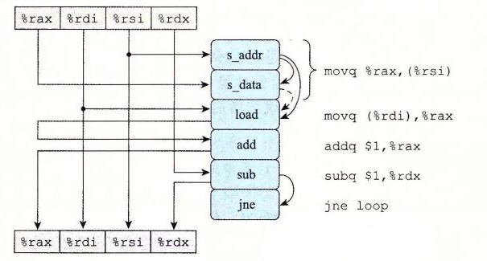

**图 5-35** `write_read` 内循环代码的图形化表示。第一个 `movq` 指令被译码成两个独立的操作，计算存储地址和将数据存储到内存。

除了由于写和读寄存器造成的操作之间的数据相关，操作符右边的弧线表示这些操作隐含的相关。特别地，`s_addr` 操作的地址计算必须在 `s_data` 操作之前。此外，对指令 `movq (%rdi), %rax` 译码得到的 `load` 操作必须检查所有未完成的存储操作的地址，在这个操作和 `s_addr` 操作之间创建一个数据相关。这张图中 `s_data` 和 `load` 操作之间有虚弧线。这个数据相关是有条件的：如果两个地址相同，`load` 操作必须等待直到 `s_data` 将它的结果存放到存储缓冲区中，但是如果两个地址不同，两个操作就可以独立地进行。

图 5-36 说明了 `write_read` 内循环操作之间的数据相关。在图 5-36a 中，重新排列了操作，让相关显得更清楚。我们标出了三个涉及加载和存储操作的相关，希望引起大家特别的注意。标号为（1）的弧线表示存储地址必须在数据被存储之前计算出来。标号为（2）的弧线表示需要 `load` 操作将它的地址与所有未完成的存储操作的地址进行比较。最后，标号为（3）的虚弧线表示条件数据相关，当加载和存储地址相同时会出现。

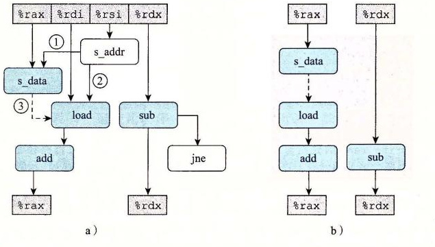

**图 5-36** 抽象 `write_read` 的操作。我们首先重新排列图 5-35 的操作（a），然后只显示那些使用一次迭代中的值为下一次迭代产生新值的操作（b）。

图 5-36b 说明了当移走那些不直接影响迭代与迭代之间数据流的操作之后，会发生什么。这个数据流图给出两个相关链：左边的一条，存储、加载和增加数据值（只对地址相同的情况有效），右边的一条，减小变量 `cnt`。

现在我们可以理解函数 `write_read` 的性能特征了。图 5-37 说明的是内循环的多次迭代形成的数据相关。对于图 5-33 示例 A 的情况，有不同的源和目的地址，加载和存储操作可以独立进行，因此唯一的关键路径是由减少变量 `cnt` 形成的，这使得 CPE 等于 1.0。对于图 5-33 示例 B 的情况，源地址和目的地址相同，`s_data` 和 `load` 指令之间的数据相关使得关键路径的形成包括了存储、加载和增加数据。我们发现顺序执行这三个操作一共需要 7 个时钟周期。


**图 5-37** 函数 `write_read` 的数据流表示。当两个地址不同时，唯一的关键路径是减少 `cnt`（示例 A）。当两个地址相同时，存储、加载和增加数据的链形成了关键路径（示例 B）。

这两个例子说明，内存操作的实现包括许多细微之处。对于寄存器操作，在指令被译码成操作的时候，处理器就可以确定哪些指令会影响其他哪些指令。另一方面，对于内存操作，只有到计算出加载和存储的地址被计算出来以后，处理器才能确定哪些指令会影响其他的哪些。高效地处理内存操作对许多程序的性能来说至关重要。内存子系统使用了很多优化，例如当操作可以独立地进行时，就利用这种潜在的并行性。

> **练习题 5.10**
>
> 作为另一个具有潜在的加载—存储相互影响的代码，考虑下面的函数，它将一个数组的内容复制到另一个数组：
>
> ```c
> void copy_array(long *src, long *dest, long n)
> {
>     long i;
>     for (i = 0; i < n; i++)
>         dest[i] = src[i];
> }
> ```
>
> 假设 `a` 是一个长度为 1000 的数组，被初始化为每个元素 `a[i]` 等于 1。
>
> A. 调用 `copy_array(a+1, a, 999)` 的效果是什么？
>
> B. 调用 `copy_array(a, a+1, 999)` 的效果是什么？
>
> C. 我们的性能测试表明问题 A 调用的 CPE 为 1.2（循环展开因子为 4 时，该值下降到 1.0），而问题 B 调用的 CPE 为 5.0。你认为是什么因素造成了这样的性能差异？
>
> D. 你预计调用 `copy_array(a, a, 999)` 的性能会是怎样的？

> **练习题 5.11**
>
> 我们测量出前置和函数 `psum1`（图 5-1）的 CPE 为 9.00，在测试机器上，要执行的基本操作——浮点加法的延迟只是 3 个时钟周期。试着理解为什么我们的函数执行效果这么差。
>
> 下面是这个函数内循环的汇编代码：
>
> ```asm
> # Inner loop of psum1
> # a in %rdi, i in %rax, cnt in %rdx
> .L5:                                      # loop:
>     vmovss -4(%rsi,%rax,4), %xmm0         # Get p[i-1]
>     vaddss (%rdi,%rax,4), %xmm0, %xmm0    # Add a[i]
>     vmovss %xmm0, (%rsi,%rax,4)           # Store at p[i]
>     addq   $1, %rax                       # Increment i
>     cmpq   %rdx, %rax                     # Compare i:cnt
>     jne    .L5                            # If !=, goto loop
> ```
>
> 参考对 `combine3`（图 5-14）和 `write_read`（图 5-36）的分析，画出这个循环生成的数据相关图，再画出计算进行时由此形成的关键路径。解释为什么 CPE 如此之高。

> **练习题 5.12**
>
> 重写 `psum1`（图 5-1）的代码，使之不需要反复地从内存中读取 `p[i]` 的值。不需要使用循环展开。得到的代码测试出的 CPE 等于 3.00，受浮点加法延迟的限制。

### 5.13 应用：性能提高技术

虽然只考虑了有限的一组应用程序，但是我们能得出关于如何编写高效代码的很重要的经验教训。我们已经描述了许多优化程序性能的基本策略：

1. **高级设计。** 为遇到的问题选择适当的算法和数据结构。要特别警觉，避免使用那些会渐进地产生糟糕性能的算法或编码技术。
2. **基本编码原则。** 避免限制优化的因素，这样编译器就能产生高效的代码。

- 消除连续的函数调用。在可能时，将计算移到循环外。考虑有选择地妥协程序的模块性以获得更大的效率。
- 消除不必要的内存引用。引入临时变量来保存中间结果。只有在最后的值计算出来时，才将结果存放到数组或全局变量中。

3. **低级优化。** 结构化代码以利用硬件功能。

- 展开循环，降低开销，并且使得进一步的优化成为可能。
- 通过使用例如多个累积变量和重新结合等技术，找到方法提高指令级并行。
- 用功能性的风格重写条件操作，使得编译采用条件数据传送。

最后要给读者一个忠告，要警惕，在为了提高效率重写程序时避免引入错误。在引入新变量、改变循环边界和使得代码整体上更复杂时，很容易犯错误。一项有用的技术是在优化函数时，用检查代码来测试函数的每个版本，以确保在这个过程没有引入错误。检查代码对函数的新版本实施一系列的测试，确保它们产生与原来一样的结果。对于高度优化的代码，这组测试情况必须变得更加广泛，因为要考虑的情况也更多。例如，使用循环展开的检查代码需要测试许多不同的循环界限，保证它能够处理最终单步迭代所需要的所有不同的可能的数字。

### 5.14 确认和消除性能瓶颈

至此，我们只考虑了优化小的程序，在这样的小程序中有一些很明显限制性能的地方，因此应该是集中注意力对它们进行优化。在处理大程序时，连知道应该优化什么地方都是很难的。本节会描述如何使用代码剖析程序（code profiler），这是在程序执行时收集性能数据的分析工具。我们还展示了一个系统优化的通用原则，称为 Amdahl 定律（Amdahl's law），参见 1.9.1 节。

#### 5.14.1 程序剖析

程序剖析（profiling）运行程序的一个版本，其中插入了工具代码，以确定程序的各个部分需要多少时间。这对于确认程序中我们需要集中注意力优化的部分是很有用的。剖析的一个有力之处在于可以在现实的基准数据（benchmark data）上运行实际程序的同时，进行剖析。

Unix 系统提供了一个剖析程序 GPROF。这个程序产生两种形式的信息。首先，它确定程序中每个函数花费了多少 CPU 时间。其次，它计算每个函数被调用的次数，以执行调用的函数来分类。这两种形式的信息都非常有用。这些计时给出了不同函数在确定整体运行时间中的相对重要性。调用信息使得我们能理解程序的动态行为。

用 GPROF 进行剖析需要 3 个步骤，就像 C 程序 `prog.c` 所示，它运行时命令行参数为 `file.txt`：

1. 程序必须为剖析而编译和链接。使用 GCC（以及其他 C 编译器），就是在命令行上简单地包括运行时标志 `-pg`。确保编译器不通过内联替换来尝试执行任何优化是很重要的，否则就可能无法正确刻画函数调用。我们使用优化标志 `-Og`，以保证能正确跟踪函数调用。

```text
linux> gcc -Og -pg prog.c -o prog
```

2. 然后程序像往常一样执行：

```text
linux> ./prog file.txt
```

它运行得会比正常时稍微慢一点（大约慢 2 倍），不过除此之外唯一的区别就是它产生了一个文件 `gmon.out`。

3. 调用 GPROF 来分析 `gmon.out` 中的数据。

```text
linux> gprof prog
```

剖析报告的第一部分列出了执行各个函数花费的时间，按照降序排列。作为一个示例，下面列出了报告的一部分，是关于程序中最耗费时间的三个函数的：

```text
  %   cumulative   self              self     total
 time   seconds   seconds    calls  s/call   s/call  name
97.58    203.66    203.66        1  203.66   203.66  sort_words
 2.32    208.50      4.85   965027    0.00     0.00  find_ele_rec
 0.14    208.81      0.30 12511031    0.00     0.00  Strlen
```

每一行代表对某个函数的所有调用所花费的时间。第一列表明花费在这个函数上的时间占整个时间的百分比。第二列显示的是直到这一行并包括这一行的函数所花费的累计时间。第三列显示的是花费在这个函数上的时间，而第四列显示的是它被调用的次数（递归调用不计算在内）。在例子中，函数 `sort_words` 只被调用了一次，但就是这一次调用需要 203.66 秒，而函数 `find_ele_rec` 被调用了 965 027 次（递归调用不计算在内），总共需要 4.85 秒。函数 `Strlen` 通过调用库函数 `strlen` 来计算字符串的长度。GPROF 的结果中通常不显示库函数调用。库函数耗费的时间通常计算在调用它们的函数内。通过创建这个“包装函数（wrapper function）”`Strlen`，我们可以可靠地跟踪对 `strlen` 的调用，表明它被调用了 12 511 031 次，但是一共只需要 0.30 秒。

剖析报告的第二部分是函数的调用历史。下面是一个递归函数 `find_ele_rec` 的历史：

```text
158655725             find_ele_rec [5]
             4.85    0.10  965027/965027      insert_string [4]
[5]   2.4    4.85    0.10  965027+158655725   find_ele_rec [5]
             0.08    0.01  363039/363039      save_string [8]
             0.00    0.01  363039/363039      new_ele [12]
158655725             find_ele_rec [5]
```

这个历史既显示了调用 `find_ele_rec` 的函数，也显示了它调用的函数。头两行显示的是对这个函数的调用：被它自身递归地调用了 158 655 725 次，被函数 `insert_string` 调用了 965 027 次（它本身被调用了 965 027 次）。函数 `find_ele_rec` 也调用了另外两个函数 `save_string` 和 `new_ele`，每个函数总共被调用了 363 039 次。

根据这个调用信息，我们通常可以推断出关于程序行为的有用信息。例如，函数 `find_ele_rec` 是一个递归过程，它扫描一个哈希桶（hash bucket）的链表，查找一个特殊的字符串。对于这个函数，比较递归调用的数量和顶层调用的数量，提供了关于遍历这些链表的长度的统计信息。这里递归与顶层调用的比率是 164.4，我们可以推断出程序每次平均大约扫描 164 个元素。

GPROF 有些属性值得注意：

- 计时不是很准确。它的计时基于一个简单的间隔计数（interval counting）机制，编译过的程序为每个函数维护一个计数器，记录花费在执行该函数上的时间。操作系统使得每隔某个规则的时间间隔 δ，程序被中断一次。δ 的典型值的范围为 1.0～10.0 毫秒。当中断发生时，它会确定程序正在执行什么函数，并将该函数的计数器值增加 δ。当然，也可能这个函数只是刚开始执行，而很快就会完成，却赋给它从上次中断以来整个的执行花费。在两次中断之间也可能运行其他某个程序，却因此根本没有计算花费。对于运行时间较长的程序，这种机制工作得相当好。从统计上来说，应该根据花费在执行函数上的相对时间来计算每个函数的花费。不过，对于那些运行时间少于 1 秒的程序来说，得到的统计数字只能看成是粗略的估计值。
- 假设没有执行内联替换，则调用信息相当可靠。编译过的程序为每对调用者和被调用者维护一个计数器。每次调用一个过程时，就会对适当的计数器加 1。
- 默认情况下，不会显示对库函数的计时。相反，库函数的时间都被计算到调用它们的函数的时间中。

#### 5.14.2 使用剖析程序来指导优化

作为一个用剖析程序来指导程序优化的示例，我们创建了一个包括几个不同任务和数据结构的应用。这个应用分析一个文本文档的 *n*-gram 统计信息，这里 *n*-gram 是一个出现在文档中 *n* 个单词的序列。对于 *n*=1，我们收集每个单词的统计信息，对于 *n*=2，收集每对单词的统计信息，以此类推。对于一个给定的 *n* 值，程序读一个文本文件，创建一张互不相同的 *n*-gram 的表，指出每个 *n*-gram 出现了多少次，然后按照出现次数的降序对单词排序。

作为基准程序，我们在一个由《莎士比亚全集》组成的文件上运行这个程序，一共有 965 028 个单词，其中 23 706 个是互不相同的。我们发现，对于 *n*=1，即使是一个写得很烂的分析程序也能在 1 秒以内处理完整个文件，所以我们设置 *n*=2，使得事情更加有挑战。对于 *n*=2 的情况，*n*-gram 被称为 bigram（读作“bye-gram”）。我们确定《莎士比亚全集》包含 363 039 个互不相同的 bigram。最常见的是“I am”，出现了 1892 次。词组“to be”出现了 1020 次。bigram 中有 266 018 个只出现了一次。

程序是由下列部分组成的。我们创建了多个版本，从各部分简单的算法开始，然后再换成更成熟完善的算法：

1. 从文件中读出每个单词，并转换成小写字母。我们最初的版本使用的是函数 `lower1`（图 5-7），我们知道由于反复地调用 `strlen`，它的时间复杂度是二次的。
2. 对字符串应用一个哈希函数，为一个有 *s* 个桶（bucket）的哈希表产生一个 0～*s*-1 之间的数。最初的函数只是简单地对字符的 ASCII 代码求和，再对 *s* 求模。
3. 每个哈希桶都组织成一个链表。程序沿着这个链表扫描，寻找一个匹配的条目。如果找到了，这个 *n*-gram 的频度就加 1。否则，就创建一个新的链表元素。最初的版本递归地完成这个操作，将新元素插在链表尾部。
4. 一旦已经生成了这张表，我们就根据频度对所有的元素排序。最初的版本使用插入排序。

图 5-38 是 *n*-gram 频度分析程序 6 个不同版本的剖析结果。对于每个版本，我们将时间分为下面的 6 类。

- **Sort**：按照频度对 *n*-gram 进行排序
- **List**：为匹配 *n*-gram 扫描链表，如果需要，插入一个新的元素
- **Lower**：将字符串转换为小写字母
- **Strlen**：计算字符串的长度
- **Hash**：计算哈希函数
- **Rest**：其他所有函数的和


**图 5-38** bigram 频度计数程序的各个版本的剖析结果。时间是根据程序中不同的主要操作划分的。

如图 5-38a 所示，最初的版本需要 3.5 分钟，大多数时间花在了排序上。这并不奇怪，因为插入排序有二次的运行时间，而程序对 363 039 个值进行排序。

在下一个版本中，我们用库函数 `qsort` 进行排序，这个函数是基于快速排序算法的 [98]，其预期运行时间为 *O*（*n* log *n*）。在图中这个版本称为“Quicksort”。更有效的排序算法使花在排序上的时间降低到可以忽略不计，而整个运行时间降低到大约 5.4 秒。图 5-38b 是剩下各个版本的时间，所用的比例能使我们看得更清楚。

改进了排序，现在发现链表扫描变成了瓶颈。想想这个低效率是由于函数的递归结构引起的，我们用一个迭代的结构替换它，显示为“Iter first”。令人奇怪的是，运行时间增加到了大约 7.5 秒。根据更进一步的研究，我们发现两个链表函数之间有一个细微的差别。递归版本将新元素插入到链表尾部，而迭代版本把它们插到链表头部。为了使性能最大化，我们希望频率最高的 *n*-gram 出现在链表的开始处。这样一来，函数就能快速地定位常见的情况。假设 *n*-gram 在文档中是均匀分布的，我们期望频度高的单词的第一次出现在频度低的单词之前。通过将新的 *n*-gram 插入尾部，第一个函数倾向于按照频度的降序排序，而第二个函数则相反。因此我们创建第三个链表扫描函数，它使用迭代，但是将新元素插入到链表的尾部。使用这个版本，显示为“Iter last”，时间降到了大约 5.3 秒，比递归版本稍微好一点。这些测量展示了对程序做实验作为优化工作一部分的重要性。开始时，我们假设将递归代码转换成迭代代码会改进程序的性能，而没有考虑添加元素到链表末尾和开头的差别。

接下来，我们考虑哈希表的结构。最初的版本只有 1021 个桶（通常会选择桶的个数为质数，以增强哈希函数将关键字均匀分布在桶中的能力）。对于一个有 363 039 个条目的表来说，这就意味着平均负载（load）是 363 039/1021=355.6。这就解释了为什么有那么多时间花在了执行链表操作上了——搜索包括测试大量的候选 *n*-gram。它还解释了为什么性能对链表的排序这么敏感。然后，我们将桶的数量增加到了 199 999，平均负载降低到了 1.8。不过，很奇怪的是，整体运行时间只下降到 5.1 秒，差距只有 0.2 秒。

进一步观察，我们可以看到，表变大了但是性能提高很小，这是由于哈希函数选择的不好。简单地对字符串的字符编码求和不能产生一个大范围的值。特别是，一个字母最大的编码值是 122，因而 *n* 个字符产生的和最多是 122*n*。在文档中，最长的 bigram（“honorificabilitudinitatibus thou”）的和也不过是 3371，所以，我们哈希表中大多数桶都是不会被使用的。此外，可交换的哈希函数，例如加法，不能对一个字符串中不同的可能的字符顺序做出区分。例如，单词“rat”和“tar”会产生同样的和。

我们换成一个使用移位和异或操作的哈希函数。使用这个版本，显示为“Better Hash”，时间下降到了 0.6 秒。一个更加系统化的方法是更加仔细地研究关键字在桶中的分布，如果哈希函数的输出分布是均匀的，那么确保这个分布接近于人们期望的那样。

最后，我们把运行时间降到了大部分时间是花在 `strlen` 上，而大多数对 `strlen` 的调用是作为小写字母转换的一部分。我们已经看到了函数 `lower1` 有二次的性能，特别是对长字符串来说。这篇文档中的单词足够短，能避免二次性能的灾难性的结果；最长的 bigram 只有 32 个字符。不过换成使用 `lower2`，显示为“Linear Lower”，得到很好的性能，整个时间降到了 0.2 秒。

通过这个练习，我们展示了代码剖析能够帮助将一个简单应用程序所需的时间从约 3.5 分钟降低到 0.2 秒，得到的性能提升约为 1000 倍。剖析程序帮助我们把注意力集中在程序最耗时的部分上，同时还提供了关于过程调用结构的有用信息。代码中的一些瓶颈，例如二次的排序函数，很容易看出来；而其他的，例如插入到链表的开始还是结尾，只有通过仔细的分析才能看出。

我们可以看到，剖析是工具箱中一个很有用的工具，但是它不应该是唯一一个。计时测量不是很准确，特别是对较短的运行时间（小于 1 秒）来说。更重要的是，结果只适用于被测试的那些特殊的数据。例如，如果在由较少数量的较长字符串组成的数据上运行最初的函数，我们会发现小写字母转换函数才是主要的性能瓶颈。更糟糕的是，如果它只剖析包含短单词的文档，我们可能永远不会发现隐藏着的性能瓶颈，例如 `lower1` 的二次性能。通常，假设在有代表性的数据上运行程序，剖析能帮助我们对典型的情况进行优化，但是我们还应该确保对所有可能的情况，程序都有相当的性能。这主要包括避免得到糟糕的渐近性能（asymptotic performance）的算法（例如插入算法）和坏的编程实践（例如 `lower1`）。

1.9.1 中讨论了 Amdahl 定律，它为通过有针对性的优化来获取性能提升提供了一些其他的见解。对于 *n*-gram 代码来说，当用 `quicksort` 代替了插入排序后，我们看到总的执行时间从 209.0 秒下降到 5.4 秒。初始版本的 209.0 秒中的 203.7 秒用于执行插入排序，得到 α=0.974，被此次优化加速的时间比例。使用 `quicksort`，花在排序上的时间变得微不足道，得到预计的加速比为 209/5.4=39.0，接近于测量加速比 38.5。我们之所以能获得大的加速比，是因为排序在整个执行时间中占了非常大的比例。然而，当一个瓶颈消除，而新的瓶颈出现时，就需要关注程序的其他部分以获得更多的加速比。

### 5.15 小结

虽然关于代码优化的大多数论述都描述了编译器是如何能生成高效代码的，但是应用程序员有很多方法来协助编译器完成这项任务。没有任何编译器能用一个好的算法或数据结构代替低效率的算法或数据结构，因此程序设计的这些方面仍然应该是程序员主要关心的。我们还看到妨碍优化的因素，例如内存别名使用和过程调用，严重限制了编译器执行大量优化的能力。同样，程序员必须对消除这些妨碍优化的因素负主要的责任。这些应该被看作好的编程习惯的一部分，因为它们可以用来消除不必要的工作。

基本级别之外调整性能需要一些对处理器微体系结构的理解，描述处理器用来实现它的指令集体系结构的底层机制。对于乱序处理器的情况，只需要知道一些关于操作、容量、延迟和功能单元发射时间的信息，就能够基本地预测程序的性能了。

我们研究了一系列技术，包括循环展开、创建多个累积变量和重新结合，它们可以利用现代处理器提供的指令级并行。随着对优化的深入，研究产生的汇编代码以及试着理解机器如何执行计算变得重要起来。确认由程序中的数据相关决定的关键路径，尤其是循环的不同迭代之间的数据相关，会收获良多。我们还可以根据必须要计算的操作数量以及执行这些操作的功能单元的数量和发射时间，计算一个计算的吞吐量界限。

包含条件分支或与内存系统复杂交互的程序，比我们最开始考虑的简单循环程序，更难以分析和优化。基本策略是使分支更容易预测，或者使它们很容易用条件数据传送来实现。我们还必须注意存储和加载操作。将数值保存在局部变量中，使得它们可以存放在寄存器中，这会很有帮助。

当处理大型程序时，将注意力集中在最耗时的部分变得很重要。代码剖析程序和相关的工具能帮助我们系统地评价和改进程序性能。我们描述了 GPROF，一个标准的 Unix 剖析工具。还有更加复杂完善的剖析程序可用，例如 Intel 的 VTUNE 程序开发系统，还有 Linux 系统基本上都有的 VALGRIND。这些工具可以在过程级分解执行时间，估计程序每个基本块（basic block）的性能。（基本块是内部没有控制转移的指令序列，因此基本块总是整个被执行的。）

## 参考文献说明

我们的关注点是从程序员的角度描述代码优化，展示如何使书写的代码能够使编译器更容易地产生高效的代码。Chellappa、Franchetti 和 Püschel 的扩展的论文 [19] 采用了类似的方法，但关于处理器的特性描述得更详细。

有许多著作从编译器的角度描述了代码优化，形式化描述了编译器可以产生更有效代码的方法。Muchnick 的著作被认为是最全面的 [80]。Wadleigh 和 Crawford 的关于软件优化的著作 [115] 覆盖了一些我们已经谈到的内容，不过它还描述了在并行机器上获得高性能的过程。Mahlke 等人的一篇比较早期的论文 [75]，描述了几种为编译器开发的将程序映射到并行机器上的技术，它们是如何能够被改造成利用现代处理器的指令级并行的。这篇论文覆盖了我们讲过的代码变换，包括循环展开、多个累积变量（他们称之为累积变量扩展（accumulator variable expansion））和重新结合（他们称之为树高度减少（tree height reduction））。

我们对乱序处理器的操作的描述相当简单和抽象。可以在高级计算机体系结构教科书中找到对通用原则更完整的描述，例如 Hennessy 和 Patterson 的著作 [46，第 2～3 章]。Shen 和 Lipasti 的书 [100] 提供了对现代处理器设计深入的论述。

## 第 5 章家庭作业：5.13～5.17

**家庭作业 5.13**（★★）假设我们想编写一个计算两个向量 `u` 和 `v` 内积的过程。这个函数的一个抽象版本对整数和浮点数类型，在 x86-64 上 CPE 等于 14～18。通过进行与我们将抽象程序 `combine1` 变换为更有效的 `combine4` 相同类型的变换，我们得到如下代码：

```c
/* Inner product. Accumulate in temporary */
void inner4(vec_ptr u, vec_ptr v, data_t *dest)
{
    long i;
    long length = vec_length(u);
    data_t *udata = get_vec_start(u);
    data_t *vdata = get_vec_start(v);
    data_t sum = (data_t) 0;

    for (i = 0; i < length; i++) {
        sum = sum + udata[i] * vdata[i];
    }
    *dest = sum;
}
```

测试显示，对于整数这个函数的 CPE 等于 1.50，对于浮点数据 CPE 等于 3.00。对于数据类型 `double`，内循环的 x86-64 汇编代码如下所示：

```asm
# Inner loop of inner4. data_t = double, OP = *
# udata in %rbp, vdata in %rax, sum in %xmm0
# i in %rcx, limit in %rbx
.L15:                                      # loop:
    vmovsd 0(%rbp,%rcx,8), %xmm1          # Get udata[i]
    vmulsd (%rax,%rcx,8), %xmm1, %xmm1    # Multiply by vdata[i]
    vaddsd %xmm1, %xmm0, %xmm0            # Add to sum
    addq   $1, %rcx                        # Increment i
    cmpq   %rbx, %rcx                      # Compare i:limit
    jne    .L15                            # If !=, goto loop
```

假设功能单元的特性如图 5-12 所示。

A. 按照图 5-13 和图 5-14 的风格，画出这个指令序列会如何被译码成操作，并给出它们之间的数据相关如何形成一条操作的关键路径。

B. 对于数据类型 `double`，这条关键路径决定的 CPE 的下界是什么？

C. 假设对于整数代码也有类似的指令序列，对于整数数据的关键路径决定的 CPE 的下界是什么？

D. 请解释虽然乘法操作需要 5 个时钟周期，但是为什么两个浮点版本的 CPE 都是 3.00。

**家庭作业 5.14**（★）编写习题 5.13 中描述的内积过程的一个版本，使用 6×1 循环展开。对于 x86-64，我们对这个展开的版本的测试得到，对整数数据 CPE 为 1.07，而对两种浮点数据 CPE 仍然为 3.01。

A. 解释为什么在 Intel Core i7 Haswell 上运行的任何（标量）版本的内积过程都不能达到比 1.00 更小的 CPE 了。

B. 解释为什么对浮点数据的性能不会通过循环展开而得到提高。

**家庭作业 5.15**（★）编写习题 5.13 中描述的内积过程的一个版本，使用 6×6 循环展开。对于 x86-64，我们对这个函数的测试得到对整数数据的 CPE 为 1.06，对浮点数据的 CPE 为 1.01。

什么因素制约了性能达到 CPE 等于 1.00？

**家庭作业 5.16**（★）编写习题 5.13 中描述的内积过程的一个版本，使用 6×1a 循环展开产生更高的并行性。我们对这个函数的测试得到对整数数据的 CPE 为 1.10，对浮点数据的 CPE 为 1.05。

**家庭作业 5.17**（★★）库函数 `memset` 的原型如下：

```c
void *memset(void *s, int c, size_t n);
```

这个函数将从 `s` 开始的 `n` 个字节的内存区域都填充为 `c` 的低位字节。例如，通过将参数 `c` 设置为 0，可以用这个函数来对一个内存区域清零，不过用其他值也是可以的。

下面是 `memset` 最直接的实现：

```c
/* Basic implementation of memset */
void *basic_memset(void *s, int c, size_t n)
{
    size_t cnt = 0;
    unsigned char *schar = s;
    while (cnt < n) {
        *schar++ = (unsigned char) c;
        cnt++;
    }
    return s;
}
```

实现该函数一个更有效的版本，使用数据类型为 `unsigned long` 的字来装下 8 个 `c`，然后用字级的写遍历目标内存区域。你可能发现增加额外的循环展开会有所帮助。在我们的参考机上，能够把 CPE 从直接实现的 1.00 降低到 0.127。即，程序每个周期可以写 8 个字节。

这里是一些额外的指导原则。在此，假设 *K* 表示你运行程序的机器上的 `sizeof(unsigned long)` 的值。

- 你不可以调用任何库函数。
- 你的代码应该对任意 `n` 的值都能工作，包括当它不是 *K* 的倍数的时候。你可以用类似于使用循环展开时完成最后几次迭代的方法做到这一点。
- 你写的代码应该无论 *K* 的值是多少，都能够正确编译和运行。使用操作 `sizeof` 来做到这一点。
- 在某些机器上，未对齐的写可能比对齐的写慢很多。（在某些非 x86 机器上，未对齐的写甚至可能会导致段错误。）写出这样的代码，开始时直到目的地址是 *K* 的倍数时，使用字节级的写，然后进行字级的写，（如果需要）最后采用用字节级的写。
- 注意 `cnt` 足够小以至于一些循环上界变成负数的情况。对于涉及 `sizeof` 运算符的表达式，可以用无符号运算来执行测试。（参见 2.2.8 节和家庭作业 2.72。）

## 第 5 章家庭作业：5.18～5.19

**家庭作业 5.18**（★★）在练习题 5.5 和 5.6 中我们考虑了多项式求值的任务，既有直接求值，也有用 Horner 方法求值。试着用我们讲过的优化技术写出这个函数更快的版本，这些技术包括循环展开、并行累积和重新结合。你会发现有很多不同的方法可以将 Horner 方法和直接求值与这些优化技术混合起来。

理想状况下，你能达到的 CPE 应该接近于你的机器的吞吐量界限。我们的最佳版本在参考机上能使 CPE 达到 1.07。

**家庭作业 5.19**（★★）在练习题 5.12 中，我们能够把前置和计算的 CPE 减少到 3.00，这是由该机器上浮点加法的延迟决定的。简单的循环展开没有改进什么。

使用循环展开和重新结合的组合，写出求前置和的代码，能够得到一个小于你机器上浮点加法延迟的 CPE。要达到这个目标，实际上需要增加执行的加法次数。例如，我们使用 2 次循环展开的版本每次迭代需要 3 个加法，而使用 4 次循环展开的版本需要 5 个。在参考机上，我们的最佳实现能达到 CPE 为 1.67。

确定你的机器的吞吐量和延迟界限是如何限制前置和操作所能达到的最小 CPE 的。

---

[返回总目录](../README.md) · [上一章](../第04章-处理器体系结构/README.md) · [下一章](../第06章-存储器层次结构/README.md) · [按小节阅读](README.md) · [练习题答案](练习题答案.md)
