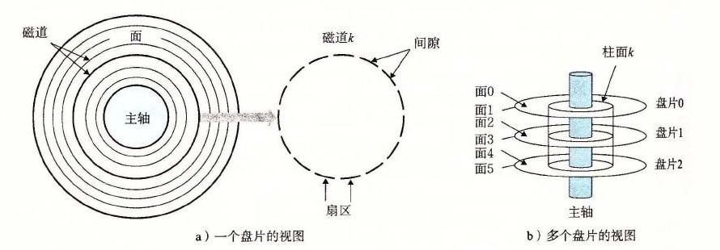
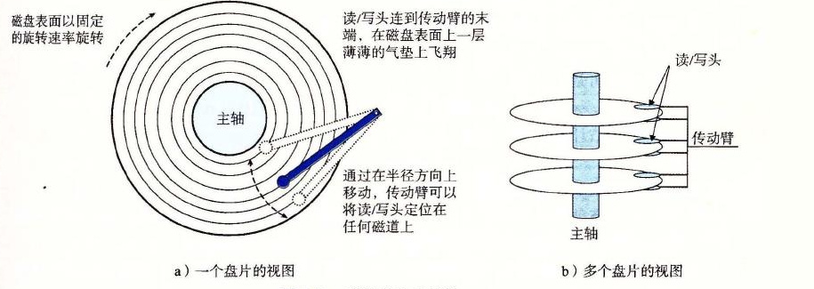
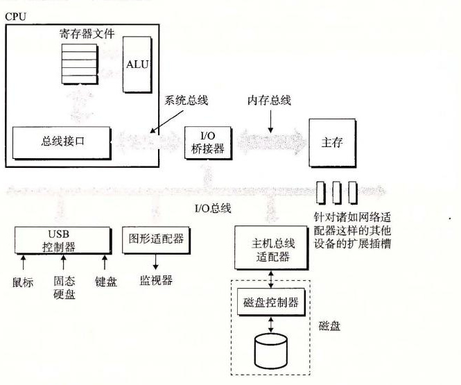
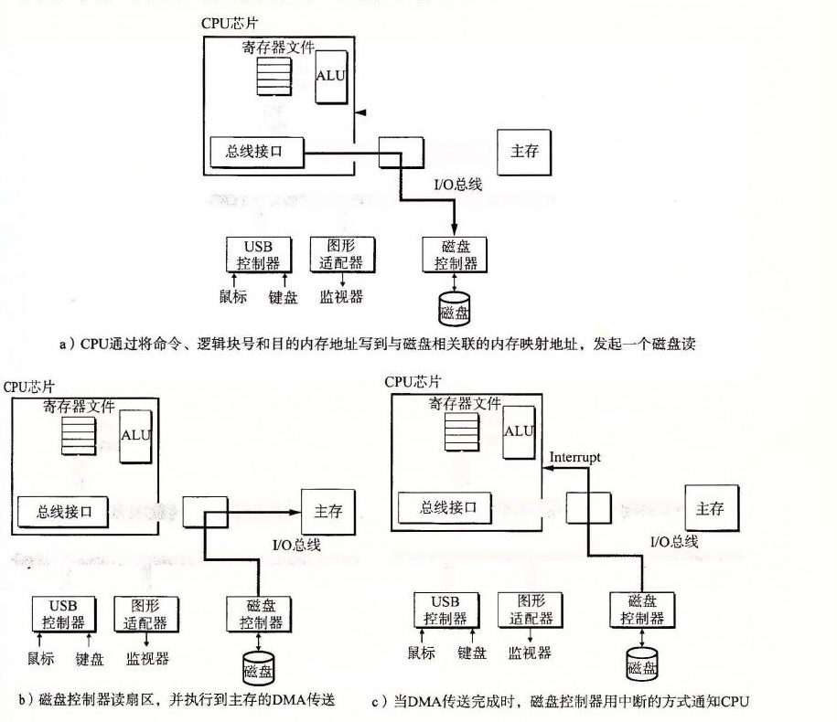

# 6.1.2 磁盘存储

磁盘是广为应用的保存大量数据的存储设备，存储数据的数量级可以达到几百到几千千兆字节，而基于 RAM 的存储器只能有几百或几千兆字节。不过，从磁盘上读信息的时间为毫秒级，比从 DRAM 读慢了 10 万倍，比从 SRAM 读慢了 100 万倍。

## 1. 磁盘构造

磁盘是由盘片（platter）构成的。每个盘片有两面或者称为表面（surface），表面覆盖着磁性记录材料。盘片中央有一个可以旋转的主轴（spindle），它使得盘片以固定的旋转速率（rotational rate）旋转，通常是 5400～15 000 转每分钟（Revolution Per Minute，RPM）。磁盘通常包含一个或多个这样的盘片，并封装在一个密封的容器内。

图 6-9a 展示了一个典型的磁盘表面的结构。每个表面是由一组称为磁道（track）的同心圆组成的。每个磁道被划分为一组扇区（sector）。每个扇区包含相等数量的数据位（通常是 512 字节），这些数据编码在扇区上的磁性材料中。扇区之间由一些间隙（gap）分隔开，这些间隙中不存储数据位。间隙存储用来标识扇区的格式化位。

磁盘是由一个或多个叠放在一起的盘片组成的，它们被封装在一个密封的包装里，如图 6-9b 所示。整个装置通常被称为磁盘驱动器（disk drive），我们通常简称为磁盘（disk）。有时，我们会称磁盘为旋转磁盘（rotating disk），以使之区别于基于闪存的固态硬盘（SSD），SSD 是没有移动部分的。

磁盘制造商通常用术语柱面（cylinder）来描述多个盘片驱动器的构造，这里，柱面是所有盘片表面上到主轴中心的距离相等的磁道的集合。例如，如果一个驱动器有三个盘片和六个面，每个表面上的磁道的编号都是一致的，那么柱面 *k* 就是 6 个磁道 *k* 的集合。



**图 6-9** 磁盘构造

## 2. 磁盘容量

一个磁盘上可以记录的最大位数称为它的最大容量，或者简称为容量。磁盘容量是由以下技术因素决定的：

- **记录密度（recording density）（位/英寸）：** 磁道一英寸的段中可以放入的位数。
- **磁道密度（track density）（道/英寸）：** 从盘片中心出发半径上一英寸的段内可以有的磁道数。
- **面密度（areal density）（位/平方英寸）：** 记录密度与磁道密度的乘积。

磁盘制造商不懈地努力以提高面密度（从而增加容量），而面密度每隔几年就会翻倍。最初的磁盘，是在面密度很低的时代设计的，将每个磁道分为数目相同的扇区，扇区的数目是由最靠内的磁道能记录的扇区数决定的。为了保持每个磁道有固定的扇区数，越往外的磁道扇区隔得越开。在面密度相对比较低的时候，这种方法还算合理。不过，随着面密度的提高，扇区之间的间隙（那里没有存储数据位）变得不可接受地大。因此，现代大容量磁盘使用一种称为多区记录（multiple zone recording）的技术，在这种技术中，柱面的集合被分割成不相交的子集合，称为记录区（recording zone）。每个区包含一组连续的柱面。一个区中的每个柱面中的每条磁道都有相同数量的扇区，这个扇区的数量是由该区中最里面的磁道所能包含的扇区数确定的。

下面的公式给出了一个磁盘的容量：

```text
             字节数   平均扇区数   磁道数   表面数   盘片数
磁盘容量 = ────── × ──────── × ───── × ───── × ─────
              扇区       磁道       表面     盘片     磁盘
```

例如，假设我们有一个磁盘，有 5 个盘片，每个扇区 512 个字节，每个面 20 000 条磁道，每条磁道平均 300 个扇区。那么这个磁盘的容量是：

```text
             512 字节   300 扇区   20 000 磁道   2 表面   5 盘片
磁盘容量 = ──────── × ──────── × ────────── × ───── × ─────
               扇区       磁道          表面      盘片     磁盘

         = 30 720 000 000 字节
         = 30.72 GB
```

注意，制造商是以千兆字节（GB）或兆兆字节（TB）为单位来表达磁盘容量的，这里 1GB＝10<sup>9</sup> 字节，1TB＝10<sup>12</sup> 字节。

> **旁注 一千兆字节有多大**
>
> 不幸地，像 K（kilo）、M（mega）、G（giga）和 T（tera）这样的前缀的含义依赖于上下文。对于与 DRAM 和 SRAM 容量相关的计量单位，通常 K＝2<sup>10</sup>，M＝2<sup>20</sup>，G＝2<sup>30</sup>，而 T＝2<sup>40</sup>。对于与像磁盘和网络这样的 I/O 设备容量相关的计量单位，通常 K＝10<sup>3</sup>，M＝10<sup>6</sup>，G＝10<sup>9</sup>，而 T＝10<sup>12</sup>。速率和吞吐量常常也使用这些前缀。
>
> 幸运地，对于我们通常依赖的不需要复杂计算的估计值，无论是哪种假设在实际中都工作得很好。例如，2<sup>30</sup> 和 10<sup>9</sup> 之间的相对差别不大：（2<sup>30</sup>−10<sup>9</sup>）/10<sup>9</sup>≈7%。类似，（2<sup>40</sup>−10<sup>12</sup>）/10<sup>12</sup>≈10%。

> **练习题 6.2**
>
> 计算这样一个磁盘的容量，它有 2 个盘片，10 000 个柱面，每条磁道平均有 400 个扇区，而每个扇区有 512 个字节。

## 3. 磁盘操作

磁盘用读/写头（read/write head）来读写存储在磁性表面的位，而读写头连接到一个传动臂（actuator arm）一端，如图 6-10a 所示。通过沿着半径轴前后移动这个传动臂，驱动器可以将读/写头定位在盘面上的任何磁道上。这样的机械运动称为寻道（seek）。一旦读/写头定位到了期望的磁道上，那么当磁道上的每个位通过它的下面时，读/写头可以感知到这个位的值（读该位），也可以修改这个位的值（写该位）。有多个盘片的磁盘针对每个盘面都有一个独立的读/写头，如图 6-10b 所示。读/写头垂直排列，一致行动。在任何时刻，所有的读/写头都位于同一个柱面上。



**图 6-10** 磁盘的动态特性

在传动臂末端的读/写头在磁盘表面高度大约 0.1 微米处的一层薄薄的气垫上飞翔（就是字面上这个意思），速度大约为 80 km/h。这可以比喻成将一座摩天大楼（442 米高）放倒，然后让它在距离地面 2.5 cm（1 英寸）的高度上环绕地球飞行，绕地球一周只需要 8 秒钟！在这样小的间隙里，盘面上一粒微小的灰尘都像一块巨石。如果读/写头碰到了这样的一块巨石，读/写头会停下来，撞到盘面——所谓的读/写头冲撞（head crash）。为此，磁盘总是密封包装的。

磁盘以扇区大小的块来读写数据。对扇区的访问时间（access time）有三个主要的部分：寻道时间（seek time）、旋转时间（rotational latency）和传送时间（transfer time）：

- **寻道时间：** 为了读取某个目标扇区的内容，传动臂首先将读/写头定位到包含目标扇区的磁道上。移动传动臂所需的时间称为寻道时间。寻道时间 *T*<sub>seek</sub> 依赖于读/写头以前的位置和传动臂在盘面上移动的速度。现代驱动器中平均寻道时间 *T*<sub>avg seek</sub> 是通过对几千次对随机扇区的寻道求平均值来测量的，通常为 3～9ms。一次寻道的最大时间 *T*<sub>max seek</sub> 可以高达 20ms。
- **旋转时间：** 一旦读/写头定位到了期望的磁道，驱动器等待目标扇区的第一个位旋转到读/写头下。这个步骤的性能依赖于当读/写头到达目标扇区时盘面的位置以及磁盘的旋转速度。在最坏的情况下，读/写头刚刚错过了目标扇区，必须等待磁盘转一整圈。因此，最大旋转延迟（以秒为单位）是：

```text
Tmax rotation = 1/RPM × 60s/1min
```

平均旋转时间 *T*<sub>avg rotation</sub> 是 *T*<sub>max rotation</sub> 的一半。

- **传送时间：** 当目标扇区的第一个位位于读/写头下时，驱动器就可以开始读或者写该扇区的内容了。一个扇区的传送时间依赖于旋转速度和每条磁道的扇区数目。因此，我们可以粗略地估计一个扇区以秒为单位的平均传送时间如下：

```text
Tavg transfer = 1/RPM × 1/(平均扇区数/磁道) × 60s/1min
```

我们可以估计访问一个磁盘扇区内容的平均时间为平均寻道时间、平均旋转延迟和平均传送时间之和。例如，考虑一个有如下参数的磁盘：

| 参数 | 值 |
| --- | --- |
| 旋转速率 | 7200RPM |
| *T*<sub>avg seek</sub> | 9ms |
| 每条磁道的平均扇区数 | 400 |

对于这个磁盘，平均旋转延迟（以 ms 为单位）是：

```text
Tavg rotation = 1/2 × Tmax rotation
              = 1/2 × (60s/7200 RPM) × 1000 ms/s
              ≈ 4 ms
```

平均传送时间是：

```text
Tavg transfer = 60/7200 RPM × 1/400 扇区/磁道 × 1000 ms/s
              ≈ 0.02 ms
```

总之，整个估计的访问时间是：

```text
Taccess = Tavg seek + Tavg rotation + Tavg transfer
        = 9 ms + 4 ms + 0.02 ms
        = 13.02 ms
```

这个例子说明了一些很重要的问题：

- 访问一个磁盘扇区中 512 个字节的时间主要是寻道时间和旋转延迟。访问扇区中的第一个字节用了很长时间，但是访问剩下的字节几乎不用时间。
- 因为寻道时间和旋转延迟大致相等，所以将寻道时间乘 2 是估计磁盘访问时间的简单而合理的方法。
- 对存储在 SRAM 中的一个 64 位字的访问时间大约是 4ns，对 DRAM 的访问时间是 60ns。因此，从内存中读一个 512 个字节扇区大小的块的时间对 SRAM 来说大约是 256ns，对 DRAM 来说大约是 4000ns。磁盘访问时间，大约 10ms，是 SRAM 的大约 40 000 倍，是 DRAM 的大约 2500 倍。

> **练习题 6.3**
>
> 估计访问下面这个磁盘上一个扇区的访问时间（以 ms 为单位）：
>
> | 参数 | 值 |
> | --- | --- |
> | 旋转速率 | 15 000RPM |
> | *T*<sub>avg seek</sub> | 8ms |
> | 每条磁道的平均扇区数 | 500 |

## 4. 逻辑磁盘块

正如我们看到的那样，现代磁盘构造复杂，有多个盘面，这些盘面上有不同的记录区。为了对操作系统隐藏这样的复杂性，现代磁盘将它们的构造呈现为一个简单的视图，一个 *B* 个扇区大小的逻辑块的序列，编号为 0，1，…，*B*−1。磁盘封装中有一个小的硬件/固件设备，称为磁盘控制器，维护着逻辑块号和实际（物理）磁盘扇区之间的映射关系。

当操作系统想要执行一个 I/O 操作时，例如读一个磁盘扇区的数据到主存，操作系统会发送一个命令到磁盘控制器，让它读某个逻辑块号。控制器上的固件执行一个快速表查找，将一个逻辑块号翻译成一个（盘面，磁道，扇区）的三元组，这个三元组唯一地标识了对应的物理扇区。控制器上的硬件会解释这个三元组，将读/写头移动到适当的柱面，等待扇区移动到读/写头下，将读/写头感知到的位放到控制器上的一个小缓冲区中，然后将它们复制到主存中。

> **旁注 格式化的磁盘容量**
>
> 磁盘控制器必须对磁盘进行格式化，然后才能在该磁盘上存储数据。格式化包括用标识扇区的信息填写扇区之间的间隙，标识出表面有故障的柱面并且不使用它们，以及在每个区中预留出一组柱面作为备用，如果区中一个或多个柱面在磁盘使用过程中坏掉了，就可以使用这些备用的柱面。因为存在着这些备用的柱面，所以磁盘制造商所说的格式化容量比最大容量要小。

> **练习题 6.4**
>
> 假设 1MB 的文件由 512 个字节的逻辑块组成，存储在具有如下特性的磁盘驱动器上：
>
> | 参数 | 值 |
> | --- | --- |
> | 旋转速率 | 10 000RPM |
> | *T*<sub>avg seek</sub> | 5ms |
> | 平均扇区数/磁道 | 1000 |
> | 表面 | 4 |
> | 扇区大小 | 512 字节 |
>
> 对于下面的情况，假设程序顺序地读文件的逻辑块，一个接一个，将读/写头定位到第一块上的时间是 *T*<sub>avg seek</sub>＋*T*<sub>avg rotation</sub>。
>
> A. 最好的情况：给定逻辑块到磁盘扇区的最好的可能的映射（即顺序的），估计读这个文件需要的最优时间（以 ms 为单位）。
>
> B. 随机的情况：如果块是随机地映射到磁盘扇区的，估计读这个文件需要的时间（以 ms 为单位）。

## 5. 连接 I/O 设备

例如图形卡、监视器、鼠标、键盘和磁盘这样的输入/输出（I/O）设备，都是通过 I/O 总线，例如 Intel 的外围设备互连（Peripheral Component Interconnect，PCI）总线连接到 CPU 和主存的。系统总线和内存总线是与 CPU 相关的，与它们不同，诸如 PCI 这样的 I/O 总线设计成与底层 CPU 无关。例如，PC 和 Mac 都可以使用 PCI 总线。图 6-11 展示了一个典型的 I/O 总线结构，它连接了 CPU、主存和 I/O 设备。

虽然 I/O 总线比系统总线和内存总线慢，但是它可以容纳种类繁多的第三方 I/O 设备。例如，在图 6-11 中，有三种不同类型的设备连接到总线。

- 通用串行总线（Universal Serial Bus，USB）控制器是一个连接到 USB 总线的设备的中转机构，USB 总线是一个广泛使用的标准，连接各种外围 I/O 设备，包括键盘、鼠标、调制解调器、数码相机、游戏操纵杆、打印机、外部磁盘驱动器和固态硬盘。USB 3.0 总线的最大带宽为 625MB/s。USB 3.1 总线的最大带宽为 1250MB/s。
- 图形卡（或适配器）包含硬件和软件逻辑，它们负责代表 CPU 在显示器上画像素。
- 主机总线适配器将一个或多个磁盘连接到 I/O 总线，使用的是一个特别的主机总线接口定义的通信协议。两个最常用的这样的磁盘接口是 SCSI（读作“scuzzy”）和 SATA（读作“sat-uh”）。SCSI 磁盘通常比 SATA 驱动器更快但是也更贵。SCSI 主机总线适配器（通常称为 SCSI 控制器）可以支持多个磁盘驱动器，与 SATA 适配器不同，它只能支持一个驱动器。



**图 6-11** 总线结构示例，它连接 CPU、主存和 I/O 设备

其他的设备，例如网络适配器，可以通过将适配器插入到主板上空的扩展槽中，从而连接到 I/O 总线，这些插槽提供了到总线的直接电路连接。

## 6. 访问磁盘

虽然详细描述 I/O 设备是如何工作的以及如何对它们进行编程超出了我们讨论的范围，但是我们可以给你一个概要的描述。例如，图 6-12 总结了当 CPU 从磁盘读数据时发生的步骤。

> **旁注 I/O 总线设计进展**
>
> 图 6-11 中的 I/O 总线是一个简单的抽象，使得我们可以具体描述但又不必和某个系统的细节联系过于紧密。它是基于外围设备互联（Peripheral Component Interconnect，PCI）总线的，在 2010 年前使用非常广泛。PCI 模型中，系统中所有的设备共享总线，一个时刻只能有一台设备访问这些线路。在现代系统中，共享的 PCI 总线已经被 PCIe（PCI express）总线取代，PCIe 是一组高速串行、通过开关连接的点到点链路，类似于你将在第 11 章中学习到的开关以太网。PCIe 总线，最大吞吐率为 16GB/s，比 PCI 总线快一个数量级，PCI 总线的最大吞吐率为 533MB/s。除了测量出的 I/O 性能，不同总线设计之间的区别对应用程序来说是不可见的，所以在本书中，我们只使用简单的共享总线抽象。

CPU 使用一种称为内存映射 I/O（memory-mapped I/O）的技术来向 I/O 设备发射命令（图 6-12a）。在使用内存映射 I/O 的系统中，地址空间中有一块地址是为与 I/O 设备通信保留的。每个这样的地址称为一个 I/O 端口（I/O port）。当一个设备连接到总线时，它与一个或多个端口相关联（或它被映射到一个或多个端口）。



**图 6-12** 读一个磁盘扇区

来看一个简单的例子，假设磁盘控制器映射到端口 `0xa0`。随后，CPU 可能通过执行三个对地址 `0xa0` 的存储指令，发起磁盘读：第一条指令是发送一个命令字，告诉磁盘发起一个读，同时还发送了其他的参数，例如当读完成时，是否中断 CPU（我们会在 8.1 节中讨论中断）。第二条指令指明应该读的逻辑块号。第三条指令指明应该存储磁盘扇区内容的主存地址。

当 CPU 发出了请求之后，在磁盘执行读的时候，它通常会做些其他的工作。回想一下，一个 1GHz 的处理器时钟周期为 1ns，在用来读磁盘的 16ms 时间里，它潜在地可能执行 1600 万条指令。在传输进行时，只是简单地等待，什么都不做，是一种极大的浪费。

在磁盘控制器收到来自 CPU 的读命令之后，它将逻辑块号翻译成一个扇区地址，读该扇区的内容，然后将这些内容直接传送到主存，不需要 CPU 的干涉（图 6-12b）。设备可以自己执行读或者写总线事务而不需要 CPU 干涉的过程，称为直接内存访问（Direct Memory Access，DMA）。这种数据传送称为 DMA 传送（DMA transfer）。

在 DMA 传送完成，磁盘扇区的内容被安全地存储在主存中以后，磁盘控制器通过给 CPU 发送一个中断信号来通知 CPU（图 6-12c）。基本思想是中断会发信号到 CPU 芯片的一个外部引脚上。这会导致 CPU 暂停它当前正在做的工作，跳转到一个操作系统例程。这个程序会记录下 I/O 已经完成，然后将控制返回到 CPU 被中断的地方。

> **旁注 商用磁盘的特性**
>
> 磁盘制造商在他们的网页上公布了许多高级技术信息。例如，希捷（Seagate）公司的网站包含关于他们最受欢迎的驱动器之一 Barracuda 7400 的如下信息。（远不止如此！）（Seagate.com）
>
> | 构造特性 | 值 | 构造特性 | 值 |
> | --- | --- | --- | --- |
> | 表面直径 | 3.5 英寸 | 旋转速率 | 7200 RPM |
> | 格式化的容量 | 3TB | 平均旋转时间 | 4.16ms |
> | 盘片数 | 3 | 平均寻道时间 | 8.5ms |
> | 表面数 | 6 | 道间寻道时间 | 1.0ms |
> | 逻辑块 | 5 860 533 168 | 平均传输时间 | 156MB/s |
> | 逻辑块大小 | 512 字节 | 最大持续传输速率 | 210MB/s |
