# 第 6 章 存储器层次结构

[返回总目录](../README.md) · [上一章](../第05章-优化程序性能/README.md) · [下一章](../第07章-链接/README.md) · [按小节阅读](README.md) · [练习题答案](练习题答案.md)

## 本章目录

- [第 6 章 存储器层次结构](#第-6-章-存储器层次结构)
  - [6.1 存储技术](#61-存储技术)
    - [6.1.1 随机访问存储器](#611-随机访问存储器)
    - [6.1.2 磁盘存储](#612-磁盘存储)
    - [6.1.3 固态硬盘](#613-固态硬盘)
    - [6.1.4 存储技术趋势](#614-存储技术趋势)
  - [6.2 局部性](#62-局部性)
    - [6.2.1 对程序数据引用的局部性](#621-对程序数据引用的局部性)
    - [6.2.2 取指令的局部性](#622-取指令的局部性)
    - [6.2.3 局部性小结](#623-局部性小结)
  - [6.3 存储器层次结构](#63-存储器层次结构)
    - [6.3.1 存储器层次结构中的缓存](#631-存储器层次结构中的缓存)
    - [6.3.2 存储器层次结构概念小结](#632-存储器层次结构概念小结)
  - [6.4 高速缓存存储器](#64-高速缓存存储器)
    - [6.4.1 通用的高速缓存存储器组织结构](#641-通用的高速缓存存储器组织结构)
    - [6.4.2 直接映射高速缓存](#642-直接映射高速缓存)
    - [6.4.3 组相联高速缓存](#643-组相联高速缓存)
    - [6.4.4 全相联高速缓存](#644-全相联高速缓存)
    - [6.4.5 有关写的问题](#645-有关写的问题)
    - [6.4.6 一个真实的高速缓存层次结构的解剖](#646-一个真实的高速缓存层次结构的解剖)
    - [6.4.7 高速缓存参数的性能影响](#647-高速缓存参数的性能影响)
  - [6.5 编写高速缓存友好的代码](#65-编写高速缓存友好的代码)
  - [6.6 综合：高速缓存对程序性能的影响](#66-综合高速缓存对程序性能的影响)
    - [6.6.1 存储器山](#661-存储器山)
    - [6.6.2 重新排列循环以提高空间局部性](#662-重新排列循环以提高空间局部性)
    - [6.6.3 在程序中利用局部性](#663-在程序中利用局部性)
  - [6.7 小结](#67-小结)
- [参考文献说明](#参考文献说明)
- [第 6 章家庭作业：6.22～6.30](#第-6-章家庭作业622630)
- [第 6 章家庭作业：6.31～6.37](#第-6-章家庭作业631637)
- [家庭作业](#家庭作业)

## 第 6 章 存储器层次结构

到目前为止，在对系统的研究中，我们依赖于一个简单的计算机系统模型，CPU 执行指令，而存储器系统为 CPU 存放指令和数据。在简单模型中，存储器系统是一个线性的字节数组，而 CPU 能够在一个常数时间内访问每个存储器位置。虽然迄今为止这都是一个有效的模型，但是它没有反映现代系统实际工作的方式。

实际上，存储器系统（memory system）是一个具有不同容量、成本和访问时间的存储设备的层次结构。CPU 寄存器保存着最常用的数据。靠近 CPU 的小的、快速的高速缓存存储器（cache memory）作为一部分存储在相对慢速的主存储器（main memory）中数据和指令的缓冲区域。主存缓存存储在容量较大的、慢速磁盘上的数据，而这些磁盘常常又作为存储在通过网络连接的其他机器的磁盘或磁带上的数据的缓冲区域。

存储器层次结构是可行的，这是因为与下一个更低层次的存储设备相比来说，一个编写良好的程序倾向于更频繁地访问某一个层次上的存储设备。所以，下一层的存储设备可以更慢速一点，也因此可以更大，每个比特位更便宜。整体效果是一个大的存储器池，其成本与层次结构底层最便宜的存储设备相当，但是却以接近于层次结构顶部存储设备的高速率向程序提供数据。

作为一个程序员，你需要理解存储器层次结构，因为它对应用程序的性能有着巨大的影响。如果你的程序需要的数据是存储在 CPU 寄存器中的，那么在指令的执行期间，在 0 个周期内就能访问到它们。如果存储在高速缓存中，需要 4～75 个周期。如果存储在主存中，需要上百个周期。而如果存储在磁盘上，需要大约几千万个周期！

这里就是计算机系统中一个基本而持久的思想：如果你理解了系统是如何将数据在存储器层次结构中上上下下移动的，那么你就可以编写自己的应用程序，使得它们的数据项存储在层次结构中较高的地方，在那里 CPU 能更快地访问到它们。

这个思想围绕着计算机程序的一个称为局部性（locality）的基本属性。具有良好局部性的程序倾向于一次又一次地访问相同的数据项集合，或是倾向于访问邻近的数据项集合。具有良好局部性的程序比局部性差的程序更多地倾向于从存储器层次结构中较高层次处访问数据项，因此运行得更快。例如，在 Core i7 系统，不同的矩阵乘法核心程序执行相同数量的算术操作，但是有不同程度的局部性，它们的运行时间可以相差 40 倍！

在本章中，我们会看看基本的存储技术——SRAM 存储器、DRAM 存储器、ROM 存储器以及旋转的和固态的硬盘——并描述它们是如何被组织成层次结构的。特别地，我们将注意力集中在高速缓存存储器上，它是作为 CPU 和主存之间的缓存区域，因为它们对应用程序性能的影响最大。我们向你展示如何分析 C 程序的局部性，并且介绍改进你的程序中局部性的技术。你还会学到一种描绘某台机器上存储器层次结构的性能的有趣方法，称为“存储器山（memory mountain）”，它展示出读访问时间是局部性的一个函数。

### 6.1 存储技术

计算机技术的成功很大程度上源自于存储技术的巨大进步。早期的计算机只有几千字节的随机访问存储器。最早的 IBM PC 甚至于没有硬盘。1982 年引入的 IBM PC-XT 有 10M 字节的磁盘。到 2015 年，典型的计算机已有 300 000 倍于 PC-XT 的磁盘存储，而且磁盘的容量以每两年加倍的速度增长。

#### 6.1.1 随机访问存储器

随机访问存储器（Random-Access Memory，RAM）分为两类：静态的和动态的。静态 RAM（SRAM）比动态 RAM（DRAM）更快，但也贵得多。SRAM 用来作为高速缓存存储器，既可以在 CPU 芯片上，也可以在片下。DRAM 用来作为主存以及图形系统的帧缓冲区。典型地，一个桌面系统的 SRAM 不会超过几兆字节，但是 DRAM 却有几百或几千兆字节。

##### 1. 静态 RAM

SRAM 将每个位存储在一个双稳态的（bistable）存储器单元里。每个单元是用一个六晶体管电路来实现的。这个电路有这样一个属性，它可以无限期地保持在两个不同的电压配置（configuration）或状态（state）之一。其他任何状态都是不稳定的——从不稳定状态开始，电路会迅速地转移到两个稳定状态中的一个。这样一个存储器单元类似于图 6-1 中画出的倒转的钟摆。


**图 6-1** 倒转的钟摆。同 SRAM 单元一样，钟摆只有两个稳定的配置或状态

当钟摆倾斜到最左边或最右边时，它是稳定的。从其他任何位置，钟摆都会倒向一边或另一边。原则上，钟摆也能在垂直的位置无限期地保持平衡，但是这个状态是亚稳态的（metastable）——最细微的扰动也能使它倒下，而且一旦倒下就永远不会再恢复到垂直的位置。

由于 SRAM 存储器单元的双稳态特性，只要有电，它就会永远地保持它的值。即使有干扰（例如电子噪音）来扰乱电压，当干扰消除时，电路就会恢复到稳定值。

##### 2. 动态 RAM

DRAM 将每个位存储为对一个电容的充电。这个电容非常小，通常只有大约 30 毫微微法拉（femtofarad）——30×10<sup>−15</sup> 法拉。不过，回想一下法拉是一个非常大的计量单位。DRAM 存储器可以制造得非常密集——每个单元由一个电容和一个访问晶体管组成。但是，与 SRAM 不同，DRAM 存储器单元对干扰非常敏感。当电容的电压被扰乱之后，它就永远不会恢复了。暴露在光线下会导致电容电压改变。实际上，数码照相机和摄像机中的传感器本质上就是 DRAM 单元的阵列。

很多原因会导致漏电，使得 DRAM 单元在 10～100 毫秒时间内失去电荷。幸运的是，计算机运行的时钟周期是以纳秒来衡量的，所以相对而言这个保持时间是比较长的。内存系统必须周期性地通过读出，然后重写来刷新内存每一位。有些系统也使用纠错码，其中计算机的字会被多编码几个位（例如 64 位的字可能用 72 位来编码），这样一来，电路可以发现并纠正一个字中任何单个的错误位。

图 6-2 总结了 SRAM 和 DRAM 存储器的特性。只要有供电，SRAM 就会保持不变。与 DRAM 不同，它不需要刷新。SRAM 的存取比 DRAM 快。SRAM 对诸如光和电噪声这样的干扰不敏感。代价是 SRAM 单元比 DRAM 单元使用更多的晶体管，因而密集度低，而且更贵，功耗更大。

|      | 每位晶体管数 | 相对访问时间 | 持续的？ | 敏感的？ | 相对花费 | 应用 |
| --- | ---: | ---: | :---: | :---: | ---: | --- |
| SRAM | 6 | 1× | 是 | 否 | 1000× | 高速缓存存储器 |
| DRAM | 1 | 10× | 否 | 是 | 1× | 主存，帧缓冲区 |

**图 6-2** DRAM 和 SRAM 存储器的特性

##### 3. 传统的 DRAM

DRAM 芯片中的单元（位）被分成 *d* 个超单元（supercell），每个超单元都由 *w* 个 DRAM 单元组成。一个 *d*×*w* 的 DRAM 总共存储了 *dw* 位信息。超单元被组织成一个 *r* 行 *c* 列的长方形阵列，这里 *rc*＝*d*。每个超单元有形如（*i*，*j*）的地址，这里 *i* 表示行，而 *j* 表示列。

例如，图 6-3 展示的是一个 16×8 的 DRAM 芯片的组织，有 *d*＝16 个超单元，每个超单元有 *w*＝8 位，*r*＝4 行，*c*＝4 列。带阴影的方框表示地址（2，1）处的超单元。信息通过称为引脚（pin）的外部连接器流入和流出芯片。每个引脚携带一个 1 位的信号。图 6-3 给出了两组引脚：8 个 `data` 引脚，它们能传送一个字节到芯片或从芯片传出一个字节，以及 2 个 `addr` 引脚，它们携带 2 位的行和列超单元地址。其他携带控制信息的引脚没有显示出来。

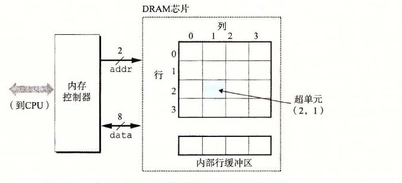

**图 6-3** 一个 128 位 16×8 的 DRAM 芯片的高级视图

> **旁注 关于术语的注释**
>
> 存储领域从来没有为 DRAM 的阵列元素确定一个标准的名字。计算机架构师倾向于称之为“单元”，使这个术语具有 DRAM 存储单元之意。电路设计者倾向于称之为“字”，使之具有主存一个字之意。为了避免混淆，我们采用了无歧义的术语“超单元”。

每个 DRAM 芯片被连接到某个称为内存控制器（memory controller）的电路，这个电路可以一次传送 *w* 位到每个 DRAM 芯片或一次从每个 DRAM 芯片传出 *w* 位。为了读出超单元（*i*，*j*）的内容，内存控制器将行地址 *i* 发送到 DRAM，然后是列地址 *j*。DRAM 把超单元（*i*，*j*）的内容发回给控制器作为响应。行地址 *i* 称为 RAS（Row Access Strobe，行访问选通脉冲）请求。列地址 *j* 称为 CAS（Column Access Strobe，列访问选通脉冲）请求。注意，RAS 和 CAS 请求共享相同的 DRAM 地址引脚。

例如，要从图 6-3 中 16×8 的 DRAM 中读出超单元（2，1），内存控制器发送行地址 2，如图 6-4a 所示。DRAM 的响应是将行 2 的整个内容都复制到一个内部行缓冲区。接下来，内存控制器发送列地址 1，如图 6-4b 所示。DRAM 的响应是从行缓冲区复制出超单元（2，1）中的 8 位，并把它们发送到内存控制器。


**图 6-4** 读一个 DRAM 超单元的内容

电路设计者将 DRAM 组织成二维阵列而不是线性数组的一个原因是降低芯片上地址引脚的数量。例如，如果示例的 128 位 DRAM 被组织成一个 16 个超单元的线性数组，地址为 0～15，那么芯片会需要 4 个地址引脚而不是 2 个。二维阵列组织的缺点是必须分两步发送地址，这增加了访问时间。

##### 4. 内存模块

DRAM 芯片封装在内存模块（memory module）中，它插到主板的扩展槽上。Core i7 系统使用的 240 个引脚的双列直插内存模块（Dual Inline Memory Module，DIMM），它以 64 位为块传送数据到内存控制器和从内存控制器传出数据。

图 6-5 展示了一个内存模块的基本思想。示例模块用 8 个 64 Mbit 的 8M×8 的 DRAM 芯片，总共存储 64MB（兆字节），这 8 个芯片编号为 0～7。每个超单元存储主存的一个字节，而用相应超单元地址为（*i*，*j*）的 8 个超单元来表示主存中地址 *A* 处的 64 位字。在图 6-5 的示例中，DRAM 0 存储第一个（低位）字节，DRAM 1 存储下一个字节，依此类推。

要取出内存地址 *A* 处的一个字，内存控制器将 *A* 转换成一个超单元地址（*i*，*j*），并将它发送到内存模块，然后内存模块再将 *i* 和 *j* 广播到每个 DRAM。作为响应，每个 DRAM 输出它的（*i*，*j*）超单元的 8 位内容。模块中的电路收集这些输出，并把它们合并成一个 64 位字，再返回给内存控制器。

通过将多个内存模块连接到内存控制器，能够聚合成主存。在这种情况中，当控制器收到一个地址 *A* 时，控制器选择包含 *A* 的模块 *k*，将 *A* 转换成它的（*i*，*j*）的形式，并将（*i*，*j*）发送到模块 *k*。


**图 6-5** 读一个内存模块的内容

> **练习题 6.1**
>
> 接下来，设 *r* 表示一个 DRAM 阵列中的行数，*c* 表示列数，*b*<sub>r</sub> 表示行寻址所需的位数，*b*<sub>c</sub> 表示列寻址所需的位数。对于下面每个 DRAM，确定 2 的幂数的阵列维数，使得 max（*b*<sub>r</sub>，*b*<sub>c</sub>）最小，max（*b*<sub>r</sub>，*b*<sub>c</sub>）是对阵列的行或列寻址所需的位数中较大的值。
>
> | 组织 | *r* | *c* | *b*<sub>r</sub> | *b*<sub>c</sub> | max（*b*<sub>r</sub>，*b*<sub>c</sub>） |
> | --- | --- | --- | --- | --- | --- |
> | 16×1 |  |  |  |  |  |
> | 16×4 |  |  |  |  |  |
> | 128×8 |  |  |  |  |  |
> | 512×4 |  |  |  |  |  |
> | 1024×4 |  |  |  |  |  |

##### 5. 增强的 DRAM

有许多种 DRAM 存储器，而生产厂商试图跟上迅速增长的处理器速度，市场上就会定期推出新的种类。每种都是基于传统的 DRAM 单元，并进行一些优化，提高访问基本 DRAM 单元的速度。

- **快页模式 DRAM（Fast Page Mode DRAM，FPM DRAM）。** 传统的 DRAM 将超单元的一整行复制到它的内部行缓冲区中，使用一个，然后丢弃剩余的。FPM DRAM 允许对同一行连续地访问可以直接从行缓冲区得到服务，从而改进了这一点。例如，要从一个传统的 DRAM 的行 *i* 中读 4 个超单元，内存控制器必须发送 4 个 RAS/CAS 请求，即使是行地址 *i* 在每个情况中都是一样的。要从一个 FPM DRAM 的同一行中读取 4 个超单元，内存控制器发送第一个 RAS/CAS 请求，后面跟三个 CAS 请求。初始的 RAS/CAS 请求将行 *i* 复制到行缓冲区，并返回 CAS 寻址的那个超单元。接下来三个超单元直接从行缓冲区获得，因此返回得比初始的超单元更快。
- **扩展数据输出 DRAM（Extended Data Out DRAM，EDO DRAM）。** FPM DRAM 的一个增强的形式，它允许各个 CAS 信号在时间上靠得更紧密一点。
- **同步 DRAM（Synchronous DRAM，SDRAM）。** 就它们与内存控制器通信使用一组显式的控制信号来说，常规的、FPM 和 EDO DRAM 都是异步的。SDRAM 用与驱动内存控制器相同的外部时钟信号的上升沿来代替许多这样的控制信号。我们不会深入讨论细节，最终效果就是 SDRAM 能够比那些异步的存储器更快地输出它的超单元的内容。
- **双倍数据速率同步 DRAM（Double Data-Rate Synchronous DRAM，DDR SDRAM）。** DDR SDRAM 是对 SDRAM 的一种增强，它通过使用两个时钟沿作为控制信号，从而使 DRAM 的速度翻倍。不同类型的 DDR SDRAM 是用提高有效带宽的很小的预取缓冲区的大小来划分的：DDR（2 位）、DDR2（4 位）和 DDR3（8 位）。
- **视频 RAM（Video RAM，VRAM）。** 它用在图形系统的帧缓冲区中。VRAM 的思想与 FPM DRAM 类似。两个主要区别是：1）VRAM 的输出是通过依次对内部缓冲区的整个内容进行移位得到的；2）VRAM 允许对内存并行地读和写。因此，系统可以在写下一次更新的新值（写）的同时，用帧缓冲区中的像素刷屏幕（读）。

> **旁注 DRAM 技术流行的历史**
>
> 直到 1995 年，大多数 PC 都是用 FPM DRAM 构造的。1996～1999 年，EDO DRAM 在市场上占据了主导，而 FPM DRAM 几乎销声匿迹了。SDRAM 最早出现在 1995 年的高端系统中，到 2002 年，大多数 PC 都是用 SDRAM 和 DDR SDRAM 制造的。到 2010 年之前，大多数服务器和桌面系统都是用 DDR3 SDRAM 构造的。实际上，Intel Core i7 只支持 DDR3 SDRAM。

##### 6. 非易失性存储器

如果断电，DRAM 和 SRAM 会丢失它们的信息，从这个意义上说，它们是易失的（volatile）。另一方面，非易失性存储器（nonvolatile memory）即使是在关电后，仍然保存着它们的信息。现在有很多种非易失性存储器。由于历史原因，虽然 ROM 中有的类型既可以读也可以写，但是它们整体上都被称为只读存储器（Read-Only Memory，ROM）。ROM 是以它们能够被重编程（写）的次数和对它们进行重编程所用的机制来区分的。

PROM（Programmable ROM，可编程 ROM）只能被编程一次。PROM 的每个存储器单元有一种熔丝（fuse），只能用高电流熔断一次。

可擦写可编程 ROM（Erasable Programmable ROM，EPROM）有一个透明的石英窗口，允许光到达存储单元。紫外线光照射过窗口，EPROM 单元就被清除为 0。对 EPROM 编程是通过使用一种把 1 写入 EPROM 的特殊设备来完成的。EPROM 能够被擦除和重编程的次数的数量级可以达到 1000 次。电子可擦除 PROM（Electrically Erasable PROM，EEPROM）类似于 EPROM，但是它不需要一个物理上独立的编程设备，因此可以直接在印制电路卡上编程。EEPROM 能够被编程的次数的数量级可以达到 10<sup>5</sup> 次。

闪存（flash memory）是一类非易失性存储器，基于 EEPROM，它已经成为了一种重要的存储技术。闪存无处不在，为大量的电子设备提供快速而持久的非易失性存储，包括数码相机、手机、音乐播放器、PDA 和笔记本、台式机和服务器计算机系统。在 6.1.3 节中，我们会仔细研究一种新型的基于闪存的磁盘驱动器，称为固态硬盘（Solid State Disk，SSD），它能提供相对于传统旋转磁盘的一种更快速、更强健和更低能耗的选择。

存储在 ROM 设备中的程序通常被称为固件（firmware）。当一个计算机系统通电以后，它会运行存储在 ROM 中的固件。一些系统在固件中提供了少量基本的输入和输出函数——例如 PC 的 BIOS（基本输入/输出系统）例程。复杂的设备，像图形卡和磁盘驱动控制器，也依赖固件翻译来自 CPU 的 I/O（输入/输出）请求。

##### 7. 访问主存

数据流通过称为总线（bus）的共享电子电路在处理器和 DRAM 主存之间来来回回。每次 CPU 和主存之间的数据传送都是通过一系列步骤来完成的，这些步骤称为总线事务（bus transaction）。读事务（read transaction）从主存传送数据到 CPU。写事务（write transaction）从 CPU 传送数据到主存。

总线是一组并行的导线，能携带地址、数据和控制信号。取决于总线的设计，数据和地址信号可以共享同一组导线，也可以使用不同的。同时，两个以上的设备也能共享同一总线。控制线携带的信号会同步事务，并标识出当前正在被执行的事务的类型。例如，当前关注的这个事务是到主存的吗？还是到诸如磁盘控制器这样的其他 I/O 设备？这个事务是读还是写？总线上的信息是地址还是数据项？

图 6-6 展示了一个示例计算机系统的配置。主要部件是 CPU 芯片、我们将称为 I/O 桥接器（I/O bridge）的芯片组（其中包括内存控制器），以及组成主存的 DRAM 内存模块。这些部件由一对总线连接起来，其中一条总线是系统总线（system bus），它连接 CPU 和 I/O 桥接器，另一条总线是内存总线（memory bus），它连接 I/O 桥接器和主存。I/O 桥接器将系统总线的电子信号翻译成内存总线的电子信号。正如我们看到的那样，I/O 桥也将系统总线和内存总线连接到 I/O 总线，像磁盘和图形卡这样的 I/O 设备共享 I/O 总线。不过现在，我们将注意力集中在内存总线上。


**图 6-6** 连接 CPU 和主存的总线结构示例

> **旁注 关于总线设计的注释**
>
> 总线设计是计算机系统一个复杂而且变化迅速的方面。不同的厂商提出了不同的总线体系结构，作为产品差异化的一种方法。例如，Intel 系统使用称为北桥（northbridge）和南桥（southbridge）的芯片组分别将 CPU 连接到内存和 I/O 设备。在比较老的 Pentium 和 Core 2 系统中，前端总线（Front Side Bus，FSB）将 CPU 连接到北桥。来自 AMD 的系统将 FSB 替换为超传输（HyperTransport）互联，而更新一些的 Intel Core i7 系统使用的是快速通道（QuickPath）互联。这些不同总线体系结构的细节超出了本书的范围。反之，我们会使用图 6-6 中的高级总线体系结构作为一个运行示例贯穿本书。这是一个简单但是有用的抽象，使得我们可以很具体，并且可以掌握主要思想而不必与任何私有设计的细节绑得太紧。

考虑当 CPU 执行一个如下加载操作时会发生什么：

```asm
movq A,%rax
```

这里，地址 *A* 的内容被加载到寄存器 `%rax` 中。CPU 芯片上称为总线接口（bus interface）的电路在总线上发起读事务。读事务是由三个步骤组成的。首先，CPU 将地址 *A* 放到系统总线上。I/O 桥将信号传递到内存总线（图 6-7a）。接下来，主存感觉到内存总线上的地址信号，从内存总线读地址，从 DRAM 取出数据字，并将数据写到内存总线。I/O 桥将内存总线信号翻译成系统总线信号，然后沿着系统总线传递（图 6-7b）。最后，CPU 感觉到系统总线上的数据，从总线上读数据，并将数据复制到寄存器 `%rax`（图 6-7c）。


**图 6-7** 加载操作 `movq A,%rax` 的内存读事务

反过来，当 CPU 执行一个像下面这样的存储操作时：

```asm
movq %rax,A
```

这里，寄存器 `%rax` 的内容被写到地址 *A*，CPU 发起写事务。同样，有三个基本步骤。首先，CPU 将地址放到系统总线上。内存从内存总线读出地址，并等待数据到达（图 6-8a）。接下来，CPU 将 `%rax` 中的数据字复制到系统总线（图 6-8b）。最后，主存从内存总线读出数据字，并且将这些位存储到 DRAM 中（图 6-8c）。

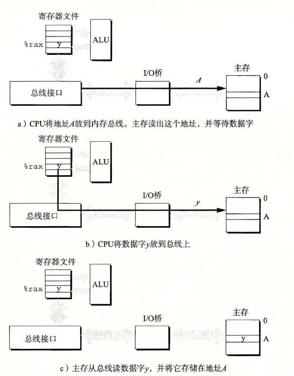

**图 6-8** 存储操作 `movq %rax,A` 的内存写事务

#### 6.1.2 磁盘存储

磁盘是广为应用的保存大量数据的存储设备，存储数据的数量级可以达到几百到几千千兆字节，而基于 RAM 的存储器只能有几百或几千兆字节。不过，从磁盘上读信息的时间为毫秒级，比从 DRAM 读慢了 10 万倍，比从 SRAM 读慢了 100 万倍。

##### 1. 磁盘构造

磁盘是由盘片（platter）构成的。每个盘片有两面或者称为表面（surface），表面覆盖着磁性记录材料。盘片中央有一个可以旋转的主轴（spindle），它使得盘片以固定的旋转速率（rotational rate）旋转，通常是 5400～15 000 转每分钟（Revolution Per Minute，RPM）。磁盘通常包含一个或多个这样的盘片，并封装在一个密封的容器内。

图 6-9a 展示了一个典型的磁盘表面的结构。每个表面是由一组称为磁道（track）的同心圆组成的。每个磁道被划分为一组扇区（sector）。每个扇区包含相等数量的数据位（通常是 512 字节），这些数据编码在扇区上的磁性材料中。扇区之间由一些间隙（gap）分隔开，这些间隙中不存储数据位。间隙存储用来标识扇区的格式化位。

磁盘是由一个或多个叠放在一起的盘片组成的，它们被封装在一个密封的包装里，如图 6-9b 所示。整个装置通常被称为磁盘驱动器（disk drive），我们通常简称为磁盘（disk）。有时，我们会称磁盘为旋转磁盘（rotating disk），以使之区别于基于闪存的固态硬盘（SSD），SSD 是没有移动部分的。

磁盘制造商通常用术语柱面（cylinder）来描述多个盘片驱动器的构造，这里，柱面是所有盘片表面上到主轴中心的距离相等的磁道的集合。例如，如果一个驱动器有三个盘片和六个面，每个表面上的磁道的编号都是一致的，那么柱面 *k* 就是 6 个磁道 *k* 的集合。


**图 6-9** 磁盘构造

##### 2. 磁盘容量

一个磁盘上可以记录的最大位数称为它的最大容量，或者简称为容量。磁盘容量是由以下技术因素决定的：

- **记录密度（recording density）（位/英寸）：** 磁道一英寸的段中可以放入的位数。
- **磁道密度（track density）（道/英寸）：** 从盘片中心出发半径上一英寸的段内可以有的磁道数。
- **面密度（areal density）（位/平方英寸）：** 记录密度与磁道密度的乘积。

磁盘制造商不懈地努力以提高面密度（从而增加容量），而面密度每隔几年就会翻倍。最初的磁盘，是在面密度很低的时代设计的，将每个磁道分为数目相同的扇区，扇区的数目是由最靠内的磁道能记录的扇区数决定的。为了保持每个磁道有固定的扇区数，越往外的磁道扇区隔得越开。在面密度相对比较低的时候，这种方法还算合理。不过，随着面密度的提高，扇区之间的间隙（那里没有存储数据位）变得不可接受地大。因此，现代大容量磁盘使用一种称为多区记录（multiple zone recording）的技术，在这种技术中，柱面的集合被分割成不相交的子集合，称为记录区（recording zone）。每个区包含一组连续的柱面。一个区中的每个柱面中的每条磁道都有相同数量的扇区，这个扇区的数量是由该区中最里面的磁道所能包含的扇区数确定的。

下面的公式给出了一个磁盘的容量：

```text
             字节数   平均扇区数   磁道数   表面数   盘片数
磁盘容量 = ────── × ──────── × ───── × ───── × ─────
              扇区       磁道       表面     盘片     磁盘
```

例如，假设我们有一个磁盘，有 5 个盘片，每个扇区 512 个字节，每个面 20 000 条磁道，每条磁道平均 300 个扇区。那么这个磁盘的容量是：

```text
             512 字节   300 扇区   20 000 磁道   2 表面   5 盘片
磁盘容量 = ──────── × ──────── × ────────── × ───── × ─────
               扇区       磁道          表面      盘片     磁盘

         = 30 720 000 000 字节
         = 30.72 GB
```

注意，制造商是以千兆字节（GB）或兆兆字节（TB）为单位来表达磁盘容量的，这里 1GB＝10<sup>9</sup> 字节，1TB＝10<sup>12</sup> 字节。

> **旁注 一千兆字节有多大**
>
> 不幸地，像 K（kilo）、M（mega）、G（giga）和 T（tera）这样的前缀的含义依赖于上下文。对于与 DRAM 和 SRAM 容量相关的计量单位，通常 K＝2<sup>10</sup>，M＝2<sup>20</sup>，G＝2<sup>30</sup>，而 T＝2<sup>40</sup>。对于与像磁盘和网络这样的 I/O 设备容量相关的计量单位，通常 K＝10<sup>3</sup>，M＝10<sup>6</sup>，G＝10<sup>9</sup>，而 T＝10<sup>12</sup>。速率和吞吐量常常也使用这些前缀。
>
> 幸运地，对于我们通常依赖的不需要复杂计算的估计值，无论是哪种假设在实际中都工作得很好。例如，2<sup>30</sup> 和 10<sup>9</sup> 之间的相对差别不大：（2<sup>30</sup>−10<sup>9</sup>）/10<sup>9</sup>≈7%。类似，（2<sup>40</sup>−10<sup>12</sup>）/10<sup>12</sup>≈10%。

> **练习题 6.2**
>
> 计算这样一个磁盘的容量，它有 2 个盘片，10 000 个柱面，每条磁道平均有 400 个扇区，而每个扇区有 512 个字节。

##### 3. 磁盘操作

磁盘用读/写头（read/write head）来读写存储在磁性表面的位，而读写头连接到一个传动臂（actuator arm）一端，如图 6-10a 所示。通过沿着半径轴前后移动这个传动臂，驱动器可以将读/写头定位在盘面上的任何磁道上。这样的机械运动称为寻道（seek）。一旦读/写头定位到了期望的磁道上，那么当磁道上的每个位通过它的下面时，读/写头可以感知到这个位的值（读该位），也可以修改这个位的值（写该位）。有多个盘片的磁盘针对每个盘面都有一个独立的读/写头，如图 6-10b 所示。读/写头垂直排列，一致行动。在任何时刻，所有的读/写头都位于同一个柱面上。


**图 6-10** 磁盘的动态特性

在传动臂末端的读/写头在磁盘表面高度大约 0.1 微米处的一层薄薄的气垫上飞翔（就是字面上这个意思），速度大约为 80 km/h。这可以比喻成将一座摩天大楼（442 米高）放倒，然后让它在距离地面 2.5 cm（1 英寸）的高度上环绕地球飞行，绕地球一周只需要 8 秒钟！在这样小的间隙里，盘面上一粒微小的灰尘都像一块巨石。如果读/写头碰到了这样的一块巨石，读/写头会停下来，撞到盘面——所谓的读/写头冲撞（head crash）。为此，磁盘总是密封包装的。

磁盘以扇区大小的块来读写数据。对扇区的访问时间（access time）有三个主要的部分：寻道时间（seek time）、旋转时间（rotational latency）和传送时间（transfer time）：

- **寻道时间：** 为了读取某个目标扇区的内容，传动臂首先将读/写头定位到包含目标扇区的磁道上。移动传动臂所需的时间称为寻道时间。寻道时间 *T*<sub>seek</sub> 依赖于读/写头以前的位置和传动臂在盘面上移动的速度。现代驱动器中平均寻道时间 *T*<sub>avg seek</sub> 是通过对几千次对随机扇区的寻道求平均值来测量的，通常为 3～9ms。一次寻道的最大时间 *T*<sub>max seek</sub> 可以高达 20ms。
- **旋转时间：** 一旦读/写头定位到了期望的磁道，驱动器等待目标扇区的第一个位旋转到读/写头下。这个步骤的性能依赖于当读/写头到达目标扇区时盘面的位置以及磁盘的旋转速度。在最坏的情况下，读/写头刚刚错过了目标扇区，必须等待磁盘转一整圈。因此，最大旋转延迟（以秒为单位）是：

```text
Tmax rotation = 1/RPM × 60s/1min
```

平均旋转时间 *T*<sub>avg rotation</sub> 是 *T*<sub>max rotation</sub> 的一半。

- **传送时间：** 当目标扇区的第一个位位于读/写头下时，驱动器就可以开始读或者写该扇区的内容了。一个扇区的传送时间依赖于旋转速度和每条磁道的扇区数目。因此，我们可以粗略地估计一个扇区以秒为单位的平均传送时间如下：

```text
Tavg transfer = 1/RPM × 1/(平均扇区数/磁道) × 60s/1min
```

我们可以估计访问一个磁盘扇区内容的平均时间为平均寻道时间、平均旋转延迟和平均传送时间之和。例如，考虑一个有如下参数的磁盘：

| 参数 | 值 |
| --- | --- |
| 旋转速率 | 7200RPM |
| *T*<sub>avg seek</sub> | 9ms |
| 每条磁道的平均扇区数 | 400 |

对于这个磁盘，平均旋转延迟（以 ms 为单位）是：

```text
Tavg rotation = 1/2 × Tmax rotation
              = 1/2 × (60s/7200 RPM) × 1000 ms/s
              ≈ 4 ms
```

平均传送时间是：

```text
Tavg transfer = 60/7200 RPM × 1/400 扇区/磁道 × 1000 ms/s
              ≈ 0.02 ms
```

总之，整个估计的访问时间是：

```text
Taccess = Tavg seek + Tavg rotation + Tavg transfer
        = 9 ms + 4 ms + 0.02 ms
        = 13.02 ms
```

这个例子说明了一些很重要的问题：

- 访问一个磁盘扇区中 512 个字节的时间主要是寻道时间和旋转延迟。访问扇区中的第一个字节用了很长时间，但是访问剩下的字节几乎不用时间。
- 因为寻道时间和旋转延迟大致相等，所以将寻道时间乘 2 是估计磁盘访问时间的简单而合理的方法。
- 对存储在 SRAM 中的一个 64 位字的访问时间大约是 4ns，对 DRAM 的访问时间是 60ns。因此，从内存中读一个 512 个字节扇区大小的块的时间对 SRAM 来说大约是 256ns，对 DRAM 来说大约是 4000ns。磁盘访问时间，大约 10ms，是 SRAM 的大约 40 000 倍，是 DRAM 的大约 2500 倍。

> **练习题 6.3**
>
> 估计访问下面这个磁盘上一个扇区的访问时间（以 ms 为单位）：
>
> | 参数 | 值 |
> | --- | --- |
> | 旋转速率 | 15 000RPM |
> | *T*<sub>avg seek</sub> | 8ms |
> | 每条磁道的平均扇区数 | 500 |

##### 4. 逻辑磁盘块

正如我们看到的那样，现代磁盘构造复杂，有多个盘面，这些盘面上有不同的记录区。为了对操作系统隐藏这样的复杂性，现代磁盘将它们的构造呈现为一个简单的视图，一个 *B* 个扇区大小的逻辑块的序列，编号为 0，1，…，*B*−1。磁盘封装中有一个小的硬件/固件设备，称为磁盘控制器，维护着逻辑块号和实际（物理）磁盘扇区之间的映射关系。

当操作系统想要执行一个 I/O 操作时，例如读一个磁盘扇区的数据到主存，操作系统会发送一个命令到磁盘控制器，让它读某个逻辑块号。控制器上的固件执行一个快速表查找，将一个逻辑块号翻译成一个（盘面，磁道，扇区）的三元组，这个三元组唯一地标识了对应的物理扇区。控制器上的硬件会解释这个三元组，将读/写头移动到适当的柱面，等待扇区移动到读/写头下，将读/写头感知到的位放到控制器上的一个小缓冲区中，然后将它们复制到主存中。

> **旁注 格式化的磁盘容量**
>
> 磁盘控制器必须对磁盘进行格式化，然后才能在该磁盘上存储数据。格式化包括用标识扇区的信息填写扇区之间的间隙，标识出表面有故障的柱面并且不使用它们，以及在每个区中预留出一组柱面作为备用，如果区中一个或多个柱面在磁盘使用过程中坏掉了，就可以使用这些备用的柱面。因为存在着这些备用的柱面，所以磁盘制造商所说的格式化容量比最大容量要小。

> **练习题 6.4**
>
> 假设 1MB 的文件由 512 个字节的逻辑块组成，存储在具有如下特性的磁盘驱动器上：
>
> | 参数 | 值 |
> | --- | --- |
> | 旋转速率 | 10 000RPM |
> | *T*<sub>avg seek</sub> | 5ms |
> | 平均扇区数/磁道 | 1000 |
> | 表面 | 4 |
> | 扇区大小 | 512 字节 |
>
> 对于下面的情况，假设程序顺序地读文件的逻辑块，一个接一个，将读/写头定位到第一块上的时间是 *T*<sub>avg seek</sub>＋*T*<sub>avg rotation</sub>。
>
> A. 最好的情况：给定逻辑块到磁盘扇区的最好的可能的映射（即顺序的），估计读这个文件需要的最优时间（以 ms 为单位）。
>
> B. 随机的情况：如果块是随机地映射到磁盘扇区的，估计读这个文件需要的时间（以 ms 为单位）。

##### 5. 连接 I/O 设备

例如图形卡、监视器、鼠标、键盘和磁盘这样的输入/输出（I/O）设备，都是通过 I/O 总线，例如 Intel 的外围设备互连（Peripheral Component Interconnect，PCI）总线连接到 CPU 和主存的。系统总线和内存总线是与 CPU 相关的，与它们不同，诸如 PCI 这样的 I/O 总线设计成与底层 CPU 无关。例如，PC 和 Mac 都可以使用 PCI 总线。图 6-11 展示了一个典型的 I/O 总线结构，它连接了 CPU、主存和 I/O 设备。

虽然 I/O 总线比系统总线和内存总线慢，但是它可以容纳种类繁多的第三方 I/O 设备。例如，在图 6-11 中，有三种不同类型的设备连接到总线。

- 通用串行总线（Universal Serial Bus，USB）控制器是一个连接到 USB 总线的设备的中转机构，USB 总线是一个广泛使用的标准，连接各种外围 I/O 设备，包括键盘、鼠标、调制解调器、数码相机、游戏操纵杆、打印机、外部磁盘驱动器和固态硬盘。USB 3.0 总线的最大带宽为 625MB/s。USB 3.1 总线的最大带宽为 1250MB/s。
- 图形卡（或适配器）包含硬件和软件逻辑，它们负责代表 CPU 在显示器上画像素。
- 主机总线适配器将一个或多个磁盘连接到 I/O 总线，使用的是一个特别的主机总线接口定义的通信协议。两个最常用的这样的磁盘接口是 SCSI（读作“scuzzy”）和 SATA（读作“sat-uh”）。SCSI 磁盘通常比 SATA 驱动器更快但是也更贵。SCSI 主机总线适配器（通常称为 SCSI 控制器）可以支持多个磁盘驱动器，与 SATA 适配器不同，它只能支持一个驱动器。


**图 6-11** 总线结构示例，它连接 CPU、主存和 I/O 设备

其他的设备，例如网络适配器，可以通过将适配器插入到主板上空的扩展槽中，从而连接到 I/O 总线，这些插槽提供了到总线的直接电路连接。

##### 6. 访问磁盘

虽然详细描述 I/O 设备是如何工作的以及如何对它们进行编程超出了我们讨论的范围，但是我们可以给你一个概要的描述。例如，图 6-12 总结了当 CPU 从磁盘读数据时发生的步骤。

> **旁注 I/O 总线设计进展**
>
> 图 6-11 中的 I/O 总线是一个简单的抽象，使得我们可以具体描述但又不必和某个系统的细节联系过于紧密。它是基于外围设备互联（Peripheral Component Interconnect，PCI）总线的，在 2010 年前使用非常广泛。PCI 模型中，系统中所有的设备共享总线，一个时刻只能有一台设备访问这些线路。在现代系统中，共享的 PCI 总线已经被 PCIe（PCI express）总线取代，PCIe 是一组高速串行、通过开关连接的点到点链路，类似于你将在第 11 章中学习到的开关以太网。PCIe 总线，最大吞吐率为 16GB/s，比 PCI 总线快一个数量级，PCI 总线的最大吞吐率为 533MB/s。除了测量出的 I/O 性能，不同总线设计之间的区别对应用程序来说是不可见的，所以在本书中，我们只使用简单的共享总线抽象。

CPU 使用一种称为内存映射 I/O（memory-mapped I/O）的技术来向 I/O 设备发射命令（图 6-12a）。在使用内存映射 I/O 的系统中，地址空间中有一块地址是为与 I/O 设备通信保留的。每个这样的地址称为一个 I/O 端口（I/O port）。当一个设备连接到总线时，它与一个或多个端口相关联（或它被映射到一个或多个端口）。


**图 6-12** 读一个磁盘扇区

来看一个简单的例子，假设磁盘控制器映射到端口 `0xa0`。随后，CPU 可能通过执行三个对地址 `0xa0` 的存储指令，发起磁盘读：第一条指令是发送一个命令字，告诉磁盘发起一个读，同时还发送了其他的参数，例如当读完成时，是否中断 CPU（我们会在 8.1 节中讨论中断）。第二条指令指明应该读的逻辑块号。第三条指令指明应该存储磁盘扇区内容的主存地址。

当 CPU 发出了请求之后，在磁盘执行读的时候，它通常会做些其他的工作。回想一下，一个 1GHz 的处理器时钟周期为 1ns，在用来读磁盘的 16ms 时间里，它潜在地可能执行 1600 万条指令。在传输进行时，只是简单地等待，什么都不做，是一种极大的浪费。

在磁盘控制器收到来自 CPU 的读命令之后，它将逻辑块号翻译成一个扇区地址，读该扇区的内容，然后将这些内容直接传送到主存，不需要 CPU 的干涉（图 6-12b）。设备可以自己执行读或者写总线事务而不需要 CPU 干涉的过程，称为直接内存访问（Direct Memory Access，DMA）。这种数据传送称为 DMA 传送（DMA transfer）。

在 DMA 传送完成，磁盘扇区的内容被安全地存储在主存中以后，磁盘控制器通过给 CPU 发送一个中断信号来通知 CPU（图 6-12c）。基本思想是中断会发信号到 CPU 芯片的一个外部引脚上。这会导致 CPU 暂停它当前正在做的工作，跳转到一个操作系统例程。这个程序会记录下 I/O 已经完成，然后将控制返回到 CPU 被中断的地方。

> **旁注 商用磁盘的特性**
>
> 磁盘制造商在他们的网页上公布了许多高级技术信息。例如，希捷（Seagate）公司的网站包含关于他们最受欢迎的驱动器之一 Barracuda 7400 的如下信息。（远不止如此！）（Seagate.com）
>
> | 构造特性 | 值 | 构造特性 | 值 |
> | --- | --- | --- | --- |
> | 表面直径 | 3.5 英寸 | 旋转速率 | 7200 RPM |
> | 格式化的容量 | 3TB | 平均旋转时间 | 4.16ms |
> | 盘片数 | 3 | 平均寻道时间 | 8.5ms |
> | 表面数 | 6 | 道间寻道时间 | 1.0ms |
> | 逻辑块 | 5 860 533 168 | 平均传输时间 | 156MB/s |
> | 逻辑块大小 | 512 字节 | 最大持续传输速率 | 210MB/s |

#### 6.1.3 固态硬盘

固态硬盘（Solid State Disk，SSD）是一种基于闪存的存储技术（参见 6.1.1 节），在某些情况下是传统旋转磁盘的极有吸引力的替代产品。图 6-13 展示了它的基本思想。SSD 封装插到 I/O 总线上标准硬盘插槽（通常是 USB 或 SATA）中，行为就和其他硬盘一样，处理来自 CPU 的读写逻辑磁盘块的请求。一个 SSD 封装由一个或多个闪存芯片和闪存翻译层（flash translation layer）组成，闪存芯片替代传统旋转磁盘中的机械驱动器，而闪存翻译层是一个硬件/固件设备，扮演与磁盘控制器相同的角色，将对逻辑块的请求翻译成对底层物理设备的访问。

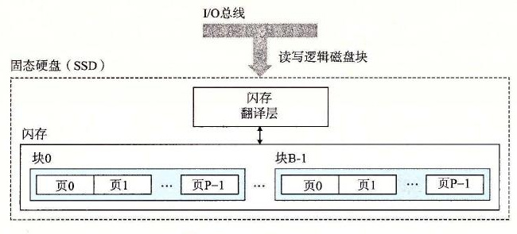

**图 6-13** 固态硬盘（SSD）

图 6-14 展示了典型 SSD 的性能特性。注意，读 SSD 比写要快。随机读和写的性能差别是由底层闪存基本属性决定的。如图 6-13 所示，一个闪存由 *B* 个块的序列组成，每个块由 *P* 页组成。通常，页的大小是 512 字节～4KB，块是由 32～128 页组成的，块的大小为 16KB～512KB。数据是以页为单位读写的。只有在一页所属的块整个被擦除之后，才能写这一页（通常是指该块中的所有位都被设置为 1）。不过，一旦一个块被擦除了，块中每一个页都可以不需要再进行擦除就写一次。在大约进行 100 000 次重复写之后，块就会磨损坏。一旦一个块磨损坏之后，就不能再使用了。

| 读 |  | 写 |  |
| --- | ---: | --- | ---: |
| 顺序读吞吐量 | 550MB/s | 顺序写吞吐量 | 470MB/s |
| 随机读吞吐量（IOPS） | 89 000 IOPS | 随机写吞吐量（IOPS） | 74 000 IOPS |
| 随机读吞吐量（MB/s） | 365MB/s | 随机写吞吐量（MB/s） | 303MB/s |
| 平均顺序读访问时间 | 50μs | 平均随机写访问时间 | 60μs |

**图 6-14** 一个商业固态硬盘的性能特性

资料来源：Intel SSD 730 产品规格书 [53]。IOPS 是每秒 I/O 操作数。吞吐量数值基于 4KB 块的读写。

随机写很慢，有两个原因。首先，擦除块需要相对较长的时间，1ms 级的，比访问页所需时间要高一个数量级。其次，如果写操作试图修改一个包含已经有数据（也就是不是全为 1）的页 *p*，那么这个块中所有带有用数据的页都必须被复制到一个新（擦除过的）块，然后才能进行对页 *p* 的写。制造商已经在闪存翻译层中实现了复杂的逻辑，试图抵消擦写块的高昂代价，最小化内部写的次数，但是随机写的性能不太可能和读一样好。

比起旋转磁盘，SSD 有很多优点。它们由半导体存储器构成，没有移动的部件，因而随机访问时间比旋转磁盘要快，能耗更低，同时也更结实。不过，也有一些缺点。首先，因为反复写之后，闪存块会磨损，所以 SSD 也容易磨损。闪存翻译层中的平均磨损（wear leveling）逻辑试图通过将擦除平均分布在所有的块上来最大化每个块的寿命。实际上，平均磨损逻辑处理得非常好，要很多年 SSD 才会磨损坏（参考练习题 6.5）。其次，SSD 每字节比旋转磁盘贵大约 30 倍，因此常用的存储容量比旋转磁盘小 100 倍。不过，随着 SSD 变得越来越受欢迎，它的价格下降得非常快，而两者的价格差也在减少。

在便携音乐设备中，SSD 已经完全地取代了旋转磁盘，在笔记本电脑中也越来越多地作为硬盘的替代品，甚至在台式机和服务器中也开始出现了。虽然旋转磁盘还会继续存在，但是显然，SSD 是一项重要的替代选择。

> **练习题 6.5**
>
> 正如我们已经看到的，SSD 的一个潜在的缺陷是底层闪存会磨损。例如，图 6-14 所示的 SSD，Intel 保证能够经得起 128PB（128×10<sup>15</sup> 字节）的写。给定这样的假设，根据下面的工作负载，估计这款 SSD 的寿命（以年为单位）：
>
> A. 顺序写的最糟情况：以 470MB/s（该设备的平均顺序写吞吐量）的速度持续地写 SSD。
>
> B. 随机写的最糟情况：以 303MB/s（该设备的平均随机写吞吐量）的速度持续地写 SSD。
>
> C. 平均情况：以 20GB/天（某些计算机制造商在他们的移动计算机工作负载模拟测试中假设的平均每天写速率）的速度写 SSD。

#### 6.1.4 存储技术趋势

从我们对存储技术的讨论中，可以总结出几个很重要的思想：

不同的存储技术有不同的价格和性能折中。SRAM 比 DRAM 快一点，而 DRAM 比磁盘要快很多。另一方面，快速存储总是比慢速存储要贵的。SRAM 每字节的造价比 DRAM 高，DRAM 的造价又比磁盘高得多。SSD 位于 DRAM 和旋转磁盘之间。

不同存储技术的价格和性能属性以截然不同的速率变化着。图 6-15 总结了从 1985 年以来的存储技术的价格和性能属性，那时第一台 PC 刚刚发明不久。这些数字是从以前的商业杂志中和 Web 上挑选出来的。虽然它们是从非正式的调查中得到的，但是这些数字还是能揭示出一些有趣的趋势。

自从 1985 年以来，SRAM 技术的成本和性能基本上是以相同的速度改善的。访问时间和每兆字节成本下降了大约 100 倍（图 6-15a）。不过，DRAM 和磁盘的变化趋势更大，而且更不一致。DRAM 每兆字节成本下降了 44 000 倍（超过了四个数量级！），而 DRAM 的访问时间只下降了大约 10 倍（图 6-15b）。磁盘技术有和 DRAM 相同的趋势，甚至变化更大。从 1985 年以来，磁盘存储的每兆字节成本暴跌了 3 000 000 倍（超过了六个数量级！），但是访问时间提高得很慢，只有 25 倍左右（图 6-15c）。这些惊人的长期趋势突出了内存和磁盘技术的一个基本事实：增加密度（从而降低成本）比降低访问时间容易得多。

DRAM 和磁盘的性能滞后于 CPU 的性能。正如我们在图 6-15d 中看到的那样，从 1985 年到 2010 年，CPU 周期时间提高了 500 倍。如果我们看有效周期时间（effective cycle time）——我们定义为一个单独的 CPU（处理器）的周期时间除以它的处理器核数——那么从 1985 年到 2010 年的提高还要大一些，为 2000 倍。CPU 性能曲线在 2003 年附近的突然变化反映的是多核处理器的出现（参见 6.2 节的旁注），在这个分割点之后，单个核的周期时间实际上增加了一点点，然后又开始下降，不过比以前的速度要慢一些。

| 度量标准 | 1985 | 1990 | 1995 | 2000 | 2005 | 2010 | 2015 | 2015:1985 |
| --- | ---: | ---: | ---: | ---: | ---: | ---: | ---: | ---: |
| 美元/MB | 2900 | 320 | 256 | 100 | 75 | 60 | 25 | 116 |
| 访问时间（ns） | 150 | 35 | 15 | 3 | 2 | 1.5 | 1.3 | 115 |

**a）SRAM 趋势**

| 度量标准 | 1985 | 1990 | 1995 | 2000 | 2005 | 2010 | 2015 | 2015:1985 |
| --- | ---: | ---: | ---: | ---: | ---: | ---: | ---: | ---: |
| 美元/MB | 880 | 100 | 30 | 1 | 0.1 | 0.06 | 0.02 | 44 000 |
| 访问时间（ns） | 200 | 100 | 70 | 60 | 50 | 40 | 20 | 10 |
| 典型的大小（MB） | 0.256 | 4 | 16 | 64 | 2000 | 8000 | 16 000 | 62 500 |

**b）DRAM 趋势**

| 度量标准 | 1985 | 1990 | 1995 | 2000 | 2005 | 2010 | 2015 | 2015:1985 |
| --- | ---: | ---: | ---: | ---: | ---: | ---: | ---: | ---: |
| 美元/GB | 100 000 | 8000 | 300 | 10 | 5 | 0.3 | 0.03 | 3 333 333 |
| 最小寻道时间（ms） | 75 | 28 | 10 | 8 | 5 | 3 | 3 | 25 |
| 典型的大小（GB） | 0.01 | 0.16 | 1 | 20 | 160 | 1500 | 3000 | 300 000 |

**c）旋转磁盘趋势**

| 度量标准 | 1985 | 1990 | 1995 | 2000 | 2003 | 2005 | 2010 | 2015 | 2015:1985 |
| --- | --- | --- | --- | --- | --- | --- | --- | --- | ---: |
| Intel CPU | 80286 | 80386 | Pent. | P-III | Pent4 | Core 2 | Core i7（n） | Core i7（h） | — |
| 时钟频率（MHz） | 6 | 20 | 150 | 600 | 3300 | 2000 | 2500 | 3000 | 500 |
| 时钟周期（ns） | 166 | 50 | 6 | 1.6 | 0.3 | 0.5 | 0.4 | 0.33 | 500 |
| 核数 | 1 | 1 | 1 | 1 | 1 | 2 | 4 | 4 | 4 |
| 有效周期时间（ns） | 166 | 50 | 6 | 1.6 | 0.30 | 0.25 | 0.10 | 0.08 | 2075 |

**d）CPU 趋势**

**图 6-15** 存储和处理器技术发展趋势。2010 年的 Core i7 使用的是 Nehalem 处理器，2015 年的 Core i7 使用的是 Haswell 核

注意，虽然 SRAM 的性能滞后于 CPU 的性能，但还是在保持增长。不过，DRAM 和磁盘性能与 CPU 性能之间的差距实际上是在加大的。直到 2003 年左右多核处理器的出现，这个性能差距都是延迟的函数，DRAM 和磁盘的访问时间比单个处理器的周期时间提高得更慢。不过，随着多核的出现，这个性能越来越成为了吞吐量的函数，多个处理器核并发地向 DRAM 和磁盘发请求。

图 6-16 清楚地表明了各种趋势，以半对数为比例（semi-log scale），画出了图 6-15 中的访问时间和周期时间。

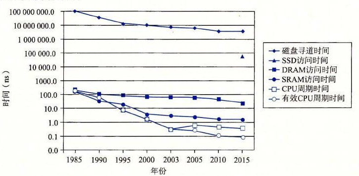

**图 6-16** 磁盘、DRAM 和 CPU 速度之间逐渐增大的差距

正如我们将在 6.4 节中看到的那样，现代计算机频繁地使用基于 SRAM 的高速缓存，试图弥补处理器—内存之间的差距。这种方法行之有效是因为应用程序的一个称为局部性（locality）的基本属性，接下来我们就讨论这个问题。

> **练习题 6.6**
>
> 使用图 6-15c 中从 2005 年到 2015 年的数据，估计到哪一年你可以以 $500 的价格买到一个 1PB（10<sup>15</sup> 字节）的旋转磁盘。假设美元价值不变（没有通货膨胀）。

> **旁注 当周期时间保持不变：多核处理器的到来**
>
> 计算机历史是由一些在工业界和整个世界产生深远变化的单个事件标记出来的。有趣的是，这些变化点趋向于每十年发生一次：20 世纪 50 年代 Fortran 的提出，20 世纪 60 年代早期 IBM 360 的出现，20 世纪 70 年代早期 Internet 的曙光（当时称为 ARPANET），20 世纪 80 年代早期 IBM PC 的出现，以及 20 世纪 90 年代万维网（World Wide Web）的出现。
>
> 最近这样的事件出现在 21 世纪初，当计算机制造商迎头撞上了所谓的“能量墙（power wall）”，发现他们无法再像以前一样迅速地增加 CPU 的时钟频率了，因为如果那样芯片的功耗会太大。解决方法是用多个小处理器核（core）取代单个大处理器，从而提高性能，每个完整的处理器能够独立地、与其他核并行地执行程序。这种多核（multi-core）方法部分有效，因为一个处理器的功耗正比于 *P*＝*fCv*<sup>2</sup>，这里 *f* 是时钟频率，*C* 是电容，而 *v* 是电压。电容 *C* 大致上正比于面积，所以只要所有核的总面积不变，多核造成的能耗就能保持不变。只要特征尺寸继续按照摩尔定律指数性地下降，每个处理器中的核数，以及每个处理器的有效性能，都会继续增加。
>
> 从这个时间点以后，计算机越来越快，不是因为时钟频率的增加，而是因为每个处理器中核数的增加，也因为体系结构上的创新提高了在这些核上运行程序的效率。我们可以从图 6-16 中很清楚地看到这个趋势。CPU 周期时间在 2003 年达到最低点，然后实际上是又开始上升的，然后变得平稳，之后又开始以比以前慢一些的速率下降。不过，由于多核处理器的出现（2004 年出现双核，2007 年出现四核），有效周期时间以接近于以前的速率持续下降。

### 6.2 局部性

一个编写良好的计算机程序常常具有良好的局部性（locality）。也就是，它们倾向于引用邻近于其他最近引用过的数据项的数据项，或者最近引用过的数据项本身。这种倾向性，被称为局部性原理（principle of locality），是一个持久的概念，对硬件和软件系统的设计和性能都有着极大的影响。

局部性通常有两种不同的形式：时间局部性（temporal locality）和空间局部性（spatial locality）。在一个具有良好时间局部性的程序中，被引用过一次的内存位置很可能在不远的将来再被多次引用。在一个具有良好空间局部性的程序中，如果一个内存位置被引用了一次，那么程序很可能在不远的将来引用附近的一个内存位置。

程序员应该理解局部性原理，因为一般而言，有良好局部性的程序比局部性差的程序运行得更快。现代计算机系统的各个层次，从硬件到操作系统、再到应用程序，它们的设计都利用了局部性。在硬件层，局部性原理允许计算机设计者通过引入称为高速缓存存储器的小而快速的存储器来保存最近被引用的指令和数据项，从而提高对主存的访问速度。在操作系统级，局部性原理允许系统使用主存作为虚拟地址空间最近被引用块的高速缓存。类似地，操作系统用主存来缓存磁盘文件系统中最近被使用的磁盘块。局部性原理在应用程序的设计中也扮演着重要的角色。例如，Web 浏览器将最近被引用的文档放在本地磁盘上，利用的就是时间局部性。大容量的 Web 服务器将最近被请求的文档放在前端磁盘高速缓存中，这些缓存能满足对这些文档的请求，而不需要服务器的任何干预。

#### 6.2.1 对程序数据引用的局部性

考虑图 6-17a 中的简单函数，它对一个向量的元素求和。这个程序有良好的局部性吗？要回答这个问题，我们来看看每个变量的引用模式。在这个例子中，变量 `sum` 在每次循环迭代中被引用一次，因此，对于 `sum` 来说，有好的时间局部性。另一方面，因为 `sum` 是标量，对于 `sum` 来说，没有空间局部性。

```c
int sumvec(int v[N])
{
    int i, sum = 0;

    for (i = 0; i < N; i++)
        sum += v[i];
    return sum;
}
```

a) 一个具有良好局部性的程序

| 地址 | 0 | 4 | 8 | 12 | 16 | 20 | 24 | 28 |
| --- | ---: | ---: | ---: | ---: | ---: | ---: | ---: | ---: |
| 内容 | *v*<sub>0</sub> | *v*<sub>1</sub> | *v*<sub>2</sub> | *v*<sub>3</sub> | *v*<sub>4</sub> | *v*<sub>5</sub> | *v*<sub>6</sub> | *v*<sub>7</sub> |
| 访问顺序 | 1 | 2 | 3 | 4 | 5 | 6 | 7 | 8 |

b) 向量 *v* 的引用模式（*N* = 8）

**图 6-17** 注意如何按照向量元素存储在内存中的顺序来访问它们

正如我们在图 6-17b 中看到的，向量 *v* 的元素是被顺序读取的，一个接一个，按照它们存储在内存中的顺序（为了方便，我们假设数组是从地址 0 开始的）。因此，对于变量 *v*，函数有很好的空间局部性，但是时间局部性很差，因为每个向量元素只被访问一次。因为对于循环体中的每个变量，这个函数要么有好的空间局部性，要么有好的时间局部性，所以我们可以断定 `sumvec` 函数有良好的局部性。

我们说像 `sumvec` 这样顺序访问一个向量每个元素的函数，具有步长为 1 的引用模式（stride-1 reference pattern）（相对于元素的大小）。有时我们称步长为 1 的引用模式为顺序引用模式（sequential reference pattern）。一个连续向量中，每隔 *k* 个元素进行访问，就称为步长为 *k* 的引用模式（stride-*k* reference pattern）。步长为 1 的引用模式是程序中空间局部性常见和重要的来源。一般而言，随着步长的增加，空间局部性下降。

对于引用多维数组的程序来说，步长也是一个很重要的问题。例如，考虑图 6-18a 中的函数 `sumarrayrows`，它对一个二维数组的元素求和。双重嵌套循环按照行优先顺序（row-major order）读数组的元素。也就是，内层循环读第一行的元素，然后读第二行，依此类推。函数 `sumarrayrows` 具有良好的空间局部性，因为它按照数组被存储的行优先顺序来访问这个数组（图 6-18b）。其结果是得到一个很好的步长为 1 的引用模式，具有良好的空间局部性。

```c
int sumarrayrows(int a[M][N])
{
    int i, j, sum = 0;

    for (i = 0; i < M; i++)
        for (j = 0; j < N; j++)
            sum += a[i][j];
    return sum;
}
```

a) 另一个具有良好局部性的程序

| 地址 | 0 | 4 | 8 | 12 | 16 | 20 |
| --- | ---: | ---: | ---: | ---: | ---: | ---: |
| 内容 | *a*<sub>00</sub> | *a*<sub>01</sub> | *a*<sub>02</sub> | *a*<sub>10</sub> | *a*<sub>11</sub> | *a*<sub>12</sub> |
| 访问顺序 | 1 | 2 | 3 | 4 | 5 | 6 |

b) 数组 *a* 的引用模式（*M* = 2，*N* = 3）

**图 6-18** 有良好的空间局部性，是因为数组是按照与它存储在内存中一样的行优先顺序来被访问的

一些看上去很小的对程序的改动能够对它的局部性有很大的影响。例如，图 6-19a 中的函数 `sumarraycols` 计算的结果和图 6-18a 中函数 `sumarrayrows` 的一样。唯一的区别是我们交换了 *i* 和 *j* 的循环。这样交换循环对它的局部性有何影响？函数 `sumarraycols` 的空间局部性很差，因为它按照列顺序来扫描数组，而不是按照行顺序。因为 C 数组在内存中是按照行顺序来存放的，结果就得到步长为 *N* 的引用模式，如图 6-19b 所示。

```c
int sumarraycols(int a[M][N])
{
    int i, j, sum = 0;

    for (j = 0; j < N; j++)
        for (i = 0; i < M; i++)
            sum += a[i][j];
    return sum;
}
```

a) 一个空间局部性很差的程序

| 地址 | 0 | 4 | 8 | 12 | 16 | 20 |
| --- | ---: | ---: | ---: | ---: | ---: | ---: |
| 内容 | *a*<sub>00</sub> | *a*<sub>01</sub> | *a*<sub>02</sub> | *a*<sub>10</sub> | *a*<sub>11</sub> | *a*<sub>12</sub> |
| 访问顺序 | 1 | 3 | 5 | 2 | 4 | 6 |

b) 数组 *a* 的引用模式（*M* = 2，*N* = 3）

**图 6-19** 函数的空间局部性很差，这是因为它使用步长为 *N* 的引用模式来扫描

#### 6.2.2 取指令的局部性

因为程序指令是存放在内存中的，CPU 必须取出（读出）这些指令，所以我们也能够评价一个程序关于取指令的局部性。例如，图 6-17 中 `for` 循环体里的指令是按照连续的内存顺序执行的，因此循环有良好的空间局部性。因为循环体会被执行多次，所以它也有很好的时间局部性。

代码区别于程序数据的一个重要属性是在运行时它是不能被修改的。当程序正在执行时，CPU 只从内存中读出它的指令。CPU 很少会重写或修改这些指令。

#### 6.2.3 局部性小结

在这一节中，我们介绍了局部性的基本思想，还给出了量化评价程序中局部性的一些简单原则：

- 重复引用相同变量的程序有良好的时间局部性。
- 对于具有步长为 *k* 的引用模式的程序，步长越小，空间局部性越好。具有步长为 1 的引用模式的程序有很好的空间局部性。在内存中以大步长跳来跳去的程序空间局部性会很差。
- 对于取指令来说，循环有好的时间和空间局部性。循环体越小，循环迭代次数越多，局部性越好。

在本章后面，在我们学习了高速缓存存储器以及它们是如何工作的之后，我们会介绍如何用高速缓存命中率和不命中率来量化局部性的概念。你还会弄明白为什么有良好局部性的程序通常比局部性差的程序运行得更快。尽管如此，了解如何看一眼源代码就能获得对程序中局部性的高层次的认识，是程序员要掌握的一项有用而且重要的技能。

> **练习题 6.7** 改变下面函数中循环的顺序，使得它以步长为 1 的引用模式扫描三维数组 `a`：
>
> ```c
> int sumarray3d(int a[N][N][N])
> {
>     int i, j, k, sum = 0;
>
>     for (i = 0; i < N; i++) {
>         for (j = 0; j < N; j++) {
>             for (k = 0; k < N; k++) {
>                 sum += a[k][i][j];
>             }
>         }
>     }
>     return sum;
> }
> ```

> **练习题 6.8** 图 6-20 中的三个函数，以不同的空间局部性程度，执行相同的操作。请对这些函数就空间局部性进行排序。解释你是如何得到排序结果的。
>
> ```c
> #define N 1000
>
> typedef struct {
>     int vel[3];
>     int acc[3];
> } point;
>
> point p[N];
> ```
>
> a) `structs` 数组
>
> ```c
> void clear1(point *p, int n)
> {
>     int i, j;
>
>     for (i = 0; i < n; i++) {
>         for (j = 0; j < 3; j++)
>             p[i].vel[j] = 0;
>         for (j = 0; j < 3; j++)
>             p[i].acc[j] = 0;
>     }
> }
> ```
>
> b) `clear1` 函数
>
> **图 6-20** 练习题 6.8 的代码示例
>
> ```c
> void clear2(point *p, int n)
> {
>     int i, j;
>
>     for (i = 0; i < n; i++) {
>         for (j = 0; j < 3; j++) {
>             p[i].vel[j] = 0;
>             p[i].acc[j] = 0;
>         }
>     }
> }
> ```
>
> c) `clear2` 函数
>
> ```c
> void clear3(point *p, int n)
> {
>     int i, j;
>
>     for (j = 0; j < 3; j++) {
>         for (i = 0; i < n; i++)
>             p[i].vel[j] = 0;
>         for (i = 0; i < n; i++)
>             p[i].acc[j] = 0;
>     }
> }
> ```
>
> d) `clear3` 函数
>
> **图 6-20（续）**

### 6.3 存储器层次结构

6.1 节和 6.2 节描述了存储技术和计算机软件的一些基本的和持久的属性：

- **存储技术：**不同存储技术的访问时间差异很大。速度较快的技术每字节的成本要比速度较慢的技术高，而且容量较小。CPU 和主存之间的速度差距在增大。
- **计算机软件：**一个编写良好的程序倾向于展示出良好的局部性。

计算中一个喜人的巧合是，硬件和软件的这些基本属性互相补充得很完美。它们这种相互补充的性质使人想到一种组织存储器系统的方法，称为存储器层次结构（memory hierarchy），所有的现代计算机系统中都使用了这种方法。图 6-21 展示了一个典型的存储器层次结构。一般而言，从高层往底层走，存储设备变得更慢、更便宜和更大。在最高层（L0），是少量快速的 CPU 寄存器，CPU 可以在一个时钟周期内访问它们。接下来是一个或多个小型到中型的基于 SRAM 的高速缓存存储器，可以在几个 CPU 时钟周期内访问它们。然后是一个大的基于 DRAM 的主存，可以在几十到几百个时钟周期内访问它们。接下来是慢速但是容量很大的本地磁盘。最后，有些系统甚至包括了一层附加的远程服务器上的磁盘，要通过网络来访问它们。例如，像安德鲁文件系统（Andrew File System，AFS）或者网络文件系统（Network File System，NFS）这样的分布式文件系统，允许程序访问存储在远程的网络服务器上的文件。类似地，万维网允许程序访问存储在世界上任何地方的 Web 服务器上的远程文件。


**图 6-21** 存储器层次结构

> **旁注：其他的存储器层次结构**
>
> 我们向你展示了一个存储器层次结构的示例，但是其他的组合也是可能的，而且确实也很常见。例如，许多站点（包括谷歌的数据中心）将本地磁盘备份到存档的磁带上。其中有些站点，在需要时由人工装好磁带。而其他站点则是由磁带机器人自动地完成这项任务。无论在哪种情况中，磁带都是存储器层次结构中的一层，在本地磁盘层下面，本书中提到的通用原则也同样适用于它。磁带每字节比磁盘更便宜，它允许站点将本地磁盘的多个快照存档。代价是磁带的访问时间要比磁盘的更长。来看另一个例子，固态硬盘在存储器层次结构中扮演着越来越重要的角色，连接起 DRAM 和旋转磁盘之间的鸿沟。

#### 6.3.1 存储器层次结构中的缓存

一般而言，高速缓存（cache，读作“cash”）是一个小而快速的存储设备，它作为存储在更大、也更慢的设备中的数据对象的缓冲区域。使用高速缓存的过程称为缓存（caching，读作“cashing”）。

存储器层次结构的中心思想是，对于每个 *k*，位于 *k* 层的更快更小的存储设备作为位于 *k* + 1 层的更大更慢的存储设备的缓存。换句话说，层次结构中的每一层都缓存来自较低一层的数据对象。例如，本地磁盘作为通过网络从远程磁盘取出的文件（例如 Web 页面）的缓存，主存作为本地磁盘上数据的缓存，依此类推，直到最小的缓存——CPU 寄存器组。

图 6-22 展示了存储器层次结构中缓存的一般性概念。第 *k* + 1 层的存储器被划分成连续的数据对象组块（chunk），称为块（block）。每个块都有一个唯一的地址或名字，使之区别于其他的块。块可以是固定大小的（通常是这样的），也可以是可变大小的（例如存储在 Web 服务器上的远程 HTML 文件）。例如，图 6-22 中第 *k* + 1 层存储器被划分成 16 个大小固定的块，编号为 0～15。


**图 6-22** 存储器层次结构中基本的缓存原理

类似地，第 *k* 层的存储器被划分成较少的块的集合，每个块的大小与 *k* + 1 层的块的大小一样。在任何时刻，第 *k* 层的缓存包含第 *k* + 1 层块的一个子集的副本。例如，在图 6-22 中，第 *k* 层的缓存有 4 个块的空间，当前包含块 4、9、14 和 3 的副本。

数据总是以块大小为传送单元（transfer unit）在第 *k* 层和第 *k* + 1 层之间来回复制的。虽然在层次结构中任何一对相邻的层次之间块大小是固定的，但是其他的层次对之间可以有不同的块大小。例如，在图 6-21 中，L1 和 L0 之间的传送通常使用的是 1 个字大小的块。L2 和 L1 之间（以及 L3 和 L2 之间、L4 和 L3 之间）的传送通常使用的是几十个字节的块。而 L5 和 L4 之间的传送用的是大小为几百或几千字节的块。一般而言，层次结构中较低层（离 CPU 较远）的设备的访问时间较长，因此为了补偿这些较长的访问时间，倾向于使用较大的块。

##### 1. 缓存命中

当程序需要第 *k* + 1 层的某个数据对象 *d* 时，它首先在当前存储在第 *k* 层的一个块中查找 *d*。如果 *d* 刚好缓存在第 *k* 层中，那么就是我们所说的缓存命中（cache hit）。该程序直接从第 *k* 层读取 *d*，根据存储器层次结构的性质，这要比从第 *k* + 1 层读取 *d* 更快。例如，一个有良好时间局部性的程序可以从块 14 中读出一个数据对象，得到一个对第 *k* 层的缓存命中。

##### 2. 缓存不命中

另一方面，如果第 *k* 层中没有缓存数据对象 *d*，那么就是我们所说的缓存不命中（cache miss）。当发生缓存不命中时，第 *k* 层的缓存从第 *k* + 1 层缓存中取出包含 *d* 的那个块，如果第 *k* 层的缓存已经满了，可能就会覆盖现存的一个块。

覆盖一个现存的块的过程称为替换（replacing）或驱逐（evicting）这个块。被驱逐的这个块有时也称为牺牲块（victim block）。决定该替换哪个块是由缓存的替换策略（replacement policy）来控制的。例如，一个具有随机替换策略的缓存会随机选择一个牺牲块。一个具有最近最少被使用（LRU）替换策略的缓存会选择那个最后被访问的时间距现在最远的块。

在第 *k* 层缓存从第 *k* + 1 层取出那个块之后，程序就能像前面一样从第 *k* 层读出 *d* 了。例如，在图 6-22 中，在第 *k* 层中读块 12 中的一个数据对象，会导致一个缓存不命中，因为块 12 当前不在第 *k* 层缓存中。一旦把块 12 从第 *k* + 1 层复制到第 *k* 层之后，它就会保持在那里，等待稍后的访问。

##### 3. 缓存不命中的种类

区分不同种类的缓存不命中有时候是很有帮助的。如果第 *k* 层的缓存是空的，那么对任何数据对象的访问都会不命中。一个空的缓存有时被称为冷缓存（cold cache），此类不命中称为强制性不命中（compulsory miss）或冷不命中（cold miss）。冷不命中很重要，因为它们通常是短暂的事件，不会在反复访问存储器使得缓存暖身（warmed up）之后的稳定状态中出现。

只要发生了不命中，第 *k* 层的缓存就必须执行某个放置策略（placement policy），确定把它从第 *k* + 1 层中取出的块放在哪里。最灵活的替换策略是允许来自第 *k* + 1 层的任何块放在第 *k* 层的任何块中。对于存储器层次结构中高层的缓存（靠近 CPU），它们是用硬件来实现的，而且速度是最优的，这个策略实现起来通常很昂贵，因为随机地放置块，定位起来代价很高。

因此，硬件缓存通常使用的是更严格的放置策略，这个策略将第 *k* + 1 层的某个块限制放置在第 *k* 层块的一个小的子集中（有时只是一个块）。例如，在图 6-22 中，我们可以确定第 *k* + 1 层的块 *i* 必须放置在第 *k* 层的块（*i* mod 4）中。例如，第 *k* + 1 层的块 0、4、8 和 12 会映射到第 *k* 层的块 0；块 1、5、9 和 13 会映射到块 1；依此类推。注意，图 6-22 中的示例缓存使用的就是这个策略。

这种限制性的放置策略会引起一种不命中，称为冲突不命中（conflict miss），在这种情况中，缓存足够大，能够保存被引用的数据对象，但是因为这些对象会映射到同一个缓存块，缓存会一直不命中。例如，在图 6-22 中，如果程序请求块 0，然后块 8，然后块 0，然后块 8，依此类推，在第 *k* 层的缓存中，对这两个块的每次引用都会不命中，即使这个缓存总共可以容纳 4 个块。

程序通常是按照一系列阶段（如循环）来运行的，每个阶段访问缓存块的某个相对稳定不变的集合。例如，一个嵌套的循环可能会反复地访问同一个数组的元素。这个块的集合称为这个阶段的工作集（working set）。当工作集的大小超过缓存的大小时，缓存会经历容量不命中（capacity miss）。换句话说就是，缓存太小了，不能处理这个工作集。

##### 4. 缓存管理

正如我们提到过的，存储器层次结构的本质是，每一层存储设备都是较低一层的缓存。在每一层上，某种形式的逻辑必须管理缓存。这里，我们的意思是指某个东西要将缓存划分成块，在不同的层之间传送块，判定是命中还是不命中，并处理它们。管理缓存的逻辑可以是硬件、软件，或是两者的结合。

例如，编译器管理寄存器文件，缓存层次结构的最高层。它决定当发生不命中时何时发射加载，以及确定哪个寄存器来存放数据。L1、L2 和 L3 层的缓存完全是由内置在缓存中的硬件逻辑来管理的。在一个有虚拟内存的系统中，DRAM 主存作为存储在磁盘上的数据块的缓存，是由操作系统软件和 CPU 上的地址翻译硬件共同管理的。对于一个具有像 AFS 这样的分布式文件系统的机器来说，本地磁盘作为缓存，它是由运行在本地机器上的 AFS 客户端进程管理的。在大多数时候，缓存都是自动运行的，不需要程序采取特殊的或显式的行动。

#### 6.3.2 存储器层次结构概念小结

概括来说，基于缓存的存储器层次结构行之有效，是因为较慢的存储设备比较快的存储设备更便宜，还因为程序倾向于展示局部性：

- **利用时间局部性：**由于时间局部性，同一数据对象可能会被多次使用。一旦一个数据对象在第一次不命中时被复制到缓存中，我们就会期望后面对该目标有一系列的访问命中。因为缓存比低一层的存储设备更快，对后面的命中的服务会比最开始的不命中快很多。
- **利用空间局部性：**块通常包含有多个数据对象。由于空间局部性，我们会期望后面对该块中其他对象的访问能够补偿不命中后复制该块的花费。

现代系统中到处都使用了缓存。正如从图 6-23 中能够看到的那样，CPU 芯片、操作系统、分布式文件系统中和万维网上都使用了缓存。各种各样硬件和软件的组合构成和管理着缓存。注意，图 6-23 中有大量我们还未涉及的术语和缩写。在此我们包括这些术语和缩写是为了说明缓存是多么的普遍。

| 类型 | 缓存什么 | 被缓存在何处 | 延迟（周期数） | 由谁管理 |
| --- | --- | --- | ---: | --- |
| CPU 寄存器 | 4 字节或 8 字节字 | 芯片上的 CPU 寄存器 | 0 | 编译器 |
| TLB | 地址翻译 | 芯片上的 TLB | 0 | 硬件 MMU |
| L1 高速缓存 | 64 字节块 | 芯片上的 L1 高速缓存 | 4 | 硬件 |
| L2 高速缓存 | 64 字节块 | 芯片上的 L2 高速缓存 | 10 | 硬件 |
| L3 高速缓存 | 64 字节块 | 芯片上的 L3 高速缓存 | 50 | 硬件 |
| 虚拟内存 | 4KB 页 | 主存 | 200 | 硬件 + OS |
| 缓冲区缓存 | 部分文件 | 主存 | 200 | OS |
| 磁盘缓存 | 磁盘扇区 | 磁盘控制器 | 100 000 | 控制器固件 |
| 网络缓存 | 部分文件 | 本地磁盘 | 10 000 000 | NFS 客户 |
| 浏览器缓存 | Web 页 | 本地磁盘 | 10 000 000 | Web 浏览器 |
| Web 缓存 | Web 页 | 远程服务器磁盘 | 1 000 000 000 | Web 代理服务器 |

**图 6-23** 缓存在现代计算机系统中无处不在。TLB：翻译后备缓冲器（Translation Lookaside Buffer）；MMU：内存管理单元（Memory Management Unit）；OS：操作系统（Operating System）；AFS：安德鲁文件系统（Andrew File System）；NFS：网络文件系统（Network File System）

### 6.4 高速缓存存储器

早期计算机系统的存储器层次结构只有三层：CPU 寄存器、DRAM 主存储器和磁盘存储。不过，由于 CPU 和主存之间逐渐增大的差距，系统设计者被迫在 CPU 寄存器文件和主存之间插入了一个小的 SRAM 高速缓存存储器，称为 L1 高速缓存（一级缓存），如图 6-24 所示。L1 高速缓存的访问速度几乎和寄存器一样快，典型地是大约 4 个时钟周期。

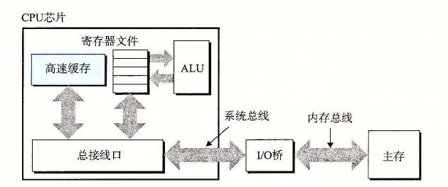

**图 6-24** 高速缓存存储器的典型总线结构

随着 CPU 和主存之间的性能差距不断增大，系统设计者在 L1 高速缓存和主存之间又插入了一个更大的高速缓存，称为 L2 高速缓存，可以在大约 10 个时钟周期内访问到它。有些现代系统还包括有一个更大的高速缓存，称为 L3 高速缓存，在存储器层次结构中，它位于 L2 高速缓存和主存之间，可以在大约 50 个周期内访问到它。虽然安排上有相当多的变化，但是通用原则是一样的。对于下一节中的讨论，我们会假设一个简单的存储器层次结构，CPU 和主存之间只有一个 L1 高速缓存。

#### 6.4.1 通用的高速缓存存储器组织结构

考虑一个计算机系统，其中每个存储器地址有 *m* 位，形成 M=2<sup>m</sup> 个不同的地址。如图 6-25a 所示，这样一个机器的高速缓存被组织成一个有 S=2<sup>s</sup> 个高速缓存组（cache set）的数组。每个组包含 E 个高速缓存行（cache line）。每个行是由一个 B=2<sup>b</sup> 字节的数据块（block）组成的，一个有效位（valid bit）指明这个行是否包含有意义的信息，还有 t=m-(b+s) 个标记位（tag bit）（是当前块的内存地址的位的一个子集），它们唯一地标识存储在这个高速缓存行中的块。

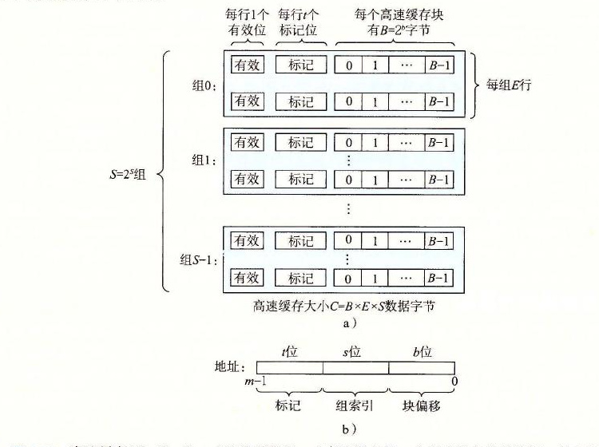

**图 6-25** 高速缓存（S、E、B、m）的通用组织。a）高速缓存是一个高速缓存组的数组。每个组包含一个或多个行，每个行包含一个有效位、一些标记位，以及一个数据块；b）高速缓存的结构将 m 个地址位划分成了 t 个标记位、s 个组索引位和 b 个块偏移位

一般而言，高速缓存的结构可以用元组 (S, E, B, m) 来描述。高速缓存的大小（或容量）C 指的是所有块的大小的和。标记位和有效位不包括在内。因此，C=S×E×B。

当一条加载指令指示 CPU 从主存地址 A 中读一个字时，它将地址 A 发送到高速缓存。如果高速缓存正保存着地址 A 处那个字的副本，它就立即将那个字发回给 CPU。那么高速缓存如何知道它是否包含地址 A 处那个字的副本的呢？高速缓存的结构使得它能通过简单地检查地址位，找到所请求的字，类似于使用极其简单的哈希函数的哈希表。下面介绍它是如何工作的：

参数 S 和 B 将 m 个地址位分为了三个字段，如图 6-25b 所示。A 中 s 个组索引位是一个到 S 个组的数组的索引。第一个组是组 0，第二个组是组 1，依此类推。组索引位被解释为一个无符号整数，它告诉我们这个字必须存储在哪个组中。一旦我们知道了这个字必须放在哪个组中，A 中的 t 个标记位就告诉我们这个组中的哪一行包含这个字（如果有的话）。当且仅当设置了有效位并且该行的标记位与地址 A 中的标记位相匹配时，组中的这一行才包含这个字。一旦我们在由组索引标识的组中定位了由标号所标识的行，那么 b 个块偏移位给出了在 B 个字节的数据块中的字偏移。

你可能已经注意到了，对高速缓存的描述使用了很多符号。图 6-26 对这些符号做了个小结，供你参考。

| 基本参数 | 描述 |
| --- | --- |
| S=2<sup>s</sup> | 组数 |
| E | 每个组的行数 |
| B=2<sup>b</sup> | 块大小（字节） |
| m=log<sub>2</sub>(M) | （主存）物理地址位数 |

| 衍生出来的量 | 描述 |
| --- | --- |
| M=2<sup>m</sup> | 内存地址的最大数量 |
| s=log<sub>2</sub>(S) | 组索引位数量 |
| b=log<sub>2</sub>(B) | 块偏移位数量 |
| t=m-(s+b) | 标记位数量 |
| C=B×E×S | 不包括像有效位和标记位这样开销的高速缓存大小（字节） |

**图 6-26** 高速缓存参数小结

> **练习题 6.9**
>
> 下表给出了几个不同的高速缓存的参数。确定每个高速缓存的高速缓存组数（S）、标记位数（t）、组索引位数（s）以及块偏移位数（b）。
>
> | 高速缓存 | m | C | B | E | S | t | s | b |
> | --- | ---: | ---: | ---: | ---: | --- | --- | --- | --- |
> | 1. | 32 | 1024 | 4 | 1 |  |  |  |  |
> | 2. | 32 | 1024 | 8 | 4 |  |  |  |  |
> | 3. | 32 | 1024 | 32 | 32 |  |  |  |  |

#### 6.4.2 直接映射高速缓存

根据每个组的高速缓存行数 E，高速缓存被分为不同的类。每个组只有一行（E=1）的高速缓存称为直接映射高速缓存（direct-mapped cache）（见图 6-27）。直接映射高速缓存是最容易实现和理解的，所以我们会以它为例来说明一些高速缓存工作方式的通用概念。


**图 6-27** 直接映射高速缓存（E=1）。每个组只有一行

假设我们有这样一个系统，它有一个 CPU、一个寄存器文件、一个 L1 高速缓存和一个主存。当 CPU 执行一条读内存字 w 的指令，它向 L1 高速缓存请求这个字。如果 L1 高速缓存有 w 的一个缓存的副本，那么就得到 L1 高速缓存命中，高速缓存会很快抽取出 w，并将它返回给 CPU。否则就是缓存不命中，当 L1 高速缓存向主存请求包含 w 的块的一个副本时，CPU 必须等待。当被请求的块最终从内存到达时，L1 高速缓存将这个块存放在它的一个高速缓存行里，从被存储的块中抽取出字 w，然后将它返回给 CPU。高速缓存确定一个请求是否命中，然后抽取出被请求的字的过程，分为三步：1）组选择；2）行匹配；3）字抽取。

##### 1. 直接映射高速缓存中的组选择

在这一步中，高速缓存从 w 的地址中间抽取出 s 个组索引位。这些位被解释成一个对应于一个组号的无符号整数。换句话来说，如果我们把高速缓存看成是一个关于组的一维数组，那么这些组索引位就是一个到这个数组的索引。图 6-28 展示了直接映射高速缓存的组选择是如何工作的。在这个例子中，组索引位 00001<sub>2</sub> 被解释为一个选择组 1 的整数索引。

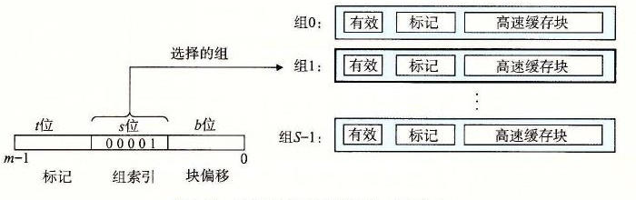

**图 6-28** 直接映射高速缓存中的组选择

##### 2. 直接映射高速缓存中的行匹配

在上一步中我们已经选择了某个组 i，接下来的一步就要确定是否有字 w 的一个副本存储在组 i 包含的一个高速缓存行中。在直接映射高速缓存中这很容易，而且很快，这是因为每个组只有一行。当且仅当设置了有效位，而且高速缓存行中的标记与 w 的地址中的标记相匹配时，这一行中包含 w 的一个副本。

图 6-29 展示了直接映射高速缓存中行匹配是如何工作的。在这个例子中，选中的组中只有一个高速缓存行。这个行的有效位设置了，所以我们知道标记和块中的位是有意义的。因为这个高速缓存行中的标记位与地址中的标记位相匹配，所以我们知道我们想要的那个字的一个副本确实存储在这个行中。换句话说，我们得到一个缓存命中。另一方面，如果有效位没有设置，或者标记不相匹配，那么我们就得到一个缓存不命中。

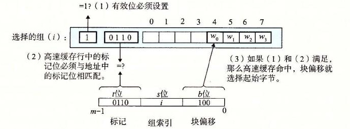

**图 6-29** 直接映射高速缓存中的行匹配和字选择。在高速缓存块中，w<sub>0</sub> 表示字 w 的低位字节，w<sub>1</sub> 是下一个字节，依此类推

##### 3. 直接映射高速缓存中的字选择

一旦命中，我们知道 w 就在这个块中的某个地方。最后一步确定所需要的字在块中是从哪里开始的。如图 6-29 所示，块偏移位提供了所需要的字的第一个字节的偏移。就像我们把高速缓存看成一个行的数组一样，我们把块看成一个字节的数组，而字节偏移是到这个数组的一个索引。在这个示例中，块偏移位是 100<sub>2</sub>，它表明 w 的副本是从块中的字节 4 开始的（我们假设字长为 4 字节）。

##### 4. 直接映射高速缓存中不命中时的行替换

如果缓存不命中，那么它需要从存储器层次结构中的下一层取出被请求的块，然后将新的块存储在组索引位指示的组中的一个高速缓存行中。一般而言，如果组中都是有效高速缓存行了，那么必须要驱逐出一个现存的行。对于直接映射高速缓存来说，每个组只包含有一行，替换策略非常简单：用新取出的行替换当前的行。

##### 5. 综合：运行中的直接映射高速缓存

高速缓存用来选择组和标识行的机制极其简单，因为硬件必须在几个纳秒的时间内完成这些工作。不过，用这种方式来处理位是很令人困惑的。一个具体的例子能帮助解释清楚这个过程。假设我们有一个直接映射高速缓存，描述如下

```text
(S, E, B, m) = (4, 1, 2, 4)
```

换句话说，高速缓存有 4 个组，每个组一行，每个块 2 个字节，而地址是 4 位的。我们还假设每个字都是单字节的。当然，这样一些假设完全是不现实的，但是它们能使示例保持简单。

当你初学高速缓存时，列举出整个地址空间并划分好位是很有帮助的，就像我们在图 6-30 对 4 位的示例所做的那样。关于这个列举出的空间，有一些有趣的事情值得注意：

| 地址（十进制） | 标记位（t=1） | 索引位（s=2） | 偏移位（b=1） | 块号（十进制） |
| ---: | ---: | :---: | ---: | ---: |
| 0 | 0 | 00 | 0 | 0 |
| 1 | 0 | 00 | 1 | 0 |
| 2 | 0 | 01 | 0 | 1 |
| 3 | 0 | 01 | 1 | 1 |
| 4 | 0 | 10 | 0 | 2 |
| 5 | 0 | 10 | 1 | 2 |
| 6 | 0 | 11 | 0 | 3 |
| 7 | 0 | 11 | 1 | 3 |
| 8 | 1 | 00 | 0 | 4 |
| 9 | 1 | 00 | 1 | 4 |
| 10 | 1 | 01 | 0 | 5 |
| 11 | 1 | 01 | 1 | 5 |
| 12 | 1 | 10 | 0 | 6 |
| 13 | 1 | 10 | 1 | 6 |
| 14 | 1 | 11 | 0 | 7 |
| 15 | 1 | 11 | 1 | 7 |

**图 6-30** 示例直接映射高速缓存的 4 位地址空间

- 标记位和索引位连起来唯一地标识了内存中的每个块。例如，块 0 是由地址 0 和 1 组成的，块 1 是由地址 2 和 3 组成的，块 2 是由地址 4 和 5 组成的，依此类推。
- 因为有 8 个内存块，但是只有 4 个高速缓存组，所以多个块会映射到同一个高速缓存组（即它们有相同的组索引）。例如，块 0 和 4 都映射到组 0，块 1 和 5 都映射到组 1，等等。
- 映射到同一个高速缓存组的块由标记位唯一地标识。例如，块 0 的标记位为 0，而块 4 的标记位为 1，块 1 的标记位为 0，而块 5 的标记位为 1，以此类推。

让我们来模拟一下当 CPU 执行一系列读的时候，高速缓存的执行情况。记住对于这个示例，我们假设 CPU 读 1 字节的字。虽然这种手工的模拟很乏味，你可能想要跳过它，但是根据我们的经验，在学生们做过几个这样的练习之前，他们是不能真正理解高速缓存是如何工作的。

初始时，高速缓存是空的（即每个有效位都是 0）：

| 组 | 有效位 | 标记位 | 块[0] | 块[1] |
| ---: | ---: | --- | --- | --- |
| 0 | 0 |  |  |  |
| 1 | 0 |  |  |  |
| 2 | 0 |  |  |  |
| 3 | 0 |  |  |  |

表中的每一行都代表一个高速缓存行。第一列指明该行所属的组，但是请记住提供这个位只是为了方便，实际上它并不真是高速缓存的一部分。后面四列代表每个高速缓存行的实际的位。现在，让我们来看看当 CPU 执行一系列读时，都发生了什么：

1）**读地址 0 的字。** 因为组 0 的有效位是 0，是缓存不命中。高速缓存从内存（或低一层的高速缓存）取出块 0，并把这个块存储在组 0 中。然后，高速缓存返回新取出的高速缓存行的块[0]的 m[0]（内存位置 0 的内容）。

| 组 | 有效位 | 标记位 | 块[0] | 块[1] |
| ---: | ---: | ---: | --- | --- |
| 0 | 1 | 0 | m[0] | m[1] |
| 1 | 0 |  |  |  |
| 2 | 0 |  |  |  |
| 3 | 0 |  |  |  |

2）**读地址 1 的字。** 这次会是高速缓存命中。高速缓存立即从高速缓存行的块[1]中返回 m[1]。高速缓存的状态没有变化。

3）**读地址 13 的字。** 由于组 2 中的高速缓存行不是有效的，所以有缓存不命中。高速缓存把块 6 加载到组 2 中，然后从新的高速缓存行的块[1]中返回 m[13]。

| 组 | 有效位 | 标记位 | 块[0] | 块[1] |
| ---: | ---: | ---: | --- | --- |
| 0 | 1 | 0 | m[0] | m[1] |
| 1 | 0 |  |  |  |
| 2 | 1 | 1 | m[12] | m[13] |
| 3 | 0 |  |  |  |

4）**读地址 8 的字。** 这会发生缓存不命中。组 0 中的高速缓存行确实是有效的，但是标记不匹配。高速缓存将块 4 加载到组 0 中（替换读地址 0 时装入的那一行），然后从新的高速缓存行的块[0]中返回 m[8]。

| 组 | 有效位 | 标记位 | 块[0] | 块[1] |
| ---: | ---: | ---: | --- | --- |
| 0 | 1 | 1 | m[8] | m[9] |
| 1 | 0 |  |  |  |
| 2 | 1 | 1 | m[12] | m[13] |
| 3 | 0 |  |  |  |

5）**读地址 0 的字。** 又会发生缓存不命中，因为在前面引用地址 8 时，我们刚好替换了块 0。这就是冲突不命中的一个例子，也就是我们有足够的高速缓存空间，但是却交替地引用映射到同一个组的块。

| 组 | 有效位 | 标记位 | 块[0] | 块[1] |
| ---: | ---: | ---: | --- | --- |
| 0 | 1 | 0 | m[0] | m[1] |
| 1 | 0 |  |  |  |
| 2 | 1 | 1 | m[12] | m[13] |
| 3 | 0 |  |  |  |

##### 6. 直接映射高速缓存中的冲突不命中

冲突不命中在真实的程序中很常见，会导致令人困惑的性能问题。当程序访问大小为 2 的幂的数组时，直接映射高速缓存中通常会发生冲突不命中。例如，考虑一个计算两个向量点积的函数：

```c
float dotprod(float x[8], float y[8])
{
    float sum = 0.0;
    int i;

    for (i = 0; i < 8; i++)
        sum += x[i] * y[i];
    return sum;
}
```

对于 x 和 y 来说，这个函数有良好的空间局部性，因此我们期望它的命中率会比较高。不幸的是，并不总是如此。

假设浮点数是 4 个字节，x 被加载到从地址 0 开始的 32 字节连续内存中，而 y 紧跟在 x 之后，从地址 32 开始。为了简便，假设一个块是 16 个字节（足够容纳 4 个浮点数），高速缓存由两个组组成，高速缓存的整个大小为 32 字节。我们会假设变量 `sum` 实际上存放在一个 CPU 寄存器中，因此不需要内存引用。根据这些假设每个 x[i] 和 y[i] 会映射到相同的高速缓存组：

| 元素 | 地址 | 组索引 | 元素 | 地址 | 组索引 |
| --- | ---: | ---: | --- | ---: | ---: |
| x[0] | 0 | 0 | y[0] | 32 | 0 |
| x[1] | 4 | 0 | y[1] | 36 | 0 |
| x[2] | 8 | 0 | y[2] | 40 | 0 |
| x[3] | 12 | 0 | y[3] | 44 | 0 |
| x[4] | 16 | 1 | y[4] | 48 | 1 |
| x[5] | 20 | 1 | y[5] | 52 | 1 |
| x[6] | 24 | 1 | y[6] | 56 | 1 |
| x[7] | 28 | 1 | y[7] | 60 | 1 |

在运行时，循环的第一次迭代引用 x[0]，缓存不命中会导致包含 x[0]～x[3] 的块被加载到组 0。接下来是对 y[0] 的引用，又一次缓存不命中，导致包含 y[0]～y[3] 的块被复制到组 0，覆盖前一次引用复制进来的 x 的值。在下一次迭代中，对 x[1] 的引用不命中，导致 x[0]～x[3] 的块被加载回组 0，覆盖掉 y[0]～y[3] 的块。因而现在我们就有了一个冲突不命中，而且实际上后面每次对 x 和 y 的引用都会导致冲突不命中，因为我们在 x 和 y 的块之间抖动（thrash）。术语“抖动”描述的是这样一种情况，即高速缓存反复地加载和驱逐相同的高速缓存块的组。

简要来说就是，即使程序有良好的空间局部性，而且我们的高速缓存中也有足够的空间来存放 x[i] 和 y[i] 的块，每次引用还是会导致冲突不命中，这是因为这些块被映射到了同一个高速缓存组。这种抖动导致速度下降 2 或 3 倍并不稀奇。另外，还要注意虽然我们的示例极其简单，但是对于更大、更现实的直接映射高速缓存来说，这个问题也是很真实的。

幸运的是，一旦程序员意识到了正在发生什么，就很容易修正抖动问题。一个很简单的方法是在每个数组的结尾放 B 字节的填充。例如，不是将 x 定义为 `float x[8]`，而是定义成 `float x[12]`。假设在内存中 y 紧跟在 x 后面，我们有下面这样的从数组元素到组的映射：

| 元素 | 地址 | 组索引 | 元素 | 地址 | 组索引 |
| --- | ---: | ---: | --- | ---: | ---: |
| x[0] | 0 | 0 | y[0] | 48 | 1 |
| x[1] | 4 | 0 | y[1] | 52 | 1 |
| x[2] | 8 | 0 | y[2] | 56 | 1 |
| x[3] | 12 | 0 | y[3] | 60 | 1 |
| x[4] | 16 | 1 | y[4] | 64 | 0 |
| x[5] | 20 | 1 | y[5] | 68 | 0 |
| x[6] | 24 | 1 | y[6] | 72 | 0 |
| x[7] | 28 | 1 | y[7] | 76 | 0 |

在 x 结尾加了填充，x[i] 和 y[i] 现在就映射到了不同的组，消除了抖动冲突不命中。

> **练习题 6.10**
>
> 在前面 `dotprod` 的例子中，在我们对数组 x 做了填充之后，所有对 x 和 y 的引用的命中率是多少？

> **旁注 为什么用中间的位来做索引**
>
> 你也许会奇怪，为什么高速缓存用中间的位来作为组索引，而不是用高位。为什么用中间的位更好，是有很好的原因的。图 6-31 说明了原因。如果高位用做索引，那么一些连续的内存块就会映射到相同的高速缓存块。例如，在图中，头四个块映射到第一个高速缓存组，第二个四个块映射到第二个组，依此类推。如果一个程序有良好的空间局部性，顺序扫描一个数组的元素，那么在任何时刻，高速缓存都只保存着一个块大小的数组内容。
>
> 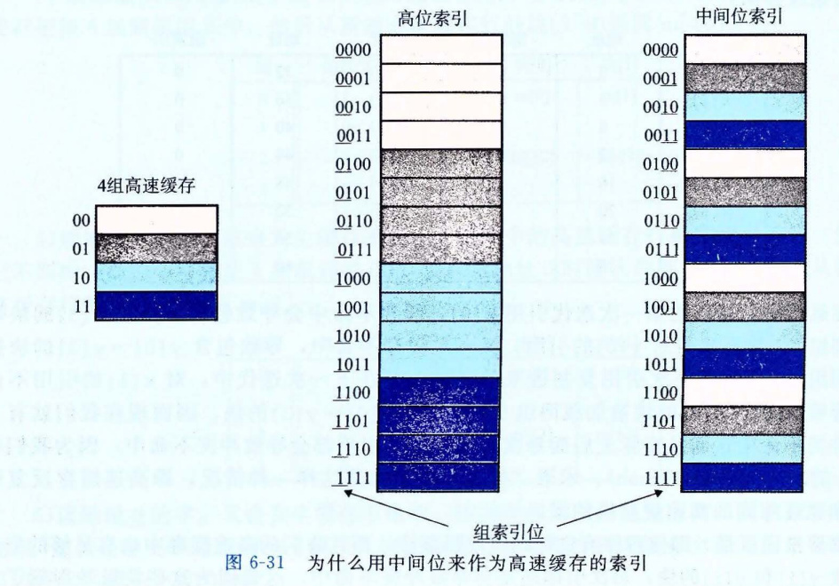
>
> **图 6-31** 为什么用中间位来作为高速缓存的索引
>
> 这样对高速缓存的使用效率很低。相比较而言，以中间位作为索引，相邻的块总是映射到不同的高速缓存行。在这里的情况中，高速缓存能够存放整个大小为 C 的数组片，这里 C 是高速缓存的大小。

> **练习题 6.11**
>
> 假想一个高速缓存，用地址的高 s 位做组索引，那么内存块连续的片（chunk）会被映射到同一个高速缓存组。
>
> A. 每个这样的连续的数组片中有多少个块？
>
> B. 考虑下面的代码，它运行在一个高速缓存形式为 (S, E, B, m)=(512, 1, 32, 32) 的系统上：
>
> ```c
> int array[4096];
>
> for (i = 0; i < 4096; i++)
>     sum += array[i];
> ```
>
> 在任意时刻，存储在高速缓存中的数组块的最大数量为多少？

#### 6.4.3 组相联高速缓存

直接映射高速缓存中冲突不命中造成的问题源于每个组只有一行（或者，按照我们的术语来描述就是 E=1）这个限制。组相联高速缓存（set associative cache）放松了这条限制，所以每个组都保存有多于一个的高速缓存行。一个 1<E<C/B 的高速缓存通常称为 E 路组相联高速缓存。在下一节中，我们会讨论 E=C/B 这种特殊情况。图 6-32 展示了一个 2 路组相联高速缓存的结构。

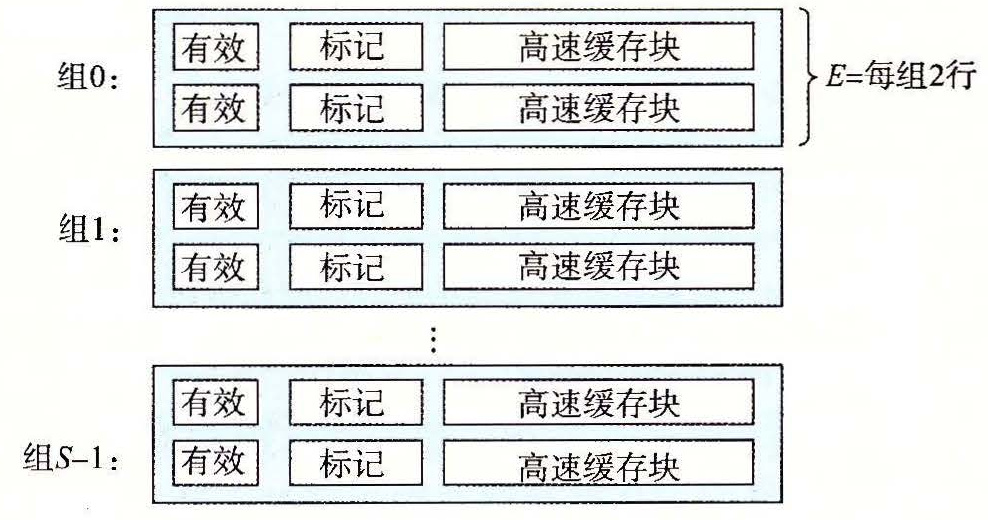

**图 6-32** 组相联高速缓存（1<E<C/B）。在一个组相联高速缓存中，每个组包含多于一个行。这里的特例是一个 2 路组相联高速缓存

##### 1. 组相联高速缓存中的组选择

它的组选择与直接映射高速缓存的组选择一样，组索引位标识组。图 6-33 总结了这个原理。

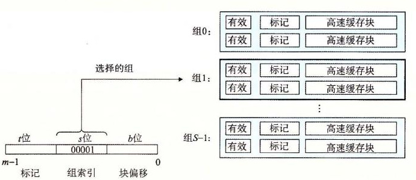

**图 6-33** 组相联高速缓存中的组选择

##### 2. 组相联高速缓存中的行匹配和字选择

组相联高速缓存中的行匹配比直接映射高速缓存中的更复杂，因为它必须检查多个行的标记位和有效位，以确定所请求的字是否在集合中。传统的内存是一个值的数组，以地址作为输入，并返回存储在那个地址的值。另一方面，相联存储器是一个 (key, value) 对的数组，以 key 为输入，返回与输入的 key 相匹配的 (key, value) 对中的 value 值。因此，我们可以把组相联高速缓存中的每个组都看成一个小的相联存储器，key 是标记和有效位，而 value 就是块的内容。

图 6-34 展示了相联高速缓存中行匹配的基本思想。这里的一个重要思想就是组中的任何一行都可以包含任何映射到这个组的内存块。所以高速缓存必须搜索组中的每一行，寻找一个有效的行，其标记与地址中的标记相匹配。如果高速缓存找到了这样一行，那么我们就命中，块偏移从这个块中选择一个字，和前面一样。

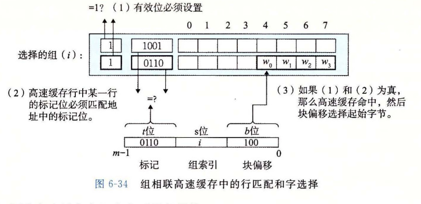

**图 6-34** 组相联高速缓存中的行匹配和字选择

##### 3. 组相联高速缓存中不命中时的行替换

如果 CPU 请求的字不在组的任何一行中，那么就是缓存不命中，高速缓存必须从内存中取出包含这个字的块。不过，一旦高速缓存取出了这个块，该替换哪个行呢？当然，如果有一个空行，那它就是个很好的候选。但是如果该组中没有空行，那么我们必须从中选择一个非空的行，希望 CPU 不会很快引用这个被替换的行。

程序员很难在代码中利用高速缓存替换策略，所以在此我们不会过多地讲述其细节。最简单的替换策略是随机选择要替换的行。其他更复杂的策略利用了局部性原理，以使在比较近的将来引用被替换的行的概率最小。例如，最不常使用（Least-Frequently-Used，LFU）策略会替换在过去某个时间窗口内引用次数最少的那一行。最近最少使用（Least-Recently-Used，LRU）策略会替换最后一次访问时间最久远的那一行。所有这些策略都需要额外的时间和硬件。但是，越往存储器层次结构下面走，远离 CPU，一次不命中的开销就会更加昂贵，用更好的替换策略使得不命中最少也变得更加值得了。

#### 6.4.4 全相联高速缓存

全相联高速缓存（fully associative cache）是由一个包含所有高速缓存行的组（即 E=C/B）组成的。图 6-35 给出了基本结构。


**图 6-35** 全相联高速缓存（E=C/B）。在全相联高速缓存中，一个组包含所有的行

##### 1. 全相联高速缓存中的组选择

全相联高速缓存中的组选择非常简单，因为只有一个组，图 6-36 做了个小结。注意地址中没有组索引位，地址只被划分成了一个标记和一个块偏移。


**图 6-36** 全相联高速缓存中的组选择。注意没有组索引位

##### 2. 全相联高速缓存中的行匹配和字选择

全相联高速缓存中的行匹配和字选择与组相联高速缓存中的是一样的，如图 6-37 所示。它们之间的区别主要是规模大小的问题。

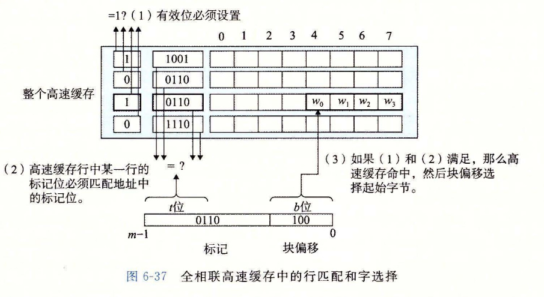

**图 6-37** 全相联高速缓存中的行匹配和字选择

因为高速缓存电路必须并行地搜索许多相匹配的标记，构造一个又大又快的相联高速缓存很困难，而且很昂贵。因此，全相联高速缓存只适合做小的高速缓存，例如虚拟内存系统中的翻译后备缓冲器（TLB），它缓存页表项（见 9.6.2 节）。

> **练习题 6.12**
>
> 下面的问题能帮助你加强理解高速缓存是如何工作的。有如下假设：
>
> - 内存是字节寻址的。
> - 内存访问的是 1 字节的字（不是 4 字节的字）。
> - 地址的宽度为 13 位。
> - 高速缓存是 2 路组相联的（E=2），块大小为 4 字节（B=4），有 8 个组（S=8）。
>
> 高速缓存的内容如下，所有的数字都是以十六进制来表示的：
>
> **2 路组相联高速缓存**
>
> | 组索引 | 行 0 标记位 | 有效位 | 字节 0 | 字节 1 | 字节 2 | 字节 3 | 行 1 标记位 | 有效位 | 字节 0 | 字节 1 | 字节 2 | 字节 3 |
> | ---: | ---: | ---: | ---: | ---: | ---: | ---: | ---: | ---: | ---: | ---: | ---: | ---: |
> | 0 | 09 | 1 | 86 | 30 | 3F | 10 | 00 | 0 | — | — | — | — |
> | 1 | 45 | 1 | 60 | 4F | E0 | 23 | 38 | 1 | 00 | BC | 0B | 37 |
> | 2 | EB | 0 | — | — | — | — | 0B | 0 | — | — | — | — |
> | 3 | 06 | 0 | — | — | — | — | 32 | 1 | 12 | 08 | 7B | AD |
> | 4 | C7 | 1 | 06 | 78 | 07 | C5 | 05 | 1 | 40 | 67 | C2 | 3B |
> | 5 | 71 | 1 | 0B | DE | 18 | 4B | 6E | 0 | — | — | — | — |
> | 6 | 91 | 1 | A0 | B7 | 26 | 2D | F0 | 0 | — | — | — | — |
> | 7 | 46 | 0 | — | — | — | — | DE | 1 | 12 | C0 | 88 | 37 |
>
> 下面的图表示的是地址格式（每个小方框一个位）。指出（在图中标出）用来确定下列内容的字段：
>
> - CO　高速缓存块偏移
> - CI　高速缓存组索引
> - CT　高速缓存标记
>
> | 位 | 12 | 11 | 10 | 9 | 8 | 7 | 6 | 5 | 4 | 3 | 2 | 1 | 0 |
> | --- | --- | --- | --- | --- | --- | --- | --- | --- | --- | --- | --- | --- | --- |
> | 字段 |  |  |  |  |  |  |  |  |  |  |  |  |  |

> **练习题 6.13**
>
> 假设一个程序运行在练习题 6.12 中的机器上，它引用地址 `0x0E34` 处的 1 个字节的字。指出访问的高速缓存条目和十六进制表示的返回的高速缓存字节值。指出是否会发生缓存不命中。如果会出现缓存不命中，用“—”来表示“返回的高速缓存字节”。
>
> A. 地址格式（每个小方框一个位）：
>
> | 位 | 12 | 11 | 10 | 9 | 8 | 7 | 6 | 5 | 4 | 3 | 2 | 1 | 0 |
> | --- | --- | --- | --- | --- | --- | --- | --- | --- | --- | --- | --- | --- | --- |
> | 地址 |  |  |  |  |  |  |  |  |  |  |  |  |  |
>
> B. 内存引用：
>
> | 参数 | 值 |
> | --- | --- |
> | 高速缓存块偏移（CO） | 0x______ |
> | 高速缓存组索引（CI） | 0x______ |
> | 高速缓存标记（CT） | 0x______ |
> | 高速缓存命中？（是/否） |  |
> | 返回的高速缓存字节 | 0x______ |

> **练习题 6.14**
>
> 对于存储器地址 `0x0DD5`，再做一遍练习题 6.13。
>
> A. 地址格式（每个小方框一个位）：
>
> | 位 | 12 | 11 | 10 | 9 | 8 | 7 | 6 | 5 | 4 | 3 | 2 | 1 | 0 |
> | --- | --- | --- | --- | --- | --- | --- | --- | --- | --- | --- | --- | --- | --- |
> | 地址 |  |  |  |  |  |  |  |  |  |  |  |  |  |
>
> B. 内存引用：
>
> | 参数 | 值 |
> | --- | --- |
> | 高速缓存块偏移（CO） | 0x______ |
> | 高速缓存组索引（CI） | 0x______ |
> | 高速缓存标记（CT） | 0x______ |
> | 高速缓存命中？（是/否） |  |
> | 返回的高速缓存字节 | 0x______ |

> **练习题 6.15**
>
> 对于内存地址 `0x1FE4`，再做一遍练习题 6.13。
>
> A. 地址格式（每个小方框一个位）：
>
> | 位 | 12 | 11 | 10 | 9 | 8 | 7 | 6 | 5 | 4 | 3 | 2 | 1 | 0 |
> | --- | --- | --- | --- | --- | --- | --- | --- | --- | --- | --- | --- | --- | --- |
> | 地址 |  |  |  |  |  |  |  |  |  |  |  |  |  |
>
> B. 内存引用：
>
> | 参数 | 值 |
> | --- | --- |
> | 高速缓存块偏移（CO） | 0x______ |
> | 高速缓存组索引（CI） | 0x______ |
> | 高速缓存标记（CT） | 0x______ |
> | 高速缓存命中？（是/否） |  |
> | 返回的高速缓存字节 | 0x______ |

> **练习题 6.16**
>
> 对于练习题 6.12 中的高速缓存，列出所有的在组 3 中会命中的十六进制内存地址。

#### 6.4.5 有关写的问题

正如我们看到的，高速缓存关于读的操作非常简单。首先，在高速缓存中查找所需字 w 的副本。如果命中，立即返回字 w 给 CPU。如果不命中，从存储器层次结构中较低层中取出包含字 w 的块，将这个块存储到某个高速缓存行中（可能会驱逐一个有效的行），然后返回字 w。

写的情况就要复杂一些了。假设我们要写一个已经缓存了的字 w（写命中，write hit）。在高速缓存更新了它的 w 的副本之后，怎么更新 w 在层次结构中紧接着低一层中的副本呢？最简单的方法，称为直写（write-through），就是立即将 w 的高速缓存块写回到紧接着的低一层中。虽然简单，但是直写的缺点是每次写都会引起总线流量。另一种方法，称为写回（write-back），尽可能地推迟更新，只有当替换算法要驱逐这个更新过的块时，才把它写到紧接着的低一层中。由于局部性，写回能显著地减少总线流量，但是它的缺点是增加了复杂性。高速缓存必须为每个高速缓存行维护一个额外的修改位（dirty bit），表明这个高速缓存块是否被修改过。

另一个问题是如何处理写不命中。一种方法，称为写分配（write-allocate），加载相应的低一层中的块到高速缓存中，然后更新这个高速缓存块。写分配试图利用写的空间局部性，但是缺点是每次不命中都会导致一个块从低一层传送到高速缓存。另一种方法，称为非写分配（not-write-allocate），避开高速缓存，直接把这个字写到低一层中。直写高速缓存通常是非写分配的。写回高速缓存通常是写分配的。

为写操作优化高速缓存是一个细致而困难的问题，在此我们只略讲皮毛。细节随系统的不同而不同，而且通常是私有的，文档记录不详细。对于试图编写高速缓存比较友好的程序的程序员来说，我们建议在心里采用一个使用写回和写分配的高速缓存的模型。这样建议有几个原因。通常，由于较长的传送时间，存储器层次结构中较低层的缓存更可能使用写回，而不是直写。例如，虚拟内存系统（用主存作为存储在磁盘上的块的缓存）只使用写回。但是由于逻辑电路密度的提高，写回的高复杂性也越来越不成为阻碍了，我们在现代系统的所有层次上都能看到写回缓存。所以这种假设符合当前的趋势。假设使用写回写分配方法的另一个原因是，它与处理读的方式相对称，因为写回写分配试图利用局部性。因此，我们可以在高层次上开发我们的程序，展示良好的空间和时间局部性，而不是试图为某一个存储器系统进行优化。

#### 6.4.6 一个真实的高速缓存层次结构的解剖

到目前为止，我们一直假设高速缓存只保存程序数据。不过，实际上，高速缓存既保存数据，也保存指令。只保存指令的高速缓存称为 i-cache。只保存程序数据的高速缓存称为 d-cache。既保存指令又包括数据的高速缓存称为统一的高速缓存（unified cache）。现代处理器包括独立的 i-cache 和 d-cache。这样做有很多原因。有两个独立的高速缓存，处理器能够同时读一个指令字和一个数据字。i-cache 通常是只读的，因此比较简单。通常会针对不同的访问模式来优化这两个高速缓存，它们可以有不同的块大小、相联度和容量。使用不同的高速缓存也确保了数据访问不会与指令访问形成冲突不命中，反过来也是一样，代价就是可能会引起容量不命中增加。

图 6-38 给出了 Intel Core i7 处理器的高速缓存层次结构。每个 CPU 芯片有四个核。每个核有自己私有的 L1 i-cache、L1 d-cache 和 L2 统一的高速缓存。所有的核共享片上 L3 统一的高速缓存。这个层次结构的一个有趣的特性是所有的 SRAM 高速缓存存储器都在 CPU 芯片上。


**图 6-38** Intel Core i7 的高速缓存层次结构

图 6-39 总结了 Core i7 高速缓存的基本特性。

| 高速缓存类型 | 访问时间（周期） | 高速缓存大小（C） | 相联度（E） | 块大小（B） | 组数（S） |
| --- | ---: | ---: | ---: | ---: | ---: |
| L1 i-cache | 4 | 32KB | 8 | 64B | 64 |
| L1 d-cache | 4 | 32KB | 8 | 64B | 64 |
| L2 统一的高速缓存 | 10 | 256KB | 8 | 64B | 512 |
| L3 统一的高速缓存 | 40～75 | 8MB | 16 | 64B | 8192 |

**图 6-39** Core i7 高速缓存层次结构的特性

#### 6.4.7 高速缓存参数的性能影响

有许多指标来衡量高速缓存的性能：

- **不命中率（miss rate）。** 在一个程序执行或程序的一部分执行期间，内存引用不命中的比率。它是这样计算的：不命中数量/引用数量。
- **命中率（hit rate）。** 命中的内存引用比率。它等于 1-不命中率。
- **命中时间（hit time）。** 从高速缓存传送一个字到 CPU 所需的时间，包括组选择、行确认和字选择的时间。对于 L1 高速缓存来说，命中时间的数量级是几个时钟周期。
- **不命中处罚（miss penalty）。** 由于不命中所需要的额外的时间。L1 不命中需要从 L2 得到服务的处罚，通常是数 10 个周期；从 L3 得到服务的处罚，50 个周期；从主存得到服务的处罚，200 个周期。

优化高速缓存的成本和性能的折中是一项很精细的工作，它需要在现实的基准程序代码上进行大量的模拟，因此超出了我们讨论的范围。不过，还是可以认识一些定性的折中考量的。

##### 1. 高速缓存大小的影响

一方面，较大的高速缓存可能会提高命中率。另一方面，使大存储器运行得更快总是要难一些的。结果，较大的高速缓存可能会增加命中时间。这解释了为什么 L1 高速缓存比 L2 高速缓存小，以及为什么 L2 高速缓存比 L3 高速缓存小。

##### 2. 块大小的影响

大的块有利有弊。一方面，较大的块能利用程序中可能存在的空间局部性，帮助提高命中率。不过，对于给定的高速缓存大小，块越大就意味着高速缓存行数越少，这会损害时间局部性比空间局部性更好的程序中的命中率。较大的块对不命中处罚也有负面影响，因为块越大，传送时间就越长。现代系统（如 Core i7）会折中使高速缓存块包含 64 个字节。

##### 3. 相联度的影响

这里的问题是参数 E 选择的影响，E 是每个组中高速缓存行数。较高的相联度（也就是 E 的值较大）的优点是降低了高速缓存由于冲突不命中出现抖动的可能性。不过，较高的相联度会造成较高的成本。较高的相联度实现起来很昂贵，而且很难使之速度变快。每一行需要更多的标记位，每一行需要额外的 LRU 状态位和额外的控制逻辑。较高的相联度会增加命中时间，因为复杂性增加了，另外，还会增加不命中处罚，因为选择牺牲行的复杂性也增加了。

相联度的选择最终变成了命中时间和不命中处罚之间的折中。传统上，努力争取时钟频率的高性能系统会为 L1 高速缓存选择较低的相联度（这里的不命中处罚只是几个周期），而在不命中处罚比较高的较低层上使用比较小的相联度。例如，Intel Core i7 系统中，L1 和 L2 高速缓存是 8 路组相联的，而 L3 高速缓存是 16 路组相联的。

##### 4. 写策略的影响

直写高速缓存比较容易实现，而且能使用独立于高速缓存的写缓冲区（write buffer），用来更新内存。此外，读不命中开销没这么大，因为它们不会触发内存写。另一方面，写回高速缓存引起的传送比较少，它允许更多的到内存的带宽用于执行 DMA 的 I/O 设备。此外，越往层次结构下面走，传送时间增加，减少传送的数量就变得更加重要。一般而言，高速缓存越往下层，越可能使用写回而不是直写。

> **旁注 高速缓存行、组和块有什么区别？**
>
> 很容易混淆高速缓存行、组和块之间的区别。让我们来回顾一下这些概念，确保概念清晰：
>
> - 块是一个固定大小的信息包，在高速缓存和主存（或下一层高速缓存）之间来回传送。
> - 行是高速缓存中的一个容器，存储块以及其他信息（例如有效位和标记位）。
> - 组是一个或多个行的集合。直接映射高速缓存中的组只由一行组成。组相联和全相联高速缓存中的组是由多个行组成的。
>
> 在直接映射高速缓存中，组和行实际上是等价的。不过，在相联高速缓存中，组和行是很不一样的，这两个词不能互换使用。
>
> 因为一行总是存储一个块，术语“行”和“块”通常互换使用。例如，系统专家总是说高速缓存的“行大小”，实际上他们指的是块大小。这样的用法十分普遍，只要你理解块和行之间的区别，它不会造成任何误会。

### 6.5 编写高速缓存友好的代码

在 6.2 节中，我们介绍了局部性的思想，而且定性地谈了一下什么会具有良好的局部性。明白了高速缓存存储器是如何工作的，我们就能更加准确一些了。局部性比较好的程序更容易有较低的不命中率，而不命中率较低的程序往往比不命中率较高的程序运行得更快。因此，从具有良好局部性的意义上来说，好的程序员总是应该试着去编写高速缓存友好（cache friendly）的代码。下面就是我们用来确保代码高速缓存友好的基本方法。

1. 让最常见的情况运行得快。程序通常把大部分时间都花在少量的核心函数上，而这些函数通常把大部分时间都花在了少量循环上。所以要把注意力集中在核心函数里的循环上，而忽略其他部分。
2. 尽量减小每个循环内部的缓存不命中数量。在其他条件（例如加载和存储的总次数）相同的情况下，不命中率较低的循环运行得更快。

为了看看实际上这是怎么工作的，考虑 6.2 节中的函数 `sumvec`：

```c
int sumvec(int v[N])
{
    int i, sum = 0;

    for (i = 0; i < N; i++)
        sum += v[i];
    return sum;
}
```

这个函数高速缓存友好吗？首先，注意对于局部变量 `i` 和 `sum`，循环体有良好的时间局部性。实际上，因为它们都是局部变量，任何合理的优化编译器都会把它们缓存在寄存器文件中，也就是存储器层次结构的最高层中。现在考虑一下对向量 `v` 的步长为 1 的引用。一般而言，如果一个高速缓存的块大小为 *B* 字节，那么一个步长为 *k* 的引用模式（这里 *k* 是以字为单位的）平均每次循环迭代会有

```text
min(1, (wordsize × k) / B)
```

次缓存不命中。当 *k* = 1 时，它取最小值，所以对 `v` 的步长为 1 的引用确实是高速缓存友好的。例如，假设 `v` 是块对齐的，字为 4 个字节，高速缓存块为 4 个字，而高速缓存初始为空（冷高速缓存）。然后，无论是什么样的高速缓存结构，对 `v` 的引用都会得到下面的命中和不命中模式：

| `v[i]` | `i = 0` | `i = 1` | `i = 2` | `i = 3` | `i = 4` | `i = 5` | `i = 6` | `i = 7` |
|---|---:|---:|---:|---:|---:|---:|---:|---:|
| 访问顺序，命中 `[h]` 或不命中 `[m]` | 1 `[m]` | 2 `[h]` | 3 `[h]` | 4 `[h]` | 5 `[m]` | 6 `[h]` | 7 `[h]` | 8 `[h]` |

在这个例子中，对 `v[0]` 的引用会不命中，而相应的包含 `v[0]`～`v[3]` 的块会被从内存加载到高速缓存中。因此，接下来三个引用都会命中。对 `v[4]` 的引用会导致不命中，而一个新的块被加载到高速缓存中，接下来的三个引用都命中，依此类推。总的来说，四个引用中，三个会命中，在这种冷缓存的情况下，这是我们所能做到的最好的情况了。

总之，简单的 `sumvec` 示例说明了两个关于编写高速缓存友好的代码的重要问题：

- 对局部变量的反复引用是好的，因为编译器能够将它们缓存在寄存器文件中（时间局部性）。
- 步长为 1 的引用模式是好的，因为存储器层次结构中所有层次上的缓存都是将数据存储为连续的块（空间局部性）。

在对多维数组进行操作的程序中，空间局部性尤其重要。例如，考虑 6.2 节中的 `sumarrayrows` 函数，它按照行优先顺序对一个二维数组的元素求和：

```c
int sumarrayrows(int a[M][N])
{
    int i, j, sum = 0;

    for (i = 0; i < M; i++)
        for (j = 0; j < N; j++)
            sum += a[i][j];
    return sum;
}
```

由于 C 语言以行优先顺序存储数组，所以这个函数中的内循环有与 `sumvec` 一样好的步长为 1 的访问模式。例如，假设我们对这个高速缓存做与对 `sumvec` 一样的假设。那么对数组 `a` 的引用会得到下面的命中和不命中模式：

| `a[i][j]` | `j = 0` | `j = 1` | `j = 2` | `j = 3` | `j = 4` | `j = 5` | `j = 6` | `j = 7` |
|---|---:|---:|---:|---:|---:|---:|---:|---:|
| `i = 0` | 1 `[m]` | 2 `[h]` | 3 `[h]` | 4 `[h]` | 5 `[m]` | 6 `[h]` | 7 `[h]` | 8 `[h]` |
| `i = 1` | 9 `[m]` | 10 `[h]` | 11 `[h]` | 12 `[h]` | 13 `[m]` | 14 `[h]` | 15 `[h]` | 16 `[h]` |
| `i = 2` | 17 `[m]` | 18 `[h]` | 19 `[h]` | 20 `[h]` | 21 `[m]` | 22 `[h]` | 23 `[h]` | 24 `[h]` |
| `i = 3` | 25 `[m]` | 26 `[h]` | 27 `[h]` | 28 `[h]` | 29 `[m]` | 30 `[h]` | 31 `[h]` | 32 `[h]` |

但是如果我们做一个看似无伤大雅的改变——交换循环的次序，看看会发生什么：

```c
int sumarraycols(int a[M][N])
{
    int i, j, sum = 0;

    for (j = 0; j < N; j++)
        for (i = 0; i < M; i++)
            sum += a[i][j];
    return sum;
}
```

在这种情况中，我们是一列一列而不是一行一行地扫描数组的。如果我们够幸运，整个数组都在高速缓存中，那么我们也会有相同的不命中率 1/4。不过，如果数组比高速缓存要大（更可能出现这种情况），那么每次对 `a[i][j]` 的访问都会不命中！

| `a[i][j]` | `j = 0` | `j = 1` | `j = 2` | `j = 3` | `j = 4` | `j = 5` | `j = 6` | `j = 7` |
|---|---:|---:|---:|---:|---:|---:|---:|---:|
| `i = 0` | 1 `[m]` | 5 `[m]` | 9 `[m]` | 13 `[m]` | 17 `[m]` | 21 `[m]` | 25 `[m]` | 29 `[m]` |
| `i = 1` | 2 `[m]` | 6 `[m]` | 10 `[m]` | 14 `[m]` | 18 `[m]` | 22 `[m]` | 26 `[m]` | 30 `[m]` |
| `i = 2` | 3 `[m]` | 7 `[m]` | 11 `[m]` | 15 `[m]` | 19 `[m]` | 23 `[m]` | 27 `[m]` | 31 `[m]` |
| `i = 3` | 4 `[m]` | 8 `[m]` | 12 `[m]` | 16 `[m]` | 20 `[m]` | 24 `[m]` | 28 `[m]` | 32 `[m]` |

较高的不命中率对运行时间可以有显著的影响。例如，在桌面机器上，`sumarrayrows` 运行速度比 `sumarraycols` 快 25 倍。总之，程序员应该注意他们程序中的局部性，试着编写利用局部性的程序。

**练习题 6.17**　在信号处理和科学计算的应用中，转置矩阵的行和列是一个很重要的问题。从局部性的角度来看，它也很有趣，因为它的引用模式既是以行为主（row-wise）的，也是以列为主（column-wise）的。例如，考虑下面的转置函数：

```c
typedef int array[2][2];

void transpose1(array dst, array src)
{
    int i, j;

    for (i = 0; i < 2; i++) {
        for (j = 0; j < 2; j++) {
            dst[j][i] = src[i][j];
        }
    }
}
```

假设在一台具有如下属性的机器上运行这段代码：

- `sizeof(int) == 4`。
- `src` 数组从地址 0 开始，`dst` 数组从地址 16（十进制）开始。
- 只有一个 L1 数据高速缓存，它是直接映射的、直写和写分配的，块大小为 8 个字节。
- 这个高速缓存总的大小为 16 个数据字节，一开始是空的。
- 对 `src` 和 `dst` 数组的访问分别是读和写不命中的唯一来源。

A. 对每个 `row` 和 `col`，指明对 `src[row][col]` 和 `dst[row][col]` 的访问是命中（`h`）还是不命中（`m`）。例如，读 `src[0][0]` 会不命中，写 `dst[0][0]` 也不命中。

**dst 数组**

|  | 列 0 | 列 1 |
|---|:---:|:---:|
| 0 行 | `m` |  |
| 1 行 |  |  |

**src 数组**

|  | 列 0 | 列 1 |
|---|:---:|:---:|
| 0 行 | `m` |  |
| 1 行 |  |  |

B. 对于一个大小为 32 数据字节的高速缓存重复这个练习。

**练习题 6.18**　最近一个很成功的游戏 SimAquarium 的核心就是一个紧密循环（tight loop），它计算 256 个海藻（algae）的平均位置。在一台具有块大小为 16 字节（*B* = 16）、整个大小为 1024 字节的直接映射数据缓存的机器上测量它的高速缓存性能。定义如下：

```c
struct algae_position {
    int x;
    int y;
};

struct algae_position grid[16][16];
int total_x = 0, total_y = 0;
int i, j;
```

还有如下假设：

- `sizeof(int) == 4`。
- `grid` 从内存地址 0 开始。
- 这个高速缓存开始时是空的。
- 唯一的内存访问是对数组 `grid` 的元素的访问。变量 `i`、`j`、`total_x` 和 `total_y` 存放在寄存器中。

确定下面代码的高速缓存性能：

```c
for (i = 0; i < 16; i++) {
    for (j = 0; j < 16; j++) {
        total_x += grid[i][j].x;
    }
}

for (i = 0; i < 16; i++) {
    for (j = 0; j < 16; j++) {
        total_y += grid[i][j].y;
    }
}
```

A. 读总数是多少？

B. 缓存不命中的读总数是多少？

C. 不命中率是多少？

**练习题 6.19**　给定练习题 6.18 的假设，确定下列代码的高速缓存性能：

```c
for (i = 0; i < 16; i++) {
    for (j = 0; j < 16; j++) {
        total_x += grid[j][i].x;
        total_y += grid[j][i].y;
    }
}
```

A. 读总数是多少？

B. 高速缓存不命中的读总数是多少？

C. 不命中率是多少？

D. 如果高速缓存有两倍大，那么不命中率会是多少呢？

**练习题 6.20**　给定练习题 6.18 的假设，确定下列代码的高速缓存性能：

```c
for (i = 0; i < 16; i++) {
    for (j = 0; j < 16; j++) {
        total_x += grid[i][j].x;
        total_y += grid[i][j].y;
    }
}
```

A. 读总数是多少？

B. 高速缓存不命中的读总数是多少？

C. 不命中率是多少？

D. 如果高速缓存有两倍大，那么不命中率会是多少呢？

### 6.6 综合：高速缓存对程序性能的影响

本节通过研究高速缓存对运行在实际机器上的程序的性能影响，综合了我们对存储器层次结构的讨论。

#### 6.6.1 存储器山

一个程序从存储系统中读数据的速率称为读吞吐量（read throughput），或者有时称为读带宽（read bandwidth）。如果一个程序在 *s* 秒的时间段内读 *n* 个字节，那么这段时间内的读吞吐量就等于 *n* / *s*，通常以兆字节每秒（MB/s）为单位。

如果我们要编写一个程序，它从一个紧密程序循环（tight program loop）中发出一系列读请求，那么测量出的读吞吐量能让我们看到对于这个读序列来说的存储系统的性能。图 6-40 给出了一对测量某个读序列读吞吐量的函数。

```c
long data[MAXELEMS];  /* The global array we'll be traversing */

/*
 * test - Iterate over first "elems" elements of array "data" with
 *        stride of "stride", using 4 x 4 loop unrolling.
 */
int test(int elems, int stride)
{
    long i, sx2 = stride*2, sx3 = stride*3, sx4 = stride*4;
    long acc0 = 0, acc1 = 0, acc2 = 0, acc3 = 0;
    long length = elems;
    long limit = length - sx4;

    /* Combine 4 elements at a time */
    for (i = 0; i < limit; i += sx4) {
        acc0 = acc0 + data[i];
        acc1 = acc1 + data[i+stride];
        acc2 = acc2 + data[i+sx2];
        acc3 = acc3 + data[i+sx3];
    }

    /* Finish any remaining elements */
    for (; i < length; i += stride) {
        acc0 = acc0 + data[i];
    }
    return ((acc0 + acc1) + (acc2 + acc3));
}

/*
 * run - Run test(elems, stride) and return read throughput (MB/s).
 *       "size" is in bytes, "stride" is in array elements, and Mhz is
 *       CPU clock frequency in Mhz.
 */
double run(int size, int stride, double Mhz)
{
    double cycles;
    int elems = size / sizeof(double);

    test(elems, stride);                      /* Warm up the cache */
    cycles = fcyc2(test, elems, stride, 0);   /* Call test(elems,stride) */
    return (size / stride) / (cycles / Mhz);  /* Convert cycles to MB/s */
}
```

**图 6-40** 测量和计算读吞吐量的函数。我们可以通过以不同的 `size`（对应于时间局部性）和 `stride`（对应于空间局部性）的值来调用 `run` 函数，产生某台计算机的存储器山。

`test` 函数通过以步长 `stride` 扫描一个数组的头 `elems` 个元素来产生读序列。为了提高内循环中可用的并行性，使用了 4 × 4 展开（见 5.9 节）。`run` 函数是一个包装函数，调用 `test` 函数，并返回测量出的读吞吐量。第 37 行对 `test` 函数的调用会对高速缓存做暖身。第 38 行的 `fcyc2` 函数以参数 `elems` 调用 `test` 函数，并估计 `test` 函数的运行时间，以 CPU 周期为单位。注意，`run` 函数的参数 `size` 是以字节为单位的，而 `test` 函数对应的参数 `elems` 是以数组元素为单位的。另外，注意第 39 行将 MB/s 计算为 10<sup>6</sup> 字节/秒，而不是 2<sup>20</sup> 字节/秒。

`run` 函数的参数 `size` 和 `stride` 允许我们控制产生出的读序列的时间和空间局部性程度。`size` 的值越小，得到的工作集越小，因此时间局部性越好。`stride` 的值越小，得到的空间局部性越好。如果我们反复以不同的 `size` 和 `stride` 值调用 `run` 函数，那么我们就能得到一个读带宽的时间和空间局部性的二维函数，称为存储器山（memory mountain）[112]。

每个计算机都有表明它存储器系统的能力特色的唯一的存储器山。例如，图 6-41 展示了 Intel Core i7 系统的存储器山。在这个例子中，`size` 从 16KB 变到 128MB，`stride` 从 1 变到 12 个元素，每个元素是一个 8 个字节的 `long int`。

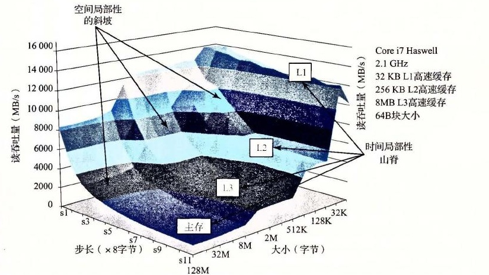

**图 6-41** 存储器山。展示了读吞吐量，它是时间和空间局部性的函数。

这座 Core i7 山的地形地势展现了一个很丰富的结构。垂直于大小轴的是四条山脊，分别对应于工作集完全在 L1 高速缓存、L2 高速缓存、L3 高速缓存和主存内的时间局部性区域。注意，L1 山脊的最高点（那里 CPU 读速率为 14GB/s）与主存山脊的最低点（那里 CPU 读速率为 900MB/s）之间的差别有一个数量级。

在 L2、L3 和主存山脊上，随着步长的增加，有一个空间局部性的斜坡，空间局部性下降。注意，即使当工作集太大，不能全都装进任何一个高速缓存时，主存山脊的最高点也比它的最低点高 8 倍。因此，即使是当程序的时间局部性很差时，空间局部性仍然能补救，并且是非常重要的。

有一条特别有趣的平坦的山脊线，对于步长 1 垂直于步长轴，此时读吞吐量相对保持不变，为 12GB/s，即使工作集超出了 L1 和 L2 的大小。这显然是由于 Core i7 存储器系统中的硬件预取（prefetching）机制，它会自动地识别顺序的、步长为 1 的引用模式，试图在一些块被访问之前，将它们取到高速缓存中。虽然文档里没有记录这种预取算法的细节，但是从存储器山可以明显地看到这个算法对小步长效果最好——这也是代码中要使用步长为 1 的顺序访问的另一个理由。

如果我们从这座山中取出一个片段，保持步长为常数，如图 6-42 所示，我们就能很清楚地看到高速缓存的大小和时间局部性对性能的影响了。大小最大为 32KB 的工作集完全能放进 L1 d-cache 中，因此，读都是由 L1 来服务的，吞吐量保持在峰值 12GB/s 处。大小最大为 256KB 的工作集完全能放进统一的 L2 高速缓存中，对于大小最大为 8MB，工作集完全能放进统一的 L3 高速缓存中。更大的工作集大小主要由主存来服务。


**图 6-42** 存储器山中时间局部性的山脊。这幅图展示了图 6-41 中 `stride = 8` 时的一个片段。

L2 和 L3 高速缓存区域最左边的边缘上读吞吐量的下降很有趣，此时工作集大小为 256KB 和 8MB，等于对应的高速缓存的大小。为什么会出现这样的下降，还不是完全清楚。要确认的唯一方法就是执行一个详细的高速缓存模拟，但是这些下降很有可能是与其他数据和代码行的冲突造成的。

以相反的方向横切这座山，保持工作集大小不变，我们从中能看到空间局部性对读吞吐量的影响。例如，图 6-43 展示了工作集大小固定为 4MB 时的片段。这个片段是沿着图 6-41 中的 L3 山脊切的，这里，工作集完全能够放到 L3 高速缓存中，但是对 L2 高速缓存来说太大了。

注意随着步长从 1 个字增长到 8 个字，读吞吐量是如何平稳地下降的。在山的这个区域中，L2 中的读不命中会导致一个块从 L3 传送到 L2。后面在 L2 中这个块上会有一定数量的命中，这是取决于步长的。随着步长的增加，L2 不命中与 L2 命中的比值也增加了。因为服务不命中要比命中更慢，所以读吞吐量也下降了。一旦步长达到了 8 个字，在这个系统上就等于块的大小 64 个字节了，每个读请求在 L2 中都会不命中，必须从 L3 服务。因此，对于至少为 8 个字的步长来说，读吞吐量是一个常数速率，是由从 L3 传送高速缓存块到 L2 的速率决定的。

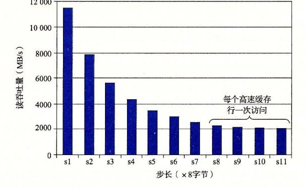

**图 6-43** 一个空间局部性的斜坡。这幅图展示了图 6-41 中大小 = 4MB 时的一个片段。

总结一下我们对存储器山的讨论，存储器系统的性能不是一个数字就能描述的。相反，它是一座时间和空间局部性的山，这座山的上升高度差别可以超过一个数量级。明智的程序员会试图构造他们的程序，使得程序运行在山峰而不是低谷。目标就是利用时间局部性，使得频繁使用的字从 L1 中取出，还要利用空间局部性，使得尽可能多的字从一个 L1 高速缓存行中访问到。

**练习题 6.21**　利用图 6-41 中的存储器山来估计从 L1 d-cache 中读一个 8 字节的字所需要的时间（以 CPU 周期为单位）。

#### 6.6.2 重新排列循环以提高空间局部性

考虑一对 *n* × *n* 矩阵相乘的问题：*C* = *AB*。例如，如果 *n* = 2，那么

```text
[ c₁₁  c₁₂ ]   [ a₁₁  a₁₂ ][ b₁₁  b₁₂ ]
[ c₂₁  c₂₂ ] = [ a₂₁  a₂₂ ][ b₂₁  b₂₂ ]
```

其中

```text
c₁₁ = a₁₁b₁₁ + a₁₂b₂₁
c₁₂ = a₁₁b₁₂ + a₁₂b₂₂
c₂₁ = a₂₁b₁₁ + a₂₂b₂₁
c₂₂ = a₂₁b₁₂ + a₂₂b₂₂
```

矩阵乘法函数通常是用 3 个嵌套的循环来实现的，分别用索引 `i`、`j` 和 `k` 来标识。如果改变循环的次序，对代码进行一些其他的小改动，我们就能得到矩阵乘法的 6 个在功能上等价的版本，如图 6-44 所示。每个版本都以它循环的顺序来唯一地标识。

在高层次来看，这 6 个版本是非常相似的。如果加法是可结合的，那么每个版本计算出的结果完全一样。每个版本总共都执行 O(*n*<sup>3</sup>) 个操作，而加法和乘法的数量相同。*A* 和 *B* 的 *n*<sup>2</sup> 个元素中的每一个都要读 *n* 次；计算 *C* 的 *n*<sup>2</sup> 个元素中的每一个都要对 *n* 个值求和。不过，如果分析最里层循环迭代的行为，我们发现在访问数量和局部性上还是有区别的。

> ① 正如我们在第 2 章中学到的，浮点加法是可交换的，但是通常是不可结合的。实际上，如果矩阵不把极大的数和极小的数混在一起——存储物理属性的矩阵常常这样，那么假设浮点加法是可结合的也是合理的。

为了分析，我们做了如下假设：

- 每个数组都是一个 `double` 类型的 *n* × *n* 的数组，`sizeof(double) == 8`。
- 只有一个高速缓存，其块大小为 32 字节（*B* = 32）。
- 数组大小 *n* 很大，以至于矩阵的一行都不能完全装进 L1 高速缓存中。
- 编译器将局部变量存储到寄存器中，因此循环内对局部变量的引用不需要任何加载或存储指令。

**a) `ijk` 版本**

```c
for (i = 0; i < n; i++)
    for (j = 0; j < n; j++) {
        sum = 0.0;
        for (k = 0; k < n; k++)
            sum += A[i][k] * B[k][j];
        C[i][j] += sum;
    }
```

**b) `jik` 版本**

```c
for (j = 0; j < n; j++)
    for (i = 0; i < n; i++) {
        sum = 0.0;
        for (k = 0; k < n; k++)
            sum += A[i][k] * B[k][j];
        C[i][j] += sum;
    }
```

**c) `jki` 版本**

```c
for (j = 0; j < n; j++)
    for (k = 0; k < n; k++) {
        r = B[k][j];
        for (i = 0; i < n; i++)
            C[i][j] += A[i][k] * r;
    }
```

**d) `kji` 版本**

```c
for (k = 0; k < n; k++)
    for (j = 0; j < n; j++) {
        r = B[k][j];
        for (i = 0; i < n; i++)
            C[i][j] += A[i][k] * r;
    }
```

**e) `kij` 版本**

```c
for (k = 0; k < n; k++)
    for (i = 0; i < n; i++) {
        r = A[i][k];
        for (j = 0; j < n; j++)
            C[i][j] += r * B[k][j];
    }
```

**f) `ikj` 版本**

```c
for (i = 0; i < n; i++)
    for (k = 0; k < n; k++) {
        r = A[i][k];
        for (j = 0; j < n; j++)
            C[i][j] += B[k][j] * r;
    }
```

**图 6-44** 矩阵乘法的六个版本。每个版本都以它循环的顺序来唯一地标识。

图 6-45 总结了我们对内循环的分析结果。注意 6 个版本成对地形成了 3 个等价类，用内循环中访问的矩阵对来表示每个类。例如，版本 `ijk` 和 `jik` 是类 AB 的成员，因为它们在最内层的循环中引用的是矩阵 *A* 和 *B*（而不是 *C*）。对于每个类，我们统计了每个内循环迭代中加载（读）和存储（写）的数量，每次循环迭代中对 *A*、*B* 和 *C* 的引用在高速缓存中不命中的数量，以及每次迭代缓存不命中的总数。

| 矩阵乘法版本（类） | 加载次数 | 存储次数 | *A* 不命中次数 | *B* 不命中次数 | *C* 不命中次数 | 不命中总次数 |
|---|---:|---:|---:|---:|---:|---:|
| `ijk` 和 `jik`（AB） | 2 | 0 | 0.25 | 1.00 | 0.00 | 1.25 |
| `jki` 和 `kji`（AC） | 2 | 1 | 1.00 | 0.00 | 1.00 | 2.00 |
| `kij` 和 `ikj`（BC） | 2 | 1 | 0.00 | 0.25 | 0.25 | 0.50 |

**图 6-45** 矩阵乘法内循环的分析。6 个版本分为 3 个等价类，用内循环中访问的数组对来表示。

类 AB 例程的内循环（图 6-44a 和图 6-44b）以步长 1 扫描数组 *A* 的一行。因为每个高速缓存块保存四个 8 字节的字，*A* 的不命中率是每次迭代不命中 0.25 次。另一方面，内循环以步长 *n* 扫描数组 *B* 的一列。因为 *n* 很大，每次对数组 *B* 的访问都会不命中，所以每次迭代总共会有 1.25 次不命中。

类 AC 例程的内循环（图 6-44c 和图 6-44d）有一些问题。每次迭代执行两个加载和一个存储（相对于类 AB 例程，它们执行 2 个加载而没有存储）。内循环以步长 *n* 扫描 *A* 和 *C* 的列。结果是每次加载都会不命中，所以每次迭代总共有两个不命中。注意，与类 AB 例程相比，交换循环降低了空间局部性。

BC 例程（图 6-44e 和图 6-44f）展示了一个很有趣的折中：使用了两个加载和一个存储，它们比 AB 例程多需要一个内存操作。另一方面，因为内循环以步长为 1 的访问模式按行扫描 *B* 和 *C*，每次迭代每个数组上的不命中率只有 0.25 次不命中，所以每次迭代总共有 0.50 个不命中。

图 6-46 小结了一个 Core i7 系统上矩阵乘法各个版本的性能。这个图画出了测量出的每次内循环迭代所需的 CPU 周期数作为数组大小（*n*）的函数。

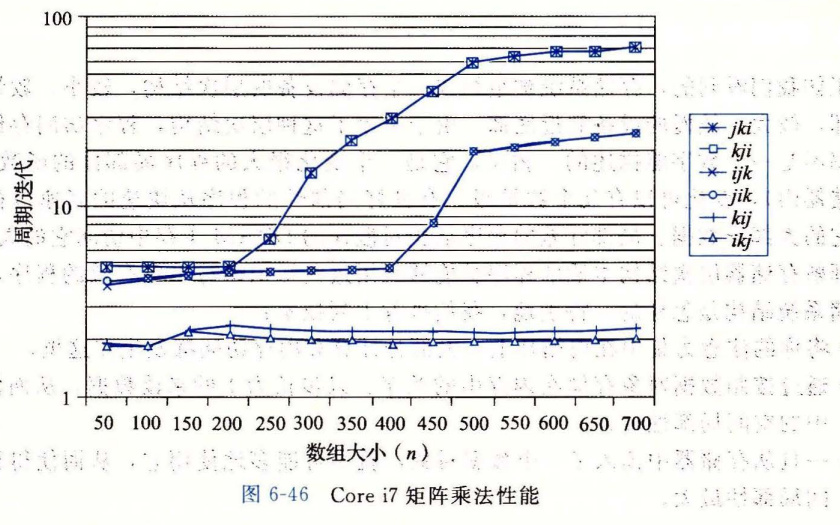

**图 6-46** Core i7 矩阵乘法性能。

对于这幅图有很多有意思的地方值得注意：

- 对于大的 *n* 值，即使每个版本都执行相同数量的浮点算术操作，最快的版本比最慢的版本运行得快几乎 40 倍。
- 每次迭代内存引用和不命中数量都相同的一对版本，有大致相同的测量性能。
- 内存行为最糟糕的两个版本，就每次迭代的访问数量和不命中数量而言，明显地比其他 4 个版本运行得慢，其他 4 个版本有较少的不命中次数或者较少的访问次数，或者兼而有之。
- 在这个情况中，与内存访问总数相比，不命中率是一个更好的性能预测指标。例如，即使类 BC 例程（2 个加载和 1 个存储）在内循环中比类 AB 例程（2 个加载）执行更多的内存引用，类 BC 例程（每次迭代有 0.5 个不命中）比类 AB 例程（每次迭代有 1.25 个不命中）性能还是要好很多。
- 对于大的 *n* 值，最快的一对版本（`kij` 和 `ikj`）的性能保持不变。虽然这个数组远大于任何 SRAM 高速缓存存储器，但预取硬件足够聪明，能够认出步长为 1 的访问模式，而且速度足够快能够跟上内循环中的内存访问。这是设计这个内存系统的 Intel 的工程师所做的一项极好成就，向程序员提供了甚至更多的鼓励，鼓励他们开发出具有良好空间局部性的程序。

> **网络旁注 MEM:BLOCKING　使用分块来提高时间局部性**
>
> 有一项很有趣的技术，称为分块（blocking），它可以提高内循环的时间局部性。分块的大致思想是将一个程序中的数据结构组织成大的片（chunk），称为块（block）。（在这个上下文中，“块”指的是一个应用级的数据组块，而不是高速缓存块。）这样构造程序，使得能够将一个片加载到 L1 高速缓存中，并在这个片中进行所需的所有的读和写，然后丢掉这个片，加载下一个片，依此类推。
>
> 与为提高空间局部性所做的简单循环变换不同，分块使得代码更难阅读和理解。由于这个原因，它最适合于优化编译器或者频繁执行的库函数。由于 Core i7 有完善的预取硬件，分块不会提高矩阵乘在 Core i7 上的性能。不过，学习和理解这项技术还是很有趣的，因为它是一个通用的概念，可以在一些没有预取的系统上获得极大的性能收益。

#### 6.6.3 在程序中利用局部性

正如我们看到的，存储系统被组织成一个存储设备的层次结构，较小、较快的设备靠近顶部，较大、较慢的设备靠近底部。由于采用了这种层次结构，程序访问存储位置的实际速率不是一个数字能描述的。相反，它是一个变化很大的程序局部性的函数（我们称之为存储器山），变化可以有几个数量级。有良好局部性的程序从快速的高速缓存存储器中访问它的大部分数据。局部性差的程序从相对慢速的 DRAM 主存中访问它的大部分数据。

理解存储器层次结构本质的程序员能够利用这些知识编写出更有效的程序，无论具体的存储系统结构是怎样的。特别地，我们推荐下列技术：

- 将你的注意力集中在内循环上，大部分计算和内存访问都发生在这里。
- 通过按照数据对象存储在内存中的顺序、以步长为 1 的模式来读数据，从而使得你程序中的空间局部性最大。
- 一旦从存储器中读入了一个数据对象，就尽可能多地使用它，从而使得程序中的时间局部性最大。

### 6.7 小结

基本存储技术包括随机存储器（RAM）、非易失性存储器（ROM）和磁盘。RAM 有两种基本类型。静态 RAM（SRAM）快一些，但是也贵一些，它既可以用做 CPU 芯片上的高速缓存，也可以用做芯片下的高速缓存。动态 RAM（DRAM）慢一点，也便宜一些，用做主存和图形帧缓冲区。即使是在关电的时候，ROM 也能保持它们的信息，可以用来存储固件。旋转磁盘是机械的非易失性存储设备，以每个位很低的成本保存大量的数据，但是其访问时间比 DRAM 长得多。固态硬盘（SSD）基于非易失性的闪存，对某些应用来说，越来越成为旋转磁盘的具有吸引力的替代产品。

一般而言，较快的存储技术每个位会更贵，而且容量更小。这些技术的价格和性能属性正在以显著不同的速度变化着。特别地，DRAM 和磁盘访问时间远远大于 CPU 周期时间。系统通过将存储器组织成存储设备的层次结构来弥补这些差异，在这个层次结构中，较小、较快的设备在顶部，较大、较慢的设备在底部。因为编写良好的程序有好的局部性，大多数数据都可以从较高层得到服务，结果就是存储系统能以较高层的速度运行，但却有较低层的成本和容量。

程序员可以通过编写有良好空间和时间局部性的程序来显著地改进程序的运行时间。利用基于 SRAM 的高速缓存存储器特别重要。主要从高速缓存取数据的程序能比主要从内存取数据的程序运行得快得多。

## 参考文献说明

内存和磁盘技术变化得很快。根据我们的经验，最好的技术信息来源是制造商维护的 Web 页面。像 Micron、Toshiba 和 Samsung 这样的公司，提供了丰富的当前有关内存设备的技术信息。Seagate 和 Western Digital 的页面也提供了类似的有关磁盘的有用信息。

关于电路和逻辑设计的教科书提供了关于内存技术的详细信息 [58, 89]。IEEE Spectrum 出版了一系列有关 DRAM 的综述文章 [55]。计算机体系结构国际会议（ISCA）和高性能计算机体系结构（HPCA）是关于 DRAM 存储性能特性的公共论坛 [28, 29, 18]。

Wilkes 写了第一篇关于高速缓存存储器的论文 [117]。Smith 写了一篇经典的综述 [104]。Przybylski 编写了一本关于高速缓存设计的权威著作 [86]。Hennessy 和 Patterson 提供了对高速缓存设计问题的全面讨论 [46]。Levinthal 写了一篇有关 Intel Core i7 的全面性能指南 [70]。

Stricker 在 [112] 中介绍了存储器山的思想，作为对存储器系统的全面描述，并且在后来的工作描述中非正式地提出了术语“存储器山”。编译器研究者通过自动执行我们在 6.6 节中讨论过的那些手工代码转换来增加局部性 [22, 32, 66, 72, 79, 87, 119]。Carter 和他的同事们提出了一个高速缓存可知晓的内存控制器（cache-aware memory controller）[17]。其他的研究者开发出了高速缓存不知晓的（cache-oblivious）算法，它被设计用来在不明确知道底层高速缓存存储器结构的情况下也能运行得很好 [30, 38, 39, 9]。

关于构造和使用磁盘存储设备也有大量的论著。许多存储技术研究者找寻方法，将单个的磁盘集合成更大、更健壮和更安全的存储池 [20, 40, 41, 83, 121]。其他研究者找寻利用高速缓存和局部性来改进磁盘访问性能的方法 [12, 21]。像 Exokernel 这样的系统提供了更多的对磁盘和存储器资源的用户级控制 [57]。像安德鲁文件系统 [78] 和 Coda [94] 这样的系统，将存储器层次结构扩展到了计算机网络和移动笔记本电脑。Schindler 和 Ganger 开发了一个有趣的工具，它能自动描述 SCSI 磁盘驱动器的构造和性能 [95]。研究者正在研究构造和使用基于闪存的 SSD 的技术 [8, 81]。

## 第 6 章家庭作业：6.22～6.30

**家庭作业 6.22**（★★）假设要求你设计一个每条磁道位数固定的旋转磁盘。你知道每条磁道的位数是由最里层磁道的周长决定的，可以假设它就是中间那个圆洞的周长。因此，如果你把磁盘中间的洞做得大一点，每条磁道的位数就会增大，但是总的磁道数会减少。如果用 `r` 来表示盘面的半径，`x · r` 表示圆洞的半径，那么 `x` 取什么值能使这个磁盘的容量最大？

**家庭作业 6.23**（★）估计访问下面这个磁盘上扇区的平均时间（以 ms 为单位）：

| 参数 | 值 |
| --- | --- |
| 旋转速率 | 15 000 RPM |
| T<sub>avg seek</sub> | 4 ms |
| 平均扇区数/磁道 | 800 |

**家庭作业 6.24**（★★）假设一个 2 MB 的文件，由 512 个字节的逻辑块组成，存储在具有下述特性的磁盘驱动器上：

| 参数 | 值 |
| --- | --- |
| 旋转速率 | 15 000 RPM |
| T<sub>avg seek</sub> | 4 ms |
| 平均扇区数/磁道 | 1000 |
| 盘面数 | 8 |
| 扇区大小 | 512 字节 |

对于下面的每种情况，假设程序顺序地读文件的逻辑块，一个接一个，并且对第一个块定位读/写头的时间等于 T<sub>avg seek</sub> + T<sub>avg rotation</sub>。

A. 最好情况：估计在所有可能的逻辑块到磁盘扇区的映射上读该文件所需要的最优时间（以 ms 为单位）。

B. 随机情况：估计如果块是随机映射到磁盘扇区上时读该文件所需要的时间（以 ms 为单位）。

**家庭作业 6.25**（★）下面的表给出了一些不同的高速缓存的参数。对于每个高速缓存，填写出表中缺失的字段。记住 `m` 是物理地址的位数，`C` 是高速缓存大小（数据字节数），`B` 是以字节为单位的块大小，`E` 是相联度，`S` 是高速缓存组数，`t` 是标记位数，`s` 是组索引位数，而 `b` 是块偏移位数。

| 高速缓存 | m | C | B | E | S | t | s | b |
| --- | ---: | ---: | ---: | ---: | ---: | ---: | ---: | ---: |
| 1. | 32 | 1024 | 4 | 4 |  |  |  |  |
| 2. | 32 | 1024 | 4 | 256 |  |  |  |  |
| 3. | 32 | 1024 | 8 | 1 |  |  |  |  |
| 4. | 32 | 1024 | 8 | 128 |  |  |  |  |
| 5. | 32 | 1024 | 32 | 1 |  |  |  |  |
| 6. | 32 | 1024 | 32 | 4 |  |  |  |  |

**家庭作业 6.26**（★）下面的表给出了一些不同的高速缓存的参数。你的任务是填写出表中缺失的字段。记住 `m` 是物理地址的位数，`C` 是高速缓存大小（数据字节数），`B` 是以字节为单位的块大小，`E` 是相联度，`S` 是高速缓存组数，`t` 是标记位数，`s` 是组索引位数，而 `b` 是块偏移位数。

| 高速缓存 | m | C | B | E | S | t | s | b |
| --- | ---: | ---: | ---: | ---: | ---: | ---: | ---: | ---: |
| 1. | 32 |  | 8 | 1 |  | 21 | 8 | 3 |
| 2. | 32 | 2048 |  |  | 128 | 23 | 7 | 2 |
| 3. | 32 | 1024 | 2 | 8 | 64 |  |  | 1 |
| 4. | 32 | 1024 |  | 2 | 16 | 23 | 4 |  |

**家庭作业 6.27**（★）这个问题是关于练习题 6.12 中的高速缓存的。

A. 列出所有会在组 1 中命中的十六进制内存地址。

B. 列出所有会在组 6 中命中的十六进制内存地址。

**家庭作业 6.28**（★★）这个问题是关于练习题 6.12 中的高速缓存的。

A. 列出所有会在组 2 中命中的十六进制内存地址。

B. 列出所有会在组 4 中命中的十六进制内存地址。

C. 列出所有会在组 5 中命中的十六进制内存地址。

D. 列出所有会在组 7 中命中的十六进制内存地址。

**家庭作业 6.29**（★★）假设我们有一个具有如下属性的系统：

- 内存是字节寻址的。
- 内存访问是对 1 字节字的（而不是 4 字节字）。
- 地址宽 12 位。
- 高速缓存是两路组相联的（`E=2`），块大小为 4 字节（`B=4`），有 4 个组（`S=4`）。

高速缓存的内容如下，所有的地址、标记和值都以十六进制表示：

| 组索引 | 标记 | 有效位 | 字节 0 | 字节 1 | 字节 2 | 字节 3 |
| ---: | ---: | ---: | ---: | ---: | ---: | ---: |
| 0 | 00 | 1 | 40 | 41 | 42 | 43 |
| 0 | 83 | 1 | FE | 97 | CC | D0 |
| 1 | 00 | 1 | 44 | 45 | 46 | 47 |
| 1 | 83 | 0 | — | — | — | — |
| 2 | 00 | 1 | 48 | 49 | 4A | 4B |
| 2 | 40 | 0 | — | — | — | — |
| 3 | FF | 1 | 9A | C0 | 03 | FF |
| 3 | 00 | 0 | — | — | — | — |

A. 下面的图给出了一个地址的格式（每个小框表示一位）。指出用来确定下列信息的字段（在图中标号出来）：

- CO　高速缓存块偏移
- CI　高速缓存组索引
- CT　高速缓存标记

| 12 | 11 | 10 | 9 | 8 | 7 | 6 | 5 | 4 | 3 | 2 | 1 | 0 |
| --- | --- | --- | --- | --- | --- | --- | --- | --- | --- | --- | --- | --- |
|  |  |  |  |  |  |  |  |  |  |  |  |  |

B. 对于下面每个内存访问，当它们是按照列出来的顺序执行时，指出是高速缓存命中还是不命中。如果可以从高速缓存中的信息推断出来，请也给出读出的值。

| 操作 | 地址 | 命中？ | 读出的值（或者未知） |
| --- | --- | --- | --- |
| 读 | 0x834 |  |  |
| 写 | 0x836 |  |  |
| 读 | 0xFFD |  |  |

**家庭作业 6.30**（★）假设我们有一个具有如下属性的系统：

- 内存是字节寻址的。
- 内存访问是对 1 字节字的（而不是 4 字节字）。
- 地址宽 13 位。
- 高速缓存是四路组相联的（`E=4`），块大小为 4 字节（`B=4`），有 8 个组（`S=8`）。

考虑下面的高速缓存状态。所有的地址、标记和值都以十六进制表示。每组有 4 行，索引列包含组索引。标记列包含每一行的标记值。`V` 列包含每一行的有效位。字节 0～3 列包含每一行的数据，标号从左向右，字节 0 在左边。

**4 路组相联高速缓存**

| 索引 | 标记 | V | 字节 0～3 | 标记 | V | 字节 0～3 | 标记 | V | 字节 0～3 | 标记 | V | 字节 0～3 |
| ---: | ---: | ---: | --- | ---: | ---: | --- | ---: | ---: | --- | ---: | ---: | --- |
| 0 | F0 | 1 | ED 32 0A A2 | 8A | 1 | BF 80 1D FC | 14 | 1 | EF 09 86 2A | BC | 0 | 25 44 6F 1A |
| 1 | BC | 0 | 03 3E CD 38 | A0 | 0 | 16 7B ED 5A | BC | 1 | 8E 4C DF 18 | E4 | 1 | FB B7 12 02 |
| 2 | BC | 1 | 54 9E 1E FA | B6 | 1 | DC 81 B2 14 | 00 | 0 | B6 1F 7B 44 | 74 | 0 | 10 F5 B8 2E |
| 3 | BE | 0 | 2F 7E 3D AB | C0 | 1 | 27 95 A4 74 | C4 | 0 | 07 11 6B D8 | BC | 0 | C7 B7 AF C2 |
| 4 | 7E | 1 | 32 21 1C 2C | 8A | 1 | 22 C2 DC 34 | BC | 1 | BA DD 37 D8 | DC | 0 | E7 A2 39 BA |
| 5 | 98 | 0 | A9 76 2B EE | 54 | 0 | BC 91 D5 92 | 98 | 1 | 80 BA 9B F6 | BC | 1 | 48 16 81 0A |
| 6 | 38 | 0 | 5D 4D F7 DA | BC | 1 | 69 C2 8C 74 | 8A | 1 | A8 CE 7F DA | 38 | 1 | FA 93 EB 48 |
| 7 | 8A | 1 | 04 2A 32 6A | 9E | 0 | B1 86 56 08 | CC | 1 | 96 3D 47 F2 | BC | 1 | FB 1D 42 30 |

A. 这个高速缓存的大小（`C`）是多少字节？

B. 下面的图给出了一个地址的格式（每个小框表示一位）。指出用来确定下列信息的字段（在图中标号出来）：

- CO　高速缓存块偏移
- CI　高速缓存组索引
- CT　高速缓存标记

| 12 | 11 | 10 | 9 | 8 | 7 | 6 | 5 | 4 | 3 | 2 | 1 | 0 |
| --- | --- | --- | --- | --- | --- | --- | --- | --- | --- | --- | --- | --- |
|  |  |  |  |  |  |  |  |  |  |  |  |  |

## 第 6 章家庭作业：6.31～6.37

**家庭作业 6.31**（★★）假设程序使用作业 6.30 中的高速缓存，引用位于地址 `0x071A` 处的 1 字节字。用十六进制表示出它所访问的高速缓存条目，以及返回的高速缓存字节值。指明是否发生了高速缓存不命中。如果有高速缓存不命中，对于“返回的高速缓存字节”输入“—”。提示：注意那些有效位！

A. 地址格式（每个小框表示一位）：

| 12 | 11 | 10 | 9 | 8 | 7 | 6 | 5 | 4 | 3 | 2 | 1 | 0 |
| --- | --- | --- | --- | --- | --- | --- | --- | --- | --- | --- | --- | --- |
|  |  |  |  |  |  |  |  |  |  |  |  |  |

B. 内存引用：

| 参数 | 值 |
| --- | --- |
| 高速缓存块偏移（CO） | `0x______` |
| 高速缓存组索引（CI） | `0x______` |
| 高速缓存标记（CT） | `0x______` |
| 高速缓存命中？（是/否） |  |
| 返回的高速缓存字节 | `0x______` |

**家庭作业 6.32**（★★）对于内存地址 `0x16E8` 重复作业 6.31。

A. 地址格式（每个小框表示一位）：

| 12 | 11 | 10 | 9 | 8 | 7 | 6 | 5 | 4 | 3 | 2 | 1 | 0 |
| --- | --- | --- | --- | --- | --- | --- | --- | --- | --- | --- | --- | --- |
|  |  |  |  |  |  |  |  |  |  |  |  |  |

B. 内存引用：

| 参数 | 值 |
| --- | --- |
| 高速缓存块偏移（CO） | `0x______` |
| 高速缓存组索引（CI） | `0x______` |
| 高速缓存标记（CT） | `0x______` |
| 高速缓存命中？（是/否） |  |
| 返回的高速缓存字节 | `0x______` |

**家庭作业 6.33**（★★）对于作业 6.30 中的高速缓存，列出会在组 2 中命中的 8 个内存地址（以十六进制表示）。

**家庭作业 6.34**（★★）考虑下面的矩阵转置函数：

```c
typedef int array[4][4];

void transpose2(array dst, array src)
{
    int i, j;

    for (i = 0; i < 4; i++) {
        for (j = 0; j < 4; j++) {
            dst[j][i] = src[i][j];
        }
    }
}
```

假设这段代码运行在一台具有如下属性的机器上：

- `sizeof(int)==4`。
- 数组 `src` 从地址 0 开始，而数组 `dst` 从地址 64 开始（十进制）。
- 只有一个 L1 数据高速缓存，它是直接映射、直写、写分配的，块大小为 16 字节。
- 这个高速缓存总共有 32 个数据字节，初始为空。
- 对 `src` 和 `dst` 数组的访问分别是读和写不命中的唯一来源。

对于每个 `row` 和 `col`，指明对 `src[row][col]` 和 `dst[row][col]` 的访问是命中（h）还是不命中（m）。例如，读 `src[0][0]` 会不命中，而写 `dst[0][0]` 也会不命中。

**dst 数组**

|  | 列 0 | 列 1 | 列 2 | 列 3 |
| --- | --- | --- | --- | --- |
| 行 0 | m |  |  |  |
| 行 1 |  |  |  |  |
| 行 2 |  |  |  |  |
| 行 3 |  |  |  |  |

**src 数组**

|  | 列 0 | 列 1 | 列 2 | 列 3 |
| --- | --- | --- | --- | --- |
| 行 0 | m |  |  |  |
| 行 1 |  |  |  |  |
| 行 2 |  |  |  |  |
| 行 3 |  |  |  |  |

**家庭作业 6.35**（★★）对于一个总大小为 128 数据字节的高速缓存，重复练习题 6.34。

**dst 数组**

|  | 列 0 | 列 1 | 列 2 | 列 3 |
| --- | --- | --- | --- | --- |
| 行 0 | m |  |  |  |
| 行 1 |  |  |  |  |
| 行 2 |  |  |  |  |
| 行 3 |  |  |  |  |

**src 数组**

|  | 列 0 | 列 1 | 列 2 | 列 3 |
| --- | --- | --- | --- | --- |
| 行 0 | m |  |  |  |
| 行 1 |  |  |  |  |
| 行 2 |  |  |  |  |
| 行 3 |  |  |  |  |

**家庭作业 6.36**（★★）这道题测试你预测 C 语言代码的高速缓存行为的能力。对下面这段代码进行分析：

```c
int x[2][128];
int i;
int sum = 0;

for (i = 0; i < 128; i++) {
    sum += x[0][i] * x[1][i];
}
```

假设我们在下列条件下执行这段代码：

- `sizeof(int)==4`。
- 数组 `x` 从内存地址 `0x0` 开始，按照行优先顺序存储。
- 在下面每种情况中，高速缓存最开始时都是空的。
- 唯一的内存访问是对数组 `x` 的条目进行访问。其他所有的变量都存储在寄存器中。

给定这些假设，估计下列情况中的不命中率：

A. 情况 1：假设高速缓存是 512 字节，直接映射，高速缓存块大小为 16 字节。不命中率是多少？

B. 情况 2：如果我们把高速缓存的大小翻倍到 1024 字节，不命中率是多少？

C. 情况 3：现在假设高速缓存是 512 字节，两路组相联，使用 LRU 替换策略，高速缓存块大小为 16 字节。不命中率是多少？

D. 对于情况 3，更大的高速缓存大小会帮助降低不命中率吗？为什么能或者为什么不能？

E. 对于情况 3，更大的块大小会帮助降低不命中率吗？为什么能或者为什么不能？

**家庭作业 6.37**（★★）这道题也是测试你分析 C 语言代码的高速缓存行为的能力。假设我们在下列条件下执行图 6-47 中的 3 个求和函数：

- `sizeof(int)==4`。
- 机器有 4KB 直接映射的高速缓存，块大小为 16 字节。
- 在两个循环中，代码只对数组数据进行内存访问。循环索引和值 `sum` 都存放在寄存器中。
- 数组 `a` 从内存地址 `0x08000000` 处开始存储。

对于 `N=64` 和 `N=60` 两种情况，在表中填写它们大概的高速缓存不命中率。

| 函数 | N=64 | N=60 |
| --- | --- | --- |
| `sumA` |  |  |
| `sumB` |  |  |
| `sumC` |  |  |

```c
typedef int array_t[N][N];

int sumA(array_t a)
{
    int i, j;
    int sum = 0;
    for (i = 0; i < N; i++)
        for (j = 0; j < N; j++) {
            sum += a[i][j];
        }
    return sum;
}

int sumB(array_t a)
{
    int i, j;
    int sum = 0;
    for (j = 0; j < N; j++)
        for (i = 0; i < N; i++) {
            sum += a[i][j];
        }
    return sum;
}

int sumC(array_t a)
{
    int i, j;
    int sum = 0;
    for (j = 0; j < N; j+=2)
        for (i = 0; i < N; i+=2) {
            sum += (a[i][j] + a[i+1][j]
                    + a[i][j+1] + a[i+1][j+1]);
        }
    return sum;
}
```

**图 6-47**　作业 6.37 中引用的函数

## 家庭作业

**家庭作业 6.38**（★）

3M 决定在白纸上印黄方格，做成 Post-It 小贴纸。在打印过程中，他们需要设置方格中每个点的 CMYK（蓝色，红色，黄色，黑色）值。3M 雇佣你判定下面算法在一个具有 2048 字节、直接映射、块大小为 32 字节的数据高速缓存上的效率。有如下定义：

```c
struct point_color {
    int c;
    int m;
    int y;
    int k;
};

struct point_color square[16][16];
int i, j;
```

有如下假设：

- `sizeof(int)==4`。
- `square` 起始于内存地址 0。
- 高速缓存初始为空。
- 唯一的内存访问是对于 `square` 数组中的元素。变量 `i` 和 `j` 存放在寄存器中。

确定下列代码的高速缓存性能：

```c
for (i = 0; i < 16; i++) {
    for (j = 0; j < 16; j++) {
        square[i][j].c = 0;
        square[i][j].m = 0;
        square[i][j].y = 1;
        square[i][j].k = 0;
    }
}
```

A. 写总数是多少？

B. 在高速缓存中不命中的写总数是多少？

C. 不命中率是多少？

**家庭作业 6.39**（★）

给定作业 6.38 中的假设，确定下列代码的高速缓存性能：

```c
for (i = 0; i < 16; i++) {
    for (j = 0; j < 16; j++) {
        square[j][i].c = 0;
        square[j][i].m = 0;
        square[j][i].y = 1;
        square[j][i].k = 0;
    }
}
```

A. 写总数是多少？

B. 在高速缓存中不命中的写总数是多少？

C. 不命中率是多少？

**家庭作业 6.40**（★）

给定作业 6.38 中的假设，确定下列代码的高速缓存性能：

```c
for (i = 0; i < 16; i++) {
    for (j = 0; j < 16; j++) {
        square[i][j].y = 1;
    }
}

for (i = 0; i < 16; i++) {
    for (j = 0; j < 16; j++) {
        square[i][j].c = 0;
        square[i][j].m = 0;
        square[i][j].k = 0;
    }
}
```

A. 写总数是多少？

B. 在高速缓存中不命中的写总数是多少？

C. 不命中率是多少？

**家庭作业 6.41**（★★）

你正在编写一个新的 3D 游戏，希望能名利双收。现在正在写一个函数，使得在画下一帧之前先清空屏幕缓冲区。工作的屏幕是 640×480 像素数组。工作的机器有一个 64 KB 直接映射高速缓存，每行 4 个字节。使用下面的 C 语言数据结构：

```c
struct pixel {
    char r;
    char g;
    char b;
    char a;
};

struct pixel buffer[480][640];
int i, j;
char *cptr;
int *iptr;
```

有如下假设：

- `sizeof(char)==1` 和 `sizeof(int)==4`。
- `buffer` 起始于内存地址 0。
- 高速缓存初始为空。
- 唯一的内存访问是对于 `buffer` 数组中元素的访问。变量 `i`、`j`、`cptr` 和 `iptr` 存放在寄存器中。

下面代码中百分之多少的写会在高速缓存中不命中？

```c
for (j = 0; j < 640; j++) {
    for (i = 0; i < 480; i++) {
        buffer[i][j].r = 0;
        buffer[i][j].g = 0;
        buffer[i][j].b = 0;
        buffer[i][j].a = 0;
    }
}
```

**家庭作业 6.42**（★★）

给定作业 6.41 中的假设，下面代码中百分之多少的写会在高速缓存中不命中？

```c
char *cptr = (char *) buffer;
for (; cptr < (((char *) buffer) + 640 * 480 * 4); cptr++)
    *cptr = 0;
```

**家庭作业 6.43**（★★）

给定作业 6.41 中的假设，下面代码中百分之多少的写会在高速缓存中不命中？

```c
int *iptr = (int *) buffer;
for (; iptr < ((int *) buffer + 640 * 480); iptr++)
    *iptr = 0;
```

**家庭作业 6.44**（★★★）

从 CS:APP 的网站上下载 `mountain` 程序，在你最喜欢的 PC/Linux 系统上运行它。根据结果估计你系统上的高速缓存的大小。

**家庭作业 6.45**（★★★）

在这项任务中，你会把在第 5 章和第 6 章中学习到的概念应用到一个内存使用频繁的代码的优化问题上。考虑一个复制并转置一个类型为 `int` 的 N×N 矩阵的过程。也就是，对于源矩阵 S 和目的矩阵 D，我们要将每个元素 s<sub>i,j</sub> 复制到 d<sub>j,i</sub>。只用一个简单的循环就能实现这段代码：

```c
void transpose(int *dst, int *src, int dim)
{
    int i, j;

    for (i = 0; i < dim; i++)
        for (j = 0; j < dim; j++)
            dst[j*dim + i] = src[i*dim + j];
}
```

这里，过程的参数是指向目的矩阵（`dst`）和源矩阵（`src`）的指针，以及矩阵的大小 N（`dim`）。你的工作是设计一个运行得尽可能快的转置函数。

**家庭作业 6.46**（★★★）

这是练习题 6.45 的一个有趣的变体。考虑将一个有向图 g 转换成它对应的无向图 g′。图 g′ 有一条从顶点 u 到顶点 v 的边，当且仅当原图 g 中有一条 u 到 v 或者 v 到 u 的边。图 g 是由如下的它的邻接矩阵（adjacency matrix）G 表示的。如果 N 是 g 中顶点的数量，那么 G 是一个 N×N 的矩阵，它的元素是全 0 或者全 1。假设 g 的顶点是这样命名的：v<sub>0</sub>，v<sub>1</sub>，…，v<sub>N−1</sub>。那么如果有一条从 v<sub>i</sub> 到 v<sub>j</sub> 的边，那么 `G[i][j]` 为 1，否则为 0。注意，邻接矩阵对角线上的元素总是 1，而无向图的邻接矩阵是对称的。只用一个简单的循环就能实现这段代码：

```c
void col_convert(int *G, int dim) {
    int i, j;

    for (i = 0; i < dim; i++)
        for (j = 0; j < dim; j++)
            G[j*dim + i] = G[j*dim + i] || G[i*dim + j];
}
```

你的工作是设计一个运行得尽可能快的函数。同前面一样，要提出一个好的解答，你需要应用在第 5 章和第 6 章中所学到的概念。

---

[返回总目录](../README.md) · [上一章](../第05章-优化程序性能/README.md) · [下一章](../第07章-链接/README.md) · [按小节阅读](README.md) · [练习题答案](练习题答案.md)
