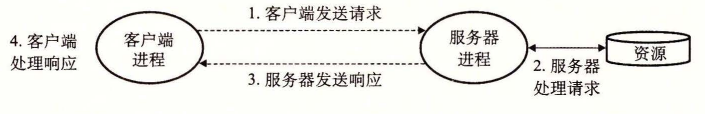
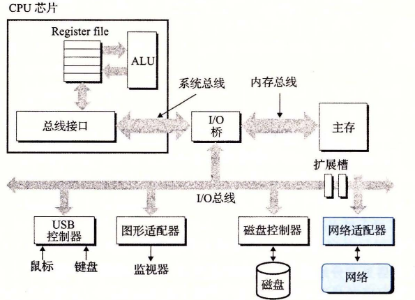
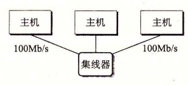
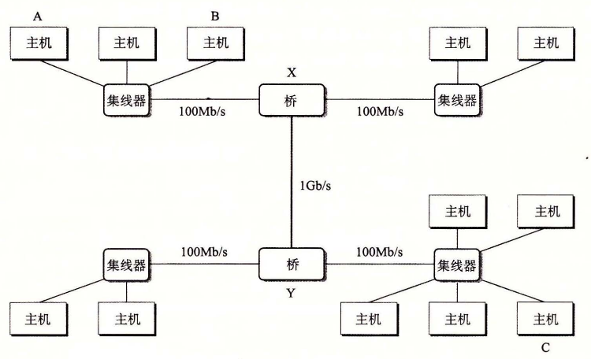
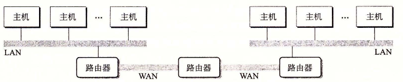
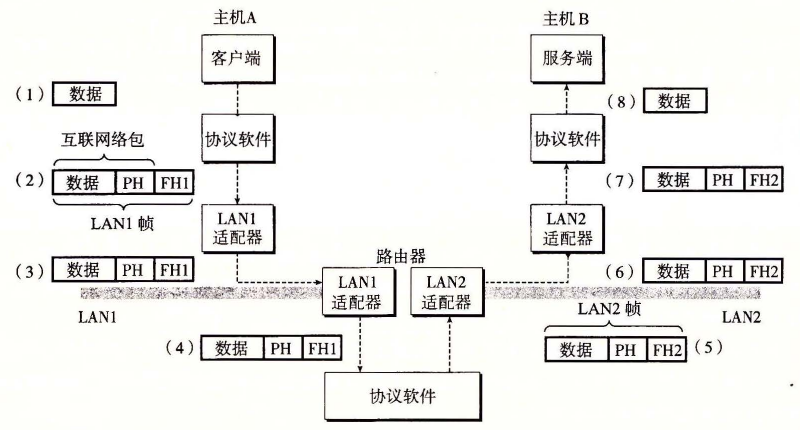
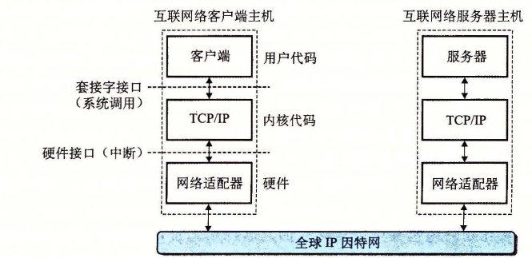
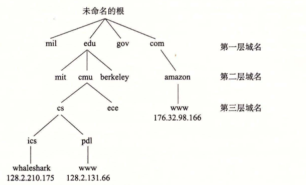
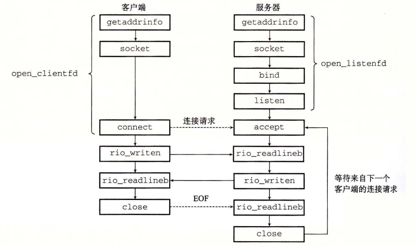
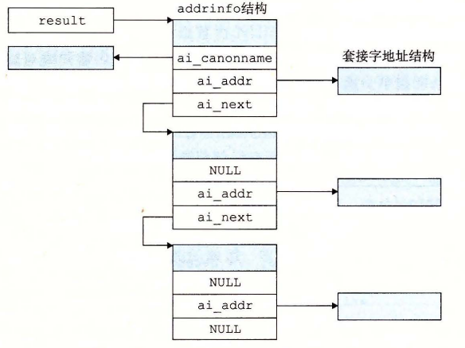

# 第 11 章 网络编程

[返回总目录](../README.md) · [上一章](../第10章-系统级IO/README.md) · [下一章](../第12章-并发编程/README.md) · [按小节阅读](README.md) · [练习题答案](练习题答案.md)

## 本章目录

- [第 11 章 网络编程](#第-11-章-网络编程)
  - [11.1 客户端-服务器编程模型](#111-客户端-服务器编程模型)
  - [11.2 网络](#112-网络)
  - [11.3 全球 IP 因特网](#113-全球-ip-因特网)
    - [11.3.1 IP 地址](#1131-ip-地址)
    - [11.3.2 因特网域名](#1132-因特网域名)
    - [11.3.3 因特网连接](#1133-因特网连接)
  - [11.4 套接字接口](#114-套接字接口)
    - [11.4.1 套接字地址结构](#1141-套接字地址结构)
    - [11.4.2 `socket` 函数](#1142-socket-函数)
    - [11.4.3 `connect` 函数](#1143-connect-函数)
    - [11.4.4 `bind` 函数](#1144-bind-函数)
    - [11.4.5 `listen` 函数](#1145-listen-函数)
    - [11.4.6 `accept` 函数](#1146-accept-函数)
    - [11.4.7 主机和服务的转换](#1147-主机和服务的转换)
    - [11.4.8 套接字接口的辅助函数](#1148-套接字接口的辅助函数)
    - [11.4.9 `echo` 客户端和服务器的示例](#1149-echo-客户端和服务器的示例)
  - [11.5 Web 服务器](#115-web-服务器)
    - [11.5.1 Web 基础](#1151-web-基础)
    - [11.5.2 Web 内容](#1152-web-内容)
    - [11.5.3 HTTP 事务](#1153-http-事务)
    - [11.5.4 服务动态内容](#1154-服务动态内容)
  - [11.6 综合：TINY Web 服务器](#116-综合tiny-web-服务器)
  - [11.7 小结](#117-小结)
- [参考文献说明](#参考文献说明)
- [家庭作业](#家庭作业)

## 第 11 章 网络编程

网络应用随处可见。任何时候浏览 Web、发送 email 信息或是玩在线游戏，你就正在使用网络应用程序。有趣的是，所有的网络应用都是基于相同的基本编程模型，有着相似的整体逻辑结构，并且依赖相同的编程接口。

网络应用依赖于很多在系统研究中已经学习过的概念。例如，进程、信号、字节顺序、内存映射以及动态内存分配，都扮演着重要的角色。还有一些新概念要掌握。我们需要理解基本的客户端-服务器编程模型，以及如何编写使用因特网提供的服务的客户端-服务器程序。最后，我们将把所有这些概念结合起来，开发一个虽小但功能齐全的 Web 服务器，能够为真实的 Web 浏览器提供静态和动态的文本和图形内容。

### 11.1 客户端-服务器编程模型

每个网络应用都是基于客户端-服务器模型的。采用这个模型，一个应用是由一个服务器进程和一个或者多个客户端进程组成。服务器管理某种资源，并且通过操作这种资源来为它的客户端提供某种服务。例如，一个 Web 服务器管理着一组磁盘文件，它会代表客户端进行检索和执行。一个 FTP 服务器管理着一组磁盘文件，它会为客户端进行存储和检索。相似地，一个电子邮件服务器管理着一些文件，它为客户端进行读和更新。

客户端-服务器模型中的基本操作是事务（transaction）（见图 11-1）。一个客户端-服务器事务由以下四步组成。

1. 当一个客户端需要服务时，它向服务器发送一个请求，发起一个事务。例如，当 Web 浏览器需要一个文件时，它就发送一个请求给 Web 服务器。
2. 服务器收到请求后，解释它，并以适当的方式操作它的资源。例如，当 Web 服务器收到浏览器发出的请求后，它就读一个磁盘文件。
3. 服务器给客户端发送一个响应，并等待下一个请求。例如，Web 服务器将文件发送回客户端。
4. 客户端收到响应并处理它。例如，当 Web 浏览器收到来自服务器的一页后，就在屏幕上显示此页。



**图 11-1** 一个客户端-服务器事务

认识到客户端和服务器是进程，而不是常提到的机器或者主机，这是很重要的。一台主机可以同时运行许多不同的客户端和服务器，而且一个客户端和服务器的事务可以在同一台或是不同的主机上。无论客户端和服务器是怎样映射到主机上的，客户端-服务器模型都是相同的。

> **旁注 客户端-服务器事务与数据库事务**
>
> 客户端-服务器事务不是数据库事务，没有数据库事务的任何特性，例如原子性。在我们的上下文中，事务仅仅是客户端和服务器执行的一系列步骤。

### 11.2 网络

客户端和服务器通常运行在不同的主机上，并且通过计算机网络的硬件和软件资源来通信。网络是很复杂的系统，在这里我们只想了解一点皮毛。我们的目标是从程序员的角度给你一个切实可行的思维模型。

对主机而言，网络只是又一种 I/O 设备，是数据源和数据接收方，如图 11-2 所示。一个插到 I/O 总线扩展槽的适配器提供了到网络的物理接口。从网络上接收到的数据从适配器经过 I/O 和内存总线复制到内存，通常是通过 DMA 传送。相似地，数据也能从内存复制到网络。



**图 11-2** 一个网络主机的硬件组成

物理上而言，网络是一个按照地理远近组成的层次系统。最低层是 LAN（Local Area Network，局域网），在一个建筑或者校园范围内。迄今为止，最流行的局域网技术是以太网（Ethernet），它是由施乐公司帕洛阿尔托研究中心（Xerox PARC）在 20 世纪 70 年代中期提出的。以太网技术被证明是适应力极强的，从 3Mb/s 演变到 10Gb/s。

一个以太网段（Ethernet segment）包括一些电缆（通常是双绞线）和一个叫做集线器的小盒子，如图 11-3 所示。以太网段通常跨越一些小的区域，例如某建筑物的一个房间或者一个楼层。每根电缆都有相同的最大位带宽，通常是 100Mb/s 或者 1Gb/s。一端连接到主机的适配器，而另一端则连接到集线器的一个端口上。集线器不加分辨地将从一个端口上收到的每个位复制到其他所有的端口上。因此，每台主机都能看到每个位。



**图 11-3** 以太网段

每个以太网适配器都有一个全球唯一的 48 位地址，它存储在这个适配器的非易失性存储器上。一台主机可以发送一段位（称为帧（frame））到这个网段内的其他任何主机。每个帧包括一些固定数量的头部（header）位，用来标识此帧的源和目的地址以及此帧的长度，此后紧随的就是数据位的有效载荷（payload）。每个主机适配器都能看到这个帧，但是只有目的主机实际读取它。

使用一些电缆和叫做网桥（bridge）的小盒子，多个以太网段可以连接成较大的局域网，称为桥接以太网（bridged Ethernet），如图 11-4 所示。桥接以太网能够跨越整个建筑物或者校区。在一个桥接以太网里，一些电缆连接网桥与网桥，而另外一些连接网桥和集线器。这些电缆的带宽可以是不同的。在我们的示例中，网桥与网桥之间的电缆有 1Gb/s 的带宽，而四根网桥和集线器之间电缆的带宽却是 100Mb/s。



**图 11-4** 桥接以太网

网桥比集线器更充分地利用了电缆带宽。利用一种聪明的分配算法，它们随着时间自动学习哪个主机可以通过哪个端口可达，然后只在有必要时，有选择地将帧从一个端口复制到另一个端口。例如，如果主机 A 发送一个帧到同网段上的主机 B，当该帧到达网桥 X 的输入端口时，X 就将丢弃此帧，因而节省了其他网段上的带宽。然而，如果主机 A 发送一个帧到一个不同网段上的主机 C，那么网桥 X 只会把此帧复制到和网桥 Y 相连的端口上，网桥 Y 会只把此帧复制到与主机 C 的网段连接的端口。

为了简化局域网的表示，我们将把集线器和网桥以及连接它们的电缆画成一根水平线，如图 11-5 所示。


**图 11-5** 局域网的概念视图

在层次的更高级别中，多个不兼容的局域网可以通过叫做路由器（router）的特殊计算机连接起来，组成一个 internet（互联网络）。每台路由器对于它所连接到的每个网络都有一个适配器（端口）。路由器也能连接高速点到点电话连接，这是称为 WAN（Wide-Area Network，广域网）的网络示例，之所以这么叫是因为它们覆盖的地理范围比局域网的大。一般而言，路由器可以用来由各种局域网和广域网构建互联网络。例如，图 11-6 展示了一个互联网络的示例，3 台路由器连接了一对局域网和一对广域网。



**图 11-6** 一个小型的互联网络。三台路由器连接起两个局域网和两个广域网

> **旁注 Internet 和 internet**
>
> 我们总是用小写字母的 internet 描述一般概念，而用大写字母的 Internet 来描述一种具体的实现，也就是所谓的全球 IP 因特网。

互联网络至关重要的特性是，它能由采用完全不同和不兼容技术的各种局域网和广域网组成。每台主机和其他每台主机都是物理相连的，但是如何能够让某台源主机跨过所有这些不兼容的网络发送数据位到另一台目的主机呢？

解决办法是一层运行在每台主机和路由器上的协议软件，它消除了不同网络之间的差异。这个软件实现一种协议，这种协议控制主机和路由器如何协同工作来实现数据传输。这种协议必须提供两种基本能力：

- **命名机制。** 不同的局域网技术有不同和不兼容的方式来为主机分配地址。互联网络协议通过定义一种一致的主机地址格式消除了这些差异。每台主机会被分配至少一个这种互联网络地址（internet address），这个地址唯一地标识了这台主机。
- **传送机制。** 在电缆上编码位和将这些位封装成帧方面，不同的联网技术有不同的和不兼容的方式。互联网络协议通过定义一种把数据位捆扎成不连续的片（称为包）的统一方式，从而消除了这些差异。一个包是由包头和有效载荷组成的，其中包头包括包的大小以及源主机和目的主机的地址，有效载荷包括从源主机发出的数据位。

图 11-7 展示了主机和路由器如何使用互联网络协议在不兼容的局域网间传送数据的一个示例。这个互联网络示例由两个局域网通过一台路由器连接而成。一个客户端运行在主机 A 上，主机 A 与 LAN1 相连，它发送一串数据字节到运行在主机 B 上的服务器端，主机 B 则连接在 LAN2 上。这个过程有 8 个基本步骤：

1. 运行在主机 A 上的客户端进行一个系统调用，从客户端的虚拟地址空间复制数据到内核缓冲区中。
2. 主机 A 上的协议软件通过在数据前附加互联网络包头和 LAN1 帧头，创建了一个 LAN1 的帧。互联网络包头寻址到互联网络主机 B。LAN1 帧头寻址到路由器。然后它传送此帧到适配器。注意，LAN1 帧的有效载荷是一个互联网络包，而互联网络包的有效载荷是实际的用户数据。这种封装是基本的网络互联方法之一。
3. LAN1 适配器复制该帧到网络上。
4. 当此帧到达路由器时，路由器的 LAN1 适配器从电缆上读取它，并把它传送到协议软件。
5. 路由器从互联网络包头中提取出目的互联网络地址，并用它作为路由表的索引，确定向哪里转发这个包，在本例中是 LAN2。路由器剥落旧的 LAN1 的帧头，加上寻址到主机 B 的新的 LAN2 帧头，并把得到的帧传送到适配器。
6. 路由器的 LAN2 适配器复制该帧到网络上。
7. 当此帧到达主机 B 时，它的适配器从电缆上读到此帧，并将它传送到协议软件。
8. 最后，主机 B 上的协议软件剥落包头和帧头。当服务器进行一个读取这些数据的系统调用时，协议软件最终将得到的数据复制到服务器的虚拟地址空间。



**图 11-7** 在互联网络上，数据是如何从一台主机传送到另一台主机的（PH：互联网络包头；FH1：LAN1 的帧头；FH2：LAN2 的帧头）

当然，在这里我们掩盖了许多很难的问题。如果不同的网络有不同帧大小的最大值，该怎么办呢？路由器如何知道该往哪里转发帧呢？当网络拓扑变化时，如何通知路由器？如果一个包丢失了又会如何呢？虽然如此，我们的示例抓住了互联网络思想的精髓，封装是关键。

### 11.3 全球 IP 因特网

全球 IP 因特网是最著名和最成功的互联网络实现。从 1969 年起，它就以这样或那样的形式存在了。虽然因特网的内部体系结构复杂而且不断变化，但是自从 20 世纪 80 年代早期以来，客户端-服务器应用的组织就一直保持着相当的稳定。图 11-8 展示了一个因特网客户端-服务器应用程序的基本硬件和软件组织。



**图 11-8** 一个因特网应用程序的硬件和软件组织

每台因特网主机都运行实现 TCP/IP 协议（Transmission Control Protocol/Internet Protocol，传输控制协议/互联网络协议）的软件，几乎每个现代计算机系统都支持这个协议。因特网的客户端和服务器混合使用套接字接口函数和 Unix I/O 函数来进行通信（我们将在 11.4 节中介绍套接字接口）。通常将套接字函数实现为系统调用，这些系统调用会陷入内核，并调用各种内核模式的 TCP/IP 函数。

TCP/IP 实际是一个协议族，其中每一个都提供不同的功能。例如，IP 协议提供基本的命名方法和递送机制，这种递送机制能够从一台因特网主机往其他主机发送包，也叫做数据报（datagram）。IP 机制从某种意义上而言是不可靠的，因为，如果数据报在网络中丢失或者重复，它并不会试图恢复。UDP（Unreliable Datagram Protocol，不可靠数据报协议）稍微扩展了 IP 协议，这样一来，包可以在进程间而不是在主机间传送。TCP 是一个构建在 IP 之上的复杂协议，提供了进程间可靠的全双工（双向的）连接。为了简化讨论，我们将 TCP/IP 看做是一个单独的整体协议。我们将不讨论它的内部工作，只讨论 TCP 和 IP 为应用程序提供的某些基本功能。我们将不讨论 UDP。

从程序员的角度，我们可以把因特网看做一个世界范围的主机集合，满足以下特性：

- 主机集合被映射为一组 32 位的 IP 地址。
- 这组 IP 地址被映射为一组称为因特网域名（Internet domain name）的标识符。
- 因特网主机上的进程能够通过连接（connection）和任何其他因特网主机上的进程通信。

接下来三节将更详细地讨论这些基本的因特网概念。

> **旁注 IPv4 和 IPv6**
>
> 最初的因特网协议，使用 32 位地址，称为因特网协议版本 4（Internet Protocol Version 4，IPv4）。1996 年，因特网工程任务组织（Internet Engineering Task Force，IETF）提出了一个新版本的 IP，称为因特网协议版本 6（IPv6），它使用的是 128 位地址，意在替代 IPv4。但是直到 2015 年，大约 20 年后，因特网流量的绝大部分还是由 IPv4 网络承载的。例如，只有 4% 的访问 Google 服务的用户使用 IPv6 [42]。
>
> 因为 IPv6 的使用率较低，本书不会讨论 IPv6 的细节，而只是集中注意力于 IPv4 背后的概念。当我们谈论因特网时，我们指的是基于 IPv4 的因特网。但是，本章后面介绍的书写客户端和服务器的技术是基于现代接口的，与任何特殊的协议无关。

#### 11.3.1 IP 地址

一个 IP 地址就是一个 32 位无符号整数。网络程序将 IP 地址存放在如图 11-9 所示的 IP 地址结构中。

`code/netp/netpfragments.c`

```c
/* IP address structure */
struct in_addr {
    uint32_t s_addr; /* Address in network byte order (big-endian) */
};
```

**图 11-9** IP 地址结构

把一个标量地址存放在结构中，是套接字接口早期实现的不幸产物。为 IP 地址定义一个标量类型应该更有意义，但是现在更改已经太迟了，因为已经有大量应用是基于此的。

因为因特网主机可以有不同的主机字节顺序，TCP/IP 为任意整数数据项定义了统一的网络字节顺序（network byte order）（大端字节顺序），例如 IP 地址，它放在包头中跨过网络被携带。在 IP 地址结构中存放的地址总是以（大端法）网络字节顺序存放的，即使主机字节顺序（host byte order）是小端法。Unix 提供了下面这样的函数在网络和主机字节顺序间实现转换。

```c
#include <arpa/inet.h>

uint32_t htonl(uint32_t hostlong);
uint16_t htons(uint16_t hostshort);
```

**返回：** 按照网络字节顺序的值。

```c
uint32_t ntohl(uint32_t netlong);
uint16_t ntohs(uint16_t netshort);
```

**返回：** 按照主机字节顺序的值。

`htonl` 函数将 32 位整数由主机字节顺序转换为网络字节顺序。`ntohl` 函数将 32 位整数从网络字节顺序转换为主机字节。`htons` 和 `ntohs` 函数为 16 位无符号整数执行相应的转换。注意，没有对应的处理 64 位值的函数。

IP 地址通常是以一种称为点分十进制表示法来表示的，这里，每个字节由它的十进制值表示，并且用句点和其他字节间分开。例如，`128.2.194.242` 就是地址 `0x8002c2f2` 的点分十进制表示。在 Linux 系统上，你能够使用 `HOSTNAME` 命令来确定你自己主机的点分十进制地址：

```text
linux> hostname -i
128.2.210.175
```

应用程序使用 `inet_pton` 和 `inet_ntop` 函数来实现 IP 地址和点分十进制串之间的转换。

```c
#include <arpa/inet.h>

int inet_pton(AF_INET, const char *src, void *dst);
```

**返回：** 若成功则为 1，若 `src` 为非法点分十进制地址则为 0，若出错则为 -1。

```c
const char *inet_ntop(AF_INET, const void *src, char *dst,
                      socklen_t size);
```

**返回：** 若成功则指向点分十进制字符串的指针，若出错则为 NULL。

在这些函数名中，“n”代表网络，“p”代表表示。它们可以处理 32 位 IPv4 地址（`AF_INET`）（就像这里展示的那样），或者 128 位 IPv6 地址（`AF_INET6`）（这部分我们不讲）。

`inet_pton` 函数将一个点分十进制串（`src`）转换为一个二进制的网络字节顺序的 IP 地址（`dst`）。如果 `src` 没有指向一个合法的点分十进制字符串，那么该函数就返回 0。任何其他错误会返回 -1，并设置 `errno`。相似地，`inet_ntop` 函数将一个二进制的网络字节顺序的 IP 地址（`src`）转换为它所对应的点分十进制表示，并把得到的以 null 结尾的字符串的最多 `size` 个字节复制到 `dst`。

> **练习题 11.1** 完成下表：
>
> | 十六进制地址 | 点分十进制地址 |
> | --- | --- |
> | `0x0` | |
> | `0xffffffff` | |
> | `0x7f000001` | |
> | | `205.188.160.121` |
> | | `64.12.149.13` |
> | | `205.188.146.23` |

> **练习题 11.2** 编写程序 `hex2dd.c`，将它的十六进制参数转换为点分十进制串并打印出结果。例如
>
> ```text
> linux> ./hex2dd 0x8002c2f2
> 128.2.194.242
> ```

> **练习题 11.3** 编写程序 `dd2hex.c`，将它的点分十进制参数转换为十六进制数并打印出结果。例如
>
> ```text
> linux> ./dd2hex 128.2.194.242
> 0x8002c2f2
> ```

#### 11.3.2 因特网域名

因特网客户端和服务器互相通信时使用的是 IP 地址。然而，对于人们而言，大整数是很难记住的，所以因特网也定义了一组更加人性化的域名（domain name），以及一种将域名映射到 IP 地址的机制。域名是一串用句点分隔的单词（字母、数字和破折号），例如 `whaleshark.ics.cs.cmu.edu`。

域名集合形成了一个层次结构，每个域名编码了它在这个层次中的位置。通过一个示例你将很容易理解这点。图 11-10 展示了域名层次结构的一部分。层次结构可以表示为一棵树。树的节点表示域名，反向到根的路径形成了域名。子树称为子域（subdomain）。层次结构中的第一层是一个未命名的根节点。下一层是一组一级域名（first-level domain name），由非营利组织 ICANN（Internet Corporation for Assigned Names and Numbers，因特网分配名字数字协会）定义。常见的第一层域名包括 `com`、`edu`、`gov`、`org` 和 `net`。



**图 11-10** 因特网域名层次结构的一部分

下一层是二级（second-level）域名，例如 `cmu.edu`，这些域名是由 ICANN 的各个授权代理按照先到先服务的基础分配的。一旦一个组织得到了一个二级域名，那么它就可以在这个子域中创建任何新的域名了，例如 `cs.cmu.edu`。

因特网定义了域名集合和 IP 地址集合之间的映射。直到 1988 年，这个映射都是通过一个叫做 `HOSTS.TXT` 的文本文件来手工维护的。从那以后，这个映射是通过分布世界范围内的数据库（称为 DNS（Domain Name System，域名系统））来维护的。从概念上而言，DNS 数据库由上百万的主机条目结构（host entry structure）组成，其中每条定义了一组域名和一组 IP 地址之间的映射。从数学意义上讲，可以认为每条主机条目就是一个域名和 IP 地址的等价类。我们可以用 Linux 的 `NSLOOKUP` 程序来探究 DNS 映射的一些属性，这个程序能展示与某个 IP 地址对应的域名。[^nslookup]

每台因特网主机都有本地定义的域名 `localhost`，这个域名总是映射为回送地址（loopback address）`127.0.0.1`：

```text
linux> nslookup localhost
Address: 127.0.0.1
```

`localhost` 名字为引用运行在同一台机器上的客户端和服务器提供了一种便利和可移植的方式，这对调试相当有用。我们可以使用 `HOSTNAME` 来确定本地主机的实际域名：

```text
linux> hostname
whaleshark.ics.cs.cmu.edu
```

在最简单的情况中，一个域名和一个 IP 地址之间是一一映射：

```text
linux> nslookup whaleshark.ics.cs.cmu.edu
Address: 128.2.210.175
```

然而，在某些情况下，多个域名可以映射为同一个 IP 地址：

```text
linux> nslookup cs.mit.edu
Address: 18.62.1.6

linux> nslookup eecs.mit.edu
Address: 18.62.1.6
```

在最通常的情况下，多个域名可以映射到同一组的多个 IP 地址：

```text
linux> nslookup www.twitter.com
Address: 199.16.156.6
Address: 199.16.156.70
Address: 199.16.156.102
Address: 199.16.156.230

linux> nslookup twitter.com
Address: 199.16.156.102
Address: 199.16.156.230
Address: 199.16.156.6
Address: 199.16.156.70
```

最后，我们注意到某些合法的域名没有映射到任何 IP 地址：

```text
linux> nslookup edu
*** Can't find edu: No answer
linux> nslookup ics.cs.cmu.edu
*** Can't find ics.cs.cmu.edu: No answer
```

> **旁注 有多少因特网主机？**
>
> 因特网软件协会（Internet Software Consortium，`www.isc.org`）自从 1987 年以后，每年进行两次因特网域名调查。这个调查通过计算已经分配给一个域名的 IP 地址的数量来估算因特网主机的数量，展示了一种令人吃惊的趋势。自从 1987 年以来，当时一共大约有 20 000 台因特网主机，主机的数量已经在指数性增长。到 2015 年，已经有大约 1 000 000 000 台因特网主机了。

[^nslookup]: 我们重新调整了 `NSLOOKUP` 的输出以提高可读性。

#### 11.3.3 因特网连接

因特网客户端和服务器通过在连接上发送和接收字节流来通信。从连接一对进程的意义上而言，连接是点对点的。从数据可以同时双向流动的角度来说，它是全双工的。并且从（除了一些如粗心的耕锄机操作员切断了电缆引起灾难性的失败以外）由源进程发出的字节流最终被目的进程以它发出的顺序收到它的角度来说，它也是可靠的。

一个套接字是连接的一个端点。每个套接字都有相应的套接字地址，是由一个因特网地址和一个 16 位的整数端口[^ports]组成的，用“地址：端口”来表示。

当客户端发起一个连接请求时，客户端套接字地址中的端口是由内核自动分配的，称为临时端口（ephemeral port）。然而，服务器套接字地址中的端口通常是某个知名端口，是和这个服务相对应的。例如，Web 服务器通常使用端口 80，而电子邮件服务器使用端口 25。每个具有知名端口的服务都有一个对应的知名的服务名。例如，Web 服务的知名名字是 `http`，email 的知名名字是 `smtp`。文件 `/etc/services` 包含一张这台机器提供的知名名字和知名端口之间的映射。

一个连接是由它两端的套接字地址唯一确定的。这对套接字地址叫做套接字对（socket pair），由下列元组来表示：

```text
(cliaddr:cliport, servaddr:servport)
```

其中 `cliaddr` 是客户端的 IP 地址，`cliport` 是客户端的端口，`servaddr` 是服务器的 IP 地址，而 `servport` 是服务器的端口。例如，图 11-11 展示了一个 Web 客户端和一个 Web 服务器之间的连接。


**图 11-11** 因特网连接分析

在这个示例中，Web 客户端的套接字地址是

```text
128.2.194.242:51213
```

其中端口号 51213 是内核分配的临时端口号。Web 服务器的套接字地址是

```text
208.216.181.15:80
```

其中端口号 80 是和 Web 服务相关联的知名端口号。给定这些客户端和服务器套接字地址，客户端和服务器之间的连接就由下列套接字对唯一确定了：

```text
(128.2.194.242:51213, 208.216.181.15:80)
```

> **旁注 因特网的起源**
>
> 因特网是政府、学校和工业界合作的最成功的示例之一。它成功的因素很多，但是我们认为有两点尤其重要：美国政府 30 年持续不变的投资，以及充满激情的研究人员对麻省理工学院的 Dave Clarke 提出的“粗略一致和能用的代码”的投入。
>
> 因特网的种子是在 1957 年播下的，其时正值冷战的高峰，苏联发射 Sputnik，第一颗人造地球卫星，震惊了世界。作为响应，美国政府创建了高级研究计划署（ARPA），其任务就是重建美国在科学与技术上的领导地位。1967 年，ARPA 的 Lawrence Roberts 提出了一个计划，建立一个叫做 ARPANET 的新网络。第一个 ARPANET 节点是在 1969 年建立并运行的。到 1971 年，已有 13 个 ARPANET 节点，而且 email 作为第一个重要的网络应用涌现出来。
>
> 1972 年，Robert Kahn 概括了网络互联的一般原则：一组互相连接的网络，通过叫做“路由器”的黑盒子按照“以尽力传送作为基础”在互相独立处理的网络间实现通信。1974 年，Kahn 和 Vinton Cerf 发表了 TCP/IP 协议的第一本详细资料，到 1982 年它成为了 ARPANET 的标准网络互联协议。1983 年 1 月 1 日，ARPANET 的每个节点都切换到 TCP/IP，标志着全球 IP 因特网的诞生。
>
> 1985 年，Paul Mockapetris 发明了 DNS，有 1000 多台因特网主机。1986 年，国家科学基金会（NSF）用 56KB/s 的电话线连接了 13 个节点，构建了 NSFNET 的骨干网。其后在 1988 年升级到 1.5MB/s T1 的连接速率，1991 年为 45MB/s T3 的连接速率。到 1988 年，有超过 50 000 台主机。1989 年，原始的 ARPANET 正式退休了。1995 年，已经有几乎 10 000 000 台因特网主机了，NSF 取消了 NSFNET，并且用基于由公众网络接入点连接的私有商业骨干网的现代因特网架构取代了它。

[^ports]: 这些软件端口与网络中交换机和路由器的硬件端口没有关系。

### 11.4 套接字接口

套接字接口（socket interface）是一组函数，它们和 Unix I/O 函数结合起来，用以创建网络应用。大多数现代系统上都实现套接字接口，包括所有的 Unix 变种、Windows 和 Macintosh 系统。图 11-12 给出了一个典型的客户端-服务器事务的上下文中的套接字接口概述。当讨论各个函数时，你可以使用这张图来作为向导图。



**图 11-12** 基于套接字接口的网络应用概述

> **旁注 套接字接口的起源**
>
> 套接字接口是加州大学伯克利分校的研究人员在 20 世纪 80 年代早期提出的。因为这个原因，它也经常被叫做伯克利套接字。伯克利的研究者使得套接字接口适用于任何底层的协议。第一个实现的就是针对 TCP/IP 协议的，他们把它包括在 Unix 4.2BSD 的内核里，并且分发给许多学校和实验室。这在因特网的历史上是一个重大事件。几乎一夜之间，成千上万的人们接触到了 TCP/IP 和它的源代码。它引起了巨大的轰动，并激发了新的网络和网络互联研究的浪潮。

#### 11.4.1 套接字地址结构

从 Linux 内核的角度来看，一个套接字就是通信的一个端点。从 Linux 程序的角度来看，套接字就是一个有相应描述符的打开文件。

因特网的套接字地址存放在如图 11-13 所示的类型为 `sockaddr_in` 的 16 字节结构中。对于因特网应用，`sin_family` 成员是 `AF_INET`，`sin_port` 成员是一个 16 位的端口号，而 `sin_addr` 成员就是一个 32 位的 IP 地址。IP 地址和端口号总是以网络字节顺序（大端法）存放的。

`code/netp/netpfragments.c`

```c
/* IP socket address structure */
struct sockaddr_in {
    uint16_t       sin_family;  /* Protocol family (always AF_INET) */
    uint16_t       sin_port;    /* Port number in network byte order */
    struct in_addr sin_addr;    /* IP address in network byte order */
    unsigned char  sin_zero[8]; /* Pad to sizeof(struct sockaddr) */
};

/* Generic socket address structure (for connect, bind, and accept) */
struct sockaddr {
    uint16_t sa_family;  /* Protocol family */
    char     sa_data[14]; /* Address data */
};
```

**图 11-13** 套接字地址结构

> **旁注 `_in` 后缀意味什么？**
>
> `_in` 后缀是互联网络（internet）的缩写，而不是输入（input）的缩写。

`connect`、`bind` 和 `accept` 函数要求一个指向与协议相关的套接字地址结构的指针。套接字接口的设计者面临的问题是，如何定义这些函数，使之能接受各种类型的套接字地址结构。今天我们可以使用通用的 `void *` 指针，但是那时在 C 中并不存在这种类型的指针。解决办法是定义套接字函数要求一个指向通用 `sockaddr` 结构（图 11-13）的指针，然后要求应用程序将与协议特定的结构的指针强制转换成这个通用结构。为了简化代码示例，我们跟随 Steven 的指导，定义下面的类型：

```c
typedef struct sockaddr SA;
```

然后无论何时需要将 `sockaddr_in` 结构强制转换成通用 `sockaddr` 结构时，我们都使用这个类型。

#### 11.4.2 `socket` 函数

客户端和服务器使用 `socket` 函数来创建一个套接字描述符（socket descriptor）。

```c
#include <sys/types.h>
#include <sys/socket.h>

int socket(int domain, int type, int protocol);
```

**返回：** 若成功则为非负描述符，若出错则为 -1。

如果想要使套接字成为连接的一个端点，就用如下硬编码的参数来调用 `socket` 函数：

```c
clientfd = Socket(AF_INET, SOCK_STREAM, 0);
```

其中，`AF_INET` 表明我们正在使用 32 位 IP 地址，而 `SOCK_STREAM` 表示这个套接字是连接的一个端点。不过最好的方法是用 `getaddrinfo` 函数（11.4.7 节）来自动生成这些参数，这样代码就与协议无关了。我们会在 11.4.8 节中向你展示如何配合 `socket` 函数来使用 `getaddrinfo`。

`socket` 返回的 `clientfd` 描述符仅是部分打开的，还不能用于读写。如何完成打开套接字的工作，取决于我们是客户端还是服务器。下一节描述当我们是客户端时如何完成打开套接字的工作。

#### 11.4.3 `connect` 函数

客户端通过调用 `connect` 函数来建立和服务器的连接。

```c
#include <sys/socket.h>

int connect(int clientfd, const struct sockaddr *addr,
            socklen_t addrlen);
```

**返回：** 若成功则为 0，若出错则为 -1。

`connect` 函数试图与套接字地址为 `addr` 的服务器建立一个因特网连接，其中 `addrlen` 是 `sizeof(sockaddr_in)`。`connect` 函数会阻塞，一直到连接成功建立或是发生错误。如果成功，`clientfd` 描述符现在就准备好可以读写了，并且得到的连接是由套接字对

```text
(x:y, addr.sin_addr:addr.sin_port)
```

刻画的，其中 x 表示客户端的 IP 地址，而 y 表示临时端口，它唯一地确定了客户端主机上的客户端进程。对于 `socket`，最好的方法是用 `getaddrinfo` 来为 `connect` 提供参数（见 11.4.8 节）。

#### 11.4.4 `bind` 函数

剩下的套接字函数——`bind`、`listen` 和 `accept`，服务器用它们来和客户端建立连接。

```c
#include <sys/socket.h>

int bind(int sockfd, const struct sockaddr *addr,
         socklen_t addrlen);
```

**返回：** 若成功则为 0，若出错则为 -1。

`bind` 函数告诉内核将 `addr` 中的服务器套接字地址和套接字描述符 `sockfd` 联系起来。参数 `addrlen` 就是 `sizeof(sockaddr_in)`。对于 `socket` 和 `connect`，最好的方法是用 `getaddrinfo` 来为 `bind` 提供参数（见 11.4.8 节）。

#### 11.4.5 `listen` 函数

客户端是发起连接请求的主动实体。服务器是等待来自客户端的连接请求的被动实体。默认情况下，内核会认为 `socket` 函数创建的描述符对应于主动套接字（active socket），它存在于一个连接的客户端。服务器调用 `listen` 函数告诉内核，描述符是被服务器而不是客户端使用的。

```c
#include <sys/socket.h>

int listen(int sockfd, int backlog);
```

**返回：** 若成功则为 0，若出错则为 -1。

`listen` 函数将 `sockfd` 从一个主动套接字转化为一个监听套接字（listening socket），该套接字可以接受来自客户端的连接请求。`backlog` 参数暗示了内核在开始拒绝连接请求之前，队列中要排队的未完成的连接请求的数量。`backlog` 参数的确切含义要求对 TCP/IP 协议的理解，这超出了我们讨论的范围。通常我们会把它设置为一个较大的值，比如 1024。

#### 11.4.6 `accept` 函数

服务器通过调用 `accept` 函数来等待来自客户端的连接请求。

```c
#include <sys/socket.h>

int accept(int listenfd, struct sockaddr *addr, int *addrlen);
```

**返回：** 若成功则为非负连接描述符，若出错则为 -1。

`accept` 函数等待来自客户端的连接请求到达侦听描述符 `listenfd`，然后在 `addr` 中填写客户端的套接字地址，并返回一个已连接描述符（connected descriptor），这个描述符可被用来利用 Unix I/O 函数与客户端通信。

监听描述符和已连接描述符之间的区别使很多人感到迷惑。监听描述符是作为客户端连接请求的一个端点。它通常被创建一次，并存在于服务器的整个生命周期。已连接描述符是客户端和服务器之间已经建立起来了的连接的一个端点。服务器每次接受连接请求时都会创建一次，它只存在于服务器为一个客户端服务的过程中。

图 11-14 描绘了监听描述符和已连接描述符的角色。在第一步中，服务器调用 `accept`，等待连接请求到达监听描述符，具体地我们设定为描述符 3。回忆一下，描述符 0～2 是预留给了标准文件的。

在第二步中，客户端调用 `connect` 函数，发送一个连接请求到 `listenfd`。第三步，`accept` 函数打开了一个新的已连接描述符 `connfd`（我们假设是描述符 4），在 `clientfd` 和 `connfd` 之间建立连接，并且随后返回 `connfd` 给应用程序。客户端也从 `connect` 返回，在这一点以后，客户端和服务器就可以分别通过读和写 `clientfd` 和 `connfd` 来回传送数据了。


**图 11-14** 监听描述符和已连接描述符的角色

> **旁注 为何要有监听描述符和已连接描述符之间的区别？**
>
> 你可能很想知道为什么套接字接口要区别监听描述符和已连接描述符。乍一看，这像是不必要的复杂化。然而，区分这两者被证明是很有用的，因为它使得我们可以建立并发服务器，它能够同时处理许多客户端连接。例如，每次一个连接请求到达监听描述符时，我们可以派生（`fork`）一个新的进程，它通过已连接描述符与客户端通信。在第 12 章中将介绍更多关于并发服务器的内容。

#### 11.4.7 主机和服务的转换

Linux 提供了一些强大的函数（称为 `getaddrinfo` 和 `getnameinfo`）实现二进制套接字地址结构和主机名、主机地址、服务名和端口号的字符串表示之间的相互转化。当和套接字接口一起使用时，这些函数能使我们编写独立于任何特定版本的 IP 协议的网络程序。

##### 1. `getaddrinfo` 函数

`getaddrinfo` 函数将主机名、主机地址、服务名和端口号的字符串表示转化成套接字地址结构。它是已弃用的 `gethostbyname` 和 `getservbyname` 函数的新的替代品。和以前的那些函数不同，这个函数是可重入的（见 12.7.2 节），适用于任何协议。

```c
#include <sys/types.h>
#include <sys/socket.h>
#include <netdb.h>

int getaddrinfo(const char *host, const char *service,
                const struct addrinfo *hints,
                struct addrinfo **result);
```

**返回：** 如果成功则为 0，如果错误则为非零的错误代码。

```c
void freeaddrinfo(struct addrinfo *result);
```

**返回：** 无。

```c
const char *gai_strerror(int errcode);
```

**返回：** 错误消息。

给定 `host` 和 `service`（套接字地址的两个组成部分），`getaddrinfo` 返回 `result`，`result` 一个指向 `addrinfo` 结构的链表，其中每个结构指向一个对应于 `host` 和 `service` 的套接字地址结构（图 11-15）。



**图 11-15** `getaddrinfo` 返回的数据结构

在客户端调用了 `getaddrinfo` 之后，会遍历这个列表，依次尝试每个套接字地址，直到调用 `socket` 和 `connect` 成功，建立起连接。类似地，服务器会尝试遍历列表中的每个套接字地址，直到调用 `socket` 和 `bind` 成功，描述符会被绑定到一个合法的套接字地址。为了避免内存泄漏，应用程序必须在最后调用 `freeaddrinfo`，释放该链表。如果 `getaddrinfo` 返回非零的错误代码，应用程序可以调用 `gai_strerror`，将该代码转换成消息字符串。

`getaddrinfo` 的 `host` 参数可以是域名，也可以是数字地址（如点分十进制 IP 地址）。`service` 参数可以是服务名（如 `http`），也可以是十进制端口号。如果不想把主机名转换成地址，可以把 `host` 设置为 `NULL`。对 `service` 来说也是一样。但是必须指定两者中至少一个。

可选的参数 `hints` 是一个 `addrinfo` 结构（见图 11-16），它提供对 `getaddrinfo` 返回的套接字地址列表的更好的控制。如果要传递 `hints` 参数，只能设置下列字段：`ai_family`、`ai_socktype`、`ai_protocol` 和 `ai_flags` 字段。其他字段必须设置为 0（或 `NULL`）。实际中，我们用 `memset` 将整个结构清零，然后有选择地设置一些字段：

- `getaddrinfo` 默认可以返回 IPv4 和 IPv6 套接字地址。`ai_family` 设置为 `AF_INET` 会将列表限制为 IPv4 地址；设置为 `AF_INET6` 则限制为 IPv6 地址。
- 对于 `host` 关联的每个地址，`getaddrinfo` 函数默认最多返回三个 `addrinfo` 结构，每个的 `ai_socktype` 字段不同：一个是连接，一个是数据报（本书未讲述），一个是原始套接字（本书未讲述）。`ai_socktype` 设置为 `SOCK_STREAM` 将列表限制为对每个地址最多一个 `addrinfo` 结构，该结构的套接字地址可以作为连接的一个端点。这是所有示例程序所期望的行为。
- `ai_flags` 字段是一个位掩码，可以进一步修改默认行为。可以把各种值用 OR 组合起来得到该掩码。下面是一些我们认为有用的值：

**`AI_ADDRCONFIG`。** 如果在使用连接，就推荐使用这个标志 [34]。它要求只有当本地主机被配置为 IPv4 时，`getaddrinfo` 返回 IPv4 地址。对于 IPv6 也是类似。

**`AI_CANONNAME`。** `ai_canonname` 字段默认为 `NULL`。如果设置了该标志，就是告诉 `getaddrinfo` 将列表中第一个 `addrinfo` 结构的 `ai_canonname` 字段指向 `host` 的权威（官方）名字（见图 11-15）。

**`AI_NUMERICSERV`。** 参数 `service` 默认可以是服务名或端口号。这个标志强制参数 `service` 为端口号。

**`AI_PASSIVE`。** `getaddrinfo` 默认返回套接字地址，客户端可以在调用 `connect` 时用作主动套接字。这个标志告诉该函数，返回的套接字地址可能被服务器用作监听套接字。在这种情况中，参数 `host` 应该为 `NULL`。得到的套接字地址结构中的地址字段会是通配符地址（wildcard address），告诉内核这个服务器会接受发送到该主机所有 IP 地址的请求。这是所有示例服务器所期望的行为。

`code/netp/netpfragments.c`

```c
struct addrinfo {
    int              ai_flags;     /* Hints argument flags */
    int              ai_family;    /* First arg to socket function */
    int              ai_socktype;  /* Second arg to socket function */
    int              ai_protocol;  /* Third arg to socket function */
    char            *ai_canonname; /* Canonical hostname */
    size_t           ai_addrlen;   /* Size of ai_addr struct */
    struct sockaddr *ai_addr;      /* Ptr to socket address structure */
    struct addrinfo *ai_next;      /* Ptr to next item in linked list */
};
```

**图 11-16** `getaddrinfo` 使用的 `addrinfo` 结构

当 `getaddrinfo` 创建输出列表中的 `addrinfo` 结构时，会填写每个字段，除了 `ai_flags`。`ai_addr` 字段指向一个套接字地址结构，`ai_addrlen` 字段给出这个套接字地址结构的大小，而 `ai_next` 字段指向列表中下一个 `addrinfo` 结构。其他字段描述这个套接字地址的各种属性。

`getaddrinfo` 一个很好的方面是 `addrinfo` 结构中的字段是不透明的，即它们可以直接传递给套接字接口中的函数，应用程序代码无需再做任何处理。例如，`ai_family`、`ai_socktype` 和 `ai_protocol` 可以直接传递给 `socket`。类似地，`ai_addr` 和 `ai_addrlen` 可以直接传递给 `connect` 和 `bind`。这个强大的属性使得我们编写的客户端和服务器能够独立于某个特殊版本的 IP 协议。

##### 2. `getnameinfo` 函数

`getnameinfo` 函数和 `getaddrinfo` 是相反的，将一个套接字地址结构转换成相应的主机和服务名字符串。它是已弃用的 `gethostbyaddr` 和 `getservbyport` 函数的新的替代品，和以前的那些函数不同，它是可重入和与协议无关的。

```c
#include <sys/socket.h>
#include <netdb.h>

int getnameinfo(const struct sockaddr *sa, socklen_t salen,
                char *host, size_t hostlen,
                char *service, size_t servlen, int flags);
```

**返回：** 如果成功则为 0，如果错误则为非零的错误代码。

参数 `sa` 指向大小为 `salen` 字节的套接字地址结构，`host` 指向大小为 `hostlen` 字节的缓冲区，`service` 指向大小为 `servlen` 字节的缓冲区。`getnameinfo` 函数将套接字地址结构 `sa` 转换成对应的主机和服务名字符串，并将它们复制到 `host` 和 `service` 缓冲区。如果 `getnameinfo` 返回非零的错误代码，应用程序可以调用 `gai_strerror` 把它转化成字符串。

如果不想要主机名，可以把 `host` 设置为 `NULL`，`hostlen` 设置为 0。对服务字段来说也是一样。不过，两者必须设置其中之一。

参数 `flags` 是一个位掩码，能够修改默认的行为。可以把各种值用 OR 组合起来得到该掩码。下面是两个有用的值：

- **`NI_NUMERICHOST`。** `getnameinfo` 默认试图返回 `host` 中的域名。设置该标志会使该函数返回一个数字地址字符串。
- **`NI_NUMERICSERV`。** `getnameinfo` 默认会检查 `/etc/services`，如果可能，会返回服务名而不是端口号。设置该标志会使该函数跳过查找，简单地返回端口号。

图 11-17 给出了一个简单的程序，称为 HOSTINFO，它使用 `getaddrinfo` 和 `getnameinfo` 展示出域名到和它相关联的 IP 地址之间的映射。该程序类似于 11.3.2 节中的 NSLOOKUP 程序。

`code/netp/hostinfo.c`

```c
#include "csapp.h"

int main(int argc, char **argv)
{
    struct addrinfo *p, *listp, hints;
    char buf[MAXLINE];
    int rc, flags;

    if (argc != 2) {
        fprintf(stderr, "usage: %s <domain name>\n", argv[0]);
        exit(0);
    }

    /* Get a list of addrinfo records */
    memset(&hints, 0, sizeof(struct addrinfo));
    hints.ai_family = AF_INET;          /* IPv4 only */
    hints.ai_socktype = SOCK_STREAM;    /* Connections only */
    if ((rc = getaddrinfo(argv[1], NULL, &hints, &listp)) != 0) {
        fprintf(stderr, "getaddrinfo error: %s\n", gai_strerror(rc));
        exit(1);
    }

    /* Walk the list and display each IP address */
    flags = NI_NUMERICHOST; /* Display address string instead of domain name */
    for (p = listp; p; p = p->ai_next) {
        Getnameinfo(p->ai_addr, p->ai_addrlen, buf, MAXLINE, NULL, 0, flags);
        printf("%s\n", buf);
    }

    /* Clean up */
    Freeaddrinfo(listp);

    exit(0);
}
```

**图 11-17** HOSTINFO 展示出域名到和它相关联的 IP 地址之间的映射

首先，初始化 `hints` 结构，使 `getaddrinfo` 返回我们想要的地址。在这里，我们想查找 32 位的 IP 地址（第 16 行），用作连接的端点（第 17 行）。因为只想 `getaddrinfo` 转换域名，所以用 `service` 参数为 `NULL` 来调用它。

调用 `getaddrinfo` 之后，会遍历 `addrinfo` 结构，用 `getnameinfo` 将每个套接字地址转换成点分十进制地址字符串。遍历完列表之后，我们调用 `freeaddrinfo` 小心地释放这个列表（虽然对于这个简单的程序来说，并不是严格需要这样做的）。

运行 HOSTINFO 时，我们看到 `twitter.com` 映射到了四个 IP 地址，和 11.3.2 节用 NSLOOKUP 的结果一样。

```text
linux> ./hostinfo twitter.com
199.16.156.102
199.16.156.230
199.16.156.6
199.16.156.70
```

> **练习题 11.4** 函数 `getaddrinfo` 和 `getnameinfo` 分别包含了 `inet_pton` 和 `inet_ntop` 的功能，提供了更高级别的、独立于任何特殊地址格式的抽象。想看看这到底有多方便，编写 HOSTINFO（图 11-17）的一个版本，用 `inet_pton` 而不是 `getnameinfo` 将每个套接字地址转换成点分十进制地址字符串。

#### 11.4.8 套接字接口的辅助函数

初学时，`getnameinfo` 函数和套接字接口看上去有些可怕。用高级的辅助函数包装一下会方便很多，称为 `open_clientfd` 和 `open_listenfd`，客户端和服务器互相通信时可以使用这些函数。

##### 1. `open_clientfd` 函数

客户端调用 `open_clientfd` 建立与服务器的连接。

```c
#include "csapp.h"

int open_clientfd(char *hostname, char *port);
```

**返回：** 若成功则为描述符，若出错则为 -1。

`open_clientfd` 函数建立与服务器的连接，该服务器运行在主机 `hostname` 上，并在端口号 `port` 上监听连接请求。它返回一个打开的套接字描述符，该描述符准备好了，可以用 Unix I/O 函数做输入和输出。图 11-18 给出了 `open_clientfd` 的代码。

我们调用 `getaddrinfo`，它返回 `addrinfo` 结构的列表，每个结构指向一个套接字地址结构，可用于建立与服务器的连接，该服务器运行在 `hostname` 上并监听 `port` 端口。然后遍历该列表，依次尝试列表中的每个条目，直到调用 `socket` 和 `connect` 成功。如果 `connect` 失败，在尝试下一个条目之前，要小心地关闭套接字描述符。如果 `connect` 成功，我们会释放列表内存，并把套接字描述符返回给客户端，客户端可以立即开始用 Unix I/O 与服务器通信了。

注意，所有的代码都与任何版本的 IP 无关。`socket` 和 `connect` 的参数都是用 `getaddrinfo` 自动产生的，这使得我们的代码干净可移植。

##### 2. `open_listenfd` 函数

调用 `open_listenfd` 函数，服务器创建一个监听描述符，准备好接收连接请求。

```c
#include "csapp.h"

int open_listenfd(char *port);
```

**返回：** 若成功则为描述符，若出错则为 -1。

`code/src/csapp.c`

```c
int open_clientfd(char *hostname, char *port) {
    int clientfd;
    struct addrinfo hints, *listp, *p;

    /* Get a list of potential server addresses */
    memset(&hints, 0, sizeof(struct addrinfo));
    hints.ai_socktype = SOCK_STREAM;  /* Open a connection */
    hints.ai_flags = AI_NUMERICSERV;  /* ... using a numeric port arg. */
    hints.ai_flags |= AI_ADDRCONFIG;  /* Recommended for connections */
    Getaddrinfo(hostname, port, &hints, &listp);

    /* Walk the list for one that we can successfully connect to */
    for (p = listp; p; p = p->ai_next) {
        /* Create a socket descriptor */
        if ((clientfd = socket(p->ai_family, p->ai_socktype, p->ai_protocol))
            < 0) continue; /* Socket failed, try the next */

        /* Connect to the server */
        if (connect(clientfd, p->ai_addr, p->ai_addrlen) != -1)
            break; /* Success */
        Close(clientfd); /* Connect failed, try another */
    }

    /* Clean up */
    Freeaddrinfo(listp);
    if (!p) /* All connects failed */
        return -1;
    else    /* The last connect succeeded */
        return clientfd;
}
```

**图 11-18** `open_clientfd`：和服务器建立连接的辅助函数。它是可重入和与协议无关的

`open_listenfd` 函数打开和返回一个监听描述符，这个描述符准备好在端口 `port` 上接收连接请求。图 11-19 展示了 `open_listenfd` 的代码。

`open_listenfd` 的风格类似于 `open_clientfd`。调用 `getaddrinfo`，然后遍历结果列表，直到调用 `socket` 和 `bind` 成功。注意，在第 20 行，我们使用 `setsockopt` 函数（本书中没有讲述）来配置服务器，使得服务器能够被终止、重启和立即开始接收连接请求。一个重启的服务器默认将在大约 30 秒内拒绝客户端的连接请求，这严重地阻碍了调试。

因为我们调用 `getaddrinfo` 时，使用了 `AI_PASSIVE` 标志并将 `host` 参数设置为 `NULL`，每个套接字地址结构中的地址字段会被设置为通配符地址，这告诉内核这个服务器会接收发送到本主机所有 IP 地址的请求。

`code/src/csapp.c`

```c
int open_listenfd(char *port)
{
    struct addrinfo hints, *listp, *p;
    int listenfd, optval=1;

    /* Get a list of potential server addresses */
    memset(&hints, 0, sizeof(struct addrinfo));
    hints.ai_socktype = SOCK_STREAM;             /* Accept connections */
    hints.ai_flags = AI_PASSIVE | AI_ADDRCONFIG; /* ... on any IP address */
    hints.ai_flags |= AI_NUMERICSERV;            /* ... using port number */
    Getaddrinfo(NULL, port, &hints, &listp);

    /* Walk the list for one that we can bind to */
    for (p = listp; p; p = p->ai_next) {
        /* Create a socket descriptor */
        if ((listenfd = socket(p->ai_family, p->ai_socktype, p->ai_protocol))
            < 0) continue; /* Socket failed, try the next */

        /* Eliminates "Address already in use" error from bind */
        Setsockopt(listenfd, SOL_SOCKET, SO_REUSEADDR,
                   (const void *)&optval, sizeof(int));

        /* Bind the descriptor to the address */
        if (bind(listenfd, p->ai_addr, p->ai_addrlen) == 0)
            break; /* Success */
        Close(listenfd); /* Bind failed, try the next */
    }

    /* Clean up */
    Freeaddrinfo(listp);
    if (!p) /* No address worked */
        return -1;

    /* Make it a listening socket ready to accept connection requests */
    if (listen(listenfd, LISTENQ) < 0) {
        Close(listenfd);
        return -1;
    }
    return listenfd;
}
```

**图 11-19** `open_listenfd`：打开并返回监听描述符的辅助函数。它是可重入和与协议无关的

最后，我们调用 `listen` 函数，将 `listenfd` 转换为一个监听描述符，并返回给调用者。如果 `listen` 失败，我们要小心地避免内存泄漏，在返回前关闭描述符。

#### 11.4.9 `echo` 客户端和服务器的示例

学习套接字接口的最好方法是研究示例代码。图 11-20 展示了一个 `echo` 客户端的代码。在和服务器建立连接之后，客户端进入一个循环，反复从标准输入读取文本行，发送文本行给服务器，从服务器读取回送的行，并输出结果到标准输出。当 `fgets` 在标准输入上遇到 EOF 时，或者因为用户在键盘上键入 Ctrl+D，或者因为在一个重定向的输入文件中用尽了所有的文本行时，循环就终止。

`code/netp/echoclient.c`

```c
#include "csapp.h"

int main(int argc, char **argv)
{
    int clientfd;
    char *host, *port, buf[MAXLINE];
    rio_t rio;

    if (argc != 3) {
        fprintf(stderr, "usage: %s <host> <port>\n", argv[0]);
        exit(0);
    }
    host = argv[1];
    port = argv[2];

    clientfd = Open_clientfd(host, port);
    Rio_readinitb(&rio, clientfd);

    while (Fgets(buf, MAXLINE, stdin) != NULL) {
        Rio_writen(clientfd, buf, strlen(buf));
        Rio_readlineb(&rio, buf, MAXLINE);
        Fputs(buf, stdout);
    }
    Close(clientfd);
    exit(0);
}
```

**图 11-20** `echo` 客户端的主程序

循环终止之后，客户端关闭描述符。这会导致发送一个 EOF 通知到服务器，当服务器从它的 `rio_readlineb` 函数收到一个为零的返回码时，就会检测到这个结果。在关闭它的描述符后，客户端就终止了。既然客户端内核在一个进程终止时会自动关闭所有打开的描述符，第 24 行的 `close` 就没有必要了。不过，显式地关闭已经打开的任何描述符是一个良好的编程习惯。

图 11-21 展示了 `echo` 服务器的主程序。在打开监听描述符后，它进入一个无限循环。每次循环都等待一个来自客户端的连接请求，输出已连接客户端的域名和 IP 地址，并调用 `echo` 函数为这些客户端服务。在 `echo` 程序返回后，主程序关闭已连接描述符。一旦客户端和服务器关闭了它们各自的描述符，连接也就终止了。

第 9 行的 `clientaddr` 变量是一个套接字地址结构，被传递给 `accept`。在 `accept` 返回之前，会在 `clientaddr` 中填上连接另一端客户端的套接字地址。注意，我们将 `clientaddr` 声明为 `struct sockaddr_storage` 类型，而不是 `struct sockaddr_in` 类型。根据定义，`sockaddr_storage` 结构足够大能够装下任何类型的套接字地址，以保持代码的协议无关性。

`code/netp/echoserveri.c`

```c
#include "csapp.h"

void echo(int connfd);

int main(int argc, char **argv)
{
    int listenfd, connfd;
    socklen_t clientlen;
    struct sockaddr_storage clientaddr; /* Enough space for any address */
    char client_hostname[MAXLINE], client_port[MAXLINE];

    if (argc != 2) {
        fprintf(stderr, "usage: %s <port>\n", argv[0]);
        exit(0);
    }

    listenfd = Open_listenfd(argv[1]);
    while (1) {
        clientlen = sizeof(struct sockaddr_storage);
        connfd = Accept(listenfd, (SA *)&clientaddr, &clientlen);
        Getnameinfo((SA *)&clientaddr, clientlen, client_hostname, MAXLINE,
                    client_port, MAXLINE, 0);
        printf("Connected to (%s, %s)\n", client_hostname, client_port);
        echo(connfd);
        Close(connfd);
    }
    exit(0);
}
```

**图 11-21** 迭代 `echo` 服务器的主程序

注意，简单的 `echo` 服务器一次只能处理一个客户端。这种类型的服务器一次一个地在客户端间迭代，称为迭代服务器（iterative server）。在第 12 章中，我们将学习如何建立更加复杂的并发服务器（concurrent server），它能够同时处理多个客户端。

最后，图 11-22 展示了 `echo` 程序的代码，该程序反复读写文本行，直到 `rio_readlineb` 函数在第 10 行遇到 EOF。

`code/netp/echo.c`

```c
#include "csapp.h"

void echo(int connfd)
{
    size_t n;
    char buf[MAXLINE];
    rio_t rio;

    Rio_readinitb(&rio, connfd);
    while ((n = Rio_readlineb(&rio, buf, MAXLINE)) != 0) {
        printf("server received %d bytes\n", (int)n);
        Rio_writen(connfd, buf, n);
    }
}
```

**图 11-22** 读和回送文本行的 `echo` 函数

> **旁注 在连接中 EOF 意味什么？**
>
> EOF 的概念常常使人们感到迷惑，尤其是在因特网连接的上下文中。首先，我们需要理解其实并没有像 EOF 字符这样的一个东西。进一步来说，EOF 是由内核检测到的一种条件。应用程序在它接收到一个由 `read` 函数返回的零返回码时，它就会发现出 EOF 条件。对于磁盘文件，当前文件位置超出文件长度时，会发生 EOF。对于因特网连接，当一个进程关闭连接它的那一端时，会发生 EOF。连接另一端的进程在试图读取流中最后一个字节之后的字节时，会检测到 EOF。

### 11.5 Web 服务器

迄今为止，我们已经在一个简单的 echo 服务器的上下文中讨论了网络编程。在这一节里，我们将向你展示如何利用网络编程的基本概念，来创建你自己的虽小但功能齐全的 Web 服务器。

#### 11.5.1 Web 基础

Web 客户端和服务器之间的交互用的是一个基于文本的应用级协议，叫做 HTTP（Hypertext Transfer Protocol，超文本传输协议）。HTTP 是一个简单的协议。一个 Web 客户端（即浏览器）打开一个到服务器的因特网连接，并且请求某些内容。服务器响应所请求的内容，然后关闭连接。浏览器读取这些内容，并把它显示在屏幕上。

Web 服务和常规的文件检索服务（例如 FTP）有什么区别呢？主要的区别是 Web 内容可以用一种叫做 HTML（Hypertext Markup Language，超文本标记语言）的语言来编写。一个 HTML 程序（页）包含指令（标记），它们告诉浏览器如何显示这页中的各种文本和图形对象。例如，代码

```html
<b> Make me bold! </b>
```

告诉浏览器用粗体字类型输出 `<b>` 和 `</b>` 标记之间的文本。然而，HTML 真正的强大之处在于一个页面可以包含指针（超链接），这些指针可以指向存放在任何因特网主机上的内容。例如，一个格式如下的 HTML 行

```html
<a href="http://www.cmu.edu/index.html">Carnegie Mellon</a>
```

告诉浏览器高亮显示文本对象“Carnegie Mellon”，并且创建一个超链接，它指向存放在 CMU Web 服务器上叫做 `index.html` 的 HTML 文件。如果用户单击了这个高亮文本对象，浏览器就会从 CMU 服务器中请求相应的 HTML 文件并显示它。

> **旁注 万维网的起源**
>
> 万维网是 Tim Berners-Lee 发明的，他是一位在瑞典物理实验室 CERN（欧洲粒子物理研究所）工作的软件工程师。1989 年，Berners-Lee 写了一个内部备忘录，提出了一个分布式超文本系统，它能连接“用链接组成的笔记的网（web of notes with links）”。提出这个系统的目的是帮助 CERN 的科学家共享和管理信息。在接下来的两年多里，Berners-Lee 实现了第一个 Web 服务器和 Web 浏览器之后，在 CERN 内部以及其他一些网站中，Web 发展出了小规模的拥护者。1993 年一个关键事件发生了，Marc Andreesen（他后来创建了 Netscape）和他在 NCSA 的同事发布了一种图形化的浏览器，叫做 MOSAIC，可以在三种主要的平台上所使用：Unix、Windows 和 Macintosh。在 MOSAIC 发布后，对 Web 的兴趣爆发了，Web 网站以每年 10 倍或更高的数量增长。到 2015 年，世界上已经有超过 975 000 000 个 Web 网站了（源自 Netcraft Web Survey）。

#### 11.5.2 Web 内容

对于 Web 客户端和服务器而言，内容是与一个 MIME（Multipurpose Internet Mail Extensions，多用途的网际邮件扩充协议）类型相关的字节序列。图 11-23 展示了一些常用的 MIME 类型。

| MIME 类型 | 描述 |
|---|---|
| `text/html` | HTML 页面 |
| `text/plain` | 无格式文本 |
| `application/postscript` | Postscript 文档 |
| `image/gif` | GIF 格式编码的二进制图像 |
| `image/png` | PNG 格式编码的二进制图像 |
| `image/jpeg` | JPEG 格式编码的二进制图像 |

**图 11-23** MIME 类型示例

Web 服务器以两种不同的方式向客户端提供内容：

- 取一个磁盘文件，并将它的内容返回给客户端。磁盘文件称为静态内容（static content），而返回文件给客户端的过程称为服务静态内容（serving static content）。
- 运行一个可执行文件，并将它的输出返回给客户端。运行时可执行文件产生的输出称为动态内容（dynamic content），而运行程序并返回它的输出到客户端的过程称为服务动态内容（serving dynamic content）。

每条由 Web 服务器返回的内容都是和它管理的某个文件相关联的。这些文件中的每一个都有一个唯一的名字，叫做 URL（Universal Resource Locator，通用资源定位符）。例如，URL

```text
http://www.google.com:80/index.html
```

表示因特网主机 `www.google.com` 上一个称为 `/index.html` 的 HTML 文件，它是由一个监听端口 80 的 Web 服务器管理的。端口号是可选的，默认为知名的 HTTP 端口 80。可执行文件的 URL 可以在文件名后包括程序参数。“?”字符分隔文件名和参数，而且每个参数都用“&”字符分隔开。例如，URL

```text
http://bluefish.ics.cs.cmu.edu:8000/cgi-bin/adder?15000&213
```

标识了一个叫做 `/cgi-bin/adder` 的可执行文件，会带两个参数字符串 `15000` 和 `213` 来调用它。在事务过程中，客户端和服务器使用的是 URL 的不同部分。例如，客户端使用前缀

```text
http://www.google.com:80
```

来决定与哪类服务器联系，服务器在哪里，以及它监听的端口号是多少。服务器使用后缀

```text
/index.html
```

来发现在它文件系统中的文件，并确定请求的是静态内容还是动态内容。

关于服务器如何解释一个 URL 的后缀，有几点需要理解：

- 确定一个 URL 指向的是静态内容还是动态内容没有标准的规则。每个服务器对它所管理的文件都有自己的规则。一种经典的（老式的）方法是，确定一组目录，例如 `cgi-bin`，所有的可执行性文件都必须存放这些目录中。
- 后缀中的最开始的那个“/”不表示 Linux 的根目录。相反，它表示的是被请求内容类型的主目录。例如，可以将一个服务器配置成这样：所有的静态内容存放在目录 `/usr/httpd/html` 下，而所有的动态内容都存放在目录 `/usr/httpd/cgi-bin` 下。
- 最小的 URL 后缀是“/”字符，所有服务器将其扩展为某个默认的主页，例如 `/index.html`。这解释了为什么简单地在浏览器中键入一个域名就可以取出一个网站的主页。浏览器在 URL 后添加缺失的“/”，并将之传递给服务器，服务器又把“/”扩展到某个默认的文件名。

#### 11.5.3 HTTP 事务

因为 HTTP 是基于在因特网连接上传送的文本行的，我们可以使用 Linux 的 TELNET 程序来和因特网上的任何 Web 服务器执行事务。对于调试在连接上通过文本行来与客户端对话的服务器来说，TELNET 程序是非常便利的。例如，图 11-24 使用 TELNET 向 AOL Web 服务器请求主页。

```text
 1  linux> telnet www.aol.com 80              Client: open connection to server
 2  Trying 205.188.146.23...                  Telnet prints 3 lines to the terminal
 3  Connected to aol.com.
 4  Escape character is '^]'.
 5  GET / HTTP/1.1                            Client: request line
 6  Host: www.aol.com                         Client: required HTTP/1.1 header
 7                                             Client: empty line terminates headers
 8  HTTP/1.0 200 OK                           Server: response line
 9  MIME-Version: 1.0                         Server: followed by five response headers
10  Date: Mon, 8 Jan 2010 4:59:42 GMT
11  Server: Apache-Coyote/1.1
12  Content-Type: text/html                   Server: expect HTML in the response body
13  Content-Length: 42092                     Server: expect 42,092 bytes in the response body
14                                             Server: empty line terminates response headers
15  <html>                                    Server: first HTML line in response body
16  ...                                       Server: 766 lines of HTML not shown
17  </html>                                   Server: last HTML line in response body
18  Connection closed by foreign host.        Server: closes connection
19  linux>                                    Client: closes connection and terminates
```

**图 11-24** 一个服务静态内容的 HTTP 事务

在第 1 行，我们从 Linux shell 运行 TELNET，要求它打开一个到 AOL Web 服务器的连接。TELNET 向终端打印三行输出，打开连接，然后等待我们输入文本（第 5 行）。每次输入一个文本行，并键入回车键，TELNET 会读取该行，在后面加上回车和换行符号（在 C 的表示中为“`\r\n`”），并且将这一行发送到服务器。这是和 HTTP 标准相符的，HTTP 标准要求每个文本行都由一对回车和换行符来结束。为了发起事务，我们输入一个 HTTP 请求（第 5～7 行）。服务器返回 HTTP 响应（第 8～17 行），然后关闭连接（第 18 行）。

##### 1. HTTP 请求

一个 HTTP 请求的组成是这样的：一个请求行（request line）（第 5 行），后面跟随零个或更多个请求报头（request header）（第 6 行），再跟随一个空的文本行来终止报头列表（第 7 行）。一个请求行的形式是

```text
method URI version
```

HTTP 支持许多不同的方法，包括 GET、POST、OPTIONS、HEAD、PUT、DELETE 和 TRACE。我们将只讨论广为应用的 GET 方法，大多数 HTTP 请求都是这种类型的。

GET 方法指导服务器生成和返回 URI（Uniform Resource Identifier，统一资源标识符）标识的内容。URI 是相应的 URL 的后缀，包括文件名和可选的参数。①

请求行中的 version 字段表明了该请求遵循的 HTTP 版本。最新的 HTTP 版本是 HTTP/1.1 [37]。HTTP/1.0 是从 1996 年沿用至今的老版本 [6]。HTTP/1.1 定义了一些附加的报头，为诸如缓冲和安全等高级特性提供支持，它还支持一种机制，允许客户端和服务器在同一条持久连接（persistent connection）上执行多个事务。在实际中，两个版本是互相兼容的，因为 HTTP/1.0 的客户端和服务器会简单地忽略 HTTP/1.1 的报头。

总的来说，第 5 行的请求行要求服务器取出并返回 HTML 文件 `/index.html`。它也告知服务器请求剩下的部分是 HTTP/1.1 格式的。

请求报头为服务器提供了额外的信息，例如浏览器的商标名，或者浏览器理解的 MIME 类型。请求报头的格式为

```text
header-name: header-data
```

针对我们的目的，唯一需要关注的报头是 Host 报头（第 6 行），这个报头在 HTTP/1.1 请求中是需要的，而在 HTTP/1.0 请求中是不需要的。代理缓存（proxy cache）会使用 Host 报头，这个代理缓存有时作为浏览器和管理被请求文件的原始服务器（origin server）的中介。客户端和原始服务器之间，可以有多个代理，即所谓的代理链（proxy chain）。Host 报头中的数据指示了原始服务器的域名，使得代理链中的代理能够判断它是否可以在本地缓存中拥有一个被请求内容的副本。

继续图 11-24 中的示例，第 7 行的空文本行（通过在键盘上键入回车键生成的）终止了报头，并指示服务器发送被请求的 HTML 文件。

##### 2. HTTP 响应

HTTP 响应和 HTTP 请求是相似的。一个 HTTP 响应的组成是这样的：一个响应行（response line）（第 8 行），后面跟随着零个或更多的响应报头（response header）（第 9～13 行），再跟随一个终止报头的空行（第 14 行），再跟随一个响应主体（response body）（第 15～17 行）。一个响应行的格式是

```text
version status-code status-message
```

version 字段描述的是响应所遵循的 HTTP 版本。状态码（status-code）是一个 3 位的正整数，指明对请求的处理。状态消息（status message）给出与错误代码等价的英文描述。图 11-25 列出了一些常见的状态码，以及它们相应的消息。

| 状态代码 | 状态消息 | 描述 |
|---|---|---|
| 200 | 成功 | 处理请求无误 |
| 301 | 永久移动 | 内容已移动到 location 头中指明的主机上 |
| 400 | 错误请求 | 服务器不能理解请求 |
| 403 | 禁止 | 服务器无权访问所请求的文件 |
| 404 | 未发现 | 服务器不能找到所请求的文件 |
| 501 | 未实现 | 服务器不支持请求的方法 |
| 505 | HTTP 版本不支持 | 服务器不支持请求的版本 |

**图 11-25** 一些 HTTP 状态码

> ① 实际上，只有当浏览器请求内容时，这才是真的。如果代理服务器请求内容，那么这个 URI 必须是完整的 URL。

第 9～13 行的响应报头提供了关于响应的附加信息。针对我们的目的，两个最重要的报头是 Content-Type（第 12 行），它告诉客户端响应主体中内容的 MIME 类型；以及 Content-Length（第 13 行），用来指示响应主体的字节大小。

第 14 行的终止响应报头的空文本行，其后跟随着响应主体，响应主体中包含着被请求的内容。

#### 11.5.4 服务动态内容

如果我们停下来考虑一下，一个服务器是如何向客户端提供动态内容的，就会发现一些问题。例如，客户端如何将程序参数传递给服务器？服务器如何将这些参数传递给它所创建的子进程？服务器如何将子进程生成内容所需要的其他信息传递给子进程？子进程将它的输出发送到哪里？一个称为 CGI（Common Gateway Interface，通用网关接口）的事实标准的出现解决了这些问题。

##### 1. 客户端如何将程序参数传递给服务器

GET 请求的参数在 URI 中传递。正如我们看到的，一个“?”字符分隔了文件名和参数，而每个参数都用一个“&”字符分隔开。参数中不允许有空格，而必须用字符串“%20”来表示。对其他特殊字符，也存在着相似的编码。

> **旁注 在 HTTP POST 请求中传递参数**
>
> HTTP POST 请求的参数是在请求主体中而不是 URI 中传递的。

##### 2. 服务器如何将参数传递给子进程

在服务器接收一个如下的请求后

```text
GET /cgi-bin/adder?15000&213 HTTP/1.1
```

它调用 `fork` 来创建一个子进程，并调用 `execve` 在子进程的上下文中执行 `/cgi-bin/adder` 程序。像 `adder` 这样的程序，常常被称为 CGI 程序，因为它们遵守 CGI 标准的规则。而且，因为许多 CGI 程序是用 Perl 脚本编写的，所以 CGI 程序也常被称为 CGI 脚本。在调用 `execve` 之前，子进程将 CGI 环境变量 `QUERY_STRING` 设置为“15000&213”，`adder` 程序在运行时可以用 Linux `getenv` 函数来引用它。

##### 3. 服务器如何将其他信息传递给子进程

CGI 定义了大量的其他环境变量，一个服务器在它运行一个 CGI 程序时可以设置这些环境变量。图 11-26 给出了其中的一部分。

| 环境变量 | 描述 |
|---|---|
| `QUERY_STRING` | 程序参数 |
| `SERVER_PORT` | 父进程侦听的端口 |
| `REQUEST_METHOD` | GET 或 POST |
| `REMOTE_HOST` | 客户端的域名 |
| `REMOTE_ADDR` | 客户端的点分十进制 IP 地址 |
| `CONTENT_TYPE` | 只对 POST 而言：请求体的 MIME 类型 |
| `CONTENT_LENGTH` | 只对 POST 而言：请求体的字节大小 |

**图 11-26** CGI 环境变量示例

##### 4. 子进程将它的输出发送到哪里

一个 CGI 程序将它的动态内容发送到标准输出。在子进程加载并运行 CGI 程序之前，它使用 Linux `dup2` 函数将标准输出重定向到和客户端相关联的已连接描述符。因此，任何 CGI 程序写到标准输出的东西都会直接到达客户端。

注意，因为父进程不知道子进程生成的内容的类型或大小，所以子进程就要负责生成 Content-type 和 Content-length 响应报头，以及终止报头的空行。

图 11-27 展示了一个简单的 CGI 程序，它对两个参数求和，并返回带结果的 HTML 文件给客户端。图 11-28 展示了一个 HTTP 事务，它根据 `adder` 程序提供动态内容。

`code/netp/tiny/cgi-bin/adder.c`

```c
#include "csapp.h"

int main(void) {
    char *buf, *p;
    char arg1[MAXLINE], arg2[MAXLINE], content[MAXLINE];
    int n1=0, n2=0;

    /* Extract the two arguments */
    if ((buf = getenv("QUERY_STRING")) != NULL) {
        p = strchr(buf,'&');
        *p = '\0';
        strcpy(arg1, buf);
        strcpy(arg2, p+1);
        n1 = atoi(arg1);
        n2 = atoi(arg2);
    }

    /* Make the response body */
    sprintf(content, "QUERY_STRING=%s", buf);
    sprintf(content, "Welcome to add.com: ");
    sprintf(content, "%sTHE Internet addition portal.\r\n<p>", content);
    sprintf(content, "%sThe answer is: %d + %d = %d\r\n<p>",
            content, n1, n2, n1 + n2);
    sprintf(content, "%sThanks for visiting!\r\n", content);

    /* Generate the HTTP response */
    printf("Connection: close\r\n");
    printf("Content-length: %d\r\n", (int)strlen(content));
    printf("Content-type: text/html\r\n\r\n");
    printf("%s", content);
    fflush(stdout);

    exit(0);
}
```

**图 11-27** 对两个整数求和的 CGI 程序

```text
 1  linux> telnet kittyhawk.cmcl.cs.cmu.edu 8000   Client: open connection
 2  Trying 128.2.194.242...
 3  Connected to kittyhawk.cmcl.cs.cmu.edu.
 4  Escape character is '^]'.
 5  GET /cgi-bin/adder?15000&213 HTTP/1.0           Client: request line
 6                                                       Client: empty line terminates headers
 7  HTTP/1.0 200 OK                                  Server: response line
 8  Server: Tiny Web Server                          Server: identify server
 9  Content-length: 115                              Adder: expect 115 bytes in response body
10  Content-type: text/html                          Adder: expect HTML in the response body
11                                                       Adder: empty line terminates headers
12  Welcome to add.com: THE Internet addition portal. Adder: first HTML line
13  <p>The answer is: 15000 + 213 = 15213            Adder: second HTML line in response body
14  <p>Thanks for visiting!                          Adder: third HTML line in response body
15  Connection closed by foreign host.               Server: closes connection
16  linux>                                           Client: closes connection and terminates
```

**图 11-28** 一个提供动态 HTML 内容的 HTTP 事务

> **旁注 将 HTTP POST 请求中的参数传递给 CGI 程序**
>
> 对于 POST 请求，子进程也需要重定向标准输入到已连接描述符。然后，CGI 程序会从标准输入中读取请求主体中的参数。

> **练习题 11.5** 在 10.11 节中，我们警告过你关于在网络应用中使用 C 标准 I/O 函数的危险。然而，图 11-27 中的 CGI 程序却能没有任何问题地使用标准 I/O。为什么呢？

### 11.6 综合：TINY Web 服务器

我们通过开发一个虽小但功能齐全的称为 TINY 的 Web 服务器来结束对网络编程的讨论。TINY 是一个有趣的程序。在短短 250 行代码中，它结合了许多我们已经学习到的思想，例如进程控制、Unix I/O、套接字接口和 HTTP。虽然它缺乏一个实际服务器所具备的功能性、健壮性和安全性，但是它足够用来为实际的 Web 浏览器提供静态和动态的内容。我们鼓励你研究它，并且自己实现它。将一个实际的浏览器指向你自己的服务器，看着它显示一个复杂的带有文本和图片的 Web 页面，真是非常令人兴奋（甚至对我们这些作者来说，也是如此！）。

#### 1. TINY 的 `main` 程序

图 11-29 展示了 TINY 的主程序。TINY 是一个迭代服务器，监听在命令行中传递来的端口上的连接请求。在通过调用 `open_listenfd` 函数打开一个监听套接字以后，TINY 执行典型的无限服务器循环，不断地接受连接请求（第 32 行），执行事务（第 36 行），并关闭连接的它那一端（第 37 行）。

`code/netp/tiny/tiny.c`

```c
/*
 * tiny.c - A simple, iterative HTTP/1.0 Web server that uses the
 *     GET method to serve static and dynamic content
 */
#include "csapp.h"

void doit(int fd);
void read_requesthdrs(rio_t *rp);
int parse_uri(char *uri, char *filename, char *cgiargs);
void serve_static(int fd, char *filename, int filesize);
void get_filetype(char *filename, char *filetype);
void serve_dynamic(int fd, char *filename, char *cgiargs);
void clienterror(int fd, char *cause, char *errnum,
                 char *shortmsg, char *longmsg);

int main(int argc, char **argv)
{
    int listenfd, connfd;
    char hostname[MAXLINE], port[MAXLINE];
    socklen_t clientlen;
    struct sockaddr_storage clientaddr;

    /* Check command-line args */
    if (argc != 2) {
        fprintf(stderr, "usage: %s <port>\n", argv[0]);
        exit(1);
    }

    listenfd = Open_listenfd(argv[1]);
    while (1) {
        clientlen = sizeof(clientaddr);
        connfd = Accept(listenfd, (SA *)&clientaddr, &clientlen);
        Getnameinfo((SA *) &clientaddr, clientlen, hostname, MAXLINE,
                    port, MAXLINE, 0);
        printf("Accepted connection from (%s, %s)\n", hostname, port);
        doit(connfd);
        Close(connfd);
    }
}
```

**图 11-29** TINY Web 服务器

#### 2. `doit` 函数

图 11-30 中的 `doit` 函数处理一个 HTTP 事务。首先，我们读和解析请求行（第 11～14 行）。注意，我们使用图 11-8 中的 `rio_readlineb` 函数读取请求行。

TINY 只支持 GET 方法。如果客户端请求其他方法（比如 POST），我们发送给它一个错误信息，并返回到主程序（第 15～19 行），主程序随后关闭连接并等待下一个连接请求。否则，我们读并且（像我们将要看到的那样）忽略任何请求报头（第 20 行）。

然后，我们将 URI 解析为一个文件名和一个可能为空的 CGI 参数字符串，并且设置一个标志，表明请求的是静态内容还是动态内容（第 23 行）。如果文件在磁盘上不存在，我们立即发送一个错误信息给客户端并返回。

最后，如果请求的是静态内容，我们就验证该文件是一个普通文件，而我们是有读权限的（第 31 行）。如果是这样，我们就向客户端提供静态内容（第 36 行）。相似地，如果请求的是动态内容，我们就验证该文件是可执行文件（第 39 行），如果是这样，我们就继续，并且提供动态内容（第 44 行）。

`code/netp/tiny/tiny.c`

```c
void doit(int fd)
{
    int is_static;
    struct stat sbuf;
    char buf[MAXLINE], method[MAXLINE], uri[MAXLINE], version[MAXLINE];
    char filename[MAXLINE], cgiargs[MAXLINE];
    rio_t rio;

    /* Read request line and headers */
    Rio_readinitb(&rio, fd);
    Rio_readlineb(&rio, buf, MAXLINE);
    printf("Request headers:\n");
    printf("%s", buf);
    sscanf(buf, "%s %s %s", method, uri, version);
    if (strcasecmp(method, "GET")) {
        clienterror(fd, method, "501", "Not implemented",
                    "Tiny does not implement this method");
        return;
    }
    read_requesthdrs(&rio);

    /* Parse URI from GET request */
    is_static = parse_uri(uri, filename, cgiargs);
    if (stat(filename, &sbuf) < 0) {
        clienterror(fd, filename, "404", "Not found",
                    "Tiny couldn't find this file");
        return;
    }

    if (is_static) { /* Serve static content */
        if (!(S_ISREG(sbuf.st_mode)) || !(S_IRUSR & sbuf.st_mode)) {
            clienterror(fd, filename, "403", "Forbidden",
                        "Tiny couldn't read the file");
            return;
        }
        serve_static(fd, filename, sbuf.st_size);
    }
    else { /* Serve dynamic content */
        if (!(S_ISREG(sbuf.st_mode)) || !(S_IXUSR & sbuf.st_mode)) {
            clienterror(fd, filename, "403", "Forbidden",
                        "Tiny couldn't run the CGI program");
            return;
        }
        serve_dynamic(fd, filename, cgiargs);
    }
}
```

**图 11-30** TINY `doit` 处理一个 HTTP 事务

#### 3. `clienterror` 函数

TINY 缺乏一个实际服务器的许多错误处理特性。然而，它会检查一些明显的错误，并把它们报告给客户端。图 11-31 中的 `clienterror` 函数发送一个 HTTP 响应到客户端，在响应行中包含相应的状态码和状态消息，响应主体中包含一个 HTML 文件，向浏览器的用户解释这个错误。

`code/netp/tiny/tiny.c`

```c
void clienterror(int fd, char *cause, char *errnum,
                 char *shortmsg, char *longmsg)
{
    char buf[MAXLINE], body[MAXBUF];

    /* Build the HTTP response body */
    sprintf(body, "<html><title>Tiny Error</title>");
    sprintf(body, "%s<body bgcolor=\"ffffff\">\r\n", body);
    sprintf(body, "%s%s: %s\r\n", body, errnum, shortmsg);
    sprintf(body, "%s<p>%s: %s\r\n", body, longmsg, cause);
    sprintf(body, "%s<hr><em>The Tiny Web server</em>\r\n", body);

    /* Print the HTTP response */
    sprintf(buf, "HTTP/1.0 %s %s\r\n", errnum, shortmsg);
    Rio_writen(fd, buf, strlen(buf));
    sprintf(buf, "Content-type: text/html\r\n");
    Rio_writen(fd, buf, strlen(buf));
    sprintf(buf, "Content-length: %d\r\n\r\n", (int)strlen(body));
    Rio_writen(fd, buf, strlen(buf));
    Rio_writen(fd, body, strlen(body));
}
```

**图 11-31** TINY `clienterror` 向客户端发送一个出错消息

回想一下，HTML 响应应该指明主体中内容的大小和类型。因此，我们选择创建 HTML 内容为一个字符串，这样一来我们可以简单地确定它的大小。还有，请注意我们为所有的输出使用的都是图 10-4 中健壮的 `rio_writen` 函数。

#### 4. `read_requesthdrs` 函数

TINY 不使用请求报头中的任何信息。它仅仅调用图 11-32 中的 `read_requesthdrs` 函数来读取并忽略这些报头。注意，终止请求报头的空文本行是由回车和换行符对组成的，我们在第 6 行中检查它。

`code/netp/tiny/tiny.c`

```c
void read_requesthdrs(rio_t *rp)
{
    char buf[MAXLINE];

    Rio_readlineb(rp, buf, MAXLINE);
    while(strcmp(buf, "\r\n")) {
        Rio_readlineb(rp, buf, MAXLINE);
        printf("%s", buf);
    }
    return;
}
```

**图 11-32** TINY `read_requesthdrs` 读取并忽略请求报头

#### 5. `parse_uri` 函数

TINY 假设静态内容的主目录就是它的当前目录，而可执行文件的主目录是 `./cgi-bin`。任何包含字符串 `cgi-bin` 的 URI 都会被认为表示的是对动态内容的请求。默认的文件名是 `./home.html`。

图 11-33 中的 `parse_uri` 函数实现了这些策略。它将 URI 解析为一个文件名和一个可选的 CGI 参数字符串。如果请求的是静态内容（第 5 行），我们将清除 CGI 参数字符串（第 6 行），然后将 URI 转换为一个 Linux 相对路径名，例如 `./index.html`（第 7～8 行）。如果 URI 是用“/”结尾的（第 9 行），我们将把默认的文件名加在后面（第 10 行）。另一方面，如果请求的是动态内容（第 13 行），我们就会抽取出所有的 CGI 参数（第 14～20 行），并将 URI 剩下的部分转换为一个 Linux 相对文件名（第 21～22 行）。

`code/netp/tiny/tiny.c`

```c
int parse_uri(char *uri, char *filename, char *cgiargs)
{
    char *ptr;

    if (!strstr(uri, "cgi-bin")) {  /* Static content */
        strcpy(cgiargs, "");
        strcpy(filename, ".");
        strcat(filename, uri);
        if (uri[strlen(uri)-1] == '/')
            strcat(filename, "home.html");
        return 1;
    }
    else {  /* Dynamic content */
        ptr = index(uri, '?');
        if (ptr) {
            strcpy(cgiargs, ptr+1);
            *ptr = '\0';
        }
        else
            strcpy(cgiargs, "");
        strcpy(filename, ".");
        strcat(filename, uri);
        return 0;
    }
}
```

**图 11-33** TINY `parse_uri` 解析一个 HTTP URI

#### 6. `serve_static` 函数

TINY 提供五种常见类型的静态内容：HTML 文件、无格式的文本文件，以及编码为 GIF、PNG 和 JPG 格式的图片。

图 11-34 中的 `serve_static` 函数发送一个 HTTP 响应，其主体包含一个本地文件的内容。首先，我们通过检查文件名的后缀来判断文件类型（第 7 行），并且发送响应行和响应报头给客户端（第 8～13 行）。注意用一个空行终止报头。

`code/netp/tiny/tiny.c`

```c
void serve_static(int fd, char *filename, int filesize)
{
    int srcfd;
    char *srcp, filetype[MAXLINE], buf[MAXBUF];

    /* Send response headers to client */
    get_filetype(filename, filetype);
    sprintf(buf, "HTTP/1.0 200 OK\r\n");
    sprintf(buf, "%sServer: Tiny Web Server\r\n", buf);
    sprintf(buf, "%sConnection: close\r\n", buf);
    sprintf(buf, "%sContent-length: %d\r\n", buf, filesize);
    sprintf(buf, "%sContent-type: %s\r\n\r\n", buf, filetype);
    Rio_writen(fd, buf, strlen(buf));
    printf("Response headers:\n");
    printf("%s", buf);

    /* Send response body to client */
    srcfd = Open(filename, O_RDONLY, 0);
    srcp = Mmap(0, filesize, PROT_READ, MAP_PRIVATE, srcfd, 0);
    Close(srcfd);
    Rio_writen(fd, srcp, filesize);
    Munmap(srcp, filesize);
}

/*
 * get_filetype - Derive file type from filename
 */
void get_filetype(char *filename, char *filetype)
{
    if (strstr(filename, ".html"))
        strcpy(filetype, "text/html");
    else if (strstr(filename, ".gif"))
        strcpy(filetype, "image/gif");
    else if (strstr(filename, ".png"))
        strcpy(filetype, "image/png");
    else if (strstr(filename, ".jpg"))
        strcpy(filetype, "image/jpeg");
    else
        strcpy(filetype, "text/plain");
}
```

**图 11-34** TINY `serve_static` 为客户端提供静态内容

接着，我们将被请求文件的内容复制到已连接描述符 `fd` 来发送响应主体。这里的代码是比较微妙的，需要仔细研究。第 18 行以读方式打开 `filename`，并获得它的描述符。在第 19 行，Linux `mmap` 函数将被请求文件映射到一个虚拟内存空间。回想我们在第 9.8 节中对 `mmap` 的讨论，调用 `mmap` 将文件 `srcfd` 的前 `filesize` 个字节映射到一个从地址 `srcp` 开始的私有只读虚拟内存区域。

一旦将文件映射到内存，就不再需要它的描述符了，所以我们关闭这个文件（第 20 行）。执行这项任务失败将导致潜在的致命的内存泄漏。第 21 行执行的是到客户端的实际文件传送。`rio_writen` 函数复制从 `srcp` 位置开始的 `filesize` 个字节（它们当然已经被映射到了所请求的文件）到客户端的已连接描述符。最后，第 22 行释放了映射的虚拟内存区域。这对于避免潜在的致命的内存泄漏是很重要的。

#### 7. `serve_dynamic` 函数

TINY 通过派生一个子进程并在子进程的上下文中运行一个 CGI 程序，来提供各种类型的动态内容。

图 11-35 中的 `serve_dynamic` 函数一开始就向客户端发送一个表明成功的响应行，同时还包括带有信息的 Server 报头。CGI 程序负责发送响应的剩余部分。注意，这并不像我们可能希望的那样健壮，因为它没有考虑到 CGI 程序会遇到某些错误的可能性。

`code/netp/tiny/tiny.c`

```c
void serve_dynamic(int fd, char *filename, char *cgiargs)
{
    char buf[MAXLINE], *emptylist[] = { NULL };

    /* Return first part of HTTP response */
    sprintf(buf, "HTTP/1.0 200 OK\r\n");
    Rio_writen(fd, buf, strlen(buf));
    sprintf(buf, "Server: Tiny Web Server\r\n");
    Rio_writen(fd, buf, strlen(buf));

    if (Fork() == 0) { /* Child */
        /* Real server would set all CGI vars here */
        setenv("QUERY_STRING", cgiargs, 1);
        Dup2(fd, STDOUT_FILENO);         /* Redirect stdout to client */
        Execve(filename, emptylist, environ); /* Run CGI program */
    }
    Wait(NULL); /* Parent waits for and reaps child */
}
```

**图 11-35** TINY `serve_dynamic` 为客户端提供动态内容

在发送了响应的第一部分后，我们会派生一个新的子进程（第 11 行）。子进程用来自请求 URI 的 CGI 参数初始化 `QUERY_STRING` 环境变量（第 13 行）。注意，一个真正的服务器还会在此处设置其他的 CGI 环境变量。为了简短，我们省略了这一步。

接下来，子进程重定向它的标准输出到已连接文件描述符（第 14 行），然后加载并运行 CGI 程序（第 15 行）。因为 CGI 程序运行在子进程的上下文中，它能够访问所有在调用 `execve` 函数之前就存在的打开文件和环境变量。因此，CGI 程序写到标准输出上的任何东西都将直接送到客户端进程，不会受到任何来自父进程的干涉。其间，父进程阻塞在对 `wait` 的调用中，等待当子进程终止的时候，回收操作系统分配给子进程的资源（第 17 行）。

> **旁注 处理过早关闭的连接**
>
> 尽管一个 Web 服务器的基本功能非常简单，但是我们不想给你一个假象，以为编写一个实际的 Web 服务器是非常简单的。构造一个长时间运行而不崩溃的健壮的 Web 服务器是一件困难的任务，比起在这里我们已经学习了的内容，它要求对 Linux 系统编程有更加深入的理解。例如，如果一个服务器写一个已经被客户端关闭了的连接（比如，因为你在浏览器上单击了“Stop”按钮），那么第一次这样的写会正常返回，但是第二次写就会引起发送 `SIGPIPE` 信号，这个信号的默认行为就是终止这个进程。如果捕获或者忽略 `SIGPIPE` 信号，那么第二次写操作会返回值 -1，并将 `errno` 设置为 `EPIPE`。`strerr` 和 `perror` 函数将 `EPIPE` 错误报告为“Broken pipe”，这是一个迷惑了很多人的不太直观的信息。总的来说，一个健壮的服务器必须捕获这些 `SIGPIPE` 信号，并且检查 `write` 函数调用是否有 `EPIPE` 错误。

### 11.7 小结

每个网络应用都是基于客户端-服务器模型的。根据这个模型，一个应用是由一个服务器和一个或多个客户端组成的。服务器管理资源，以某种方式操作资源，为它的客户端提供服务。客户端-服务器模型中的基本操作是客户端-服务器事务，它是由客户端请求和跟随其后的服务器响应组成的。

客户端和服务器通过因特网这个全球网络来通信。从程序员的观点来看，我们可以把因特网看成是一个全球范围的主机集合，具有以下几个属性：1) 每个因特网主机都有一个唯一的 32 位名字，称为它的 IP 地址。2) IP 地址的集合被映射为一个因特网域名的集合。3) 不同因特网主机上的进程能够通过连接互相通信。

客户端和服务器通过使用套接字接口建立连接。一个套接字是连接的一个端点，连接以文件描述符的形式提供给应用程序。套接字接口提供了打开和关闭套接字描述符的函数。客户端和服务器通过读写这些描述符来实现彼此间的通信。

Web 服务器使用 HTTP 协议和它们的客户端（例如浏览器）彼此通信。浏览器向服务器请求静态或者动态的内容。对静态内容的请求是通过从服务器磁盘取得文件并把它返回给客户端来服务的。对动态内容的请求是通过在服务器上一个子进程的上下文中运行一个程序并将它的输出返回给客户端来服务的。

CGI 标准提供了一组规则，来管理客户端如何将程序参数传递给服务器，服务器如何将这些参数以及其他信息传递给子进程，以及子进程如何将它的输出发送回客户端。只用几百行 C 代码就能实现一个简单但是有功效的 Web 服务器，它既可以提供静态内容，也可以提供动态内容。

## 参考文献说明

有关因特网的官方信息源被保存在一系列的可免费获取的带编号的文档中，称为 RFC（Requests for Comments，请求注解，Internet 标准（草案））。在以下网站可获得可搜索的 RFC 的索引：

http://rfc-editor.org

RFC 通常是为因特网基础设施的开发者编写的，因此，对于普通读者来说，往往过于详细了。然而，要想获得权威信息，没有比它更好的信息来源了。HTTP/1.1 协议记录在 RFC 2616 中。MIME 类型的权威列表保存在：

http://www.iana.org/assignments/media-types

Kerrisk 是全面 Linux 编程的圣经，提供了现代网络编程的详细讨论[62]。关于计算机网络互联有大量很好的通用文献[65, 84, 114]。伟大的科技作家 W. Richard Stevens 编写了一系列相关的经典文献，如高级 Unix 编程[111]、因特网协议[109, 120, 107]，以及 Unix 网络编程[108, 110]。认真学习 Unix 系统编程的学生会想要研究所有这些内容。不幸的是，Stevens 在 1999 年 9 月 1 日逝世。我们会永远记住他的贡献。

## 家庭作业

**家庭作业 11.6**（★★）

A. 修改 TINY 使得它会原样返回每个请求行和请求报头。

B. 使用你喜欢的浏览器向 TINY 发送一个对静态内容的请求。把 TINY 的输出记录到一个文件中。

C. 检查 TINY 的输出，确定你的浏览器使用的 HTTP 的版本。

D. 参考 RFC 2616 中的 HTTP/1.1 标准，确定你的浏览器的 HTTP 请求中每个报头的含义。你可以从 `www.rfc-editor.org/rfc.html` 获得 RFC 2616。

**家庭作业 11.7**（★★）

扩展 TINY，使得它可以提供 MPG 视频文件。用一个真正的浏览器来检验你的工作。

**家庭作业 11.8**（★★）

修改 TINY，使得它在 `SIGCHLD` 处理程序中回收操作系统分配给 CGI 子进程的资源，而不是显式地等待它们终止。

**家庭作业 11.9**（★★）

修改 TINY，使得当它服务静态内容时，使用 `malloc`、`rio_readn` 和 `rio_writen`，而不是 `mmap` 和 `rio_writen` 来复制被请求文件到已连接描述符。

**家庭作业 11.10**（★★）

A. 写出图 11-27 中 CGI `adder` 函数的 HTML 表单。你的表单应该包括两个文本框，用户将需要相加的两个数字填在这两个文本框中。你的表单应该使用 GET 方法请求内容。

B. 用这样的方法来检查你的程序：使用一个真正的浏览器向 TINY 请求表单，向 TINY 提交填写好的表单，然后显示 `adder` 生成的动态内容。

**家庭作业 11.11**（★★）

扩展 TINY，以支持 HTTP HEAD 方法。使用 TELNET 作为 Web 客户端来验证你的工作。

**家庭作业 11.12**（★★★）

扩展 TINY，使得它服务以 HTTP POST 方式请求的动态内容。用你喜欢的 Web 浏览器来验证你的工作。

**家庭作业 11.13**（★★★）

修改 TINY，使得它可以干净地处理（而不是终止）在 `write` 函数试图写一个过早关闭的连接时发生的 `SIGPIPE` 信号和 `EPIPE` 错误。

---

[返回总目录](../README.md) · [上一章](../第10章-系统级IO/README.md) · [下一章](../第12章-并发编程/README.md) · [按小节阅读](README.md) · [练习题答案](练习题答案.md)
