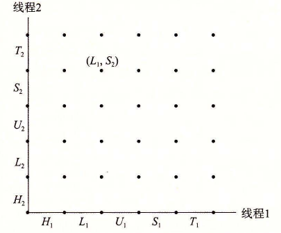
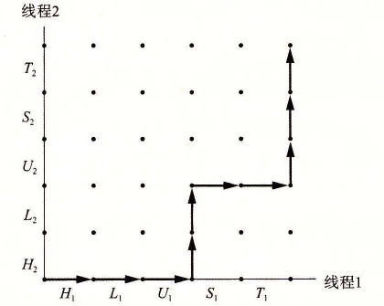
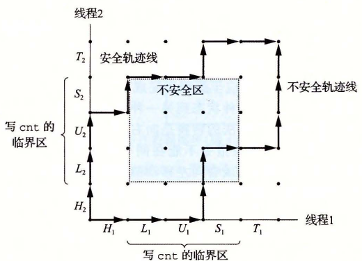

# 12.5.1 进度图

进度图（progress graph）将 n 个并发线程的执行模型化为一条 n 维笛卡儿空间中的轨迹线。每条轴 k 对应于线程 k 的进度。每个点 (I1, I2, …, In) 代表线程 k（k=1, …, n）已经完成了指令 Ik 这一状态。图的原点对应于没有任何线程完成一条指令的初始状态。

图 12-19 展示了 `badcnt.c` 程序第一次循环迭代的二维进度图。水平轴对应于线程 1，垂直轴对应于线程 2。点 (L1, S2) 对应于线程 1 完成了 L1 而线程 2 完成了 S2 的状态。

**图 12-19**　`badcnt.c` 第一次循环迭代的进度图

进度图将指令执行模型化为从一种状态到另一种状态的转换（transition）。转换被表示为一条从一点到相邻点的有向边。合法的转换是向右（线程 1 中的一条指令完成）或者向上（线程 2 中的一条指令完成）的。两条指令不能在同一时刻完成——对角线转换是不允许的。程序决不会反向运行，所以向下或者向左移动的转换也是不合法的。

一个程序的执行历史被模型化为状态空间中的一条轨迹线。图 12-20 展示了下面指令顺序对应的轨迹线：

> H1, L1, U1, H2, L2, S1, T1, U2, S2, T2

**图 12-20**　一个轨迹线示例

对于线程 i，操作共享变量 `cnt` 内容的指令（Li、Ui、Si）构成了一个（关于共享变量 `cnt` 的）临界区（critical section），这个临界区不应该和其他进程的临界区交替执行。换句话说，我们想要确保每个线程在执行它的临界区中的指令时，拥有对共享变量的互斥的访问（mutually exclusive access）。通常这种现象称为互斥（mutual exclusion）。

在进度图中，两个临界区的交集形成的状态空间区域称为不安全区（unsafe region）。图 12-21 展示了变量 `cnt` 的不安全区。注意，不安全区和与它交界的状态相毗邻，但并不包括这些状态。例如，状态 (H1, H2) 和 (S1, U2) 毗邻不安全区，但是它们并不是不安全区的一部分。绕开不安全区的轨迹线叫做安全轨迹线（safe trajectory）。相反，接触到任何不安全区的轨迹线就叫做不安全轨迹线（unsafe trajectory）。图 12-21 给出了示例程序 `badcnt.c` 的状态空间中的安全和不安全轨迹线。上面的轨迹线绕开了不安全区域的左边和上边，所以是安全的。下面的轨迹线穿越不安全区，因此是不安全的。

**图 12-21**　安全和不安全轨迹线。临界区的交集形成了不安全区。绕开不安全区的轨迹线能够正确更新计数器变量

任何安全轨迹线都将正确地更新共享计数器。为了保证线程化程序示例的正确执行（实际上任何共享全局数据结构的并发程序的正确执行），我们必须以某种方式同步线程，使它们总是有一条安全轨迹线。一个经典的方法是基于信号量的思想，接下来我们就介绍它。

**练习题 12.8**　使用图 12-21 中的进度图，将下列轨迹线划分为安全的或者不安全的。

A. H1, L1, U1, S1, H2, L2, U2, S2, T2, T1

B. H2, L2, H1, L1, U1, S1, T1, U2, S2, T2

C. H1, H2, L2, U2, S2, L1, U1, S1, T1, T2
