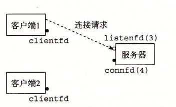
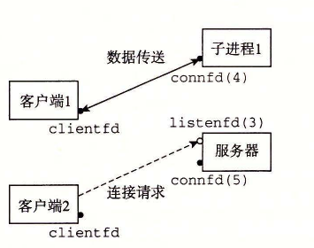
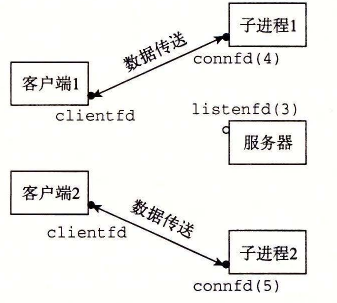
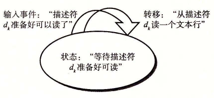
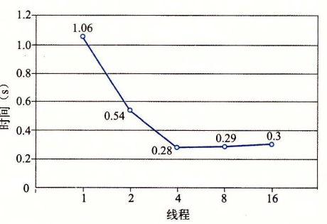
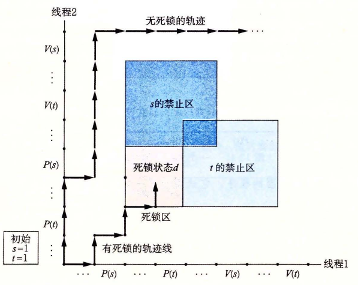
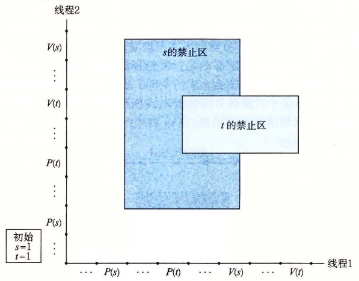

# 第 12 章 并发编程

[返回总目录](../README.md) · [上一章](../第11章-网络编程/README.md) · [下一篇：附录 A](../附录A-错误处理/README.md) · [按小节阅读](README.md) · [练习题答案](练习题答案.md)

## 本章目录

- [第 12 章 并发编程](#第-12-章-并发编程)
  - [12.1 基于进程的并发编程](#121-基于进程的并发编程)
    - [12.1.1 基于进程的并发服务器](#1211-基于进程的并发服务器)
    - [12.1.2 进程的优劣](#1212-进程的优劣)
  - [12.2 基于 I/O 多路复用的并发编程](#122-基于-io-多路复用的并发编程)
    - [12.2.1 基于 I/O 多路复用的并发事件驱动服务器](#1221-基于-io-多路复用的并发事件驱动服务器)
    - [12.2.2 I/O 多路复用技术的优劣](#1222-io-多路复用技术的优劣)
  - [12.3 基于线程的并发编程](#123-基于线程的并发编程)
    - [12.3.1 线程执行模型](#1231-线程执行模型)
    - [12.3.2 Posix 线程](#1232-posix-线程)
    - [12.3.3 创建线程](#1233-创建线程)
    - [12.3.4 终止线程](#1234-终止线程)
    - [12.3.5 回收已终止线程的资源](#1235-回收已终止线程的资源)
    - [12.3.6 分离线程](#1236-分离线程)
    - [12.3.7 初始化线程](#1237-初始化线程)
    - [12.3.8 基于线程的并发服务器](#1238-基于线程的并发服务器)
  - [12.4 多线程程序中的共享变量](#124-多线程程序中的共享变量)
    - [12.4.1 线程内存模型](#1241-线程内存模型)
    - [12.4.2 将变量映射到内存](#1242-将变量映射到内存)
    - [12.4.3 共享变量](#1243-共享变量)
  - [12.5 用信号量同步线程](#125-用信号量同步线程)
    - [12.5.1 进度图](#1251-进度图)
    - [12.5.2 信号量](#1252-信号量)
    - [12.5.3 使用信号量来实现互斥](#1253-使用信号量来实现互斥)
    - [12.5.4 利用信号量来调度共享资源](#1254-利用信号量来调度共享资源)
    - [12.5.5 综合：基于预线程化的并发服务器](#1255-综合基于预线程化的并发服务器)
  - [12.6 使用线程提高并行性](#126-使用线程提高并行性)
  - [12.7 其他并发问题](#127-其他并发问题)
    - [12.7.1 线程安全](#1271-线程安全)
    - [12.7.2 可重入性](#1272-可重入性)
    - [12.7.3 在线程化的程序中使用已存在的库函数](#1273-在线程化的程序中使用已存在的库函数)
    - [12.7.4 竞争](#1274-竞争)
    - [12.7.5 死锁](#1275-死锁)
  - [12.8 小结](#128-小结)
- [参考文献说明](#参考文献说明)
- [家庭作业](#家庭作业)

## 第 12 章 并发编程

正如我们在第 8 章学到的，如果逻辑控制流在时间上重叠，那么它们就是并发的（concurrent）。这种常见的现象称为并发（concurrency），出现在计算机系统的许多不同层面上。硬件异常处理程序、进程和 Linux 信号处理程序都是大家很熟悉的例子。

到目前为止，我们主要将并发看做是一种操作系统内核用来运行多个应用程序的机制。但是，并发不仅仅局限于内核。它也可以在应用程序中扮演重要角色。例如，我们已经看到 Linux 信号处理程序如何允许应用响应异步事件，例如用户键入 Ctrl+C，或者程序访问虚拟内存的一个未定义的区域。应用级并发在其他情况下也是很有用的：

- **访问慢速 I/O 设备。** 当一个应用正在等待来自慢速 I/O 设备（例如磁盘）的数据到达时，内核会运行其他进程，使 CPU 保持繁忙。每个应用都可以按照类似的方式，通过交替执行 I/O 请求和其他有用的工作来利用并发。
- **与人交互。** 和计算机交互的人要求计算机有同时执行多个任务的能力。例如，他们在打印一个文档时，可能想要调整一个窗口的大小。现代视窗系统利用并发来提供这种能力。每次用户请求某种操作（比如通过单击鼠标）时，一个独立的并发逻辑流被创建来执行这个操作。
- **通过推迟工作以降低延迟。** 有时，应用程序能够通过推迟其他操作和并发地执行它们，利用并发来降低某些操作的延迟。比如，一个动态内存分配器可以通过推迟合并，把它放到一个运行在较低优先级上的并发“合并”流中，在有空闲的 CPU 周期时充分利用这些空闲周期，从而降低单个 `free` 操作的延迟。
- **服务多个网络客户端。** 我们在第 11 章中学习的迭代网络服务器是不现实的，因为它们一次只能为一个客户端提供服务。因此，一个慢速的客户端可能会导致服务器拒绝为所有其他客户端服务。对于一个真正的服务器来说，可能期望它每秒为成百上千的客户端提供服务，由于一个慢速客户端导致拒绝为其他客户端服务，这是不能接受的。一个更好的方法是创建一个并发服务器，它为每个客户端创建一个单独的逻辑流。这就允许服务器同时为多个客户端服务，并且也避免了慢速客户端独占服务器。
- **在多核机器上进行并行计算。** 许多现代系统都配备多核处理器，多核处理器中包含有多个 CPU。被划分成并发流的应用程序通常在多核机器上比在单处理器机器上运行得快，因为这些流会并行执行，而不是交错执行。

使用应用级并发的应用程序称为并发程序（concurrent program）。现代操作系统提供了三种基本的构造并发程序的方法：

- **进程。** 用这种方法，每个逻辑控制流都是一个进程，由内核来调度和维护。因为进程有独立的虚拟地址空间，想要和其他流通信，控制流必须使用某种显式的进程间通信（interprocess communication，IPC）机制。
- **I/O 多路复用。** 在这种形式的并发编程中，应用程序在一个进程的上下文中显式地调度它们自己的逻辑流。逻辑流被模型化为状态机，数据到达文件描述符后，主程序显式地从一个状态转换到另一个状态。因为程序是一个单独的进程，所以所有的流都共享同一个地址空间。
- **线程。** 线程是运行在一个单一进程上下文中的逻辑流，由内核进行调度。你可以把线程看成是其他两种方式的混合体，像进程流一样由内核进行调度，而像 I/O 多路复用流一样共享同一个虚拟地址空间。

本章研究这三种不同的并发编程技术。为了使我们的讨论比较具体，我们始终以同一个应用为例——11.4.9 节中的迭代 echo 服务器的并发版本。

### 12.1 基于进程的并发编程

构造并发程序最简单的方法就是用进程，使用那些大家都很熟悉的函数，像 `fork`、`exec` 和 `waitpid`。例如，一个构造并发服务器的自然方法就是，在父进程中接受客户端连接请求，然后创建一个新的子进程来为每个新客户端提供服务。

为了解这是如何工作的，假设我们有两个客户端和一个服务器，服务器正在监听一个监听描述符（比如描述符 3）上的连接请求。现在假设服务器接受了客户端 1 的连接请求，并返回一个已连接描述符（比如描述符 4），如图 12-1 所示。在接受连接请求之后，服务器派生一个子进程，这个子进程获得服务器描述符表的完整副本。子进程关闭它的副本中的监听描述符 3，而父进程关闭它的已连接描述符 4 的副本，因为不再需要这些描述符了。这就得到了图 12-2 中的状态，其中子进程正忙于为客户端提供服务。



**图 12-1** 第一步：服务器接受客户端的连接请求


**图 12-2** 第二步：服务器派生一个子进程为这个客户端服务

因为父、子进程中的已连接描述符都指向同一个文件表表项，所以父进程关闭它的已连接描述符的副本是至关重要的。否则，将永不会释放已连接描述符 4 的文件表条目，而且由此引起的内存泄漏将最终消耗光可用的内存，使系统崩溃。

现在，假设在父进程为客户端 1 创建了子进程之后，它接受一个新的客户端 2 的连接请求，并返回一个新的已连接描述符（比如描述符 5），如图 12-3 所示。然后，父进程又派生另一个子进程，这个子进程用已连接描述符 5 为它的客户端提供服务，如图 12-4 所示。此时，父进程正在等待下一个连接请求，而两个子进程正在并发地为它们各自的客户端提供服务。



**图 12-3** 第三步：服务器接受另一个连接请求



**图 12-4** 第四步：服务器派生另一个子进程为新的客户端服务

#### 12.1.1 基于进程的并发服务器

图 12-5 展示了一个基于进程的并发 echo 服务器的代码。第 29 行调用的 `echo` 函数来自于图 11-21。关于这个服务器，有几点重要内容需要说明：

- 首先，通常服务器会运行很长的时间，所以我们必须要包括一个 `SIGCHLD` 处理程序，来回收僵死（zombie）子进程的资源（第 4～9 行）。因为当 `SIGCHLD` 处理程序执行时，`SIGCHLD` 信号是阻塞的，而 Linux 信号是不排队的，所以 `SIGCHLD` 处理程序必须准备好回收多个僵死子进程的资源。
- 其次，父子进程必须关闭它们各自的 `connfd`（分别为第 33 行和第 30 行）副本。就像我们已经提到过的，这对父进程而言尤为重要，它必须关闭它的已连接描述符，以避免内存泄漏。
- 最后，因为套接字的文件表表项中的引用计数，直到父子进程的 `connfd` 都关闭了，到客户端的连接才会终止。

`code/conc/echoserverp.c`

```c
#include "csapp.h"
void echo(int connfd);

void sigchld_handler(int sig)
{
    while (waitpid(-1, 0, WNOHANG) > 0)
        ;
    return;
}

int main(int argc, char **argv)
{
    int listenfd, connfd;
    socklen_t clientlen;
    struct sockaddr_storage clientaddr;

    if (argc != 2) {
        fprintf(stderr, "usage: %s <port>\n", argv[0]);
        exit(0);
    }

    Signal(SIGCHLD, sigchld_handler);
    listenfd = Open_listenfd(argv[1]);
    while (1) {
        clientlen = sizeof(struct sockaddr_storage);
        connfd = Accept(listenfd, (SA *) &clientaddr, &clientlen);
        if (Fork() == 0) {
            Close(listenfd); /* Child closes its listening socket */
            echo(connfd);    /* Child services client */
            Close(connfd);   /* Child closes connection with client */
            exit(0);         /* Child exits */
        }
        Close(connfd); /* Parent closes connected socket (important!) */
    }
}
```

**图 12-5** 基于进程的并发 echo 服务器。父进程派生一个子进程来处理每个新的连接请求

#### 12.1.2 进程的优劣

对于在父、子进程间共享状态信息，进程有一个非常清晰的模型：共享文件表，但是不共享用户地址空间。进程有独立的地址空间既是优点也是缺点。这样一来，一个进程不可能不小心覆盖另一个进程的虚拟内存，这就消除了许多令人迷惑的错误——这是一个明显的优点。

另一方面，独立的地址空间使得进程共享状态信息变得更加困难。为了共享信息，它们必须使用显式的 IPC（进程间通信）机制。（参见下面的旁注。）基于进程的设计的另一个缺点是，它们往往比较慢，因为进程控制和 IPC 的开销很高。

> **旁注 Unix IPC**
>
> 在本书中，你已经遇到好几个 IPC 的例子了。第 8 章中的 `waitpid` 函数和信号是基本的 IPC 机制，它们允许进程发送小消息到同一主机上的其他进程。第 11 章的套接字接口是 IPC 的一种重要形式，它允许不同主机上的进程交换任意的字节流。然而，术语 Unix IPC 通常指的是所有允许进程和同一台主机上其他进程进行通信的技术。其中包括管道、先进先出（FIFO）、系统 V 共享内存，以及系统 V 信号量（semaphore）。这些机制超出了我们的讨论范围。Kerrisk 的著作 [62] 是很好的参考资料。

**练习题 12.1** 在图 12-5 中，并发服务器的第 33 行上，父进程关闭了已连接描述符后，子进程仍然能够使用该描述符和客户端通信。为什么？

**练习题 12.2** 如果我们要删除图 12-5 中关闭已连接描述符的第 30 行，从没有内存泄漏的角度来说，代码将仍然是正确的。为什么？

### 12.2 基于 I/O 多路复用的并发编程

假设要求你编写一个 echo 服务器，它也能对用户从标准输入键入的交互命令做出响应。在这种情况下，服务器必须响应两个互相独立的 I/O 事件：1）网络客户端发起连接请求，2）用户在键盘上键入命令行。我们先等待哪个事件呢？没有哪个选择是理想的。如果在 `accept` 中等待一个连接请求，我们就不能响应输入的命令。类似地，如果在 `read` 中等待一个输入命令，我们就不能响应任何连接请求。

针对这种困境的一个解决办法就是 I/O 多路复用（I/O multiplexing）技术。基本的思路就是使用 `select` 函数，要求内核挂起进程，只有在一个或多个 I/O 事件发生后，才将控制返回给应用程序，就像在下面的示例中一样：

- 当集合 {0, 4} 中任意描述符准备好读时返回。
- 当集合 {1, 2, 7} 中任意描述符准备好写时返回。
- 如果在等待一个 I/O 事件发生时过了 152.13 秒，就超时。

`select` 是一个复杂的函数，有许多不同的使用场景。我们将只讨论第一种场景：等待一组描述符准备好读。全面的讨论请参考 [62, 110]。

```c
#include <sys/select.h>

int select(int n, fd_set *fdset, NULL, NULL, NULL);
```

返回已准备好的描述符的非零的个数，若出错则为 -1。

```c
FD_ZERO(fd_set *fdset);            /* Clear all bits in fdset */
FD_CLR(int fd, fd_set *fdset);     /* Clear bit fd in fdset */
FD_SET(int fd, fd_set *fdset);     /* Turn on bit fd in fdset */
FD_ISSET(int fd, fd_set *fdset);   /* Is bit fd in fdset on? */
```

处理描述符集合的宏。

`select` 函数处理类型为 `fd_set` 的集合，也叫做描述符集合。逻辑上，我们将描述符集合看成一个大小为 n 的位向量（在 2.1 节中介绍过）：

b<sub>n-1</sub>, …, b<sub>1</sub>, b<sub>0</sub>

每个位 b<sub>k</sub> 对应于描述符 k。当且仅当 b<sub>k</sub>=1，描述符 k 才表明是描述符集合的一个元素。只允许你对描述符集合做三件事：1）分配它们，2）将一个此种类型的变量赋值给另一个变量，3）用 `FD_ZERO`、`FD_SET`、`FD_CLR` 和 `FD_ISSET` 宏来修改和检查它们。

针对我们的目的，`select` 函数有两个输入：一个称为读集合的描述符集合（`fdset`）和该读集合的基数（n）（实际上是任何描述符集合的最大基数）。`select` 函数会一直阻塞，直到读集合中至少有一个描述符准备好可以读。当且仅当一个从该描述符读取一个字节的请求不会阻塞时，描述符 k 就表示准备好可以读了。`select` 有一个副作用，它修改参数 `fdset` 指向的 `fd_set`，指明读集合的一个子集，称为准备好集合（ready set），这个集合是由读集合中准备好可以读了的描述符组成的。该函数返回的值指明了准备好集合的基数。注意，由于这个副作用，我们必须在每次调用 `select` 时都更新读集合。

理解 `select` 的最好办法是研究一个具体例子。图 12-6 展示了可以如何利用 `select` 来实现一个迭代 echo 服务器，它也可以接受标准输入上的用户命令。一开始，我们用图 11-19 中的 `open_listenfd` 函数打开一个监听描述符（第 16 行），然后使用 `FD_ZERO` 创建一个空的读集合（第 18 行）：

```text
                    listenfd                 stdin
                       3       2       1       0
read_set (∅):       [ 0 ]   [ 0 ]   [ 0 ]   [ 0 ]
```

接下来，在第 19 和 20 行中，我们定义由描述符 0（标准输入）和描述符 3（监听描述符）组成的读集合：

```text
                    listenfd                 stdin
                       3       2       1       0
read_set ({0, 3}):  [ 1 ]   [ 0 ]   [ 0 ]   [ 1 ]
```

在这里，我们开始典型的服务器循环。但是我们不调用 `accept` 函数来等待一个连接请求，而是调用 `select` 函数，这个函数会一直阻塞，直到监听描述符或者标准输入准备好可以读（第 24 行）。例如，下面是当用户按回车键，因此使得标准输入描述符变为可读时，`select` 会返回的 `ready_set` 的值：

```text
                    listenfd                 stdin
                       3       2       1       0
ready_set ({0}):    [ 0 ]   [ 0 ]   [ 0 ]   [ 1 ]
```

一旦 `select` 返回，我们就用 `FD_ISSET` 宏指令来确定哪个描述符准备好可以读了。如果是标准输入准备好了（第 25 行），我们就调用 `command` 函数，该函数在返回到主程序前，会读、解析和响应命令。如果是监听描述符准备好了（第 27 行），我们就调用 `accept` 来得到一个已连接描述符，然后调用图 11-22 中的 `echo` 函数，它会将来自客户端的每一行又回送回去，直到客户端关闭这个连接中它的那一端。

虽然这个程序是使用 `select` 的一个很好示例，但是它仍然留下了一些问题待解决。问题是一旦它连接到某个客户端，就会连续回送输入行，直到客户端关闭这个连接中它的那一端。因此，如果键入一个命令到标准输入，你将不会得到响应，直到服务器和客户端之间结束。一个更好的方法是更细粒度的多路复用，服务器每次循环（至多）回送一个文本行。

`code/conc/select.c`

```c
#include "csapp.h"
void echo(int connfd);
void command(void);

int main(int argc, char **argv)
{
    int listenfd, connfd;
    socklen_t clientlen;
    struct sockaddr_storage clientaddr;
    fd_set read_set, ready_set;

    if (argc != 2) {
        fprintf(stderr, "usage: %s <port>\n", argv[0]);
        exit(0);
    }

    listenfd = Open_listenfd(argv[1]);

    FD_ZERO(&read_set);                /* Clear read set */
    FD_SET(STDIN_FILENO, &read_set);   /* Add stdin to read set */
    FD_SET(listenfd, &read_set);       /* Add listenfd to read set */

    while (1) {
        ready_set = read_set;
        Select(listenfd+1, &ready_set, NULL, NULL, NULL);
        if (FD_ISSET(STDIN_FILENO, &ready_set))
            command(); /* Read command line from stdin */
        if (FD_ISSET(listenfd, &ready_set)) {
            clientlen = sizeof(struct sockaddr_storage);
            connfd = Accept(listenfd, (SA *)&clientaddr, &clientlen);
            echo(connfd); /* Echo client input until EOF */
            Close(connfd);
        }
    }
}

void command(void) {
    char buf[MAXLINE];

    if (!Fgets(buf, MAXLINE, stdin))
        exit(0); /* EOF */
    printf("%s", buf); /* Process the input command */
}
```

**图 12-6** 使用 I/O 多路复用的迭代 echo 服务器。服务器使用 `select` 等待监听描述符上的连接请求和标准输入上的命令

**练习题 12.3** 在 Linux 系统里，在标准输入上键入 Ctrl+D 表示 EOF。图 12-6 中的程序阻塞在对 `select` 的调用上时，如果你键入 Ctrl+D 会发生什么？

#### 12.2.1 基于 I/O 多路复用的并发事件驱动服务器

I/O 多路复用可以用做并发事件驱动（event-driven）程序的基础，在事件驱动程序中，某些事件会导致流向前推进。一般的思路是将逻辑流模型化为状态机。不严格地说，一个状态机（state machine）就是一组状态（state）、输入事件（input event）和转移（transition），其中转移是将状态和输入事件映射到状态。每个转移是将一个（输入状态，输入事件）对映射到一个输出状态。自循环（self-loop）是同一输入和输出状态之间的转移。通常把状态机画成有向图，其中节点表示状态，有向弧表示转移，而弧上的标号表示输入事件。一个状态机从某种初始状态开始执行。每个输入事件都会引发一个从当前状态到下一状态的转移。

对于每个新的客户端 k，基于 I/O 多路复用的并发服务器会创建一个新的状态机 s<sub>k</sub>，并将它和已连接描述符 d<sub>k</sub> 联系起来。如图 12-7 所示，每个状态机 s<sub>k</sub> 都有一个状态（“等待描述符 d<sub>k</sub> 准备好可读”）、一个输入事件（“描述符 d<sub>k</sub> 准备好可以读了”）和一个转移（“从描述符 d<sub>k</sub> 读一个文本行”）。



**图 12-7** 并发事件驱动 echo 服务器中逻辑流的状态机

服务器使用 I/O 多路复用，借助 `select` 函数检测输入事件的发生。当每个已连接描述符准备好可读时，服务器就为相应的状态机执行转移，在这里就是从描述符读和写回一个文本行。

图 12-8 展示了一个基于 I/O 多路复用的并发事件驱动服务器的完整示例代码。一个 `pool` 结构里维护着活动客户端的集合（第 3～11 行）。在调用 `init_pool` 初始化池（第 27 行）之后，服务器进入一个无限循环。在循环的每次迭代中，服务器调用 `select` 函数来检测两种不同类型的输入事件：a）来自一个新客户端的连接请求到达，b）一个已存在的客户端的已连接描述符准备好可以读了。当一个连接请求到达时（第 35 行），服务器打开连接（第 37 行），并调用 `add_client` 函数，将该客户端添加到池里（第 38 行）。最后，服务器调用 `check_clients` 函数，把来自每个准备好的已连接描述符的一个文本行回送回去（第 42 行）。

`code/conc/echoservers.c`

```c
#include "csapp.h"

typedef struct { /* Represents a pool of connected descriptors */
    int maxfd;        /* Largest descriptor in read_set */
    fd_set read_set;  /* Set of all active descriptors */
    fd_set ready_set; /* Subset of descriptors ready for reading */
    int nready;       /* Number of ready descriptors from select */
    int maxi;         /* High water index into client array */
    int clientfd[FD_SETSIZE];    /* Set of active descriptors */
    rio_t clientrio[FD_SETSIZE]; /* Set of active read buffers */
} pool;

int byte_cnt = 0; /* Counts total bytes received by server */

int main(int argc, char **argv)
{
    int listenfd, connfd;
    socklen_t clientlen;
    struct sockaddr_storage clientaddr;
    static pool pool;

    if (argc != 2) {
        fprintf(stderr, "usage: %s <port>\n", argv[0]);
        exit(0);
    }
    listenfd = Open_listenfd(argv[1]);
    init_pool(listenfd, &pool);

    while (1) {
        /* Wait for listening/connected descriptor(s) to become ready */
        pool.ready_set = pool.read_set;
        pool.nready = Select(pool.maxfd+1, &pool.ready_set, NULL, NULL, NULL);

        /* If listening descriptor ready, add new client to pool */
        if (FD_ISSET(listenfd, &pool.ready_set)) {
            clientlen = sizeof(struct sockaddr_storage);
            connfd = Accept(listenfd, (SA *)&clientaddr, &clientlen);
            add_client(connfd, &pool);
        }

        /* Echo a text line from each ready connected descriptor */
        check_clients(&pool);
    }
}
```

**图 12-8** 基于 I/O 多路复用的并发 echo 服务器。每次服务器迭代都回送来自每个准备好的描述符的文本行

`init_pool` 函数（图 12-9）初始化客户端池。`clientfd` 数组表示已连接描述符的集合，其中整数 -1 表示一个可用的槽位。初始时，已连接描述符集合是空的（第 5～7 行），而且监听描述符是 `select` 读集合中唯一的描述符（第 10～12 行）。

`code/conc/echoservers.c`

```c
void init_pool(int listenfd, pool *p)
{
    /* Initially, there are no connected descriptors */
    int i;
    p->maxi = -1;
    for (i = 0; i < FD_SETSIZE; i++)
        p->clientfd[i] = -1;

    /* Initially, listenfd is only member of select read set */
    p->maxfd = listenfd;
    FD_ZERO(&p->read_set);
    FD_SET(listenfd, &p->read_set);
}
```

**图 12-9** `init_pool` 初始化活动客户端池

`add_client` 函数（图 12-10）添加一个新的客户端到活动客户端池中。在 `clientfd` 数组中找到一个空槽位后，服务器将这个已连接描述符添加到数组中，并初始化相应的 RIO 读缓冲区，这样一来我们就能够对这个描述符调用 `rio_readlineb`（第 8～9 行）。然后，我们将这个已连接描述符添加到 `select` 读集合（第 12 行），并更新该池的一些全局属性。`maxfd` 变量（第 15～16 行）记录了 `select` 的最大文件描述符。`maxi` 变量（第 17～18 行）记录的是到 `clientfd` 数组的最大索引，这样 `check_clients` 函数就无需搜索整个数组了。

`code/conc/echoservers.c`

```c
void add_client(int connfd, pool *p)
{
    int i;
    p->nready--;
    for (i = 0; i < FD_SETSIZE; i++) /* Find an available slot */
        if (p->clientfd[i] < 0) {
            /* Add connected descriptor to the pool */
            p->clientfd[i] = connfd;
            Rio_readinitb(&p->clientrio[i], connfd);

            /* Add the descriptor to descriptor set */
            FD_SET(connfd, &p->read_set);

            /* Update max descriptor and pool high water mark */
            if (connfd > p->maxfd)
                p->maxfd = connfd;
            if (i > p->maxi)
                p->maxi = i;
            break;
        }
    if (i == FD_SETSIZE) /* Couldn't find an empty slot */
        app_error("add_client error: Too many clients");
}
```

**图 12-10** `add_client` 向池中添加一个新的客户端连接

图 12-11 中的 `check_clients` 函数回送来自每个准备好的已连接描述符的一个文本行。如果成功地从描述符读取了一个文本行，那么就将该文本行回送到客户端（第 15～18 行）。注意，在第 15 行我们维护着一个从所有客户端接收到的全部字节的累计值。如果因为客户端关闭这个连接中它的那一端，检测到 EOF，那么将关闭这边的连接端（第 23 行），并从池中清除掉这个描述符（第 24～25 行）。

根据图 12-7 中的有限状态模型，`select` 函数检测到输入事件，而 `add_client` 函数创建一个新的逻辑流（状态机）。`check_clients` 函数回送输入行，从而执行状态转移，而且当客户端完成文本行发送时，它还要删除这个状态机。

**练习题 12.4** 图 12-8 所示的服务器中，我们在每次调用 `select` 之前都立即小心地重新初始化 `pool.ready_set` 变量。为什么？

> **旁注 事件驱动的 Web 服务器**
>
> 尽管有 12.2.2 节中说明的缺点，现代高性能服务器（例如 Node.js、nginx 和 Tornado）使用的都是基于 I/O 多路复用的事件驱动的编程方式，主要是因为相比于进程和线程的方式，它有明显的性能优势。

`code/conc/echoservers.c`

```c
void check_clients(pool *p)
{
    int i, connfd, n;
    char buf[MAXLINE];
    rio_t rio;

    for (i = 0; (i <= p->maxi) && (p->nready > 0); i++) {
        connfd = p->clientfd[i];
        rio = p->clientrio[i];

        /* If the descriptor is ready, echo a text line from it */
        if ((connfd > 0) && (FD_ISSET(connfd, &p->ready_set))) {
            p->nready--;
            if ((n = Rio_readlineb(&rio, buf, MAXLINE)) != 0) {
                byte_cnt += n;
                printf("Server received %d (%d total) bytes on fd %d\n",
                       n, byte_cnt, connfd);
                Rio_writen(connfd, buf, n);
            }

            /* EOF detected, remove descriptor from pool */
            else {
                Close(connfd);
                FD_CLR(connfd, &p->read_set);
                p->clientfd[i] = -1;
            }
        }
    }
}
```

**图 12-11** `check_clients` 服务准备好的客户端连接

#### 12.2.2 I/O 多路复用技术的优劣

图 12-8 中的服务器提供了一个很好的基于 I/O 多路复用的事件驱动编程的优缺点示例。事件驱动设计的一个优点是，它比基于进程的设计给了程序员更多的对程序行为的控制。例如，我们可以设想编写一个事件驱动的并发服务器，为某些客户端提供它们需要的服务，而这对于基于进程的并发服务器来说，是很困难的。

另一个优点是，一个基于 I/O 多路复用的事件驱动服务器是运行在单一进程上下文中的，因此每个逻辑流都能访问该进程的全部地址空间。这使得在流之间共享数据变得很容易。一个与作为单个进程运行相关的优点是，你可以利用熟悉的调试工具，例如 GDB，来调试你的并发服务器，就像对顺序程序那样。最后，事件驱动设计常常比基于进程的设计要高效得多，因为它们不需要进程上下文切换来调度新的流。

事件驱动设计一个明显的缺点就是编码复杂。我们的事件驱动的并发 echo 服务器需要的代码比基于进程的服务器多三倍，并且很不幸，随着并发粒度的减小，复杂性还会上升。这里的粒度是指每个逻辑流每个时间片执行的指令数量。例如，在示例并发服务器中，并发粒度就是读一个完整的文本行所需要的指令数量。只要某个逻辑流正忙于读一个文本行，其他逻辑流就不可能有进展。对我们的例子来说这没有问题，但是它使得在“故意只发送部分文本行然后就停止”的恶意客户端的攻击面前，我们的事件驱动服务器显得很脆弱。修改事件驱动服务器来处理部分文本行不是一个简单的任务，但是基于进程的设计却能处理得很好，而且是自动处理的。基于事件的设计另一个重要的缺点是它们不能充分利用多核处理器。

### 12.3 基于线程的并发编程

到目前为止，我们已经看到了两种创建并发逻辑流的方法。在第一种方法中，我们为每个流使用了单独的进程。内核会自动调度每个进程，而每个进程有它自己的私有地址空间，这使得流共享数据很困难。在第二种方法中，我们创建自己的逻辑流，并利用 I/O 多路复用来显式地调度流。因为只有一个进程，所有的流共享整个地址空间。本节介绍第三种方法——基于线程，它是这两种方法的混合。

线程（thread）就是运行在进程上下文中的逻辑流。在本书里迄今为止，程序都是由每个进程中一个线程组成的。但是现代系统也允许我们编写一个进程里同时运行多个线程的程序。线程由内核自动调度。每个线程都有它自己的线程上下文（thread context），包括一个唯一的整数线程 ID（Thread ID，TID）、栈、栈指针、程序计数器、通用目的寄存器和条件码。所有的运行在一个进程里的线程共享该进程的整个虚拟地址空间。

基于线程的逻辑流结合了基于进程和基于 I/O 多路复用的流的特性。同进程一样，线程由内核自动调度，并且内核通过一个整数 ID 来识别线程。同基于 I/O 多路复用的流一样，多个线程运行在单一进程的上下文中，因此共享这个进程虚拟地址空间的所有内容，包括它的代码、数据、堆、共享库和打开的文件。

#### 12.3.1 线程执行模型

多线程的执行模型在某些方面和多进程的执行模型是相似的。思考图 12-12 中的示例。每个进程开始生命周期时都是单一线程，这个线程称为主线程（main thread）。在某一时刻，主线程创建一个对等线程（peer thread），从这个时间点开始，两个线程就并发地运行。最后，因为主线程执行一个慢速系统调用，例如 `read` 或者 `sleep`，或者因为被系统的间隔计时器中断，控制就会通过上下文切换传递到对等线程。对等线程会执行一段时间，然后控制传递回主线程，依次类推。


**图 12-12** 并发线程执行

在一些重要的方面，线程执行是不同于进程的。因为一个线程的上下文要比一个进程的上下文小得多，线程的上下文切换要比进程的上下文切换快得多。另一个不同就是线程不像进程那样，不是按照严格的父子层次来组织的。和一个进程相关的线程组成一个对等（线程）池，独立于其他线程创建的线程。主线程和其他线程的区别仅在于它总是进程中第一个运行的线程。对等（线程）池概念的主要影响是，一个线程可以杀死它的任何对等线程，或者等待它的任意对等线程终止。另外，每个对等线程都能读写相同的共享数据。

#### 12.3.2 Posix 线程

Posix 线程（Pthreads）是在 C 程序中处理线程的一个标准接口。它最早出现在 1995 年，而且在所有的 Linux 系统上都可用。Pthreads 定义了大约 60 个函数，允许程序创建、杀死和回收线程，与对等线程安全地共享数据，还可以通知对等线程系统状态的变化。

图 12-13 展示了一个简单的 Pthreads 程序。主线程创建一个对等线程，然后等待它的终止。对等线程输出“Hello, world!\n”并且终止。当主线程检测到对等线程终止后，它就通过调用 `exit` 终止该进程。这是我们看到的第一个线程化的程序，所以让我们仔细地解析它。线程的代码和本地数据被封装在一个线程例程（thread routine）中。正如第二行里的原型所示，每个线程例程都以一个通用指针作为输入，并返回一个通用指针。如果想传递多个参数给线程例程，那么你应该将参数放到一个结构中，并传递一个指向该结构的指针。相似地，如果想要线程例程返回多个参数，你可以返回一个指向一个结构的指针。

*code/conc/hello.c*

```c
#include "csapp.h"
void *thread(void *vargp);

int main()
{
    pthread_t tid;
    Pthread_create(&tid, NULL, thread, NULL);
    Pthread_join(tid, NULL);
    exit(0);
}

void *thread(void *vargp) /* Thread routine */
{
    printf("Hello, world!\n");
    return NULL;
}
```

**图 12-13** `hello.c`：使用 Pthreads 的“Hello, world!”程序

第 4 行标出了主线程代码的开始。主线程声明了一个本地变量 `tid`，可以用来存放对等线程的 ID（第 6 行）。主线程通过调用 `pthread_create` 函数创建一个新的对等线程（第 7 行）。当对 `pthread_create` 的调用返回时，主线程和新创建的对等线程同时运行，并且 `tid` 包含新线程的 ID。通过在第 8 行调用 `pthread_join`，主线程等待对等线程终止。最后，主线程调用 `exit`（第 9 行），终止当时运行在这个进程中的所有线程（在这个示例中就只有主线程）。

第 12～16 行定义了对等线程的例程。它只打印一个字符串，然后就通过执行第 15 行中的 `return` 语句来终止对等线程。

#### 12.3.3 创建线程

线程通过调用 `pthread_create` 函数来创建其他线程。

```c
#include <pthread.h>
typedef void *(func)(void *);

int pthread_create(pthread_t *tid, pthread_attr_t *attr,
                   func *f, void *arg);
```

若成功则返回 0，若出错则为非零。

`pthread_create` 函数创建一个新的线程，并带着一个输入变量 `arg`，在新线程的上下文中运行线程例程 `f`。能用 `attr` 参数来改变新创建线程的默认属性。改变这些属性已超出我们学习的范围，在我们的示例中，总是用一个为 `NULL` 的 `attr` 参数来调用 `pthread_create` 函数。

当 `pthread_create` 返回时，参数 `tid` 包含新创建线程的 ID。新线程可以通过调用 `pthread_self` 函数来获得它自己的线程 ID。

```c
#include <pthread.h>

pthread_t pthread_self(void);
```

返回调用者的线程 ID。

#### 12.3.4 终止线程

一个线程是以下列方式之一来终止的：

- 当顶层的线程例程返回时，线程会隐式地终止。
- 通过调用 `pthread_exit` 函数，线程会显式地终止。如果主线程调用 `pthread_exit`，它会等待所有其他对等线程终止，然后再终止主线程和整个进程，返回值为 `thread_return`。

```c
#include <pthread.h>

void pthread_exit(void *thread_return);
```

从不返回。

- 某个对等线程调用 Linux 的 `exit` 函数，该函数终止进程以及所有与该进程相关的线程。
- 另一个对等线程通过以当前线程 ID 作为参数调用 `pthread_cancel` 函数来终止当前线程。

```c
#include <pthread.h>

int pthread_cancel(pthread_t tid);
```

若成功则返回 0，若出错则为非零。

#### 12.3.5 回收已终止线程的资源

线程通过调用 `pthread_join` 函数等待其他线程终止。

```c
#include <pthread.h>

int pthread_join(pthread_t tid, void **thread_return);
```

若成功则返回 0，若出错则为非零。

`pthread_join` 函数会阻塞，直到线程 `tid` 终止，将线程例程返回的通用（`void *`）指针赋值为 `thread_return` 指向的位置，然后回收已终止线程占用的所有内存资源。

注意，和 Linux 的 `wait` 函数不同，`pthread_join` 函数只能等待一个指定的线程终止。没有办法让 `pthread_wait` 等待任意一个线程终止。这使得代码更加复杂，因为它迫使我们去使用其他一些不那么直观的机制来检测进程的终止。实际上，Stevens 在 [110] 中就很有说服力地论证了这是规范中的一个错误。

#### 12.3.6 分离线程

在任何一个时间点上，线程是可结合的（joinable）或者是分离的（detached）。一个可结合的线程能够被其他线程收回和杀死。在被其他线程回收之前，它的内存资源（例如栈）是不释放的。相反，一个分离的线程是不能被其他线程回收或杀死的。它的内存资源在它终止时由系统自动释放。

默认情况下，线程被创建成可结合的。为了避免内存泄漏，每个可结合线程都应该要么被其他线程显式地收回，要么通过调用 `pthread_detach` 函数被分离。

```c
#include <pthread.h>

int pthread_detach(pthread_t tid);
```

若成功则返回 0，若出错则为非零。

`pthread_detach` 函数分离可结合线程 `tid`。线程能够通过以 `pthread_self()` 为参数的 `pthread_detach` 调用来分离它们自己。

尽管我们的一些例子会使用可结合线程，但是在现实程序中，有很好的理由要使用分离的线程。例如，一个高性能 Web 服务器可能在每次收到 Web 浏览器的连接请求时都创建一个新的对等线程。因为每个连接都是由一个单独的线程独立处理的，所以对于服务器而言，就很没有必要（实际上也不愿意）显式地等待每个对等线程终止。在这种情况下，每个对等线程都应该在它开始处理请求之前分离它自身，这样就能在它终止后回收它的内存资源了。

#### 12.3.7 初始化线程

`pthread_once` 函数允许你初始化与线程例程相关的状态。

```c
#include <pthread.h>

pthread_once_t once_control = PTHREAD_ONCE_INIT;

int pthread_once(pthread_once_t *once_control,
                 void (*init_routine)(void));
```

总是返回 0。

`once_control` 变量是一个全局或者静态变量，总是被初始化为 `PTHREAD_ONCE_INIT`。当你第一次用参数 `once_control` 调用 `pthread_once` 时，它调用 `init_routine`，这是一个没有输入参数、也不返回什么的函数。接下来的以 `once_control` 为参数的 `pthread_once` 调用不做任何事情。无论何时，当你需要动态初始化多个线程共享的全局变量时，`pthread_once` 函数是很有用的。我们将在 12.5.5 节里看到一个示例。

#### 12.3.8 基于线程的并发服务器

图 12-14 展示了基于线程的并发 echo 服务器的代码。整体结构类似于基于进程的设计。主线程不断地等待连接请求，然后创建一个对等线程处理该请求。虽然代码看似简单，但是有几个普遍而且有些微妙的问题需要我们更仔细地看一看。第一个问题是当我们调用 `pthread_create` 时，如何将已连接描述符传递给对等线程。最明显的方法就是传递一个指向这个描述符的指针，就像下面这样

```c
connfd = Accept(listenfd, (SA *) &clientaddr, &clientlen);
Pthread_create(&tid, NULL, thread, &connfd);
```

然后，我们让对等线程间接引用这个指针，并将它赋值给一个局部变量，如下所示

```c
void *thread(void *vargp) {
    int connfd = *((int *)vargp);
    ...
}
```

*code/conc/echoservert.c*

```c
#include "csapp.h"

void echo(int connfd);
void *thread(void *vargp);

int main(int argc, char **argv)
{
    int listenfd, *connfdp;
    socklen_t clientlen;
    struct sockaddr_storage clientaddr;
    pthread_t tid;

    if (argc != 2) {
        fprintf(stderr, "usage: %s <port>\n", argv[0]);
        exit(0);
    }
    listenfd = Open_listenfd(argv[1]);

    while (1) {
        clientlen=sizeof(struct sockaddr_storage);
        connfdp = Malloc(sizeof(int));
        *connfdp = Accept(listenfd, (SA *) &clientaddr, &clientlen);
        Pthread_create(&tid, NULL, thread, connfdp);
    }
}

/* Thread routine */
void *thread(void *vargp)
{
    int connfd = *((int *)vargp);
    Pthread_detach(pthread_self());
    Free(vargp);
    echo(connfd);
    Close(connfd);
    return NULL;
}
```

**图 12-14** 基于线程的并发 echo 服务器

然而，这样可能会出错，因为它在对等线程的赋值语句和主线程的 `accept` 语句间引入了竞争（race）。如果赋值语句在下一个 `accept` 之前完成，那么对等线程中的局部变量 `connfd` 就得到正确的描述符值。然而，如果赋值语句是在 `accept` 之后才完成的，那么对等线程中的局部变量 `connfd` 就得到下一次连接的描述符值。那么不幸的结果就是，现在两个线程在同一个描述符上执行输入和输出。为了避免这种潜在的致命竞争，我们必须将 `accept` 返回的每个已连接描述符分配到它自己的动态分配的内存块，如第 20～21 行所示。我们会在 12.7.4 节中回过来讨论竞争的问题。

另一个问题是在线程例程中避免内存泄漏。既然不显式地收回线程，就必须分离每个线程，使得在它终止时它的内存资源能够被收回（第 31 行）。更进一步，我们必须小心释放主线程分配的内存块（第 32 行）。

**练习题 12.5**　在图 12-5 中基于进程的服务器中，我们在两个位置小心地关闭了已连接描述符：父进程和子进程。然而，在图 12-14 中基于线程的服务器中，我们只在一个位置关闭了已连接描述符：对等线程。为什么？

### 12.4 多线程程序中的共享变量

从程序员的角度来看，线程很有吸引力的一个方面是多个线程很容易共享相同的程序变量。然而，这种共享也是很棘手的。为了编写正确的多线程程序，我们必须对所谓的共享以及它是如何工作的有很清楚的了解。

为了理解 C 程序中的一个变量是否是共享的，有一些基本的问题要解答：1) 线程的基础内存模型是什么？2) 根据这个模型，变量实例是如何映射到内存的？3) 最后，有多少线程引用这些实例？一个变量是共享的，当且仅当多个线程引用这个变量的某个实例。

为了让我们对共享的讨论具体化，我们将使用图 12-15 中的程序作为运行示例。尽管有些人为的痕迹，但是它仍然值得研究，因为它说明了关于共享的许多细微之处。示例程序由一个创建了两个对等线程的主线程组成。主线程传递一个唯一的 ID 给每个对等线程，每个对等线程利用这个 ID 输出一条个性化的信息，以及调用该线程例程的总次数。

#### 12.4.1 线程内存模型

一组并发线程运行在一个进程的上下文中。每个线程都有它自己独立的线程上下文，包括线程 ID、栈、栈指针、程序计数器、条件码和通用目的寄存器值。每个线程和其他线程一起共享进程上下文的剩余部分。这包括整个用户虚拟地址空间，它是由只读文本（代码）、读/写数据、堆以及所有的共享库代码和数据区域组成的。线程也共享相同的打开文件的集合。

从实际操作的角度来说，让一个线程去读或写另一个线程的寄存器值是不可能的。另一方面，任何线程都可以访问共享虚拟内存的任意位置。如果某个线程修改了一个内存位置，那么其他每个线程最终都能在它读这个位置时发现这个变化。因此，寄存器是从不共享的，而虚拟内存总是共享的。

各自独立的线程栈的内存模型不是那么整齐清楚的。这些栈被保存在虚拟地址空间的栈区域中，并且通常是被相应的线程独立地访问的。我们说通常而不是总是，是因为不同的线程栈是不对其他线程设防的。所以，如果一个线程以某种方式得到一个指向其他线程栈的指针，那么它就可以读写这个栈的任何部分。示例程序在第 26 行展示了这一点，其中对等线程直接通过全局变量 `ptr` 间接引用主线程的栈的内容。

*code/conc/sharing.c*

```c
#include "csapp.h"
#define N 2
void *thread(void *vargp);

char **ptr; /* Global variable */

int main()
{
    int i;
    pthread_t tid;
    char *msgs[N] = {
        "Hello from foo",
        "Hello from bar"
    };

    ptr = msgs;
    for (i = 0; i < N; i++)
        Pthread_create(&tid, NULL, thread, (void *)i);
    Pthread_exit(NULL);
}

void *thread(void *vargp)
{
    int myid = (int)vargp;
    static int cnt = 0;
    printf("[%d]: %s (cnt=%d)\n", myid, ptr[myid], ++cnt);
    return NULL;
}
```

**图 12-15** 说明共享不同方面的示例程序

#### 12.4.2 将变量映射到内存

多线程的 C 程序中变量根据它们的存储类型被映射到虚拟内存：

- **全局变量。** 全局变量是定义在函数之外的变量。在运行时，虚拟内存的读/写区域只包含每个全局变量的一个实例，任何线程都可以引用。例如，第 5 行声明的全局变量 `ptr` 在虚拟内存的读/写区域中有一个运行时实例。当一个变量只有一个实例时，我们只用变量名（在这里就是 `ptr`）来表示这个实例。
- **本地自动变量。** 本地自动变量就是定义在函数内部但是没有 `static` 属性的变量。在运行时，每个线程的栈都包含它自己的所有本地自动变量的实例。即使多个线程执行同一个线程例程时也是如此。例如，有一个本地变量 `tid` 的实例，它保存在主线程的栈中。我们用 `tid.m` 来表示这个实例。再来看一个例子，本地变量 `myid` 有两个实例，一个在对等线程 0 的栈内，另一个在对等线程 1 的栈内。我们将这两个实例分别表示为 `myid.p0` 和 `myid.p1`。
- **本地静态变量。** 本地静态变量是定义在函数内部并有 `static` 属性的变量。和全局变量一样，虚拟内存的读/写区域只包含在程序中声明的每个本地静态变量的一个实例。例如，即使示例程序中的每个对等线程都在第 25 行声明了 `cnt`，在运行时，虚拟内存的读/写区域中也只有一个 `cnt` 的实例。每个对等线程都读和写这个实例。

#### 12.4.3 共享变量

我们说一个变量 *v* 是共享的，当且仅当它的一个实例被一个以上的线程引用。例如，示例程序中的变量 `cnt` 就是共享的，因为它只有一个运行时实例，并且这个实例被两个对等线程引用。在另一方面，`myid` 不是共享的，因为它的两个实例中每一个都只被一个线程引用。然而，认识到像 `msgs` 这样的本地自动变量也能被共享是很重要的。

**练习题 12.6**

A. 利用 12.4 节中的分析，为图 12-15 中的示例程序在下表的每个条目中填写“是”或者“否”。在第一列中，符号 *v.t* 表示变量 *v* 的一个实例，它驻留在线程 *t* 的本地栈中，其中 *t* 要么是 m（主线程），要么是 p0（对等线程 0）或者 p1（对等线程 1）。

| 变量实例 | 主线程引用的？ | 对等线程0引用的？ | 对等线程1引用的？ |
| --- | --- | --- | --- |
| `ptr` |  |  |  |
| `cnt` |  |  |  |
| `i.m` |  |  |  |
| `msgs.m` |  |  |  |
| `myid.p0` |  |  |  |
| `myid.p1` |  |  |  |

B. 根据 A 部分的分析，变量 `ptr`、`cnt`、`i`、`msgs` 和 `myid` 哪些是共享的？

### 12.5 用信号量同步线程

共享变量是十分方便，但是它们也引入了同步错误（synchronization error）的可能性。考虑图 12-16 中的程序 `badcnt.c`，它创建了两个线程，每个线程都对共享计数变量 `cnt` 加 1。

`code/conc/badcnt.c`

```c
/* WARNING: This code is buggy! */
#include "csapp.h"

void *thread(void *vargp);  /* Thread routine prototype */

/* Global shared variable */
volatile long cnt = 0;  /* Counter */

int main(int argc, char **argv)
{
    long niters;
    pthread_t tid1, tid2;

    /* Check input argument */
    if (argc != 2) {
        printf("usage: %s <niters>\n", argv[0]);
        exit(0);
    }
    niters = atoi(argv[1]);

    /* Create threads and wait for them to finish */
    Pthread_create(&tid1, NULL, thread, &niters);
    Pthread_create(&tid2, NULL, thread, &niters);
    Pthread_join(tid1, NULL);
    Pthread_join(tid2, NULL);

    /* Check result */
    if (cnt != (2 * niters))
        printf("BOOM! cnt=%ld\n", cnt);
    else
        printf("OK cnt=%ld\n", cnt);
    exit(0);
}

/* Thread routine */
void *thread(void *vargp)
{
    long i, niters = *((long *)vargp);

    for (i = 0; i < niters; i++)
        cnt++;

    return NULL;
}
```

**图 12-16**　`badcnt.c`：一个同步不正确的计数器程序

因为每个线程都对计数器增加了 `niters` 次，我们预计它的最终值是 2 × niters。这看上去简单而直接。然而，当在 Linux 系统上运行 `badcnt.c` 时，我们不仅得到错误的答案，而且每次得到的答案都还不相同！

```text
linux> ./badcnt 1000000
BOOM! cnt=1445085
linux> ./badcnt 1000000
BOOM! cnt=1915220
linux> ./badcnt 1000000
BOOM! cnt=1404746
```

那么哪里出错了呢？为了清晰地理解这个问题，我们需要研究计数器循环（第 40～41 行）的汇编代码，如图 12-17 所示。我们发现，将线程 i 的循环代码分解成五个部分是很有帮助的：

* H<sub>i</sub>：在循环头部的指令块。
* L<sub>i</sub>：加载共享变量 `cnt` 到累加寄存器 %rdx<sub>i</sub> 的指令，这里 %rdx<sub>i</sub> 表示线程 i 中的寄存器 `%rdx` 的值。
* U<sub>i</sub>：更新（增加）%rdx<sub>i</sub> 的指令。
* S<sub>i</sub>：将 %rdx<sub>i</sub> 的更新值存回到共享变量 `cnt` 的指令。
* T<sub>i</sub>：循环尾部的指令块。

注意头和尾只操作本地栈变量，而 L<sub>i</sub>、U<sub>i</sub> 和 S<sub>i</sub> 操作共享计数器变量的内容。

当 `badcnt.c` 中的两个对等线程在一个单处理器上并发运行时，机器指令以某种顺序一个接一个地完成。因此，每个并发执行定义了两个线程中的指令的某种全序（或者交叉）。不幸的是，这些顺序中的一些将会产生正确结果，但是其他的则不会。

**线程 i 的 C 代码**

```c
for (i = 0; i < niters; i++)
    cnt++;
```

**线程 i 的汇编代码**

```asm
movq    (%rdi), %rcx
testq   %rcx, %rcx
jle     .L2
movl    $0, %eax
.L3:
movq    cnt(%rip), %rdx
addq    %eax
movq    %eax, cnt(%rip)
addq    $1, %rax
cmpq    %rcx, %rax
jne     .L3
.L2:
```

**图 12-17**　`badcnt.c` 中计数器循环（第 40～41 行）的汇编代码

> **编校注（非原书正文）** 原书图中将更新、存储两行印为 `addq %eax` 和 `movq %eax, cnt(%rip)`，存在操作数与寄存器宽度疑误。按本节对 U<sub>i</sub>、S<sub>i</sub> 的定义，应理解为对 `%rdx` 加 1，再将 `%rdx` 存回 `cnt`；图中文字在此照录。

这里有个关键点：一般而言，你没有办法预测操作系统是否将为你的线程选择一个正确的顺序。例如，图 12-18a 展示了一个正确的指令顺序的分步操作。在每个线程更新了共享变量 `cnt` 之后，它在内存中的值就是 2，这正是期望的值。

另一方面，图 12-18b 的顺序产生一个不正确的 `cnt` 的值。会发生这样的问题是因为，线程 2 在第 5 步加载 `cnt`，是在第 2 步线程 1 加载 `cnt` 之后，而在第 6 步线程 1 存储它的更新值之前。因此，每个线程最终都会存储一个值为 1 的更新后的计数器值。我们能够借助于一种叫做进度图（progress graph）的方法来阐明这些正确的和不正确的指令顺序的概念，这个图我们将在下一节中介绍。

**a）正确的顺序**

| 步骤 | 线程 | 指令 | %rdx<sub>1</sub> | %rdx<sub>2</sub> | `cnt` |
|---:|---:|:---:|:---:|:---:|---:|
| 1 | 1 | H<sub>1</sub> | — | — | 0 |
| 2 | 1 | L<sub>1</sub> | 0 | — | 0 |
| 3 | 1 | U<sub>1</sub> | 1 | — | 0 |
| 4 | 1 | S<sub>1</sub> | 1 | — | 1 |
| 5 | 2 | H<sub>2</sub> | — | — | 1 |
| 6 | 2 | L<sub>2</sub> | — | 1 | 1 |
| 7 | 2 | U<sub>2</sub> | — | 2 | 1 |
| 8 | 2 | S<sub>2</sub> | — | 2 | 2 |
| 9 | 2 | T<sub>2</sub> | — | 2 | 2 |
| 10 | 1 | T<sub>1</sub> | 1 | — | 2 |

**b）不正确的顺序**

| 步骤 | 线程 | 指令 | %rdx<sub>1</sub> | %rdx<sub>2</sub> | `cnt` |
|---:|---:|:---:|:---:|:---:|---:|
| 1 | 1 | H<sub>1</sub> | — | — | 0 |
| 2 | 1 | L<sub>1</sub> | 0 | — | 0 |
| 3 | 1 | U<sub>1</sub> | 1 | — | 0 |
| 4 | 2 | H<sub>2</sub> | — | — | 0 |
| 5 | 2 | L<sub>2</sub> | — | 0 | 0 |
| 6 | 1 | S<sub>1</sub> | 1 | — | 1 |
| 7 | 1 | T<sub>1</sub> | 1 | — | 1 |
| 8 | 2 | U<sub>2</sub> | — | 1 | 1 |
| 9 | 2 | S<sub>2</sub> | — | 1 | 1 |
| 10 | 2 | T<sub>2</sub> | — | 1 | 1 |

**图 12-18**　`badcnt.c` 中第一次循环迭代的指令顺序

**练习题 12.7**　根据 `badcnt.c` 的指令顺序完成下表：

| 步骤 | 线程 | 指令 | %rdx<sub>1</sub> | %rdx<sub>2</sub> | `cnt` |
|---:|---:|:---:|:---:|:---:|:---:|
| 1 | 1 | H<sub>1</sub> | — | — | 0 |
| 2 | 1 | L<sub>1</sub> |  |  |  |
| 3 | 2 | H<sub>2</sub> |  |  |  |
| 4 | 2 | L<sub>2</sub> |  |  |  |
| 5 | 2 | U<sub>2</sub> |  |  |  |
| 6 | 2 | S<sub>2</sub> |  |  |  |
| 7 | 1 | U<sub>1</sub> |  |  |  |
| 8 | 1 | S<sub>1</sub> |  |  |  |
| 9 | 1 | T<sub>1</sub> |  |  |  |
| 10 | 2 | T<sub>2</sub> |  |  |  |

这种顺序会产生一个正确的 `cnt` 值吗？

#### 12.5.1 进度图

进度图（progress graph）将 n 个并发线程的执行模型化为一条 n 维笛卡儿空间中的轨迹线。每条轴 k 对应于线程 k 的进度。每个点 (I<sub>1</sub>, I<sub>2</sub>, …, I<sub>n</sub>) 代表线程 k（k=1, …, n）已经完成了指令 I<sub>k</sub> 这一状态。图的原点对应于没有任何线程完成一条指令的初始状态。

图 12-19 展示了 `badcnt.c` 程序第一次循环迭代的二维进度图。水平轴对应于线程 1，垂直轴对应于线程 2。点 (L<sub>1</sub>, S<sub>2</sub>) 对应于线程 1 完成了 L<sub>1</sub> 而线程 2 完成了 S<sub>2</sub> 的状态。


**图 12-19**　`badcnt.c` 第一次循环迭代的进度图

进度图将指令执行模型化为从一种状态到另一种状态的转换（transition）。转换被表示为一条从一点到相邻点的有向边。合法的转换是向右（线程 1 中的一条指令完成）或者向上（线程 2 中的一条指令完成）的。两条指令不能在同一时刻完成——对角线转换是不允许的。程序决不会反向运行，所以向下或者向左移动的转换也是不合法的。

一个程序的执行历史被模型化为状态空间中的一条轨迹线。图 12-20 展示了下面指令顺序对应的轨迹线：

> H<sub>1</sub>, L<sub>1</sub>, U<sub>1</sub>, H<sub>2</sub>, L<sub>2</sub>, S<sub>1</sub>, T<sub>1</sub>, U<sub>2</sub>, S<sub>2</sub>, T<sub>2</sub>


**图 12-20**　一个轨迹线示例

对于线程 i，操作共享变量 `cnt` 内容的指令（L<sub>i</sub>、U<sub>i</sub>、S<sub>i</sub>）构成了一个（关于共享变量 `cnt` 的）临界区（critical section），这个临界区不应该和其他进程的临界区交替执行。换句话说，我们想要确保每个线程在执行它的临界区中的指令时，拥有对共享变量的互斥的访问（mutually exclusive access）。通常这种现象称为互斥（mutual exclusion）。

在进度图中，两个临界区的交集形成的状态空间区域称为不安全区（unsafe region）。图 12-21 展示了变量 `cnt` 的不安全区。注意，不安全区和与它交界的状态相毗邻，但并不包括这些状态。例如，状态 (H<sub>1</sub>, H<sub>2</sub>) 和 (S<sub>1</sub>, U<sub>2</sub>) 毗邻不安全区，但是它们并不是不安全区的一部分。绕开不安全区的轨迹线叫做安全轨迹线（safe trajectory）。相反，接触到任何不安全区的轨迹线就叫做不安全轨迹线（unsafe trajectory）。图 12-21 给出了示例程序 `badcnt.c` 的状态空间中的安全和不安全轨迹线。上面的轨迹线绕开了不安全区域的左边和上边，所以是安全的。下面的轨迹线穿越不安全区，因此是不安全的。


**图 12-21**　安全和不安全轨迹线。临界区的交集形成了不安全区。绕开不安全区的轨迹线能够正确更新计数器变量

任何安全轨迹线都将正确地更新共享计数器。为了保证线程化程序示例的正确执行（实际上任何共享全局数据结构的并发程序的正确执行），我们必须以某种方式同步线程，使它们总是有一条安全轨迹线。一个经典的方法是基于信号量的思想，接下来我们就介绍它。

**练习题 12.8**　使用图 12-21 中的进度图，将下列轨迹线划分为安全的或者不安全的。

A. H<sub>1</sub>, L<sub>1</sub>, U<sub>1</sub>, S<sub>1</sub>, H<sub>2</sub>, L<sub>2</sub>, U<sub>2</sub>, S<sub>2</sub>, T<sub>2</sub>, T<sub>1</sub>

B. H<sub>2</sub>, L<sub>2</sub>, H<sub>1</sub>, L<sub>1</sub>, U<sub>1</sub>, S<sub>1</sub>, T<sub>1</sub>, U<sub>2</sub>, S<sub>2</sub>, T<sub>2</sub>

C. H<sub>1</sub>, H<sub>2</sub>, L<sub>2</sub>, U<sub>2</sub>, S<sub>2</sub>, L<sub>1</sub>, U<sub>1</sub>, S<sub>1</sub>, T<sub>1</sub>, T<sub>2</sub>

#### 12.5.2 信号量

Edsger Dijkstra，并发编程领域的先锋人物，提出了一种经典的解决同步不同执行线程问题的方法，这种方法是基于一种叫做信号量（semaphore）的特殊类型变量的。信号量 s 是具有非负整数值的全局变量，只能由两种特殊的操作来处理，这两种操作称为 P 和 V：

* P(s)：如果 s 是非零的，那么 P 将 s 减 1，并且立即返回。如果 s 为零，那么就挂起这个线程，直到 s 变为非零，而一个 V 操作会重启这个线程。在重启之后，P 操作将 s 减 1，并将控制返回给调用者。
* V(s)：V 操作将 s 加 1。如果有任何线程阻塞在 P 操作等待 s 变成非零，那么 V 操作会重启这些线程中的一个，然后该线程将 s 减 1，完成它的 P 操作。

P 中的测试和减 1 操作是不可分割的，也就是说，一旦预测信号量 s 变为非零，就会将 s 减 1，不能有中断。V 中的加 1 操作也是不可分割的，也就是加载、加 1 和存储信号量的过程中没有中断。注意，V 的定义中没有定义等待线程被重启动的顺序。唯一的要求是 V 必须只能重启一个正在等待的线程。因此，当有多个线程在等待同一个信号量时，你不能预测 V 操作要重启哪一个线程。

P 和 V 的定义确保了一个正在运行的程序绝不可能进入这样一种状态，也就是一个正确初始化了的信号量有一个负值。这个属性称为信号量不变性（semaphore invariant），为控制并发程序的轨迹线提供了强有力的工具，在下一节中我们将看到。

Posix 标准定义了许多操作信号量的函数。

```c
#include <semaphore.h>

int sem_init(sem_t *sem, 0, unsigned int value);
int sem_wait(sem_t *s);  /* P(s) */
int sem_post(sem_t *s);  /* V(s) */
```

返回：若成功则为 0，若出错则为 -1。

`sem_init` 函数将信号量 `sem` 初始化为 `value`。每个信号量在使用前必须初始化。针对于我们的目的，中间的参数总是零。程序分别通过调用 `sem_wait` 和 `sem_post` 函数来执行 P 和 V 操作。为了简明，我们更喜欢使用下面这些等价的 P 和 V 的包装函数：

```c
#include "csapp.h"

void P(sem_t *s);  /* Wrapper function for sem_wait */
void V(sem_t *s);  /* Wrapper function for sem_post */
```

返回：无。

> **旁注　P 和 V 名字的起源**
>
> Edsger Dijkstra（1930—2002）出生于荷兰。名字 P 和 V 来源于荷兰语单词 Proberen（测试）和 Verhogen（增加）。

#### 12.5.3 使用信号量来实现互斥

信号量提供了一种很方便的方法来确保对共享变量的互斥访问。基本思想是将每个共享变量（或者一组相关的共享变量）与一个信号量 s（初始为 1）联系起来，然后用 P(s) 和 V(s) 操作将相应的临界区包围起来。

以这种方式来保护共享变量的信号量叫做二元信号量（binary semaphore），因为它的值总是 0 或者 1。以提供互斥为目的的二元信号量常常也称为互斥锁（mutex）。在一个互斥锁上执行 P 操作称为对互斥锁加锁。类似地，执行 V 操作称为对互斥锁解锁。对一个互斥锁加了锁但是还没有解锁的线程称为占用这个互斥锁。一个被用作一组可用资源的计数器的信号量被称为计数信号量。

图 12-22 中的进度图展示了我们如何利用二元信号量来正确地同步计数器程序示例。每个状态都标出了该状态中信号量 s 的值。关键思想是这种 P 和 V 操作的结合创建了一组状态，叫做禁止区（forbidden region），其中 s<0。因为信号量的不变性，没有实际可行的轨迹线能够包含禁止区中的状态。而且，因为禁止区完全包括了不安全区，所以没有实际可行的轨迹线能够接触不安全区的任何部分。因此，每条实际可行的轨迹线都是安全的，而且不管运行时指令顺序是怎样的，程序都会正确地增加计数器值。


**图 12-22**　使用信号量来互斥。s<0 的不可行状态定义了一个禁止区，禁止区完全包括了不安全区，阻止了实际可行的轨迹线接触到不安全区

从可操作的意义上来说，由 P 和 V 操作创建的禁止区使得在任何时间点上，在被包围的临界区中，不可能有多个线程在执行指令。换句话说，信号量操作确保了对临界区的互斥访问。

总的来说，为了用信号量正确同步图 12-16 中的计数器程序示例，我们首先声明一个信号量 `mutex`：

```c
volatile long cnt = 0;  /* Counter */
sem_t mutex;            /* Semaphore that protects counter */
```

然后在主例程中将 `mutex` 初始化为 1：

```c
Sem_init(&mutex, 0, 1);  /* mutex = 1 */
```

最后，我们通过把在线程例程中对共享变量 `cnt` 的更新包围 P 和 V 操作，从而保护它们：

```c
for (i = 0; i < niters; i++) {
    P(&mutex);
    cnt++;
    V(&mutex);
}
```

当我们运行这个正确同步的程序时，现在它每次都能产生正确的结果了。

```text
linux> ./goodcnt 1000000
OK cnt=2000000
linux> ./goodcnt 1000000
OK cnt=2000000
```

> **旁注　进度图的局限性**
>
> 进度图给了我们一种较好的方法，将在单处理器上的并发程序执行可视化，也帮助我们理解为什么需要同步。然而，它们确实也有局限性，特别是对于在多处理器上的并发执行，在多处理器上一组 CPU／高速缓存对共享同一个主存。多处理器的工作方式是进度图不能解释的。特别是，一个多处理器内存系统可以处于一种状态，不对应于进度图中任何轨迹线。不管如何，结论总是一样的：无论是在单处理器还是多处理器上运行程序，都要同步你对共享变量的访问。

#### 12.5.4 利用信号量来调度共享资源

除了提供互斥之外，信号量的另一个重要作用是调度对共享资源的访问。在这种场景中，一个线程用信号量操作来通知另一个线程，程序状态中的某个条件已经为真了。两个经典而有用的例子是生产者—消费者和读者—写者问题。

##### 1. 生产者—消费者问题

图 12-23 给出了生产者—消费者问题。生产者和消费者线程共享一个有 n 个槽的有限缓冲区。生产者线程反复地生成新的项目（item），并把它们插入到缓冲区中。消费者线程不断地从缓冲区中取出这些项目，然后消费（使用）它们。也可能有多个生产者和消费者的变种。


**图 12-23**　生产者—消费者问题。生产者产生项目并把它们插入到一个有限的缓冲区中。消费者从缓冲区中取出这些项目，然后消费它们

因为插入和取出项目都涉及更新共享变量，所以我们必须保证对缓冲区的访问是互斥的。但是只保证互斥访问是不够的，我们还需要调度对缓冲区的访问。如果缓冲区是满的（没有空的槽位），那么生产者必须等待直到有一个槽位变为可用。与之相似，如果缓冲区是空的（没有可取用的项目），那么消费者必须等待直到有一个项目变为可用。

生产者—消费者的相互作用在现实系统中是很普遍的。例如，在一个多媒体系统中，生产者编码视频帧，而消费者解码并在屏幕上呈现出来。缓冲区的目的是为了减少视频流的抖动，而这种抖动是由各个帧的编码和解码时与数据相关的差异引起的。缓冲区为生产者提供了一个槽位池，而为消费者提供一个已编码的帧池。另一个常见的示例是图形用户接口设计。生产者检测到鼠标和键盘事件，并将它们插入到缓冲区中。消费者以某种基于优先级的方式从缓冲区取出这些事件，并显示在屏幕上。

在本节中，我们将开发一个简单的包，叫做 SBUF，用来构造生产者—消费者程序。在下一节里，我们会看到如何用它来构造一个基于预线程化（prethreading）的有趣的并发服务器。SBUF 操作类型为 `sbuf_t` 的有限缓冲区（图 12-24）。项目存放在一个动态分配的 n 项整数数组（`buf`）中。`front` 和 `rear` 索引值记录该数组中的第一项和最后一项。三个信号量同步对缓冲区的访问。`mutex` 信号量提供互斥的缓冲区访问。`slots` 和 `items` 信号量分别记录空槽位和可用项目的数量。

`code/conc/sbuf.h`

```c
typedef struct {
    int *buf;       /* Buffer array */
    int n;          /* Maximum number of slots */
    int front;      /* buf[(front+1)%n] is first item */
    int rear;       /* buf[rear%n] is last item */
    sem_t mutex;    /* Protects accesses to buf */
    sem_t slots;    /* Counts available slots */
    sem_t items;    /* Counts available items */
} sbuf_t;
```

**图 12-24**　`sbuf_t`：SBUF 包使用的有限缓冲区

图 12-25 给出了 SBUF 函数的实现。`sbuf_init` 函数为缓冲区分配堆内存，设置 `front` 和 `rear` 表示一个空的缓冲区，并为三个信号量赋初始值。这个函数在调用其他三个函数中的任何一个之前调用一次。`sbuf_deinit` 函数是当应用程序使用完缓冲区时，释放缓冲区存储的。`sbuf_insert` 函数等待一个可用的槽位，对互斥锁加锁，添加项目，对互斥锁解锁，然后宣布有一个新项目可用。`sbuf_remove` 函数是与 `sbuf_insert` 函数对称的。在等待一个可用的缓冲区项目之后，对互斥锁加锁，从缓冲区的前面取出该项目，对互斥锁解锁，然后发信号通知一个新的槽位可供使用。

`code/conc/sbuf.c`

```c
#include "csapp.h"
#include "sbuf.h"

/* Create an empty, bounded, shared FIFO buffer with n slots */
void sbuf_init(sbuf_t *sp, int n)
{
    sp->buf = Calloc(n, sizeof(int));
    sp->n = n;                         /* Buffer holds max of n items */
    sp->front = sp->rear = 0;          /* Empty buffer iff front == rear */
    Sem_init(&sp->mutex, 0, 1);        /* Binary semaphore for locking */
    Sem_init(&sp->slots, 0, n);        /* Initially, buf has n empty slots */
    Sem_init(&sp->items, 0, 0);        /* Initially, buf has zero data items */
}

/* Clean up buffer sp */
void sbuf_deinit(sbuf_t *sp)
{
    Free(sp->buf);
}

/* Insert item onto the rear of shared buffer sp */
void sbuf_insert(sbuf_t *sp, int item)
{
    P(&sp->slots);                     /* Wait for available slot */
    P(&sp->mutex);                     /* Lock the buffer */
    sp->buf[(++sp->rear)%(sp->n)] = item;  /* Insert the item */
    V(&sp->mutex);                     /* Unlock the buffer */
    V(&sp->items);                     /* Announce available item */
}

/* Remove and return the first item from buffer sp */
int sbuf_remove(sbuf_t *sp)
{
    int item;
    P(&sp->items);                     /* Wait for available item */
    P(&sp->mutex);                     /* Lock the buffer */
    item = sp->buf[(++sp->front)%(sp->n)];  /* Remove the item */
    V(&sp->mutex);                     /* Unlock the buffer */
    V(&sp->slots);                     /* Announce available slot */
    return item;
}
```

**图 12-25**　SBUF：同步对有限缓冲区并发访问的包

**练习题 12.9**　设 p 表示生产者数量，c 表示消费者数量，而 n 表示以项目单元为单位的缓冲区大小。对于下面的每个场景，指出 `sbuf_insert` 和 `sbuf_remove` 中的互斥锁信号量是否是必需的。

A. p=1, c=1, n>1

B. p=1, c=1, n=1

C. p>1, c>1, n=1

##### 2. 读者—写者问题

读者—写者问题是互斥问题的一个概括。一组并发的线程要访问一个共享对象，例如一个主存中的数据结构，或者一个磁盘上的数据库。有些线程只读对象，而其他的线程只修改对象。修改对象的线程叫做写者。只读对象的线程叫做读者。写者必须拥有对对象的独占的访问，而读者可以和无限多个其他的读者共享对象。一般来说，有无限多个并发的读者和写者。

读者—写者交互在现实系统中很常见。例如，一个在线航空预定系统中，允许有无限多个客户同时查看座位分配，但是正在预订座位的客户必须拥有对数据库的独占的访问。再来看另一个例子，在一个多线程缓存 Web 代理中，无限多个线程可以从共享页面缓存中取出已有的页面，但是任何向缓存中写入一个新页面的线程必须拥有独占的访问。

读者—写者问题有几个变种，分别基于读者和写者的优先级。第一类读者—写者问题，读者优先，要求不要让读者等待，除非已经把使用对象的权限赋予了一个写者。换句话说，读者不会因为有一个写者在等待而等待。第二类读者—写者问题，写者优先，要求一旦一个写者准备好可以写，它就会尽可能快地完成它的写操作。同第一类问题不同，在一个写者后到达的读者必须等待，即使这个写者也是在等待。

图 12-26 给出了一个对第一类读者—写者问题的解答。同许多同步问题的解答一样，这个解答很微妙，极具欺骗性地简单。信号量 `w` 控制对访问共享对象的临界区的访问。信号量 `mutex` 保护对共享变量 `readcnt` 的访问，`readcnt` 统计当前在临界区中的读者数量。每当一个写者进入临界区时，它对互斥锁 `w` 加锁，每当它离开临界区时，对 `w` 解锁。这就保证了任意时刻临界区中最多只有一个写者。另一方面，只有第一个进入临界区的读者对 `w` 加锁，而只有最后一个离开临界区的读者对 `w` 解锁。当一个读者进入和离开临界区时，如果还有其他读者在临界区中，那么这个读者会忽略互斥锁 `w`。这就意味着只要还有一个读者占用互斥锁 `w`，无限多数量的读者可以没有障碍地进入临界区。

```c
/* Global variables */
int readcnt;          /* Initially = 0 */
sem_t mutex, w;       /* Both initially = 1 */

void reader(void)
{
    while (1) {
        P(&mutex);
        readcnt++;
        if (readcnt == 1)  /* First in */
            P(&w);
        V(&mutex);

        /* Critical section */
        /* Reading happens */

        P(&mutex);
        readcnt--;
        if (readcnt == 0)  /* Last out */
            V(&w);
        V(&mutex);
    }
}

void writer(void)
{
    while (1) {
        P(&w);

        /* Critical section */
        /* Writing happens */

        V(&w);
    }
}
```

**图 12-26**　对第一类读者—写者问题的解答。读者优先级高于写者

对这两种读者—写者问题的正确解答可能导致饥饿（starvation），饥饿就是一个线程无限期地阻塞，无法进展。例如，图 12-26 所示的解答中，如果有读者不断地到达，写者就可能无限期地等待。

**练习题 12.10**　图 12-26 所示的对第一类读者—写者问题的解答给予读者较高的优先级，但是从某种意义上说，这种优先级是很弱的，因为一个离开临界区的写者可能重启一个在等待的写者，而不是一个在等待的读者。描述出一个场景，其中这种弱优先级会导致一群写者使得一个读者饥饿。

> **旁注　其他同步机制**
>
> 我们已经向你展示了如何利用信号量来同步线程，主要是因为它们简单、经典，并且有一个清晰的语义模型。但是你应该知道还是存在着其他同步技术的。例如，Java 线程是用一种叫做 Java 监控器（Java Monitor）[48] 的机制来同步的，它提供了对信号量互斥和调度能力的更高级别的抽象；实际上，监控器可以用信号量来实现。再来看一个例子，Pthreads 接口定义了一组对互斥锁和条件变量的同步操作。Pthreads 互斥锁被用来实现互斥。条件变量用来调度对共享资源的访问，例如在一个生产者—消费者程序中的有限缓冲区。

#### 12.5.5 综合：基于预线程化的并发服务器

我们已经知道了如何使用信号量来访问共享变量和调度对共享资源的访问。为了帮助你更清晰地理解这些思想，让我们把它们应用到一个基于称为预线程化（prethreading）技术的并发服务器上。

在图 12-14 所示的并发服务器中，我们为每一个新客户端创建了一个新线程。这种方法的缺点是我们为每一个新客户端创建一个新线程，导致不小的代价。一个基于预线程化的服务器试图通过使用如图 12-27 所示的生产者—消费者模型来降低这种开销。服务器是由一个主线程和一组工作者线程构成的。主线程不断地接受来自客户端的连接请求，并将得到的连接描述符放在一个有限缓冲区中。每一个工作者线程反复地从共享缓冲区中取出描述符，为客户端服务，然后等待下一个描述符。


**图 12-27**　预线程化的并发服务器的组织结构。一组现有的线程不断地取出和处理来自有限缓冲区的已连接描述符

图 12-28 显示了我们怎样用 SBUF 包来实现一个预线程化的并发 `echo` 服务器。在初始化了缓冲区 `sbuf`（第 24 行）后，主线程创建了一组工作者线程（第 25～26 行）。然后它进入了无限的服务器循环，接受连接请求，并将得到的已连接描述符插入到缓冲区 `sbuf` 中。每个工作者线程的行为都非常简单。它等待直到它能从缓冲区中取出一个已连接描述符（第 39 行），然后调用 `echo_cnt` 函数回送客户端的输入。

图 12-29 所示的函数 `echo_cnt` 是图 11-22 中的 `echo` 函数的一个版本，它在全局变量 `byte_cnt` 中记录了从所有客户端接收到的累计字节数。这是一段值得研究的有趣代码，因为它向你展示了一个从线程例程调用的初始化程序包的一般技术。在这种情况中，我们需要初始化 `byte_cnt` 计数器和 `mutex` 信号量。一个方法是我们为 SBUF 和 RIO 程序包使用过的，它要求主线程显式地调用一个初始化函数。另外一个方法，在此显示的，是当第一次有某个线程调用 `echo_cnt` 函数时，使用 `pthread_once` 函数（第 19 行）去调用初始化函数。这个方法的优点是它使程序包的使用更加容易。这种方法的缺点是每一次调用 `echo_cnt` 都会导致调用 `pthread_once` 函数，而在大多数时候它没有做什么有用的事。

`code/conc/echoservert-pre.c`

```c
#include "csapp.h"
#include "sbuf.h"
#define NTHREADS 4
#define SBUFSIZE 16

void echo_cnt(int connfd);
void *thread(void *vargp);

sbuf_t sbuf;  /* Shared buffer of connected descriptors */

int main(int argc, char **argv)
{
    int i, listenfd, connfd;
    socklen_t clientlen;
    struct sockaddr_storage clientaddr;
    pthread_t tid;

    if (argc != 2) {
        fprintf(stderr, "usage: %s <port>\n", argv[0]);
        exit(0);
    }
    listenfd = Open_listenfd(argv[1]);

    sbuf_init(&sbuf, SBUFSIZE);
    for (i = 0; i < NTHREADS; i++)  /* Create worker threads */
        Pthread_create(&tid, NULL, thread, NULL);

    while (1) {
        clientlen = sizeof(struct sockaddr_storage);
        connfd = Accept(listenfd, (SA *) &clientaddr, &clientlen);
        sbuf_insert(&sbuf, connfd);  /* Insert connfd in buffer */
    }
}

void *thread(void *vargp)
{
    Pthread_detach(pthread_self());
    while (1) {
        int connfd = sbuf_remove(&sbuf);  /* Remove connfd from buffer */
        echo_cnt(connfd);                 /* Service client */
        Close(connfd);
    }
}
```

**图 12-28**　一个预线程化的并发 `echo` 服务器。这个服务器使用的是有一个生产者和多个消费者的生产者—消费者模型

`code/conc/echo-cnt.c`

```c
#include "csapp.h"

static int byte_cnt;   /* Byte counter */
static sem_t mutex;    /* and the mutex that protects it */

static void init_echo_cnt(void)
{
    Sem_init(&mutex, 0, 1);
    byte_cnt = 0;
}

void echo_cnt(int connfd)
{
    int n;
    char buf[MAXLINE];
    rio_t rio;
    static pthread_once_t once = PTHREAD_ONCE_INIT;

    Pthread_once(&once, init_echo_cnt);
    Rio_readinitb(&rio, connfd);
    while ((n = Rio_readlineb(&rio, buf, MAXLINE)) != 0) {
        P(&mutex);
        byte_cnt += n;
        printf("server received %d (%d total) bytes on fd %d\n",
               n, byte_cnt, connfd);
        V(&mutex);
        Rio_writen(connfd, buf, n);
    }
}
```

**图 12-29**　`echo_cnt`：`echo` 的一个版本，它对从客户端接收的所有字节计数

一旦程序包被初始化，`echo_cnt` 函数会初始化 RIO 带缓冲区的 I/O 包（第 20 行），然后回送从客户端接收到的每一个文本行。注意，在第 23～25 行中对共享变量 `byte_cnt` 的访问是被 P 和 V 操作保护的。

> **旁注　基于线程的事件驱动程序**
>
> I/O 多路复用不是编写事件驱动程序的唯一方法。例如，你可能已经注意到我们刚才开发的并发的预线程化的服务器实际上是一个事件驱动服务器，带有主线程和工作者线程的简单状态机。主线程有两种状态（“等待连接请求”和“等待可用的缓冲区槽位”）、两个 I/O 事件（“连接请求到达”和“缓冲区槽位变为可用”）和两个转换（“接受连接请求”和“插入缓冲区项目”）。类似地，每个工作者线程有一个状态（“等待可用的缓冲区项目”）、一个 I/O 事件（“缓冲区项目变为可用”）和一个转换（“取出缓冲区项目”）。

### 12.6 使用线程提高并行性

到目前为止，在对并发的研究中，我们都假设并发线程是在单处理器系统上执行的。然而，大多数现代机器具有多核处理器。并发程序通常在这样的机器上运行得更快，因为操作系统内核在多个核上并行地调度这些并发线程，而不是在单个核上顺序地调度。在像繁忙的 Web 服务器、数据库服务器和大型科学计算代码这样的应用中利用这样的并行性是至关重要的，而且在像 Web 浏览器、电子表格处理程序和文档处理程序这样的主流应用中，并行性也变得越来越有用。

图 12-30 给出了顺序、并发和并行程序之间的集合关系。所有程序的集合能够被划分成不相交的顺序程序集合和并发程序的集合。顺序程序只有一条逻辑流。并发程序有多条并发流。并行程序是一个运行在多个处理器上的并发程序。因此，并行程序的集合是并发程序集合的真子集。


**图 12-30**　顺序、并发和并行程序集合之间的关系

并行程序的详细处理超出了本书讲述的范围，但是研究一个非常简单的示例程序能够帮助你理解并行编程的一些重要的方面。例如，考虑我们如何并行地对一列整数 0, …, n-1 求和。当然，对于这个特殊的问题，有闭合形式表达式的解答（译者注：即有现成的公式来计算它，即和等于 n(n-1)/2），但是尽管如此，它是一个简洁和易于理解的示例，能让我们对并行程序做一些有趣的说明。

将任务分配到不同线程的最直接方法是将序列划分成 t 个不相交的区域，然后给 t 个不同的线程每个分配一个区域。为了简单，假设 n 是 t 的倍数，这样每个区域有 n/t 个元素。让我们来看看多个线程并行处理分配给它们的区域的不同方法。

最简单也最直接的选择是将线程的和放入一个共享全局变量中，用互斥锁保护这个变量。图 12-31 给出了我们会如何实现这种方法。在第 28～33 行，主线程创建对等线程，然后等待它们结束。注意，主线程传递给每个对等线程一个小整数，作为唯一的线程 ID。每个对等线程会用它的线程 ID 来决定它应该计算序列的哪一部分。这个向对等线程传递一个小的唯一的线程 ID 的思想是一项通用技术，许多并行应用中都用到了它。在对等线程终止后，全局变量 `gsum` 包含着最终的和。然后主线程用闭合形式解答来验证结果（第 36～37 行）。

`code/conc/psum-mutex.c`

```c
#include "csapp.h"
#define MAXTHREADS 32

void *sum_mutex(void *vargp);  /* Thread routine */

/* Global shared variables */
long gsum = 0;                  /* Global sum */
long nelems_per_thread;        /* Number of elements to sum */
sem_t mutex;                    /* Mutex to protect global sum */

int main(int argc, char **argv)
{
    long i, nelems, log_nelems, nthreads, myid[MAXTHREADS];
    pthread_t tid[MAXTHREADS];

    /* Get input arguments */
    if (argc != 3) {
        printf("Usage: %s <nthreads> <log_nelems>\n", argv[0]);
        exit(0);
    }
    nthreads = atoi(argv[1]);
    log_nelems = atoi(argv[2]);
    nelems = (1L << log_nelems);
    nelems_per_thread = nelems / nthreads;
    sem_init(&mutex, 0, 1);

    /* Create peer threads and wait for them to finish */
    for (i = 0; i < nthreads; i++) {
        myid[i] = i;
        Pthread_create(&tid[i], NULL, sum_mutex, &myid[i]);
    }
    for (i = 0; i < nthreads; i++)
        Pthread_join(tid[i], NULL);

    /* Check final answer */
    if (gsum != (nelems * (nelems-1))/2)
        printf("Error: result=%ld\n", gsum);

    exit(0);
}
```

**图 12-31**　`psum-mutex` 的主程序，使用多个线程将一个序列元素的和放入一个用互斥锁保护的共享全局变量中

图 12-32 给出了每个对等线程执行的函数。在第 4 行中，线程从线程参数中提取出线程 ID，然后用这个 ID 来决定它要计算的序列区域（第 5～6 行）。在第 9～13 行中，线程在它的那部分序列上迭代操作，每次迭代都更新共享全局变量 `gsum`。注意，我们很小心地用 P 和 V 互斥操作来保护每次更新。

`code/conc/psum-mutex.c`

```c
/* Thread routine for psum-mutex.c */
void *sum_mutex(void *vargp)
{
    long myid = *((long *)vargp);          /* Extract the thread ID */
    long start = myid * nelems_per_thread; /* Start element index */
    long end = start + nelems_per_thread;  /* End element index */
    long i;

    for (i = start; i < end; i++) {
        P(&mutex);
        gsum += i;
        V(&mutex);
    }
    return NULL;
}
```

**图 12-32**　`psum-mutex` 的线程例程。每个对等线程将各自的和累加进一个用互斥锁保护的共享全局变量中

我们在一个四核系统上，对一个大小为 n=2<sup>31</sup> 的序列运行 `psum-mutex`，测量它的运行时间（以秒为单位），作为线程数的函数，得到的结果难懂又令人奇怪：

|  | 线程数 |  |  |  |  |
|:---|---:|---:|---:|---:|---:|
| 版本 | 1 | 2 | 4 | 8 | 16 |
| `psum-mutex` | 68 | 432 | 719 | 552 | 599 |

程序单线程顺序运行时非常慢，几乎比多线程并行运行时慢了一个数量级。不仅如此，使用的核数越多，性能越差。造成性能差的原因是相对于内存更新操作的开销，同步操作（P 和 V）代价太大。这突显了并行编程的一项重要教训：同步开销巨大，要尽可能避免。如果无可避免，必须要用尽可能多的有用计算弥补这个开销。

在我们的例子中，一种避免同步的方法是让每个对等线程在一个私有变量中计算它自己的部分和，这个私有变量不与其他任何线程共享，如图 12-33 所示。主线程（图中未显示）定义一个全局数组 `psum`，每个对等线程 i 把它的部分和累积在 `psum[i]` 中。因为小心地给了每个对等线程一个不同的内存位置来更新，所以不需要用互斥锁来保护这些更新。唯一需要同步的地方是主线程必须等待所有的子线程完成。在对等线程结束后，主线程把 `psum` 向量的元素加起来，得到最终的结果。

`code/conc/psum-array.c`

```c
/* Thread routine for psum-array.c */
void *sum_array(void *vargp)
{
    long myid = *((long *)vargp);          /* Extract the thread ID */
    long start = myid * nelems_per_thread; /* Start element index */
    long end = start + nelems_per_thread;  /* End element index */
    long i;

    for (i = start; i < end; i++) {
        psum[myid] += i;
    }
    return NULL;
}
```

**图 12-33**　`psum-array` 的线程例程。每个对等线程把它的部分和累积在一个私有数组元素中，不与其他任何对等线程共享该元素

在四核系统上运行 `psum-array` 时，我们看到它比 `psum-mutex` 运行得快好几个数量级：

|  | 线程数 |  |  |  |  |
|:---|---:|---:|---:|---:|---:|
| 版本 | 1 | 2 | 4 | 8 | 16 |
| `psum-mutex` | 68.00 | 432.00 | 719.00 | 552.00 | 599.00 |
| `psum-array` | 7.26 | 3.64 | 1.91 | 1.85 | 1.84 |

在第 5 章中，我们学习到了如何使用局部变量来消除不必要的内存引用。图 12-34 展示了如何应用这项原则，让每个对等线程把它的部分和累积在一个局部变量而不是全局变量中。当在四核机器上运行 `psum-local` 时，得到一组新的递减的运行时间：

|  | 线程数 |  |  |  |  |
|:---|---:|---:|---:|---:|---:|
| 版本 | 1 | 2 | 4 | 8 | 16 |
| `psum-mutex` | 68.00 | 432.00 | 719.00 | 552.00 | 599.00 |
| `psum-array` | 7.26 | 3.64 | 1.91 | 1.85 | 1.84 |
| `psum-local` | 1.06 | 0.54 | 0.28 | 0.29 | 0.30 |

`code/conc/psum-local.c`

```c
/* Thread routine for psum-local.c */
void *sum_local(void *vargp)
{
    long myid = *((long *)vargp);          /* Extract the thread ID */
    long start = myid * nelems_per_thread; /* Start element index */
    long end = start + nelems_per_thread;  /* End element index */
    long i, sum = 0;

    for (i = start; i < end; i++) {
        sum += i;
    }
    psum[myid] = sum;
    return NULL;
}
```

**图 12-34**　`psum-local` 的线程例程。每个对等线程把它的部分和累积在一个局部变量中

从这个练习可以学习到一个重要的经验，那就是写并行程序相当棘手。对代码看上去很小的改动可能会对性能有极大的影响。

#### 刻画并行程序的性能

图 12-35 给出了图 12-34 中程序 `psum-local` 的运行时间，它是线程数的函数。在每个情况下，程序运行在一个有四个处理器核的系统上，对一个 n=2<sup>31</sup> 个元素的序列求和。我们看到，随着线程数的增加，运行时间下降，直到增加到四个线程，此时，运行时间趋于平稳，甚至开始有点增加。



**图 12-35**　`psum-local` 的性能（图 12-34）。用四个处理器核对一个 2<sup>31</sup> 个元素序列求和

在理想的情况中，我们会期望运行时间随着核数的增加线性下降。也就是说，我们会期望线程数每增加一倍，运行时间就下降一半。确实是这样，直到到达 t>4 的时候，此时四个核中的每一个都忙于运行至少一个线程。随着线程数量的增加，运行时间实际上增加了一点儿，这是由于在一个核上多个线程上下文切换的开销。由于这个原因，并行程序常常被写为每个核上只运行一个线程。

虽然绝对运行时间是衡量程序性能的终极标准，但是还是有一些有用的相对衡量标准能够说明并行程序有多好地利用了潜在的并行性。并行程序的加速比（speedup）通常定义为

> S<sub>p</sub> = T<sub>1</sub> / T<sub>p</sub>

这里 p 是处理器核的数量，T<sub>k</sub> 是在 k 个核上的运行时间。这个公式有时被称为强扩展（strong scaling）。当 T<sub>1</sub> 是程序顺序执行版本的执行时间时，S<sub>p</sub> 称为绝对加速比（absolute speedup）。当 T<sub>1</sub> 是程序并行版本在一个核上的执行时间时，S<sub>p</sub> 称为相对加速比（relative speedup）。绝对加速比比相对加速比能更真实地衡量并行的好处。即使是当并行程序在一个处理器上运行时，也常常会受到同步开销的影响，而这些开销会人为地增加相对加速比的数值，因为它们增加了分子的大小。另一方面，绝对加速比比相对加速比更难以测量，因为测量绝对加速比需要程序的两种不同的版本。对于复杂的并行代码，创建一个独立的顺序版本可能不太实际，或者因为代码太复杂，或者因为源代码不可得。

一种相关的测量称为效率（efficiency），定义为

> E<sub>p</sub> = S<sub>p</sub> / p = T<sub>1</sub> / (pT<sub>p</sub>)

通常表示为范围在 (0, 100] 之间的百分比。效率是对由于并行化造成的开销的衡量。具有高效率的程序比效率低的程序在有用的工作上花费更多的时间，在同步和通信上花费更少的时间。

图 12-36 给出了我们并行求和示例程序的各个加速比和效率测量值。

| 线程（t） | 1 | 2 | 4 | 8 | 16 |
|:---|---:|---:|---:|---:|---:|
| 核（p） | 1 | 2 | 4 | 4 | 4 |
| 运行时间（T<sub>p</sub>） | 1.06 | 0.54 | 0.28 | 0.29 | 0.30 |
| 加速比（S<sub>p</sub>） | 1 | 1.9 | 3.8 | 3.7 | 3.5 |
| 效率（E<sub>p</sub>） | 100% | 98% | 95% | 91% | 88% |

**图 12-36**　图 12-35 中执行时间的加速比和并行效率

像这样超过 90% 的效率是非常好的，但是不要被欺骗了。能取得这么高的效率是因为我们的问题非常容易并行化。在实际中，很少会这样。数十年来，并行编程一直是一个很活跃的研究领域。随着商用多核机器的出现，这些机器的核数每几年就翻一番，并行编程会继续是一个深入、困难而活跃的研究领域。

加速比还有另外一面，称为弱扩展（weak scaling），在增加处理器数量的同时，增加问题的规模，这样随着处理器数量的增加，每个处理器执行的工作量保持不变。在这种描述中，加速比和效率被表达为单位时间完成的工作总量。例如，如果将处理器数量翻倍，同时每个小时也做了两倍的工作量，那么我们就有线性的加速比和 100% 的效率。

弱扩展常常是比强扩展更真实的衡量值，因为它更准确地反映了我们用更大的机器做更多的工作的愿望。对于科学计算程序来说尤其如此，科学计算问题的规模很容易增加，更大的问题规模直接就意味着更好地预测。不过，还是有一些应用的规模不那么容易增加，对于这样的应用，强扩展是更合适的。例如，实时信号处理应用所执行的工作量常常是由产生信号的物理传感器的属性决定的。改变工作总量需要用不同的物理传感器，这不太实际或者不太必要。对于这类应用，我们通常想要用并行来尽可能快地完成定量的工作。

**练习题 12.11**　对于下表中的并行程序，填写空白处。假设使用强扩展。

| 线程（t） | 1 | 2 | 4 |
|:---|:---:|:---:|:---:|
| 核（p） | 1 | 2 | 4 |
| 运行时间（T<sub>p</sub>） | 12 | 8 | 6 |
| 加速比（S<sub>p</sub>） |  | 1.5 |  |
| 效率（E<sub>p</sub>） | 100% |  | 50% |

### 12.7 其他并发问题

你可能已经注意到了，一旦我们要求同步对共享数据的访问，那么事情就变得复杂得多了。迄今为止，我们已经看到了用于互斥和生产者-消费者同步的技术，但这仅仅是冰山一角。同步从根本上说是很难的问题，它引出了在普通的顺序程序中不会出现的问题。这一小节是关于你在写并发程序时需要注意的一些问题的（非常不完整的）综述。为了让事情具体化，我们将以线程为例描述讨论。不过要记住，这些典型问题是任何类型的并发流操作共享资源时都会出现的。

#### 12.7.1 线程安全

当用线程编写程序时，必须小心地编写那些具有称为线程安全性 (thread safety) 属性的函数。一个函数被称为线程安全的 (thread-safe)，当且仅当被多个并发线程反复地调用时，它会一直产生正确的结果。如果一个函数不是线程安全的，我们就说它是线程不安全的 (thread-unsafe)。

我们能够定义出四个（不相交的）线程不安全函数类：

**第 1 类：不保护共享变量的函数。** 我们在图 12-16 的 `thread` 函数中就已经遇到了这样的问题，该函数对一个未受保护的全局计数器变量加 1。将这类线程不安全函数变成线程安全的，相对而言比较容易：利用像 P 和 V 操作这样的同步操作来保护共享的变量。这个方法的优点是在调用程序中不需要做任何修改。缺点是同步操作将减慢程序的执行时间。

**第 2 类：保持跨越多个调用的状态的函数。** 一个伪随机数生成器是这类线程不安全函数的简单例子。请参考图 12-37 中的伪随机数生成器程序包。`rand` 函数是线程不安全的，因为当前调用的结果依赖于前次调用的中间结果。当调用 `srand` 为 `rand` 设置了一个种子后，我们从一个单线程中反复地调用 `rand`，能够预期得到一个可重复的随机数字序列。然而，如果多线程调用 `rand` 函数，这种假设就不再成立了。

`code/conc/rand.c`

```c
unsigned next_seed = 1;

/* rand - return pseudorandom integer in the range 0..32767 */
unsigned rand(void)
{
    next_seed = next_seed*1103515245 + 12543;
    return (unsigned)(next_seed>>16) % 32768;
}

/* srand - set the initial seed for rand() */
void srand(unsigned new_seed)
{
    next_seed = new_seed;
}
```

**图 12-37** 一个线程不安全的伪随机数生成器（基于 [61]）

使得像 `rand` 这样的函数线程安全的唯一方式是重写它，使得它不再使用任何 `static` 数据，而是依靠调用者在参数中传递状态信息。这样做的缺点是，程序员现在还要被迫修改调用程序中的代码。在一个大的程序中，可能有成百上千个不同的调用位置，做这样的修改将是非常麻烦的，而且容易出错。

**第 3 类：返回指向静态变量的指针的函数。** 某些函数，例如 `ctime` 和 `gethostbyname`，将计算结果放在一个 `static` 变量中，然后返回一个指向这个变量的指针。如果我们从并发线程中调用这些函数，那么将可能发生灾难，因为正在被一个线程使用的结果会被另一个线程悄悄地覆盖了。

有两种方法来处理这类线程不安全函数。一种选择是重写函数，使得调用者传递存放结果的变量的地址。这就消除了所有共享数据，但是它要求程序员能够修改函数的源代码。

如果线程不安全函数是难以修改或不可能修改的（例如，代码非常复杂或是没有源代码可用），那么另外一种选择就是使用加锁-复制 (lock-and-copy) 技术。基本思想是将线程不安全函数与互斥锁联系起来。在每一个调用位置，对互斥锁加锁，调用线程不安全函数，将函数返回的结果复制到一个私有的内存位置，然后对互斥锁解锁。为了尽可能地减少对调用者的修改，你应该定义一个线程安全的包装函数，它执行加锁-复制，然后通过调用这个包装函数来取代所有对线程不安全函数的调用。例如，图 12-38 给出了 `ctime` 的一个线程安全的版本，利用的就是加锁-复制技术。

`code/conc/ctime-ts.c`

```c
char *ctime_ts(const time_t *timep, char *privatep)
{
    char *sharedp;

    P(&mutex);
    sharedp = ctime(timep);
    strcpy(privatep, sharedp); /* Copy string from shared to private */
    V(&mutex);
    return privatep;
}
```

**图 12-38** C 标准库函数 `ctime` 的线程安全的包装函数。使用加锁-复制技术调用一个第 3 类线程不安全函数

**第 4 类：调用线程不安全函数的函数。** 如果函数 `f` 调用线程不安全函数 `g`，那么 `f` 就是线程不安全的吗？不一定。如果 `g` 是第 2 类函数，即依赖于跨越多次调用的状态，那么 `f` 也是线程不安全的，而且除了重写 `g` 以外，没有什么办法。然而，如果 `g` 是第 1 类或者第 3 类函数，那么只要你用一个互斥锁保护调用位置和任何得到的共享数据，`f` 仍然可能是线程安全的。在图 12-38 中我们看到了一个这种情况很好的示例，其中我们使用加锁-复制编写了一个线程安全函数，它调用了一个线程不安全的函数。

#### 12.7.2 可重入性

有一类重要的线程安全函数，叫做可重入函数 (reentrant function)，其特点在于它们具有这样一种属性：当它们被多个线程调用时，不会引用任何共享数据。尽管线程安全和可重入有时会（不正确地）被用做同义词，但是它们之间还是有清晰的技术差别，值得留意。图 12-39 展示了可重入函数、线程安全函数和线程不安全函数之间的集合关系。所有函数的集合被划分成不相交的线程安全和线程不安全函数集合。可重入函数集合是线程安全函数的一个真子集。


**图 12-39** 可重入函数、线程安全函数和线程不安全函数之间的集合关系

可重入函数通常要比不可重入的线程安全的函数高效一些，因为它们不需要同步操作。更进一步来说，将第 2 类线程不安全函数转化为线程安全函数的唯一方法就是重写它，使之变为可重入的。例如，图 12-40 展示了图 12-37 中 `rand` 函数的一个可重入的版本。关键思想是我们用一个调用者传递进来的指针取代了静态的 `next` 变量。

`code/conc/rand-r.c`

```c
/* rand_r - return a pseudorandom integer on 0..32767 */
int rand_r(unsigned int *nextp)
{
    *nextp = *nextp * 1103515245 + 12345;
    return (unsigned int)(*nextp / 65536) % 32768;
}
```

**图 12-40** `rand_r`：图 12-37 中的 `rand` 函数的可重入版本

检查某个函数的代码并先验地断定它是可重入的，这可能吗？不幸的是，不一定能这样。如果所有的函数参数都是传值传递的（即没有指针），并且所有的数据引用都是本地的自动栈变量（即没有引用静态或全局变量），那么函数就是显式可重入的 (explicitly reentrant)，也就是说，无论它是被如何调用的，都可以断言它是可重入的。

然而，如果把假设放宽松一点，允许显式可重入函数中一些参数是引用传递的（即允许它们传递指针），那么我们就得到了一个隐式可重入的 (implicitly reentrant) 函数，也就是说，如果调用线程小心地传递指向非共享数据的指针，那么它是可重入的。例如，图 12-40 中的 `rand_r` 函数就是隐式可重入的。

我们总是使用术语可重入的 (reentrant) 既包括显式可重入函数也包括隐式可重入函数。然而，认识到可重入性有时既是调用者也是被调用者的属性，并不只是被调用者单独的属性是非常重要的。

> **练习题 12.12** 图 12-38 中的 `ctime_ts` 函数是线程安全的，但不是可重入的。请解释说明。

#### 12.7.3 在线程化的程序中使用已存在的库函数

大多数 Linux 函数，包括定义在标准 C 库中的函数（例如 `malloc`、`free`、`realloc`、`printf` 和 `scanf`）都是线程安全的，只有一小部分是例外。图 12-41 列出了常见的例外。（参考 [110] 可以得到一个完整的列表。）`strtok` 函数是一个已弃用的（不推荐使用）函数。`asctime`、`ctime` 和 `localtime` 函数是在不同时间和数据格式间相互来回转换时经常使用的函数。`gethostbyname`、`gethostbyaddr` 和 `inet_ntoa` 函数是已弃用的网络编程函数，已经分别被可重入的 `getaddrinfo`、`getnameinfo` 和 `inet_ntop` 函数取代（见第 11 章）。除了 `rand` 和 `strtok` 以外，所有这些线程不安全函数都是第 3 类的，它们返回一个指向静态变量的指针。如果我们需要在一个线程化的程序中调用这些函数中的某一个，对调用者来说最不惹麻烦的方法是加锁-复制。然而，加锁-复制方法有许多缺点。首先，额外的同步降低了程序的速度。第二，像 `gethostbyname` 这样的函数返回指向复杂结构的结构的指针，要复制整个结构层次，需要深层复制 (deep copy) 结构。第三，加锁-复制方法对像 `rand` 这样依赖跨越调用的静态状态的第 2 类函数并不有效。

| 线程不安全函数 | 线程不安全类 | Linux 线程安全版本 |
| --- | ---: | --- |
| `rand` | 2 | `rand_r` |
| `strtok` | 2 | `strtok_r` |
| `asctime` | 3 | `asctime_r` |
| `ctime` | 3 | `ctime_r` |
| `gethostbyaddr` | 3 | `gethostbyaddr_r` |
| `gethostbyname` | 3 | `gethostbyname_r` |
| `inet_ntoa` | 3 | （无） |
| `localtime` | 3 | `localtime_r` |

**图 12-41** 常见的线程不安全的库函数

因此，Linux 系统提供大多数线程不安全函数的可重入版本。可重入版本的名字总是以“`_r`”后缀结尾。例如，`asctime` 的可重入版本就叫做 `asctime_r`。我们建议尽可能地使用这些函数。

#### 12.7.4 竞争

当一个程序的正确性依赖于一个线程要在另一个线程到达 *y* 点之前到达它的控制流中的 *x* 点时，就会发生竞争 (race)。通常发生竞争是因为程序员假定线程将按照某种特殊的轨迹线穿过执行状态空间，而忘记了另一条准则规定：多线程的程序必须对任何可行的轨迹线都正确工作。

例子是理解竞争本质的最简单的方法。让我们来看看图 12-42 中的简单程序。主线程创建了四个对等线程，并传递一个指向一个唯一的整数 ID 的指针到每个线程。每个对等线程复制它的参数中传递的 ID 到一个局部变量中（第 22 行），然后输出一个包含这个 ID 的信息。它看上去足够简单，但是当我们在系统上运行这个程序时，我们得到以下不正确的结果：

```text
linux> ./race
Hello from thread 1
Hello from thread 3
Hello from thread 2
Hello from thread 3
```

`code/conc/race.c`

```c
/* WARNING: This code is buggy! */
#include "csapp.h"
#define N 4

void *thread(void *vargp);

int main()
{
    pthread_t tid[N];
    int i;

    for (i = 0; i < N; i++)
        Pthread_create(&tid[i], NULL, thread, &i);
    for (i = 0; i < N; i++)
        Pthread_join(tid[i], NULL);
    exit(0);
}

/* Thread routine */
void *thread(void *vargp)
{
    int myid = *((int *)vargp);
    printf("Hello from thread %d\n", myid);
    return NULL;
}
```

**图 12-42** 一个具有竞争的程序

问题是由每个对等线程和主线程之间的竞争引起的。你能发现这个竞争吗？下面是发生的情况。当主线程在第 13 行创建了一个对等线程，它传递了一个指向本地栈变量 `i` 的指针。在此时，竞争出现在下一次在第 12 行对 `i` 加 1 和第 22 行参数的间接引用和赋值之间。如果对等线程在主线程执行第 12 行对 `i` 加 1 之前就执行了第 22 行，那么 `myid` 变量就得到正确的 ID。否则，它包含的就会是其他线程的 ID。令人惊慌的是，我们是否得到正确的答案依赖于内核是如何调度线程的执行的。在我们的系统中它失败了，但是在其他系统中，它可能就能正确工作，让程序员“幸福地”察觉不到程序的严重错误。

为了消除竞争，我们可以动态地为每个整数 ID 分配一个独立的块，并且传递给线程例程一个指向这个块的指针，如图 12-43 所示（第 12～14 行）。请注意线程例程必须释放这些块以避免内存泄漏。

`code/conc/norace.c`

```c
#include "csapp.h"
#define N 4

void *thread(void *vargp);

int main()
{
    pthread_t tid[N];
    int i, *ptr;

    for (i = 0; i < N; i++) {
        ptr = Malloc(sizeof(int));
        *ptr = i;
        Pthread_create(&tid[i], NULL, thread, ptr);
    }
    for (i = 0; i < N; i++)
        Pthread_join(tid[i], NULL);
    exit(0);
}

/* Thread routine */
void *thread(void *vargp)
{
    int myid = *((int *)vargp);
    Free(vargp);
    printf("Hello from thread %d\n", myid);
    return NULL;
}
```

**图 12-43** 图 12-42 中程序的一个没有竞争的正确版本

当我们在系统上运行这个程序时，现在得到了正确的结果：

```text
linux> ./norace
Hello from thread 0
Hello from thread 1
Hello from thread 2
Hello from thread 3
```

> **练习题 12.13** 在图 12-43 中，我们可能想要在主线程中的第 14 行后立即释放已分配的内存块，而不是在对等线程中释放它。但是这会是个坏主意。为什么？

> **练习题 12.14**
>
> A. 在图 12-43 中，我们通过为每个整数 ID 分配一个独立的块来消除竞争。给出一个不调用 `malloc` 或者 `free` 函数的不同的方法。
>
> B. 这种方法的利弊是什么？

#### 12.7.5 死锁

信号量引入了一种潜在的令人厌恶的运行时错误，叫做死锁 (deadlock)，它指的是一组线程被阻塞了，等待一个永远也不会为真的条件。进度图对于理解死锁是一个无价的工具。例如，图 12-44 展示了一对用两个信号量来实现互斥的线程的进度图。从这幅图中，我们能够得到一些关于死锁的重要知识：



**图 12-44** 一个会死锁的程序的进度图

- 程序员使用 P 和 V 操作顺序不当，以至于两个信号量的禁止区域重叠。如果某个执行轨迹线碰巧到达了死锁状态 *d*，那么就不可能有进一步的进展了，因为重叠的禁止区域阻塞了每个合法方向上的进展。换句话说，程序死锁是因为每个线程都在等待其他线程执行一个根本不可能发生的 V 操作。
- 重叠的禁止区域引起了一组称为死锁区域 (deadlock region) 的状态。如果一个轨迹线碰巧到达了一个死锁区域中的状态，那么死锁就是不可避免的了。轨迹线可以进入死锁区域，但是它们不可能离开。
- 死锁是一个相当困难的问题，因为它不总是可预测的。一些幸运的执行轨迹线将绕开死锁区域，而其他的将会陷入这个区域。图 12-44 展示了每种情况的一个示例。对于程序员来说，这其中隐含的着实令人惊慌。你可以运行一个程序 1000 次不出任何问题，但是下一次它就死锁了。或者程序在一台机器上可能运行得很好，但是在另外的机器上就会死锁。最糟糕的是，错误常常是不可重复的，因为不同的执行有不同的轨迹线。

程序死锁有很多原因，要避免死锁一般而言是很困难的。然而，当使用二元信号量来实现互斥时，如图 12-44 所示，你可以应用下面的简单而有效的规则来避免死锁：

**互斥锁加锁顺序规则：** 给定所有互斥操作的一个全序，如果每个线程都是以一种顺序获得互斥锁并以相反的顺序释放，那么这个程序就是无死锁的。

例如，我们可以通过这样的方法来解决图 12-44 中的死锁问题：在每个线程中先对 *s* 加锁，然后再对 *t* 加锁。图 12-45 展示了得到的进度图。



**图 12-45** 一个无死锁程序的进度图

> **练习题 12.15** 思考下面的程序，它试图使用一对信号量来实现互斥。
>
> 初始时：`s = 1, t = 0`。
>
> | 线程 1 | 线程 2 |
> | --- | --- |
> | `P(s);` | `P(s);` |
> | `V(s);` | `V(s);` |
> | `P(t);` | `P(t);` |
> | `V(t);` | `V(t);` |
>
> A. 画出这个程序的进度图。
>
> B. 它总是会死锁吗？
>
> C. 如果是，那么对初始信号量的值做哪些简单的改变就能消除这种潜在的死锁呢？
>
> D. 画出得到的无死锁程序的进度图。

### 12.8 小结

一个并发程序是由在时间上重叠的一组逻辑流组成的。在这一章中，我们学习了三种不同的构建并发程序的机制：进程、I/O 多路复用和线程。我们以一个并发网络服务器作为贯穿全章的应用程序。

进程是由内核自动调度的，而且因为它们有各自独立的虚拟地址空间，所以要实现共享数据，必须要有显式的 IPC 机制。事件驱动程序创建它们自己的并发逻辑流，这些逻辑流被模型化为状态机，用 I/O 多路复用来显式地调度这些流。因为程序运行在一个单一进程中，所以在流之间共享数据速度很快而且很容易。线程是这些方法的混合。同基于进程的流一样，线程也是由内核自动调度的。同基于 I/O 多路复用的流一样，线程是运行在一个单一进程的上下文中的，因此可以快速而方便地共享数据。

无论哪种并发机制，同步对共享数据的并发访问都是一个困难的问题。提出对信号量的 P 和 V 操作就是为了帮助解决这个问题。信号量操作可以用来提供对共享数据的互斥访问，也对诸如生产者-消费者程序中有限缓冲区和读者-写者系统中的共享对象这样的资源访问进行调度。一个并发预线程化的 `echo` 服务器提供了信号量使用场景的很好的例子。

并发也引入了其他一些困难的问题。被线程调用的函数必须具有一种称为线程安全的属性。我们定义了四类线程不安全的函数，以及一些将它们变为线程安全的建议。可重入函数是线程安全函数的一个真子集，它不访问任何共享数据。可重入函数通常比不可重入函数更为有效，因为它们不需要任何同步原语。竞争和死锁是并发程序中出现的另一些困难的问题。当程序员错误地假设逻辑流该如何调度时，就会发生竞争。当一个流等待一个永远不会发生的事件时，就会产生死锁。

## 参考文献说明

信号量操作是 Dijkstra 提出的 [31]。进度图的概念是 Coffman [23] 提出的，后来由 Carson 和 Reynolds [16] 形式化的。Courtois 等人 [25] 提出了读者-写者问题。操作系统教科书更详细地描述了经典的同步问题，例如哲学家进餐问题、打瞌睡的理发师问题和吸烟者问题 [102, 106, 113]。Butenhof 的书 [15] 对 Posix 线程接口有全面的描述。Birrell [7] 的论文对线程编程以及线程编程中容易遇到的问题做了很好的介绍。Reinders 的书 [90] 描述了 C/C++ 库，简化了线程化程序的设计和实现。有一些课本讲述了多核系统上并行编程的基础知识 [47, 71]。Pugh 描述了 Java 线程通过内存进行交互的方式的缺陷，并提出了替代的内存模型 [88]。Gustafson 提出了替代强扩展的弱扩展加速模型 [43]。

## 家庭作业

**家庭作业 12.16**（★）

编写 `hello.c`（图 12-13）的一个版本，它创建和回收 n 个可结合的对等线程，其中 n 是一个命令行参数。

**家庭作业 12.17**（★）

A. 图 12-46 中的程序有一个 bug。要求线程睡眠一秒钟，然后输出一个字符串。然而，当在我们的系统上运行它时，却没有任何输出。为什么？

```c
/* WARNING: This code is buggy! */
#include "csapp.h"

void *thread(void *vargp);

int main()
{
    pthread_t tid;

    Pthread_create(&tid, NULL, thread, NULL);
    exit(0);
}

/* Thread routine */
void *thread(void *vargp)
{
    Sleep(1);
    printf("Hello, world!\n");
    return NULL;
}
```

**图 12-46** 练习题 12.17 的有 bug 的程序

B. 你可以通过用两个不同的 Pthreads 函数调用中的一个替代第 10 行中的 `exit` 函数来改正这个错误。选哪一个呢？

**家庭作业 12.18**（★）

用图 12-21 中的进度图，将下面的轨迹线分类为安全或者不安全的。

A. H<sub>2</sub>, L<sub>2</sub>, U<sub>2</sub>, H<sub>1</sub>, L<sub>1</sub>, S<sub>2</sub>, U<sub>1</sub>, S<sub>1</sub>, T<sub>1</sub>, T<sub>2</sub>

B. H<sub>2</sub>, H<sub>1</sub>, L<sub>1</sub>, U<sub>1</sub>, S<sub>1</sub>, L<sub>2</sub>, T<sub>1</sub>, U<sub>2</sub>, S<sub>2</sub>, T<sub>2</sub>

C. H<sub>1</sub>, L<sub>1</sub>, H<sub>2</sub>, L<sub>2</sub>, U<sub>2</sub>, S<sub>2</sub>, U<sub>1</sub>, S<sub>1</sub>, T<sub>1</sub>, T<sub>2</sub>

**家庭作业 12.19**（★★）

图 12-26 中第一类读者—写者问题的解答给予读者的是有些弱的优先级，因为读者在离开它的临界区时，可能会重启一个正在等待的写者，而不是一个正在等待的读者。推导出一个解答，它给予读者更强的优先级，当写者离开它的临界区的时候，如果有读者正在等待的话，就总是重启一个正在等待的读者。

**家庭作业 12.20**（★★★）

考虑读者—写者问题的一个更简单的变种，即最多只有 N 个读者。推导出一个解答，给予读者和写者同等的优先级，即等待中的读者和写者被赋予对资源访问的同等的机会。提示：你可以用一个计数信号量和一个互斥锁来解决这个问题。

**家庭作业 12.21**（★★★★）

推导出第二类读者—写者问题的一个解答，在此写者的优先级高于读者。

**家庭作业 12.22**（★★）

检查一下你对 `select` 函数的理解，请修改图 12-6 中的服务器，使得它在主服务器的每次迭代中最多只回送一个文本行。

**家庭作业 12.23**（★★）

图 12-8 中的事件驱动并发 echo 服务器是有缺陷的，因为一个恶意的客户端能够通过发送部分的文本行，使服务器拒绝为其他客户端服务。编写一个改进的服务器版本，使之能够非阻塞地处理这些部分文本行。

**家庭作业 12.24**（★）

RIO I/O 包中的函数（10.5 节）都是线程安全的。它们也都是可重入函数吗？

**家庭作业 12.25**（★）

在图 12-28 中的预线程化的并发 echo 服务器中，每个线程都调用 `echo_cnt` 函数（图 12-29）。`echo_cnt` 是线程安全的吗？它是可重入的吗？为什么是或为什么不是呢？

**家庭作业 12.26**（★★★）

用加锁—复制技术来实现 `gethostbyname` 的一个线程安全而又不可重入的版本，称为 `gethostbyname_ts`。一个正确的解答是使用由互斥锁保护的 `hostent` 结构的深层副本。

**家庭作业 12.27**（★★）

一些网络编程的教科书建议用以下的方法来读和写套接字：和客户端交互之前，在同一个打开的已连接套接字描述符上，打开两个标准 I/O 流，一个用来读，一个用来写：

```c
FILE *fpin, *fpout;

fpin = fdopen(sockfd, "r");
fpout = fdopen(sockfd, "w");
```

当服务器完成和客户端的交互之后，像下面这样关闭两个流：

```c
fclose(fpin);
fclose(fpout);
```

然而，如果你试图在基于线程的并发服务器上尝试这种方式，将制造一个致命的竞争条件。请解释。

**家庭作业 12.28**（★）

在图 12-45 中，将两个 V 操作的顺序交换，对程序死锁是否有影响？通过画出四种可能情况的进度图来证明你的答案：

| 情况 1：线程 1 | 情况 1：线程 2 | 情况 2：线程 1 | 情况 2：线程 2 | 情况 3：线程 1 | 情况 3：线程 2 | 情况 4：线程 1 | 情况 4：线程 2 |
|---|---|---|---|---|---|---|---|
| `P(s)` | `P(s)` | `P(s)` | `P(s)` | `P(s)` | `P(s)` | `P(s)` | `P(s)` |
| `P(t)` | `P(t)` | `P(t)` | `P(t)` | `P(t)` | `P(t)` | `P(t)` | `P(t)` |
| `V(s)` | `V(s)` | `V(s)` | `V(t)` | `V(t)` | `V(s)` | `V(t)` | `V(t)` |
| `V(t)` | `V(t)` | `V(t)` | `V(s)` | `V(s)` | `V(t)` | `V(s)` | `V(s)` |

**家庭作业 12.29**（★）

下面的程序会死锁吗？为什么会或者为什么不会？

初始时：a=1, b=1, c=1

| 线程 1 | 线程 2 |
|---|---|
| `P(a);` | `P(c);` |
| `P(b);` | `P(b);` |
| `V(b);` | `V(b);` |
| `P(c);` | `V(c);` |
| `V(c);` |  |
| `V(a);` |  |

**家庭作业 12.30**（★）

考虑下面这个会死锁的程序。

初始时：a=1, b=1, c=1

| 线程 1 | 线程 2 | 线程 3 |
|---|---|---|
| `P(a);` | `P(c);` | `P(c);` |
| `P(b);` | `P(b);` | `V(c);` |
| `V(b);` | `V(b);` | `P(b);` |
| `P(c);` | `V(c);` | `P(a);` |
| `V(c);` | `P(a);` | `V(a);` |
| `V(a);` | `V(a);` | `V(b);` |

A. 列出每个线程同时占用的一对互斥锁。

B. 如果 a<b<c，那么哪个线程违背了互斥锁加锁顺序规则？

C. 对于这些线程，指出一个新的保证不会发生死锁的加锁顺序。

**家庭作业 12.31**（★★★）

实现标准 I/O 函数 `fgets` 的一个版本，叫做 `tfgets`，假如它在 5 秒之内没有从标准输入上接收到一个输入行，那么就超时，并返回一个 `NULL` 指针。你的函数应该实现在一个叫做 `tfgets-proc.c` 的包中，使用进程、信号和非本地跳转。它不应该使用 Linux 的 `alarm` 函数。使用图 12-47 中的驱动程序测试你的结果。

```c
#include "csapp.h"

char *tfgets(char *s, int size, FILE *stream);

int main()
{
    char buf[MAXLINE];

    if (tfgets(buf, MAXLINE, stdin) == NULL)
        printf("BOOM!\n");
    else
        printf("%s", buf);

    exit(0);
}
```

**图 12-47** 家庭作业题 12.31～12.33 的驱动程序

**家庭作业 12.32**（★★★）

使用 `select` 函数来实现练习题 12.31 中 `tfgets` 函数的一个版本。你的函数应该在一个叫做 `tfgets-select.c` 的包中实现。用练习题 12.31 中的驱动程序测试你的结果。你可以假定标准输入被赋值为描述符 0。

**家庭作业 12.33**（★★★★）

实现练习题 12.31 中 `tfgets` 函数的一个线程化的版本。你的函数应该在一个叫做 `tfgets-thread.c` 的包中实现。用练习题 12.31 中的驱动程序测试你的结果。

**家庭作业 12.34**（★★★★）

编写一个 N× M 矩阵乘法核心函数的并行线程化版本。比较它的性能与顺序的版本的性能。

**家庭作业 12.35**（★★★★）

实现一个基于进程的 TINY Web 服务器的并发版本。你的解答应该为每一个新的连接请求创建一个新的子进程。使用一个实际的 Web 浏览器来测试你的解答。

**家庭作业 12.36**（★★★）

实现一个基于 I/O 多路复用的 TINY Web 服务器的并发版本。使用一个实际的 Web 浏览器来测试你的解答。

**家庭作业 12.37**（★★★★）

实现一个基于线程的 TINY Web 服务器的并发版本。你的解答应该为每一个新的连接请求创建一个新的线程。使用一个实际的 Web 浏览器来测试你的解答。

**家庭作业 12.38**（★★★★）

实现一个 TINY Web 服务器的并发预线程化的版本。你的解答应该根据当前的负载，动态地增加或减少线程的数目。一个策略是当缓冲区变满时，将线程数量翻倍，而当缓冲区变为空时，将线程数目减半。使用一个实际的 Web 浏览器来测试你的解答。

**家庭作业 12.39**（★★★★）

Web 代理是一个在 Web 服务器和浏览器之间扮演中间角色的程序。浏览器不是直接连接服务器以获取网页，而是与代理连接，代理再将请求转发给服务器。当服务器响应代理时，代理将响应发送给浏览器。为了这个试验，请你编写一个简单的可以过滤和记录请求的 Web 代理：

A. 试验的第一部分中，你要建立以接收请求的代理，分析 HTTP，转发请求给服务器，并且返回结果给浏览器。你的代理将所有请求的 URL 记录在磁盘上一个日志文件中，同时它还要阻塞所有对包含在磁盘上一个过滤文件中的 URL 的请求。

B. 试验的第二部分中，你要升级代理，它通过派生一个独立的线程来处理每一个请求，使得代理能够一次处理多个打开的连接。当你的代理在等待远程服务器响应一个请求使它能服务于一个浏览器时，它应该可以处理来自另一个浏览器未完成的请求。

使用一个实际的 Web 浏览器来检验你的解答。

---

[返回总目录](../README.md) · [上一章](../第11章-网络编程/README.md) · [下一篇：附录 A](../附录A-错误处理/README.md) · [按小节阅读](README.md) · [练习题答案](练习题答案.md)
