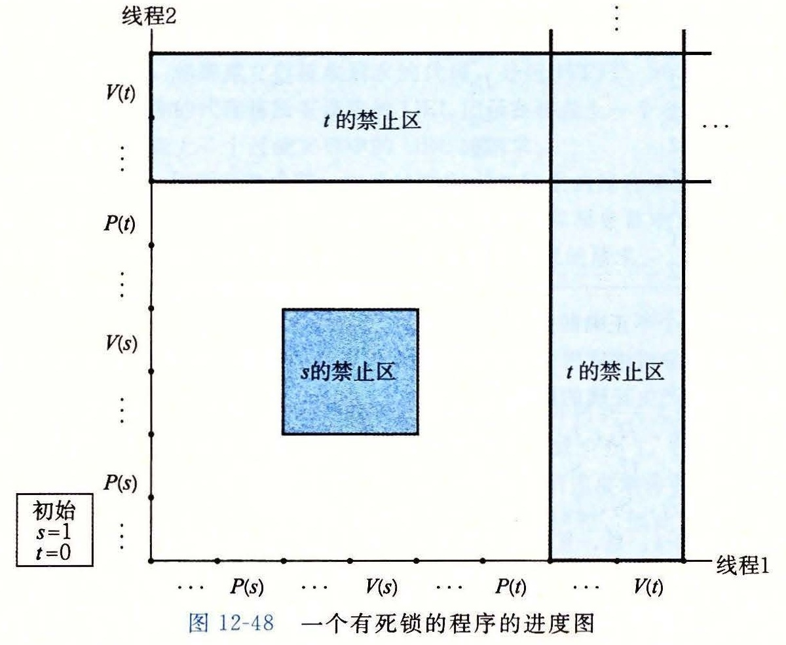
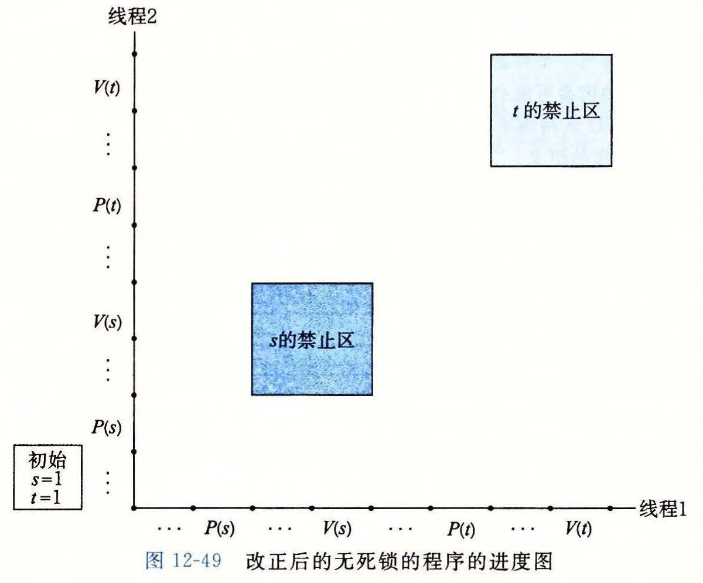

# 练习题答案

## 练习题 12.1

当父进程派生子进程时，它得到一个已连接描述符的副本，并将相关文件表中的引用计数从 1 增加到 2。当父进程关闭它的描述符副本时，引用计数就从 2 减少到 1。因为内核不会关闭一个文件，直到文件表中它的引用计数值变为零，所以子进程这边的连接端将保持打开。

## 练习题 12.2

当一个进程因为某种原因终止时，内核将关闭所有打开的描述符。因此，当子进程退出时，它的已连接文件描述符的副本也将被自动关闭。

## 练习题 12.3

回想一下，如果一个从描述符中读一个字节的请求不会阻塞，那么这个描述符就准备好可以读了。假如 EOF 在一个描述符上为真，那么描述符也准备好可读了，因为读操作将立即返回一个零返回码，表示 EOF。因此，键入 Ctrl+D 会导致 `select` 函数返回，准备好的集合中有描述符 0。

## 练习题 12.4

因为变量 `pool.read_set` 既作为输入参数也作为输出参数，所以我们在每一次调用 `select` 之前都重新初始化它。在输入时，它包含读集合。在输出，它包含准备好的集合。

## 练习题 12.5

因为线程运行在同一个进程中，它们都共享相同的描述符表。无论有多少线程使用这个已连接描述符，这个已连接描述符的文件表的引用计数都等于 1。因此，当我们用完它时，一个 `close` 操作就足以释放与这个已连接描述符相关的内存资源了。

## 练习题 12.6

这里的主要的思想是，栈变量是私有的，而全局和静态变量是共享的。诸如 `cnt` 这样的静态变量有点小麻烦，因为共享是限制在它们的函数范围内的——在这个例子中，就是线程例程。

A. 下面就是这张表：

| 变量实例 | 被主线程引用？ | 被对等线程 0 引用？ | 被对等线程 1 引用？ |
| --- | --- | --- | --- |
| `ptr` | 是 | 是 | 是 |
| `cnt` | 否 | 是 | 是 |
| `i.m` | 是 | 否 | 否 |
| `msgs.m` | 是 | 是 | 是 |
| `myid.p0` | 否 | 是 | 否 |
| `myid.p1` | 否 | 否 | 是 |

说明：

- `ptr`：一个被主线程写和被对等线程读的全局变量。
- `cnt`：一个静态变量，在内存中只有一个实例，被两个对等线程读和写。
- `i.m`：一个存储在主线程栈中的本地自动变量。虽然它的值被传递给对等线程，但是对等线程也绝不会在栈中引用它，因此它不是共享的。
- `msgs.m`：一个存储在主线程栈中的本地自动变量，被两个对等线程通过 `ptr` 间接地引用。
- `myid.0` 和 `myid.1`：一个本地自动变量的实例，分别驻留在对等线程 0 和线程 1 的栈中。

B. 变量 `ptr`、`cnt` 和 `msgs` 被多于一个线程引用，因此它们是共享的。

## 练习题 12.7

这里的重要思想是，你不能假设当内核调度你的线程时会如何选择顺序。

| 步骤 | 线程 | 指令 | %rdx<sub>1</sub> | %rdx<sub>2</sub> | `cnt` |
| --- | --- | --- | --- | --- | --- |
| 1 | 1 | H<sub>1</sub> | — | — | 0 |
| 2 | 1 | L<sub>1</sub> | 0 | — | 0 |
| 3 | 2 | H<sub>2</sub> | — | — | 0 |
| 4 | 2 | L<sub>2</sub> | — | 0 | 0 |
| 5 | 2 | U<sub>2</sub> | — | 1 | 0 |
| 6 | 2 | S<sub>2</sub> | — | 1 | 1 |
| 7 | 1 | U<sub>1</sub> | 1 | — | 1 |
| 8 | 1 | S<sub>1</sub> | 1 | — | 1 |
| 9 | 1 | T<sub>1</sub> | 1 | — | 1 |
| 10 | 2 | T<sub>2</sub> | — | 1 | 1 |

变量 `cnt` 最终有一个不正确的值 1。

## 练习题 12.8

这道题简单地测试你对进度图中安全和不安全轨迹线的理解。像 A 和 C 这样的轨迹线绕开了临界区，是安全的，会产生正确的结果。

A. H<sub>1</sub>，L<sub>1</sub>，U<sub>1</sub>，S<sub>1</sub>，H<sub>2</sub>，L<sub>2</sub>，U<sub>2</sub>，S<sub>2</sub>，T<sub>2</sub>，T<sub>1</sub>：安全的

B. H<sub>2</sub>，L<sub>2</sub>，H<sub>1</sub>，L<sub>1</sub>，U<sub>1</sub>，S<sub>1</sub>，T<sub>1</sub>，U<sub>2</sub>，S<sub>2</sub>，T<sub>2</sub>：不安全的

C. H<sub>1</sub>，H<sub>2</sub>，L<sub>2</sub>，U<sub>2</sub>，S<sub>2</sub>，L<sub>1</sub>，U<sub>1</sub>，S<sub>1</sub>，T<sub>1</sub>，T<sub>2</sub>：安全的

## 练习题 12.9

A. *p* = 1，*c* = 1，*n* > 1：是，互斥锁是需要的，因为生产者和消费者会并发地访问缓冲区。

B. *p* = 1，*c* = 1，*n* = 1：不是，在这种情况中不需要互斥锁信号量，因为一个非空的缓冲区就等于满的缓冲区。当缓冲区包含一个项目时，生产者就被阻塞了。当缓冲区为空时，消费者就被阻塞了。所以在任意时刻，只有一个线程可以访问缓冲区，因此不用互斥锁也能保证互斥。

C. *p* > 1，*c* > 1，*n* = 1：不是，在这种情况中，也不需要互斥锁，原因与前面一种情况相同。

## 练习题 12.10

假设一个特殊的信号量实现为每一个信号量使用了一个 LIFO 的线程栈。当一个线程在 P 操作中阻塞在一个信号量上，它的 ID 就被压入栈中。类似地，V 操作从栈中弹出栈顶的线程 ID，并重启这个线程。根据这个栈的实现，一个在它的临界区中的竞争的写者会简单地等待，直到在它释放这个信号量之前另一个写者阻塞在这个信号量上。在这种场景中，当两个写者来回地传递控制权时，正在等待的读者可能会永远地等待下去。

注意，虽然用 FIFO 队列而不是用 LIFO 更符合直觉，但是使用 LIFO 的栈也是对的，而且也没有违反 P 和 V 操作的语义。

## 练习题 12.11

这道题简单地检查你对加速比和并行效率的理解：

| 线程（*t*） | 1 | 2 | 4 |
| --- | --- | --- | --- |
| 核（*p*） | 1 | 2 | 4 |
| 运行时间（T<sub>p</sub>） | 12 | 8 | 6 |
| 加速比（S<sub>p</sub>） | 1 | 1.5 | 2 |
| 效率（E<sub>p</sub>） | 100% | 75% | 50% |

## 练习题 12.12

`ctime_ts` 函数不是可重入函数，因为每次调用都共享相同的由 `ctime` 函数返回的 `static` 变量。然而，它是线程安全的，因为对共享变量的访问是被 P 和 V 操作保护的，因此是互斥的。

> 编校注（非原文）：原书此处写作 `gethostbyname`；本版根据图 12-38 中 `ctime_ts` 调用 `ctime` 的代码更正为 `ctime`。

## 练习题 12.13

如果在第 14 行调用了 `pthread_create` 之后，我们立即释放块，那么将引入一个新的竞争，这次竞争发生在主线程对 `free` 的调用和线程例程中第 24 行的赋值语句之间。

## 练习题 12.14

A. 另一种方法是直接传递整数 `i`，而不是传递一个指向 `i` 的指针：

```c
for (i = 0; i < N; i++)
    Pthread_create(&tid[i], NULL, thread, (void *)i);
```

在线程例程中，我们将参数强制转换成一个 `int` 类型，并将它赋值给 `myid`：

```c
int myid = (int) vargp;
```

B. 优点是它通过消除对 `malloc` 和 `free` 的调用降低了开销。一个明显的缺点是，它假设指针至少和 `int` 一样大。即便这种假设对于所有的现代系统来说都为真，但是它对于那些过去遗留下来的或今后的系统来说可能就不为真了。

## 练习题 12.15

A. 原始的程序的进度图如图 12-48 所示。



**图 12-48** 一个有死锁的程序的进度图

B. 因为任何可行的轨迹最终都陷入死锁状态中，所以这个程序总是会死锁。

C. 为了消除潜在的死锁，将二元信号量 *t* 初始化为 1 而不是 0。

D. 改成后的程序的进度图如图 12-49 所示。



**图 12-49** 改正后的无死锁的程序的进度图
